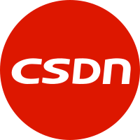

# 👋 Welcome

## 目录结构

📖 前端基础 - 包含HTML/CSS/JS等基础内容

🏗 前端框架 - 包含Vue/React等前端框架

📦 服务器/网络/后端 - 包含计算机网络/后端/数据库等内容

🛠 开发工具 - 包含前端开发过程中的开发工具

🤔 专题内容 - 包含综合性专题内容

🧑‍💻 面试相关 - 包含面试知识点/问题/资源等内容

🍭 其他 - 包含项目经验/踩坑指南/学习资源/网站收藏夹等内容


若内容无标注【原创】，则相关内容均总结自网络。非原创内容标注了参考链接，若有遗漏或侵权请及时联系。


## 学习路线

## 联系方式

| Gmail | Github | 掘金 | CSDN |
| :---: | :---: | :---: | :---: |
|  |  |  |  |

