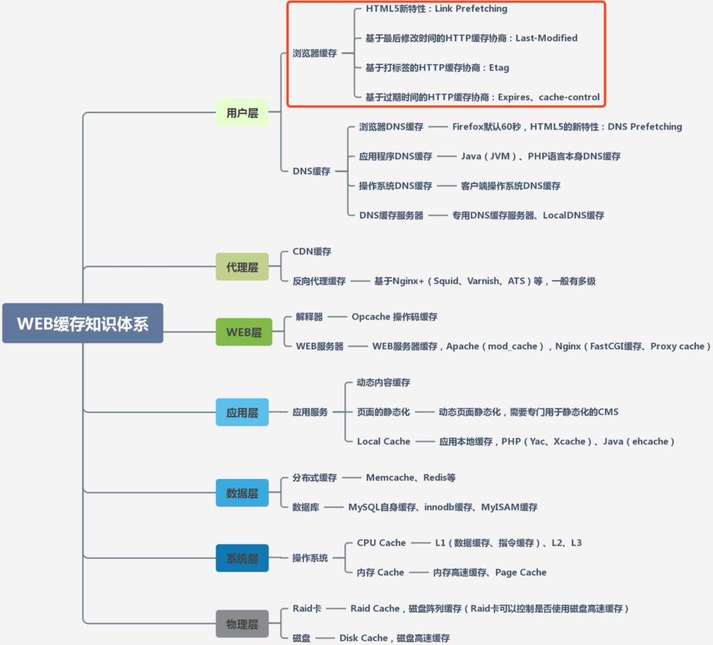

# Web 缓存

客户端浏览器在显示一个完整网页前，需要去服务器获取一些必要的数据，浏览器的数据处理和渲染速度很快，而通过网络传输的方式去服务器取数据的过程却很慢，因此就需要web缓存机制，其使得已经获取过的资源存在本地，下次用的时候就不用从服务器去取了，提高速度。

## Web缓存

根据资源存放位置、具体用途和运行机制不同，一般可以分为三个：

* 数据库缓存
* 服务器缓存
* 客户端缓存\*（即本文重点关注的**浏览器缓存**）

在实际WEB开发过程中，缓存技术会涉及到不同层、不同端，每层使用的技术实现是各有不同，具体如下图，但不管怎么分类，**每一层的缓存目标都是一致的，就是尽快返回请求数据、减少延迟。**

### 浏览器缓存

浏览器缓存（Browser Caching）是为了节约网络的资源加速浏览，浏览器在用户磁盘上对最近请求过的文档进行存储，当访问者再次请求这个页面时，浏览器就可以从本地磁盘显示文档，这样就可以加速页面的阅览。其主要优势在于：1. 减少冗余的数据传输；2. 减少服务器负担；3. 加快客户端加载网页的速度。

浏览器首次请求资源：

浏览器二次请求资源：

#### 强缓存

浏览器请求某一资源时，会先获取该资源缓存的 header 信息，然后根据header中的 Cache-Control 和 Expires 来判断是否过期。若没过期则直接从缓存中获取资源信息，包括缓存的 header 的信息，所以此次请求不会与服务器进行通信。

* Expires：一个绝对时间的GMT格式的时间字符串，代表这这个资源的失效时间
* Cache-Control：主要是利用该字段的max-age值来进行判断，它是一个相对时间，代表着资源的有效期
  * Cache-Control:max-age=3600，代表着资源的有效期是3600秒
  * Cache-Control:no-cache，不使用本地缓存
  * ......


Cache-Control优先级高于Expires


#### 协商缓存

览器请求某一资源时，显示已过期，浏览器会向服务器端发送请求，这个请求会携带第一次请求返回的有关缓存的header字段信息，比如客户端会通过`If-None-Match`头将先前服务器端发送过来的Etag发送给服务器，服务会对比这个客户端发过来的Etag是否与服务器的相同，若相同，就将`If-None-Match`的值设为false，返回状态304，客户端继续使用本地缓存，不解析服务器端发回来的数据，若不相同就将`If-None-Match`的值设为true，返回状态为200，客户端重新机械服务器端返回的数据；客户端还会通过`If-Modified-Since`头将先前服务器端发过来的最后修改时间戳发送给服务器，服务器端通过这个时间戳判断客户端的页面是否是最新的，如果不是最新的，则返回最新的内容，如果是最新的，则返回304，客户端继续使用本地缓存。

* Etag和If-None-Match：ETag可以保证每一个资源是唯一的，资源变化都会导致ETag变化。服务器根据浏览器上送的If-None-Match值来判断是否命中缓存。
* Last-Modify/If-Modify-Since ：浏览器第一次请求一个资源的时候，服务器返回的header中会加上Last-Modify，Last-modify是一个时间标识该资源的最后修改时间，当浏览器再次请求该资源时，服务器收到If-Modify-Since后，根据资源的最后修改时间判断是否命中缓存。


符合缓存策略时，服务器不会发送新的资源，但不是说客户端和服务器就没有会话了，客户端还是会发请求到服务器的。



知识点：为什么要多一个Etag？

* 一些文件也许会周期性的更改，但是他的内容并不改变\(仅仅改变的修改时间\)，这个时候我们并不希望客户端认为这个文件被修改了，而重新GET；
* 某些文件修改非常频繁，比如在秒以下的时间内进行修改，\(比方说1s内修改了N次\)，If-Modified-Since能检查到的粒度是s级的，这种修改无法判断\(或者说UNIX记录MTIME只能精确到秒\)；
* 某些服务器不能精确的得到文件的最后修改时间。



参考链接：[知乎-详解web缓存](https://zhuanlan.zhihu.com/p/90507417)  [掘金-浏览器缓存技术介绍](https://juejin.cn/post/6844903672556552205)



如果你对内容有任何疑问，欢迎提交 [❕issues](https://github.com/MrEnvision/Front-end_learning_notes/issues) 或 [ ✉️ email](mailto:EnvisionShen@gmail.com)


