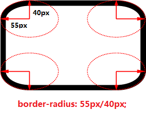

# 基础知识

## 1. 基础语法


引入 CSS 样式的方法

* 外部样式表 - `<link rel="stylesheet" href="style.css">`
* 内部样式表 - `<style>样式</style>`
* 内联样式 - `<h1 style="样式"></h1>`
* 导入方式 - `<style> @import url('main.css') <style>`

## 2. CSS 选择器



## 3. CSS的数值与单位

### 3.1 数值

* 长度值，用于指定例如元素宽度、边框（border）宽度或字体大小；
* 无单位整数，用于指定例如相对线宽或运行动画的次数。

**长度值：**

* 绝对单位：
  * px：像素（pixels ）
  * 1 `in`=2.54`cm`=25.4`mm`=72`pt`=6`pc`
    * `in`：英寸Inches \(1 英寸 = 2.54 厘米\)
    * `cm`：厘米Centimeters
    * `mm`：毫米Millimeters
    * `pt`：点Points，或者叫英镑 \(1点 = 1/72英寸\)
    * `pc`：皮卡Picas \(1 皮卡 = 12 点\)
* 相对单位：
  * em:1em与当前元素的字体大小相同（注意em会继承父元素的字体大小）
  * rem: 等于默认基础字体大小的尺寸，且继承的字体大小将不起作用，区别于em
  * vw, vh: 分别是视口宽度的1/100和视口高度的1/100

**无单位整数：**

* 0就是0，无关单位，如`margin: 0;`则去除了内外边框
* 设置行高，line-height，如`line-height: 1.5;`
* 运行动画的次数等，如`animation-iteration-count: 5;`

### 3.2 百分比


百分比的关键是看参照是什么？


* width/height：相对于父元素的width/height；
* margin/padding：相对于父元素的width（无论什么方向）；
* transform: translate：自身border-box的尺寸；
* 定位bottom/left/right/top：left/right是参照包含块宽度，bottom/top是参照包含块高度；
* border-radius：水平半轴相对于盒模型的宽度，垂直半轴相对于盒模型的高度；
* background-position：图片移动结果是\(父元素-背景图片\)\*百分比；
* line-height：自身的font-size；
* vertical-align：自身的line-height；


对于 width/height 的百分比来说，如果父元素（定位元素）没有明确的高度定义，则百分比都视为 auto。


### 3.3 颜色

用于指定背景颜色，字体颜色等

* 关键词，如“red”
* 十六进制，如“\#000000”
* RGB，如“rgb\(255,0,0\)”
* RGBA，如“rgba\(255,0,0,0.5\)” - 多了透明度通道
* 不透明度，如“opacity: 0.5”

## 4. 层叠和继承

### **4.1 层叠问题**

**解决问题**：当多个选择器匹配到同一个元素时，哪个选择器的规则最终会应用到元素上？

* 行级样式 &gt; 内嵌样式表 &gt; 外部样式表（就近原则）
* ID选择器 &gt; 类选择器=伪类选择器=属性选择器 &gt; 标签选择器=伪元素选择器
* 外部样式表的ID选择器 &gt; 内嵌样式表的标签选择器

相互冲突的声明将按以下顺序适用，后一种将覆盖先前的声明：

1. 在用户代理样式表的声明（如浏览器在没有其他声明的默认样式）
2. 用户样式表中的普通声明（由用户设置的自定义样式）
3. 作者样式表中的普通声明（这是我们Web开发人员设置的样式）
4. 作者样式表中的重要声明
5. 用户样式表中的重要声明


如果不能直接选中某个元素，通过继承性影响的话，那么权重是0。


### **4.2 继承问题**

**解决问题**：应用于某个元素的一些属性值将由该元素的哪些子元素继承，而哪些则不会？

**控制继承**

* inherit：该值将应用到选定元素的属性值设置为与其父元素一样
* initial：该值将应用到选定元素的属性值设置为与浏览器默认样式表中该元素设置值一样
* unset：该值将属性重置为其自然值，即自然继承的则表现得像 inherit，否则像 initial
* revert：如果当前的节点没有应用任何样式，则该属性恢复到它所拥有的值，即属性值被设置成自定义样式所定义的属性（如果被设置），否则属性值被设置成用户代理默认样式

**CSS 可继承属性** 


只有颜色 color、文字 text-\*、字体间距 font-\*、行高 line-\*、对齐方式和列表的样式可以继承**，**关于盒子、定位、布局的属性，都不能继承。


* 所有元素可继承：visibility、cursor
* 内联元素可继承：letter-spacing、word-spacing、white-space、line-height、color、font、font-family、font-size、font-style、font-variant、font-weight、text-decoration、text-transform、direction
* 终端块状元素可继承：text-indent、text-align
* 列表元素可继承：list-style、list-style-type、list-style-position、list-style-image

## 5. 盒模型


当前主要以标准盒子模型为准（如上图所示），但盒模型主要分为标准盒子和IE盒：

* 标准盒子模型中，width 和 height 指的是内容区域的宽度和高度
* IE 盒子模型中，width 和 height 指的是内容区域 + border + padding 的宽度和高度


我们可以通过 CSS 规则 box-sizing: border-box 来转化为 IE 盒子模型。


通过 max-height，max-width，min-height，min-width 属性进行宽高约束

```css
/* 效果：当父容器在最小和最大宽度限制内时，它将填满整个视口宽度；当父容器超过1280px宽度时，布局将保持在1280px宽，并开始在可用空间内居中。 当宽度低于480px时，视口将小于容器，您必须滚动才能看得到完全的内容。*/
div {
  width: 70%;
  max-width: 1280px;
  min-width: 480px;
  margin: 0 auto;
}

/* 效果：前两条样式规则可以使它的展示行为像一个块元素并且在父容器内居中。真正神奇的是第三条——这个限制了图像的宽度使它的最大宽度与父容器的宽度相等。因此，当父容器宽度缩小到小于图像的宽度时，图像会一起缩小。 */
div {
  display: block;
  margin: 0 auto;
  max-width: 100%;
}
```

## 6. 文本/字体样式

### 6.1 字体样式

* 颜色：`color`
* 字体种类：`font-family`
* 字体样式：`font-style`
  * `normal`: 将文本设置为普通字体 \(将存在的斜体关闭\)
  * `italic`: 若有斜体版本则用斜体版本，否则利用 oblique 状态来模拟
  * `oblique`: 将文本设置为斜体字体的模拟版本，即应用普通文本倾斜的样式
* 字体粗细：`font-weight`
  * `normal`, `bold`: 普通或者加粗的字体粗细
  * `lighter`, `bolder`: 将当前元素的粗体设置为比其父元素粗体更细或更粗一步
* 文本转换：`font-transform`
  * `none`: 防止任何转型
  * `uppercase`: 将所有文本转为大写
  * `lowercase`: 将所有文本转为小写
  * `capitalize`: 转换所有单词让其首字母大写
  * `full-width`: 将所有字形转换成固定宽度的正方形，类似于等宽字体，允许对齐
* 文本装饰：`font-decoration`
  * `none`: 取消已经存在的任何文本装饰。
  * `underline`: 文本下划线
  * `overline`: 文本上划线- 上下划线可以同时存在
  * `line-through`: 穿过文本的线 strikethrough over the text.
* 文字阴影：`text-shadow`
  * 含四个属性值：阴影与原始文本的水平偏移，阴影与原始文本的垂直偏移，模糊半径，阴影的基础颜色，例如`text-shadow: 4px 4px 5px red;`


font-weight 填写数值的话只能填写 100 至 900 这样的整百数字，normal 相当于 400，bold 相当于 700


### 6.2 文本布局风格

* 文本对齐：text-align
  * `left`: 左对齐文本
  * `right`: 右对齐文本
  * `center`: 居中文字
  * `justify`: 使文本展开，改变单词之间的差距，使所有文本行的宽度相同
* 行高：`line-height`
  * 若为无单位的数值，则为该数无单位的值乘以 font-size 获得 line-height
  * 行高可以用百分比，表示字号的百分之多少，一般都是大于 100% 的值
* 字母与字母的间距：`letter-spacing`
* 单词和单词的间距：`word-spacing`
* 超出部分的处理方式：`overflow`
  * `visible`：默认值。多余的内容不剪切也不添加滚动条，会全部显示出来
  * `hidden`：不显示超过对象尺寸的内容
  * `auto`：如果内容不超出，则不显示滚动条；如果内容超出，则显示滚动条
  * `scroll`：Windows 下，无论内容是否超出总显示滚动条。Mac 下等同`auto` 


* 行高 line-height 是指文本行基线间的垂直距离。
* 行距是上一行的底线和下一行的顶线之间的距离。
* 字体大小 font-size 是同一行的顶线和底线之间的距离。


我们的工程师有一个约定： **行高、字号，一般都是偶数**，这样可以保证，它们的差一定偶数，就能够被2整除。



小技巧：如何单行文本垂直居中？

如果一段文本只有一行，设置 **行高 = 盒子高**，就可以保证单行文本垂直居中。


## 7. 列表样式

```css
ul {  
  list-style-type: square;  
  list-style-position: inside;  
  list-style-image: url(example.png); 
}
```

* list-style-type：设置用于列表的项目符号的类型，例如无序列表的方形或圆形符号，或有序列表的数字、字母和罗马数字（设置为none，以便默认情况下不会显示项目符号）
* list-style-position：置在每个项目开始之前，项目符号是出现在列表项内，还是出现在其外。 如上所示，默认值为 outside，这使项目符号位于列表项之外（理解不了就试试吧）
* list-style-image：属性允许对于项目符号使用自定义图片

```css
/* 采用background来代替列表的原始项目符号 */
ul li {
 padding-left: 2rem;
 background-image: url(star.svg);
 background-position: 0 0;
 background-size: 1.6rem 1.6rem;
 background-repeat: no-repeat;
}
```


知识点：管理有序列表的计数

```markup
<!-- start表示序号从4开始, reversed表示启动列表倒计数 -->
<ol start="4" reversed>
 <li></li>
</ol>
​
<!-- value属性允许设置列表项指定数值 - 如下例则列表序号为value值2，4 -->
<ol>
 <li value="2"></li>
 <li value="4"></li>
</ol>
```


## 8. 链接样式

链接状态（采用伪类） - 顺序 link -&gt; visited -&gt; hover -&gt; active

* :link \(没有访问过的\): 这是链接默认状态，当它没有处在其他状态时，使用:link 伪类来应用样式。
* :visited: 这个链接已经被访问过了\(存在于浏览器的历史纪录\)，使用 :visited 伪类来应用样式。
* :hover: 当用户的鼠标光标刚好停留在这个链接，使用 :hover 伪类来应用样式。
* :active: 一个链接当它被激活的时候 \(比如被点击的时候\)，使用 :active 伪类来应用样式。
* :focus: 一个链接当它被选中的时候 \(比如通过键盘的 Tab 移动到这个链接的时候，或者使用编程的方法来选中这个链接 HTMLElement.focus\(\)\) 使用 :focus 伪类来应用样式。

默认样式：

* 链接具有下划线，可以通过`text-decoration:none`去掉下划线
* 未访问过的 \(Unvisited\) 的链接是蓝色的
* 访问过的 \(Visited\) 的链接是紫色的
* 悬停 \(Hover\) 在一个链接的时候鼠标的光标会变成一个小手的图标
* 激活 \(Active\) 链接的时候会变成红色 \(当你点击链接时，请尝试按住鼠标按钮\)
* 选中 \(Focus\) 链接的时候，链接周围会有一个轮廓，你应该可以按 tab 来选中这个页面的链接

## 9. 背景 background

A. 背景颜色：`background-color`

```css
background-color: red;
background-color: rgb(255,0,0);
background-color: #ff0000;
background-color: rgba(0, 0, 255, 0.3); /* 最后一位是透明度 */
background-color: hsla(240,50%,50%,0.4); /* 色度+饱和度+亮度+透明度 */
```


透明度除了可以用 `rgba` 表示，还能够用 `opacity` 来设置，此还可以使用 background: transparent; 来设置完全透明。


B. 背景图片：`background-image`

* 静态文件：`background-image:url(images/2.gif);`
* 渐变，具体见下方

C. 背景是否应该重复\(平铺\)：`background-repeat`

* `no-repeat`（不要平铺）
* `repeat-x`（横向平铺）
* `repeat-y`（纵向平铺）
* `repeat`（图像将在整个背景中水平和竖直地重复）

D. 背景出现在元素背景中的位置：`background-position`

* 用像素值描述属性值 —— `background-position:向右偏移量 向下偏移量;`
* 用单词描述属性值 —— `background-position: 描述左右的词 描述上下的词;`

E. 背景图片是否固定：`background-attachment`

* `fixed`（背景就会被固定住，不会被滚动条滚走）
* `scroll`（与fixed属性相反，默认属性）

F. 背景尺寸\*：`background-size`

```css
/* 宽、高的具体数值 */
background-size: 500px 500px;

/* 宽高的百分比（相对于容器的大小） */
background-size: 50% 50%;   // 如果两个属性值相同，可以简写成：background-size: 50%;

/* cover：图片始终填充满容器，且保证长宽比不变。图片如果有超出部分，则超出部分会被隐藏。 */
background-size: cover;

/* contain：将图片完整地显示在容器中，且保证长宽比不变。可能会导致容器的部分区域为空白。  */
background-size: contain;
```

G. 背景原点：`background-origin`

```css
/* 从 padding-box 内边距开始显示背景图，默认值 */
background-origin: padding-box;

/* 从 border-box 边框开始显示背景图  */
background-origin: border-box;

/* 从 content-box 内容区域开始显示背景图  */
background-origin: content-box;
```

H. 背景裁剪，即设置背景是否延伸到边框外面：`background-clip`

* `border-box` ：背景延伸至边框外沿（但在边框下层），超出 border-box 部分，将裁掉
* `padding-box` ：背景延伸至内边距（padding）外沿，超出 padding-box 部分，将裁掉
* `content-box`：背景被裁剪至内容区外沿，超出 content-box 部分，将裁掉

**应用多背景**

```css
div {
    background: url(image.png) no-repeat 99% center,
                url(background-tile.png),
                linear-gradient(to bottom, yellow, #dddd00 50%, orange);
    background-color: yellow;
}
```

**渐变背景**

* 线性渐变：`linear-gradient(方向, 起始颜色, 终止颜色)`
* 径向渐变：`radial-gradient(辐射的半径, 中心位置, 起始颜色, 终止颜色)`

```css
/* 
  线性渐变： linear-gradient(方向，起始颜色，终止颜色);
  方向：to left   to right  to top   to bottom 　角度　30deg
*/
div {
  background-image: linear-gradient(to right, yellow, green);
}

/* 不写方向，表示默认的方向是：从上往下 */
div {
  background-image: linear-gradient(yellow, green);
}

/* 方向可以指定角度 */
div {
  background-image: linear-gradient(135deg, yellow, green);
}

/* 0%的位置开始出现黄色，40%的位置开始出现红色的过度。70%的位置开始出现绿色的过度，100%的位置开始出现蓝色 */
div {
  background-image: linear-gradient(to right,
    yellow 0%,
    red 40%,
    green 70%,
    blue 100%);
}

/* 颜色之间，出现突变 */
div{
  background-image: linear-gradient(45deg,
    yellow 0%,
    yellow 25%,
    blue 25%,
    blue 50%,
    red 50%,
    red 75%,
    green 75%,
    green 100%
  );
}

div {
  background-image: linear-gradient(to right,
    #000 0%,
    #000 25%,
    #fff 25%,
    #fff 50%,
    #000 50%,
    #000 75%,
    #fff 75%,
    #fff 100%
  );
}
```

```css
/*
 径向渐变：radial-gradient（辐射的半径大小, 中心的位置，起始颜色，终止颜色）
 中心点位置：at  left  right  center bottom  top
*/

/* 辐射半径为100px，中心点在中间*/
div {
  background-image: radial-gradient(100px at center, yellow, green);
}

/* 中心点在左上角 */
div {
  background-image: radial-gradient(at left top, yellow, green);
}

div {
  background-image: radial-gradient(at 50px 50px, yellow, green);
}

/*设置不同的颜色渐变*/
div {
  background-image: radial-gradient(100px at center,
    yellow 0%,
    green 30%,
    blue 60%,
    red 100%);
}

/* 如果辐射半径的宽高不同，那就是椭圆 */
div {
  background-image: radial-gradient(100px 50px at center, yellow, green);
}
```

## 10. 边界 border

### 10.1 基础写法

border 边框有三个要素：像素（粗细）、线型、颜色。

```css
 border: 20px solid black;
```

* 根据三要素拆分`border-width`、`border-style`、`border-color`
* 根据方向拆分：`border-top`、`border-right`、`border-bottom`、`border-left`
* 组合上面两种：`border-top-width`、`border-top-style`......

### 10.2 边界图像

```css
border-image: url(border-image.png) 40 round;
```

* 源图像：`border-image-source: url();`
* 设置所需大小的切片：`border-image-slice: 40;`
* 指定图像如何填充边界：`border-image-repeat: round;`
  * stretch：默认，侧面的图像被拉伸来填满边界
  * repeat：边图像被重复，直到边界被填满，会出现碎片
  * round： 边图像被重复，直到边界被填满，它们都被稍微拉伸，不会出现碎片
  * space：边图像被重复，直到边界被填满，拷贝之间添加少量间隔，不会出现碎片


边界 border 的应用可详见 [CSS 画图](css-topics/css-drawing.md)


## 11. 布局



## 12. CSS动画



## 13. 设备媒体

概念：指定样式表规则用于指定的媒体类型和查询条件，主要用于响应式设计

语法：`@media` 媒体类型 `and 条件 { 样式 }`

```css
@media screen and (max-width:640px) {
    .class{}
    ......
}
@media screen and (min-width:640px) and (max-width:800px){
    .class{}
    ......
}
```

媒体类型：

| 值 | 描述 |
| :--- | :--- |
| all | 用于所有媒体类型设备。 |
| print | 用于打印机。 |
| screen | 用于计算机屏幕、平板电脑、智能手机等等。 |
| speech | 用于大声“读出”页面的屏幕阅读器。 |

## 14. CSS3 属性


前文中已经混杂了 CSS3 的部分内容，这里概述部分未提到的属性。


**文本阴影**：`text-shadow`

```css
text-shadow: 水平位移 垂直偏移 模糊程度 阴影颜色
text-shadow: 20px 27px 22px pink;
```

**边框阴影：**`box-shadow`

```css
box-shadow: 水平偏移 垂直偏移 模糊程度 阴影大小 阴影颜色
box-shadow: 15px 21px 48px -2px #666;
```


如果在一个阴影声明的开始放置 inset 关键字，可以使其变成一个内部阴影 `box-shadow: inset 2px 2px 1px black;`


**边框圆角**：`border-radius`

```css
border-radius: 数值
border-radius: 60px; /* 四角相同 */
border-radius: 20px 60px;
border-radius: 20px 60px 100px 140px;  /* 从左上开始，顺时针赋值 */
border-radius: 20px / 60px; /* 水平半径/垂直半径 */
```

border-radius 完整写法 `border-radius : 50px 50px 50px 50px / 40px 40px 40px 40px;`  的 “/” 前的四个数值表示圆角的水平半径，后面四个值表示圆角的垂直半径。




如果你对内容有任何疑问，欢迎提交 [❕issues](https://github.com/MrEnvision/Front-end_learning_notes/issues) 或 [ ✉️ email](mailto:EnvisionShen@gmail.com)


