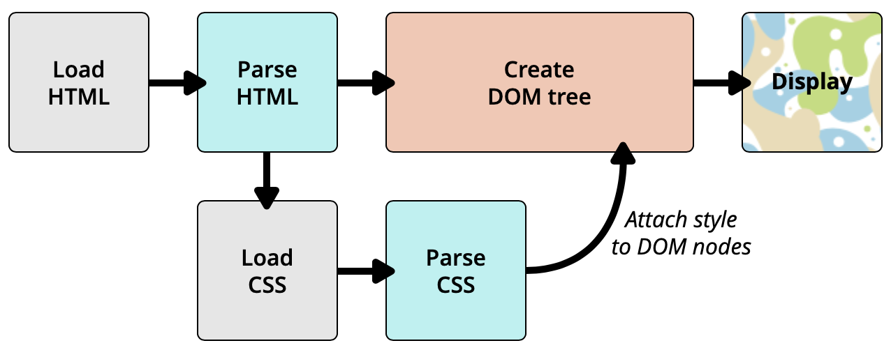

# 基础知识

## 1. 基础语法



引入 CSS 样式的方法

* 外部样式表 - `<link rel="stylesheet" href="style.css">`
* 内部样式表 - `<style>样式</style>`
* 内联样式 - `<h1 style="样式"></h1>`
* 导入方式 - `<style> @import url('main.css') <style>`

## 2. CSS 选择器



## 3. CSS的数值与单位

### 3.1 数值

* 长度值，用于指定例如元素宽度、边框（border）宽度或字体大小；
* 无单位整数，用于指定例如相对线宽或运行动画的次数。

**长度值：**

* 绝对单位：
  * px：像素（pixels ）
  * 1 `in`=2.54`cm`=25.4`mm`=72`pt`=6`pc`
    * `in`：英寸Inches \(1 英寸 = 2.54 厘米\)
    * `cm`：厘米Centimeters
    * `mm`：毫米Millimeters
    * `pt`：点Points，或者叫英镑 \(1点 = 1/72英寸\)
    * `pc`：皮卡Picas \(1 皮卡 = 12 点\)
* 相对单位：
  * em:1em与当前元素的字体大小相同（注意em会继承父元素的字体大小）
  * rem: 等于默认基础字体大小的尺寸，且继承的字体大小将不起作用，区别于em
  * vw, vh: 分别是视口宽度的1/100和视口高度的1/100

**无单位整数：**

* 0就是0，无关单位，如`margin: 0;`则去除了内外边框
* 设置行高，line-height，如`line-height: 1.5;`
* 运行动画的次数等，如`animation-iteration-count: 5;`

### 3.2 百分比


百分比的关键是看参照是什么？


* width/height：相对于父元素的width/height；
* margin/padding：相对于父元素的width（无论什么方向）；
* transform: translate：自身border-box的尺寸；
* 定位bottom/left/right/top：left/right是参照包含块宽度，bottom/top是参照包含块高度；
* border-radius：水平半轴相对于盒模型的宽度，垂直半轴相对于盒模型的高度；
* background-position：图片移动结果是\(父元素-背景图片\)\*百分比；
* line-height：自身的font-size；
* vertical-align：自身的line-height；


对于 width/height 的百分比来说，如果父元素（定位元素）没有明确的高度定义，则百分比都视为 auto。


### 3.3 颜色

用于指定背景颜色，字体颜色等

* 关键词，如“red”
* 十六进制，如“\#000000”
* RGB，如“rgb\(255,0,0\)”
* RGBA，如“rgba\(255,0,0,0.5\)” - 多了透明度通道
* 不透明度，如“opacity: 0.5”

## 4. 层叠和继承

05

## 5. 盒模型

06

## 6. 文本/字体样式

01

## 7. 列表样式

```css
ul {  
  list-style-type: square;  
  list-style-position: inside;  
  list-style-image: url(example.png); 
}
```

* list-style-type：设置用于列表的项目符号的类型，例如无序列表的方形或圆形符号，或有序列表的数字、字母和罗马数字（设置为none，以便默认情况下不会显示项目符号）
* list-style-position：置在每个项目开始之前，项目符号是出现在列表项内，还是出现在其外。 如上所示，默认值为 outside，这使项目符号位于列表项之外（理解不了就试试吧）
* list-style-image：属性允许对于项目符号使用自定义图片

```css
/* 采用background来代替列表的原始项目符号 */
ul li {
 padding-left: 2rem;
 background-image: url(star.svg);
 background-position: 0 0;
 background-size: 1.6rem 1.6rem;
 background-repeat: no-repeat;
}
```


知识点：管理有序列表的计数

```markup
<!-- start表示序号从4开始, reversed表示启动列表倒计数 -->
<ol start="4" reversed>
 <li></li>
</ol>
​
<!-- value属性允许设置列表项指定数值 - 如下例则列表序号为value值2，4 -->
<ol>
 <li value="2"></li>
 <li value="4"></li>
</ol>
```


## 8. 链接样式

链接状态（采用伪类） - 顺序 link -&gt; visited -&gt; hover -&gt; active

* :link \(没有访问过的\): 这是链接的默认状态，当它没有处在其他状态的时候，使用:link 伪类来应用样式。
* :visited: 这个链接已经被访问过了\(存在于浏览器的历史纪录\)，使用 :visited 伪类来应用样式。
* :hover: 当用户的鼠标光标刚好停留在这个链接，使用 :hover 伪类来应用样式。
* :active: 一个链接当它被激活的时候 \(比如被点击的时候\)，使用 :active 伪类来应用样式。
* :focus: 一个链接当它被选中的时候 \(比如通过键盘的 Tab 移动到这个链接的时候，或者使用编程的方法来选中这个链接 HTMLElement.focus\(\)\) 使用 :focus 伪类来应用样式。

默认样式：

* 链接具有下划线，可以通过`text-decoration:none`去掉下划线
* 未访问过的 \(Unvisited\) 的链接是蓝色的
* 访问过的 \(Visited\) 的链接是紫色的
* 悬停 \(Hover\) 在一个链接的时候鼠标的光标会变成一个小手的图标
* 激活 \(Active\) 链接的时候会变成红色 \(当你点击链接时，请尝试按住鼠标按钮\)
* 选中 \(Focus\) 链接的时候，链接周围会有一个轮廓，你应该可以按 tab 来选中这个页面的链接

## 9. 背景 background

02

## 10. 边界 border

## 11. 布局



## 12. CSS动画

## 13. 设备媒体

概念：指定样式表规则用于指定的媒体类型和查询条件，主要用于响应式设计

语法：`@media` 媒体类型 `and 条件 { 样式 }`

```css
@media screen and (max-width:640px) {
    .class{}
    ......
}
@media screen and (min-width:640px) and (max-width:800px){
    .class{}
    ......
}
```

媒体类型：

| 值 | 描述 |
| :--- | :--- |
| all | 用于所有媒体类型设备。 |
| print | 用于打印机。 |
| screen | 用于计算机屏幕、平板电脑、智能手机等等。 |
| speech | 用于大声“读出”页面的屏幕阅读器。 |


如果你对内容有任何疑问，欢迎提交 [❕issues](https://github.com/MrEnvision/Front-end_learning_notes/issues) 或 [ ✉️ email](mailto:EnvisionShen@gmail.com)


