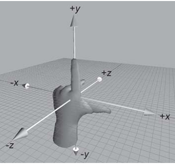
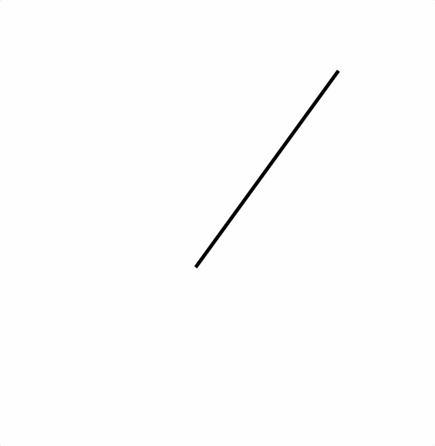

# CSS 动画

## 1. 2D/3D 转换 transform

通过2D、3D转换，能够对元素进行移动、缩放、转动、拉长或拉伸。

```css
transform: 转换属性
```

### 1.1 2D 转换

缩放

```css
/*  x：表示水平方向的缩放倍数。y：表示垂直方向的缩放倍数 */
transform: scale(x, y);

/* 等比例缩放 */
transform: scale(x);
```

位移

```css
transform: translate(水平位移, 垂直位移);
transform: translate(-50%, -50%);
```


参数为百分比，相对于自身移动；如果只写一个值，则表示水平移动。


旋转

```css
/* 正值 顺时针；负值：逆时针 */
transform: rotate(角度);
transform: rotate(45deg);
```


rotate 旋转时，默认是以盒子的正中心为坐标原点的。如果想改变旋转的坐标原点，可以用`transform-origin`属性。

```javascript
transform-origin: 水平坐标 垂直坐标;
transform-origin: 50px 50px;
transform-origin: center bottom;
```


skew

```css
transform: skew(x-angle,y-angle)
transform: skew(20deg, 10deg);
```

matrix（复合功能）

```css
/* matrix() 方法把所有 2D 变换方法组合为一个 */
transform: matrix(scaleX(), skewY(), skewX(), scaleY(), translateX(), translateY())
```

举例：借助 rotate 和 transform-origin 实现扑克牌展开

```markup
<!DOCTYPE html>
<html>
  <head lang="en">
    <meta charset="UTF-8">
    <title></title>
    <style>
      .box {
        width: 300px;
        height: 440px;
        margin: 100px auto;
        position: relative;
      }

      img {
        width: 100%;
        transition: all 1.5s;
        position: absolute;     /* 既然扑克牌是叠在一起的，那就都用绝对定位 */
        left: 0;
        top: 0;
        transform-origin: center bottom; /*旋转时，以盒子底部的中心为坐标原点*/
        box-shadow: 0 0 3px 0 #666;
      }

      .box:hover img:nth-child(6) { transform: rotate(-10deg); }
      .box:hover img:nth-child(5) { transform: rotate(-20deg); }
      .box:hover img:nth-child(4) { transform: rotate(-30deg); }
      .box:hover img:nth-child(3) { transform: rotate(-40deg); }
      .box:hover img:nth-child(2) { transform: rotate(-50deg); }
      .box:hover img:nth-child(1) { transform: rotate(-60deg); }
      .box:hover img:nth-child(8) { transform: rotate(10deg); }
      .box:hover img:nth-child(9) { transform: rotate(20deg); }
      .box:hover img:nth-child(10) { transform: rotate(30deg); }
      .box:hover img:nth-child(11) { transform: rotate(40deg); }
      .box:hover img:nth-child(12) { transform: rotate(50deg);}
      .box:hover img:nth-child(13) { transform: rotate(60deg); }
    </style>
  </head>
  <body>
    <div class="box">
      
      
      
      
      
      
      
      
      
      
      
      
      
    </div>
  </body>
</html>
```


### 1.2 3D 转换

**旋转：rotateX、rotateY、rotateZ**

#### 移动：translateX、translateY、translateZ

```css
transform: rotateX(360deg);    //绕 X 轴旋转360度
transform: rotateY(360deg);    //绕 Y 轴旋转360度
transform: rotateZ(360deg);    //绕 Z 轴旋转360度

transform: translateX(100px);    //沿着 X 轴移动
transform: translateY(360px);    //沿着 Y 轴移动
transform: translateZ(360px);    //沿着 Z 轴移动
```


3D坐标系（左手坐标系）**：**左手握住旋转轴，竖起拇指指向旋转轴的正方向，正向就是其余手指卷曲的方向。





其余属性还有 [规定 3D 元素的透视效果 - perspective](https://www.w3school.com.cn/cssref/pr_perspective.asp)、[规定 3D 元素的底部位置 - perspective-origin](https://www.w3school.com.cn/cssref/pr_perspective-origin.asp) 等。


## 2. 过渡 transition

过渡是可以实现元素不同状态间的平滑过渡（补间动画），经常用来制作动画效果。

```css
	transition: 过渡属性 过渡的持续时间 运动曲线 延迟时间;
	transition: all 3s linear 0s;
```

transition 属性拆分：

* `transition-property`：过渡属性，如果设为 all，则所有的属性都发生过渡
* `transition-duration`：过渡的持续时间
* `transition-timing-function` ：运动曲线
  * `linear` 线性
  * `ease` 减速
  * `ease-in` 加速
  * `ease-out` 减速
  * `ease-in-out` 先加速后减速
* `transition-delay`：过渡延迟时间

## 3. 动画 animation

动画是 CSS3 中具有颠覆性的特征，可通过设置多个节点来精确控制一个或一组动画，常用来实现复杂的动画效果。

1. 通过@keyframes定义动画；
2. 将这段动画通过百分比，分割成多个节点，然后各节点中分别定义各属性；
3. 在指定元素里，通过 `animation` 属性调用动画。

```css
/* 定义动画：*/
  @keyframes 动画名{
    from{ 初始状态 }
    to{ 结束状态 }
  }

/* 调用：*/
animation: 动画名 持续时间 执行次数 是否反向 运动曲线 延迟执行;
```

```css
@keyframes cartoon_name {
    /* 使用百分比*/
    0%   {top:0px;}
    25%  {top:200px;}
    50%  {top:100px;}
    75%  {top:200px;}
    100% {top:0px;}
    /* 使用from/to */
    from {top:0px;}
    to {top:200px;}
}

.div{
    animation-name:cartoon_name;
    animation-duration:2s;
    animation-iteration-count:2; /* 属性值 infinite 表示无数次 */
    animation-direction:normal; /* normal 正常，alternate 反向 */
    animation-timing-function:ease-in-out;
    animation-fill-mode: forwards; /*  forwards：保持动画结束后的状态（默认），  backwards：动画结束后回到最初的状态 */
}
```

`animation-timing-function`如果设置为`steps()`，则表示动画不是连续执行，而是间断地分成几步执行，应用于多帧动画等。

举例：通过`animation-timing-function`的`steps()`制作时钟指针

```css
<!DOCTYPE html>
<html>
  <head lang="en">
    <meta charset="UTF-8">
    <title></title>
    <style>
      div {
        width: 3px;
        height: 200px;
        background-color: #000;
        margin: 100px auto;
        transform-origin: center bottom;    /* 旋转的中心点是底部 */
        animation: myClock 60s steps(60) infinite;
      }

      @keyframes myClock {
        0% {
          transform: rotate(0deg);
        }

        100% {
          transform: rotate(360deg);
        }
      }
    </style>
  </head>
  <body>
    <div></div>
  </body>
</html>
```




如果你对内容有任何疑问，欢迎提交 [❕issues](https://github.com/MrEnvision/Front-end_learning_notes/issues) 或 [ ✉️ email](mailto:EnvisionShen@gmail.com)


