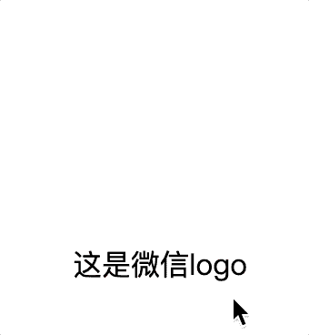
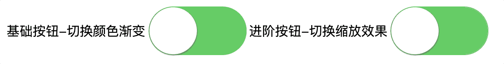

# CSS 案例

## 1. 鼠标悬停弹出微信二维码

通过`transform: scale(0)`和`opacity: 0`实现二维码隐藏，再通过`:hover`更改对应元素的`transform: scale(1)`和`opacity: 1`实现二维码显示，其中二维码的隐藏变化的基准点可以通过`transform-origin`来设置。



```markup
<!DOCTYPE html>
<html lang="en">
  <head>
    <meta charset="UTF-8" />
    <meta http-equiv="X-UA-Compatible" content="IE=edge" />
    <meta name="viewport" content="width=device-width, initial-scale=1.0" />
    <title>Document</title>
    <style>
      .logo {
        display: inline-block;
        width: 200px;
        text-align: center;
        position: relative;
      }
      .code {
        height: 100px;
        width: 100px;
        background-color: rosybrown;
        position: absolute;
        left: 50px;
        top: -100px;
        opacity: 0;
        transform: scale(0);
        transition: all 0.3s ease;
        transform-origin: bottom center;

      }
      .logo:hover .code {
        opacity: 1;
        transform: scale(1);
      }
    </style>
  </head>
  <body>
    <a class="logo">
      这是微信logo
      <div class="code">这是二维码</div>
    </a>
  </body>
</html>

```

## 2. 切换按钮



```markup
<!DOCTYPE html>
<html lang="en">
  <head>
    <meta charset="UTF-8" />
    <meta http-equiv="X-UA-Compatible" content="IE=edge" />
    <meta name="viewport" content="width=device-width, initial-scale=1.0" />
    <title>Document</title>
    <style>
      body {
        display: flex;
      }

      label {
        display: flex;
        align-items: center;
      }

      .switch {
        width: 120px;
        height: 60px;
        border-radius: 60px;
        border: 1px solid #dfdfdf;
        background-color: #fdfdfd;
        box-shadow: #dfdfdf 0 0 0 0 inset;
        transition: all 0.3s ease;
        -webkit-appearance: none;
        user-select: none;
        outline: none;
        position: relative;
      }

      .switch:checked {
        border-color: #64bd63;
        background-color: #64bd63;
      }

      .switch::before {
        content: "";
        height: 58px;
        width: 58px;
        position: absolute;
        top: 0;
        right: 0;
        border-radius: 60px;
        box-shadow: 0 1px 3px rgba(0, 0, 0, 0.4);
        background-color: #fdfdfd;
        transition: all 0.3s ease;
      }

      .switch:checked::before {
        transition: right 0.3s;
        right: 60px;
      }

      .switch-anim {
        width: 120px;
        height: 60px;
        border: 1px solid #dfdfdf;
        background-color: #fdfdfd;
        box-shadow: #dfdfdf 0 0 0 0 inset;
        border-radius: 60px;
        -webkit-appearance: none;
        user-select: none;
        outline: none;
        position: relative;
        transition: background-color cubic-bezier(0, 0, 0, 1) 0.4s, box-shadow cubic-bezier(0, 0, 0, 1) 0.4s;
      }

      .switch-anim::before {
        content: "";
        width: 58px;
        height: 58px;
        border-radius: 60px;
        position: absolute;
        top: 0;
        right: 0;
        background-color: #fff;
        box-shadow: 0 1px 3px rgba(0, 0, 0, 0.4);
        transition: right 0.3s;
      }

      .switch-anim:checked {
        border-color: #64bd63;
        box-shadow: #64bd63 0 0 0 30px inset;
        transition: border ease 0.4s, box-shadow ease 0.4s, background-color ease 1.2s;
      }

      .switch-anim:checked::before {
        right: 60px;
        transition: right 0.3s;
      }
    </style>
  </head>
  <body>
    <label>
      基础按钮-切换颜色渐变
      <input type="checkbox" class="switch" checked />
    </label>
    <label>
      进阶按钮-切换缩放效果
      <input type="checkbox" class="switch-anim" checked />
    </label>
  </body>
</html>

```


如果你对内容有任何疑问，欢迎提交 [❕issues](https://github.com/MrEnvision/Front-end_learning_notes/issues) 或 [ ✉️ email](mailto:EnvisionShen@gmail.com)


