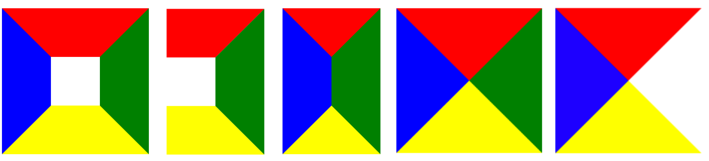
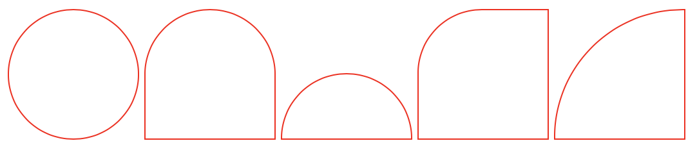
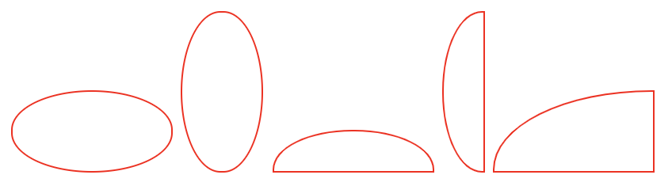
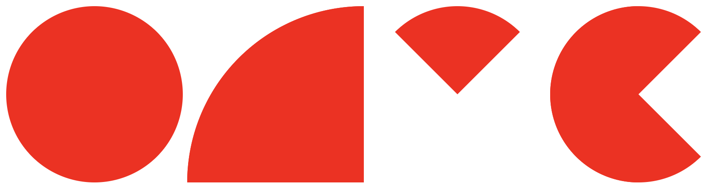
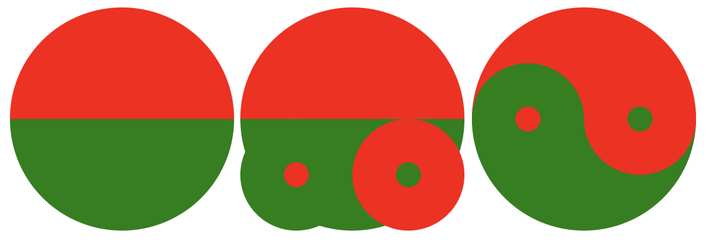
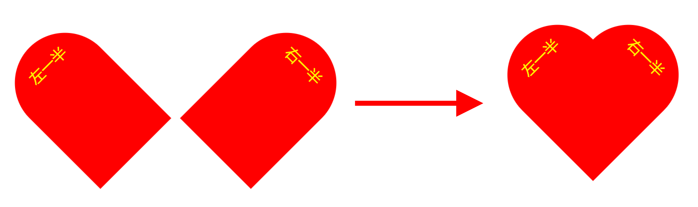

# CSS 画图


参考资料：

* [如何用 CSS 画三角形](https://www.cnblogs.com/wangjiachen666/p/9462837.html)
* [倾斜 skew\(\) 方法](http://www.lvyestudy.com/css3/css3_9.5.aspx)
* [纯 CSS 画的基本图形](https://www.cnblogs.com/zuobaiquan01/p/8582298.html)
* [利用 CSS 样式画各种图形](https://www.cnblogs.com/pigtail/archive/2013/02/17/2914119.html)


## 1. 基于 border 属性

通过对border设置大小，对内容设置宽高/颜色，可以得到梯形、三角形等。



```markup
<style>
  div {
    display: inline-block;
    height: 100px;
    width: 100px;
    border-style: solid;
    border-color: red green yellow blue;
  }
  div:nth-child(1) {
    border-width: 90px;
  }
  div:nth-child(2) {
    border-width: 90px;
    border-left-width: 0;
  }
  div:nth-child(3) {
    width: 0;
    border-width: 90px;
  }
  div:nth-child(4) {
    width: 0;
    height: 0;
    border-width: 140px;
  }
  div:nth-child(5) {
    width: 0;
    height: 0;
    border-width: 140px;
    border-right-color: transparent; /*透明*/
  }
</style>

<div></div>
<div></div>
<div></div>
<div></div>
<div></div>
```

## 2. 基于 skew 属性


## 3. 基于 border-radius 属性



```markup
<style>
  div {
    display: inline-block;
    border: 1px solid red;
  }
  div:nth-child(1) {
    height: 100px;
    width: 100px;
    border-radius: 100px;
  }
  div:nth-child(2) {
    height: 100px;
    width: 100px;
    border-radius: 100px 100px 0 0;
  }
  div:nth-child(3) {
    height: 50px;
    width: 100px;
    border-radius: 100px 100px 0 0;
  }
  div:nth-child(4) {
    height: 100px;
    width: 100px;
    border-radius: 50px 0 0 0;
  }
  div:nth-child(5) {
    height: 100px;
    width: 100px;
    border-radius: 100px 0 0 0;
  }
</style>

<div></div>
<div></div>
<div></div>
<div></div>
<div></div>
```

border-radius 可以用来实现圆形，这个众所周知，但是还有一个重要内容是，border-radius 接受水平和垂直方向不同值，使用斜杠\(/\)来分隔它们，这可以让我们在圆角处取整来创建椭圆。



```markup
<style>
  div {
    display: inline-block;
    border: 1px solid red;
  }
  div:nth-child(1) {
    height: 50px;
    width: 100px;
    border-radius: 100px / 50px;
  }
  div:nth-child(2) {
    height: 100px;
    width: 50px;
    border-radius: 50px / 100px;
  }
  div:nth-child(3) {
    height: 25px;
    width: 100px;
    border-radius: 50px 50px 0 0 / 25px 25px 0 0;
  }
  div:nth-child(4) {
    height: 100px;
    width: 25px;
    border-radius: 25px 0 0 25px / 50px 0 0 50px;
  }
  div:nth-child(5) {
    height: 50px;
    width: 100px;
    border-radius: 100px 0 0 0 / 50px 0 0 0;
  }
</style>

<div></div>
<div></div>
<div></div>
<div></div>
<div></div>
```

扇形画法是利用 border-radius 并设置透明度来实现的，类似于 CSS 画三角形



```markup
<style>
  div {
    display: inline-block;
    height: 0;
    width: 0;
  }
  div:nth-child(1) {
    border: 100px solid red;
    border-radius: 100px;
  }
  div:nth-child(2) {
    border: 100px solid red;
    border-radius: 200px 0 0 0;
  }
  div:nth-child(3) {
    border: 100px solid transparent;
    border-top-color: red;
    border-radius: 100px;
  }
  div:nth-child(4) {
    border: 100px solid transparent;
    border-left-color: red;
    border-top-color: red;
    border-bottom-color: red;
    border-radius: 100px;
  }
</style>

<div></div>
<div></div>
<div></div>
<div></div>
```

## 4. 经典案例

### 4.1 阴阳图



```markup
<style>
  div{
    position: relative;
    width: 180px;
    border: 0 solid;
    border-top-width: 90px;
    border-bottom-width: 90px;
    border-style: solid;
    border-top-color: red;
    border-bottom-color: green;
    border-right-color: red;
    border-radius: 90px;
  }
  div::after, div::before{
    content: "";
    position: absolute;
    width: 20px;
    height: 20px;
    border-width: 35px;
    border-style: solid;
    border-radius: 45px;
    top: 50%;
    transform: translateY(-50%);
  }
  div::after {
    background-color: red;
    border-color: green;
    left: 0;
  }
  div::before{
    background-color: green;
    border-color: red;
    right: 0;
  }
</style>
```

### 4.2 对话框


```markup
<style>
  div {
    display: inline-block;
  }

  div:nth-child(1) {
    width: 160px;
    height: 80px;
    background-color: red;
    border-radius: 6px;
    position: relative;
  }

  div:nth-child(1)::after {
    content: "";
    width: 0;
    height: 0;
    border-width: 10px;
    border-style: solid;
    border-color: transparent;
    border-right-color: red;
    position: absolute;
    top: 16px;
    left: -20px;
  }

  div:nth-child(2) {
    width: 160px;
    height: 80px;
    background-color: red;
    border-radius: 6px;
    position: relative;
  }

  div:nth-child(2)::after {
    content: '';
    position: absolute;
    top: 0;
    right: -20px;
    width: 30px;
    height: 30px;
    border-width: 0 0 30px 30px;
    border-style: solid;
    border-bottom-color: red;
    border-left-color: transparent;
    border-radius: 0 0 60px 0;
  }


</style>

<div></div>
<div></div>
```

### 4.3 爱心



```markup
<style>
  .heart {
    position: relative;
  }

  .heart::before, .heart::after {
    content: "";
    background-color: red;
    width: 200px;
    height: 300px;
    position: absolute;
    left: 0;
    top: 0;
    border-radius: 100px 100px 0 0;
  }
  .heart::before {
    transform: rotate(-45deg);
  }
  .heart::after {
    left: 71px;
    transform: rotate(45deg);
  }
</style>

<div class="heart"></div>
```


如果你对内容有任何疑问，欢迎提交 [❕issues](https://github.com/MrEnvision/Front-end_learning_notes/issues) 或 [ ✉️ email](mailto:EnvisionShen@gmail.com)


