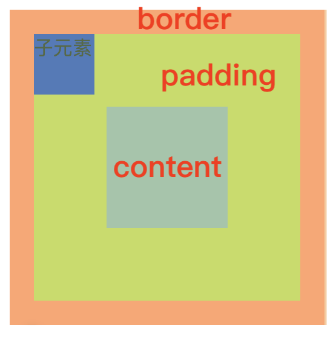
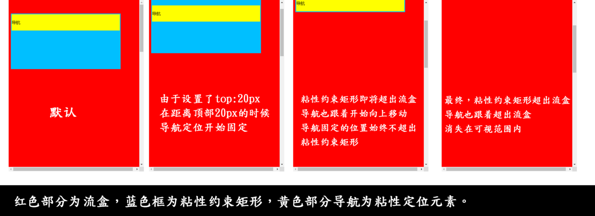
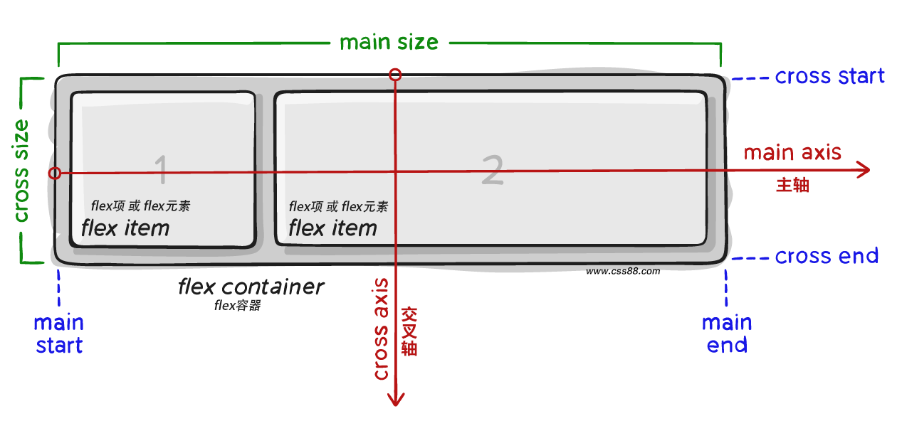
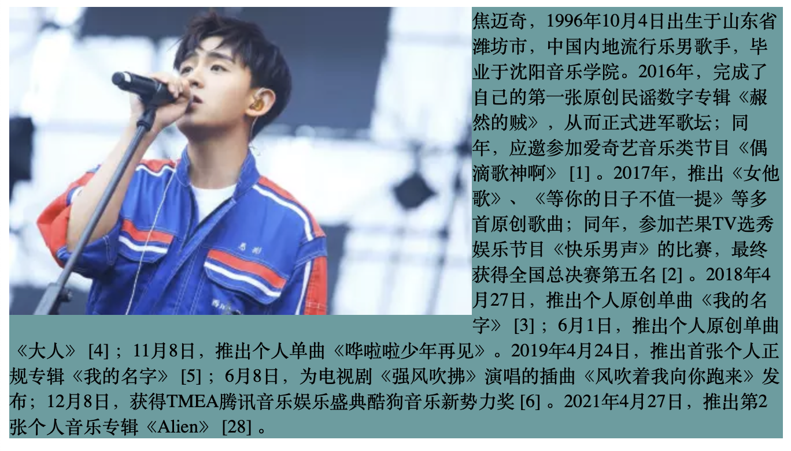
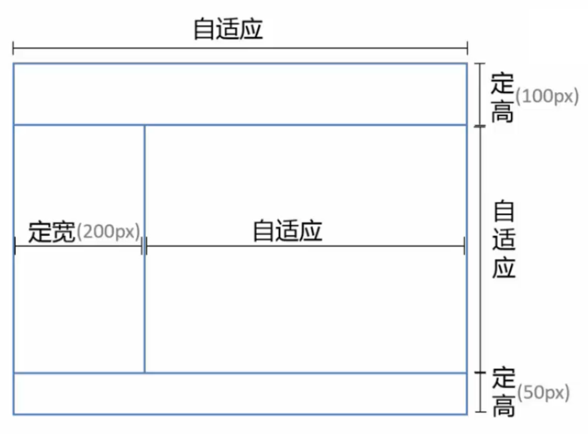

# CSS 布局

## 1. 定位


参考链接：[CSS 定位详解](http://www.ruanyifeng.com/blog/2019/11/css-position.html) [sticky定位](https://juejin.im/post/6844903973627887624)


CSS 定位主要分为静态定位 static，固定定位 fixed，绝对定位 absolute，相对定位 relative，粘性定位 sticky。

### 1.1 静态定位 static

元素默认为静态定位，正常文档流中。

### 1.2 绝对定位 absolute

* 脱离文档流，不在正常文档流中占据空间
* left、right、top、bottom 等属性相对于其最接近的一个有定位设置的父级元素进行定位，如果父元素均没有设置定位，则依据 body 元素左上角作为参考进行定位
* 绝对定位元素可以堆叠，通过 z-index 属性控制顺序


设置了绝对定位的元素，在文档流中是不占据空间的，它在文档流中的位置会被删除，相当于浮了起来。区别于浮动，浮动元素的定位还是基于正常的文档流，然后从文档流中抽出并尽可能远的移动至左侧或者右侧。文字内容会围绕在浮动元素周围。


绝对定位无视参考的那个盒子的 padding，例如下图所示的例子，蓝色的子元素设置为绝对定位，其无视了参考父元素的 padding 部分。



### 1.3 相对定位 relative


相对指的是相对于原来的位置而言，区别于绝对定位是相对于设有定位的父元素而言


* 未脱离文档流，会在正常文档流中占据空间，留下空白
* left、right、top、bottom 等属性设置在正常文档流中偏移自身位置
* 通过 z-index 属性控制顺序，但相对定位元素不可层叠


相对定位基本上就两个作用，一是微调元素，二是作为绝对定位的参考


### 1.4 固定定位 fixed

固定定位类似于绝对定位，其相对于浏览器窗口而言定位，脱离文档流。最常见的用途是在页面中创建一个固定头部、固定脚部或者固定侧边栏。

### 1.5 粘性定位sticky

类似于像 relative 和 fixed 的结合，主要用于页面滚动：在跨越特定阈值前为 relative 定位（定位基点是自身默认位置），之后变成 fixed 定位（定位基点是视口）。使用的时候必须搭配`top`、`bottom`、`left`、`right`这四个属性（之一）一起使用。

规则：页面滚动，当父元素开始脱离视口时（即部分不可见），只要与`sticky`元素的距离达到生效门槛，`relative`定位自动切换为`fixed`定位；等到元素完全脱离视口时（即完全不可见），`fixed`定位自动切换回`relative`定位。

```markup
<head>
  <style>
    body{
      height: 2000px;
      width: 100%;
      background-color: red;
    }
    div {
      height: 200px;
      margin-top: 50px;
      border: solid deepskyblue;
      width: 400px;
      background-color: deepskyblue;
    }
    nav {
      position: sticky;
      top: 20px;
      background: yellow;
      height: 60px;
      line-height: 60px;
    }
  </style>
</head>
<body>
  <div>
    <nav>导航</nav>
  </div>
</body>
```




知识点：z-index 属性

* 属性值大的位于上层，属性值小的位于下层
* 只有定位了的元素，才能有z-index值（除 static），浮动元素不支持 z-index
* 从父现象：如果父亲1比父亲2大，那么即使儿子1比儿子2小，儿子1也能在上层


## 2. Flex 布局\*


参考链接：1. [Flex 布局教程-语法篇](http://www.ruanyifeng.com/blog/2015/07/flex-grammar.html?utm_source=tuicool%EF%BC%88%E8%AF%AD%E6%B3%95%E7%AF%87%EF%BC%89) 2. [Flex 布局教程-实例篇](http://www.ruanyifeng.com/blog/2015/07/flex-examples.html) 3.[ Flexbox 布局完全指南](https://www.html.cn/archives/8629)


采用 Flex 布局`dispaly:flex;`的元素，称为 Flex 容器（flex container）；所有子元素自动成为容器成员，称为 Flex 项目（flex item）。默认水平的叫主轴（main axis），垂直的叫交叉轴（cross axis）。




### 2.1 容器的属性

**flex-direction\***：决定主轴的方向（即项目的排列方向），默认从左到右

| 属性值 | 描述 |
| :--- | :--- |
| row | 从左到右水平排列子元素（默认值） |
| column | 从上到下垂直排列子元素 |
| row-reverse | 从右向左排列子元素 |
| column-reverse | 从下到上垂直排列子元素 |

**flex-wrap**：决定一条轴线排不下如何换行，默认不换行

**flex-flow**：flex-direction \|\| flex-wrap；

**justify-content\***：定义了项目在主轴上的对齐方式，默认左对齐

| 属性值 | 描述 |
| :--- | :--- |
| flex-start | 从主轴的起点对齐（默认值） |
| flex-end | 从主轴的终点对齐 |
| center | 居中对齐 |
| space-around | 在父盒子里平分 |
| space-between | 两端对齐平分 |

**align-items\***：定义项目在交叉轴上如何对齐

| 属性值 | 描述 |
| :--- | :--- |
| flex-start | 交叉轴的起点对齐 |
| flex-end | 交叉轴的终点对齐 |
| baseline | 项目的第一行文字的基线对齐 |
| center | 交叉轴的中点对齐 |
| stretch | 如果项目未设置高度或设为auto，将占满整个容器的高度 |

**align-content**：定义了多根交叉轴线的对齐方式

### 2.2 项目的属性

**order**：定义项目的排列顺序。数值越小，排列越靠前，默认为0。

**flex-grow**：定义项目的放大比例，默认为0，即如果存在剩余空间，也不放大（用于确定各部分的比例大小，例如属性都为1，则等分剩余空间）。

**flex-shrink**：定义了项目的缩小比例，默认为1，即如果空间不足，该项目将缩小（爷用于确定各部分的比例大小，例如属性都为1，则等比例缩小，特殊的是如果一个项目属性为0，其他项目都为1，则空间不足时，前者不缩小）。

**flex-basis**：定义了在分配多余空间之前，项目占据的主轴空间（main size），默认值为`auto`，即项目的本来大小。

**flex\***：none \| \[ flex-grow flex-shrink \|\| flex-basis\]

* 默认值：0 1 auto
* auto：1 1 auto
* none：0 0 auto
* 1：1 1 0%
* 2 3：2 3 0%
* 0%：1 1 0%
* 200px: 1 1 200px
* 10 100px：10 1 100px

**align-self**：允许单个项目有与其他项目不一样的对齐方式，可覆盖align-items属性。


示例（项目长度）：容器宽度600px，项目1设置`width: 140px; flex: 2 1 0%;`，项目2设置`width: 100px; flex: 2 1 auto;`，项目3设置`flex: 1 1 200px;`。

目前已占据宽度 0%+100px+200px=300px（注意项目1尽管设置了宽度140px，但flex-basis设置为0%，则不认为其占据了宽度），因此剩余300px。根据比例2:2:1分配300px，最终项目1-120px，项目2-220px，项目3-260px。


## 3. 居中布局


示例：红包在页面严格居中


```markup
<!DOCTYPE html>
<html lang="en">
    <head>
        <meta charset="UTF-8" />
        <meta name="viewport" content="width=device-width, initial-scale=1.0" />
        <title>Document</title>
        <style>
            /* 整个弹窗组件 */
            .component_popup {
                position: fixed;
                top: 0;
                bottom: 0;
                left: 0;
                right: 0;
                z-index: 100;
            }

            /* 遮罩背景 */
            .popup_mask {
                position: fixed;
                top: 0;
                bottom: 0;
                left: 0;
                right: 0;
                background: rgba(0, 0, 0, 0.7);
            }

            /* 弹窗区域（内容 + close）：严格居中 */
            .popup_content {
                position: absolute;
                top: 50%;
                left: 50%;
                transform: translate(-50%, -50%);
            }

            /* 弹窗的内容部分 */
            .content_box {
                width: 15.45rem;
                height: 19.32rem;
                background: url(http://img.smyhvae.com/20191010_1500_red-packet.png) no-repeat;
                background-size: 15.45rem 19.32rem;
            }

            /* 弹窗的close图标 */
            .content_close {
                width: 1.25em;
                height: 1.25em;
                background: url(http://img.smyhvae.com/20191010_1500_close.png) no-repeat;
                background-size: 1.25rem 1.25rem;
                margin: 0 auto;
                margin-top: 0.5rem;
            }
        </style>
    </head>
    <body>
        <div class="content">默认文档流中的页面主体</div>

        <div class="component_popup">
            <div class="popup_mask"></div>
            <div class="popup_content">
                <div class="content_box"></div>
                <div class="content_close"></div>
            </div>
        </div>
    </body>
</html>
```

## 4. 浮动

```css
float: left;
float: right;
```

* 浮动的元素脱离标准流
* 一旦元素设置浮动了，那么无论原来的元素是块级还是行内都能够设置宽高了
* 不浮动的元素会出现在浮动元素下方，因为浮动元素脱离了文档流，但浮动的元素之间会互相贴靠，而不是存在堆叠情况
* 浮动的元素有“字围”效果，标准流中的文字不会被浮动的盒子遮挡住
* 一个浮动元素，如果没有设置 width，那么将自动收缩为内容宽度（非常像行内元素）

如下图所示，图片所在的 div 设置了 浮动，则图片会显示在下方盒子上面，但是文字不会被遮挡，而是存在字围效果。




清除浮动方法详见[进阶知识-清楚浮动](../css-advanced.md#7-qing-chu-fu-dong)。


## 5. 多列布局

### 5.1 自适应布局

#### 5.1.1 两列布局（定宽 + 自适应）

```markup
<div class="parent">
    <div class="left-fix">left</div>
    <div class="right-auto">right</div>
</div>

<!-- 浮动 + margin -->
<style>
    .left-fix {
        float: left;
        width: 100px;
    }

    .right-auto {
        margin-left: 100px;
    }
</style>
```

```markup
<div class="parent">
    <div class="left-fix">left</div>
    <div class="right-auto">right</div>
</div>

<!-- 浮动 + BFC -->
<style>
    .left-fix {
        float: left;
        width: 100px;
    }

    .right-auto {
        overflow: hidden; /* 形成BFC */
    }
</style>
```

```markup
<div class="parent">
    <div class="left-fix">left</div>
    <div class="right-auto">right</div>
</div>

<!-- flex-->
<style>
    .parent{
        display: flex;
    }
    .left-fix {
        width: 100px;
    }

    .right-auto {
       flex: 1;
    }
</style>
```

#### 5.1.2 内容定宽 + 自适应



```markup
<div class="parent">
    <div class="top"></div>
    <div class="left"></div>
    <div class="right"></div>
    <div class="bottom"></div>
</div>

<!-- 绝对定位 -->
<style>
.parent{ position: relative}
.top{ position: absolute; height: 100px; top: 0; left: 0; right: 0; }
.left{ position: absolute; width: 200px; top: 100px; left: 0; bottom: 50px; }
.right{ position: absolute; top: 100px; left: 200px; right: 0; bottom: 50px;}
.bottom{ position: absolute; height: 50px; left: 0; right: 0; bottom: 0; }
</style>
```

```markup
<div class="parent">
    <div class="top"></div>
    <div class="middle">
        <div class="left"></div>
        <div class="right"></div>
    </div>
    <div class="bottom"></div>
</div>

<!-- flex 布局 -->
<style>
.parent{display: flex;flex-direction: column;height: 100%;}
.top{height: 100px;}
.bottom{height: 50px;}
.middle{flex: 1}

.middle{display: flex; flex-direction: row;}
.left{width: 200px;}
.right{flex:1;}
</style>
```

#### 5.1.3 内容自适应+自适应


```markup
<div class="parent">
    <div class="top"></div>
    <div class="middle">
        <div class="left"></div>
        <div class="right"></div>
    </div>
    <div class="bottom"></div>
</div>

<!-- flex 布局 -->
<style>
.parent{display: flex;flex-direction: column;height: 100%;}
.middle{flex: 1}
.middle{display: flex; flex-direction: row;}
.right{flex:1;}
</style>
```

### 5.2 等分布局


```markup
<div class="parent">
    <div class="column"><p>1</p></div>
    <div class="column"><p>2</p></div>
    <div class="column"><p>3</p></div>
    <div class="column"><p>4</p></div>
</div>

<!-- flex（推荐） -->
<style>
    .parent {
        display: flex;
    }

    .column {
        flex: 1;
    }

    .column + .column {  /*下一兄弟节点选择器*/
        margin-left: 20px;
    }
</style>
```

### 5.3 等高布局


等高指的是列等高，当一列高度增加时，旁边的列也都和其等高，即所有列的高度都等于最高的列。



```markup
<div class="parent">
    <div class="column">left</div>
    <div class="column">right</div>
</div>

<!-- 负margin正padding -->
<style>
    .parent {
        overflow: hidden;
    }

    .column {
        margin-bottom: -9999px;
        padding-bottom: 9999px;
    }
</style>
```

此外还可以借助flex，本身默认值就满足等高要求，例如 flex 的 align-items 属性默认值 stretch 表示如果项目未设置高度或设为 auto，将占满整个容器的高度。

## 6. Grid 布局


参考链接：[Grid 布局完全指南](https://www.html.cn/archives/8510)  [Grid 网格布局教程](http://www.ruanyifeng.com/blog/2019/03/grid-layout-tutorial.html)


简单区别于Flex 布局，Flex是轴线布局，只能指定"项目"针对轴线的位置，可以看作是**一维布局**。Grid 布局则是将容器划分成"行"和"列"，产生单元格，然后指定"项目所在"的单元格，可以看作是**二维布局**。同样采用网格布局`dipaly:grid`的区域，称为"容器"（container）。容器内部采用网格定位的子元素，称为"项目"（item）。划分网格的线，称为"网格线"（grid line）。正常情况下，`n`行有`n + 1`根水平网格线，`m`列有`m + 1`根垂直网格线，`n`行和`m`列会产生`n x m`个单元格。


设为网格布局以后，容器子元素（项目）的`float`、`display: inline-block`、`display: table-cell`、`vertical-align`和`column-*`等设置都将失效。


具体使用详见参考链接！

## 7. Table 布局

* display:table - 作为块级表格来显示，表格前后带有换行符
* display:inline-table - 作为内联表格来显示，表格前后没有换行符
* display:table-row - 此元素会作为一个表格行显示（类似`<tr>`）
* display:table-row-group - 元素会作为一个或多个行的分组来显示（类似`<tbody>`）
* display:table-column - 此元素会作为一个单元格列显示（类似`<col>`）
* display:table-column-group - 此元素会作为一或多个列的分组来显示（类似`<colgroup>`）
* display:table-header-group - 此元素会作为一个或多个行的分组来显示（类似`<thead>`）
* display:table-footer-group - 此元素会作为一个或多个行的分组来显示（类似`<tfoot>`）
* display:table-caption - 此元素会作为一个表格标题显示（类似`<caption>`）
* display:table-cell - 此元素会作为一个表格单元格显示（类似`<td>`和`<th>`）


如果你对内容有任何疑问，欢迎提交 [❕issues](https://github.com/MrEnvision/Front-end_learning_notes/issues) 或 [ ✉️ email](mailto:EnvisionShen@gmail.com)


