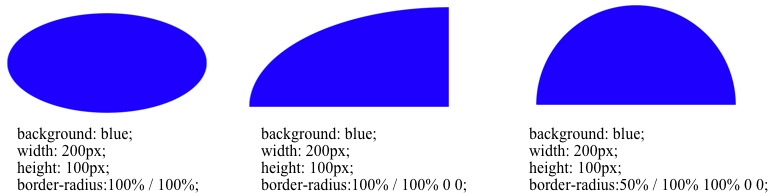

# CSS 画图

## 1. border属性

通过对border设置大小，对内容设置宽高，可以得到梯形、三角形等。

## 2. skew属性

## 3. border-radius属性

✍️ 扇形画法是利用 border-radius 并设置透明度来实现的，类似于 CSS 画三角形。

border-radius 可以用来实现圆形，这个众所周知，但是一个鲜为人知的内容是，border-radius 接受水平和垂直方向不同值，使用斜杠(/)来分隔它们，这可以让我们在圆角处取整来创建椭圆。

## 4. 总结

1. 三角形/梯形 -  [border属性](#1 border属性)
2. 平行四边形 - [transform:skew()属性](#2 skew属性)
3. 圆形 / 椭圆 -  [border-radius 属性](#3 border-radius属性)

 参考资料：[1. 如何用CSS画三角形](https://www.cnblogs.com/wangjiachen666/p/9462837.html)  [2. 倾斜skew()方法](http://www.lvyestudy.com/css3/css3_9.5.aspx) [3. 纯CSS画的基本图形](https://www.cnblogs.com/zuobaiquan01/p/8582298.html) [4. 利用css样式画各种图形](https://www.cnblogs.com/pigtail/archive/2013/02/17/2914119.html)  

