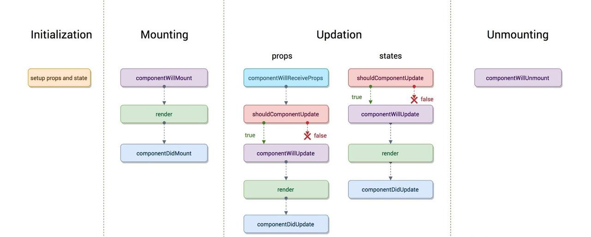
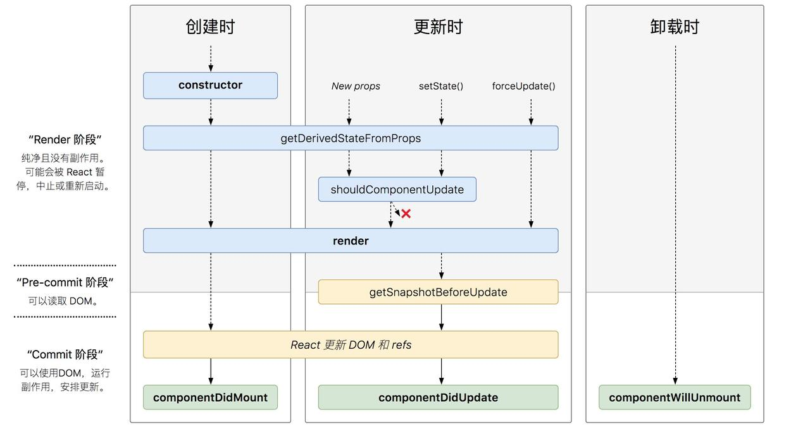

# React 生命周期

## 1. 旧版



```react
class App extends React.Component {
    static defaultProps = {
        // ...
    };

    constructor(props) {
        super(props);
        this.state = {};
    }

    componentWillMount() {
        // ...
    }

    componentDidMount() {
        // ...
    }

    render() {
        return (
            <div>This is a demo</div>
        )
    }
}
```

### 1.1 初始化阶段

初始化状态对象

```javascript
static defaultProps = {
  // ...
};
```

初始化属性对象

```javascript
constructor(props) {
  super(props);
  this.state = {};
}
```

### 1.2 挂载阶段

- componentWillMount —— 组件挂载之前执行
- render —— 组件渲染
- componentDidMount —— 组件挂载之后执行（永远只会执行一次）

### 1.3 更新阶段

**props 更新**

- componentWillReceiveProps —— 组件收到新的属性对象时调用，首次渲染不会调用
- shouldComponentUpdate —— 询问组件是否可以更新（返回 Boolean 值）
- componentWillUpdate —— 组件更新之前调用
- render —— 重新渲染组件
- componentDidUpdate —— 组件更新完成调用

**state 更新**

- shouldComponentUpdate  —— 询问组件是否可以更新（返回 Boolean 值）
- componentWillUpdate —— 组件更新之前调用
- render —— 重新渲染组件
- componentDidUpdate —— 组件更新完成调用

### 1.4 销毁阶段

- componentWillUnmount —— 组件卸载之前调用

## 2. 新版



```react
class App extends React.Component {
    static defaultProps = {
        // ...
    };

    constructor(props) {
        super(props);
        this.state = {
            number: 0
        };
    }

    static getDerivedStateFromProps(nextProps, prevState) {
        if (nextProps.number % 2 === 0) {
            return {number: nextProps.number * 2}
        } else {
            return {number: nextProps.number * 3}
        }
    }

    getSnapshotBeforeUpdate() {
        // 返回更新内容的高度
        return this.wrapper.current.scrollHeight;
    }

    componentDidMount() {
        // ...
    }

    render() {
        return (
            <div>This is a demo</div>
        )
    }
}
```

### 2.1 创建阶段

- constructor —— 初始化属性和状态
- getDerivedStateFromProps —— 根据属性对象派生状态对象
- render —— 渲染组件
- componentDidMount —— 组件挂载（渲染）完成调用

### 2.2 更新阶段

- getDerivedStateFromProps —— 根据属性对象派生状态对象
- shouldComponentUpdate —— 询问组件是否可以更新（返回 Boolean 值）
- render —— 重新渲染组件
- getSnapshotbeforeUpdate —— 获取更新前的快照
- componentDidUpdate —— 组件更新完成调用

### 2.3 销毁阶段

- componentWillUnmount —— 组件卸载之前调用

### 2.4 新旧比较（废三增二）

废弃：

- `componentWillMount`
- `componentWillReceiveProps`
- `componentWillUpdate`

增加：

- `getDerivedStateFromProps`
- `getSnapshotbeforeUpdate`

