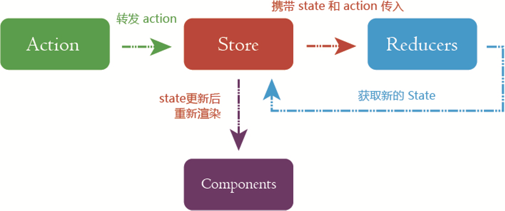

# Redux

> Redux 是 JavaScript 状态容器，提供可预测化的状态管理。



## 1. action

```js
/*
 * action 类型
 */

export const ADD_TODO = 'ADD_TODO';
export const TOGGLE_TODO = 'TOGGLE_TODO'
export const SET_VISIBILITY_FILTER = 'SET_VISIBILITY_FILTER'

/*
 * 其它的常量
 */

export const VisibilityFilters = {
  SHOW_ALL: 'SHOW_ALL',
  SHOW_COMPLETED: 'SHOW_COMPLETED',
  SHOW_ACTIVE: 'SHOW_ACTIVE'
}

/*
 * action 创建函数
 */

export function addTodo(text) {
  return { type: ADD_TODO, text }
}

export function toggleTodo(index) {
  return { type: TOGGLE_TODO, index }
}

export function setVisibilityFilter(filter) {
  return { type: SET_VISIBILITY_FILTER, filter }
}
```

### 1.1 Action

> **Action** 是把数据从应用传到 store 的有效载荷。它是 store 数据的**唯一**来源。一般来说会通过 [`store.dispatch()`](https://www.redux.org.cn/docs/api/Store.html#dispatch) 将 action 传到 store。action 本质上是 JavaScript 普通对象，例如`{ type: ADD_TODO, text }`就是一个action。

action 对象的结构可以参照 [Flux 标准 Action](https://github.com/acdlite/flux-standard-action)：

```js
{
  type: 类型,
  payload: action 的有效荷载，可以理解为数据,
  error: 布尔值，如果 action 代表为一种 error,
  meta: 用于不属于 payload 的任何其他信息
}
```

对于大型应用而言，action type 可以抽离出单独的文件统一管理：

```js
// actionType.js

/*
 * action 类型
 */

export const ADD_TODO = 'ADD_TODO';
export const TOGGLE_TODO = 'TOGGLE_TODO'
export const SET_VISIBILITY_FILTER = 'SET_VISIBILITY_FILTER'
```

### 1.2 Action 创建函数

> **Action 创建函数** 就是生成 action 的方法，也就是返回一个 action。

```js
function addTodo(text) {
  return {
    type: ADD_TODO,
    text
  }
}

// dispatch 调用
dispatch(addTodo(text))
```

## 2. reducer

> **Reducers** 指定了应用状态的变化如何响应 [actions](https://www.redux.org.cn/docs/basics/Actions.html) 并发送到 store 的，记住 actions 只是描述了*有事情发生了*这一事实，并没有描述应用如何更新 state。

```js
import { combineReducers } from 'redux'
import {
  ADD_TODO,
  TOGGLE_TODO,
  SET_VISIBILITY_FILTER,
  VisibilityFilters
} from './actions'
const { SHOW_ALL } = VisibilityFilters

function visibilityFilter(state = SHOW_ALL, action) {
  switch (action.type) {
    case SET_VISIBILITY_FILTER:
      return action.filter
    default:
      return state
  }
}

function todos(state = [], action) {
  switch (action.type) {
    case ADD_TODO:
      return [
        ...state,
        {
          text: action.text,
          completed: false
        }
      ]
    case TOGGLE_TODO:
      return state.map((todo, index) => {
        if (index === action.index) {
          return Object.assign({}, todo, {
            completed: !todo.completed
          })
        }
        return todo
      })
    default:
      return state
  }
}

const todoApp = combineReducers({
  visibilityFilter,
  todos
})

export default todoApp
```

reducer 就是一个纯函数，接收旧的 state 和 action，返回新的 state。`(previousState, action) => newState`

注意！**不要**在 reducer 里修改传入参数，也就是previousState，一般要深拷贝后再操作。

## 3. store

Store 有以下职责：

- 维持应用的 state；
- 提供 [`getState()`](https://www.redux.org.cn/docs/api/Store.html#getState) 方法获取 state；
- 提供 [`dispatch(action)`](https://www.redux.org.cn/docs/api/Store.html#dispatch) 方法更新 state；
- 通过 [`subscribe(listener)`](https://www.redux.org.cn/docs/api/Store.html#subscribe) 注册监听器;
- 通过 [`subscribe(listener)`](https://www.redux.org.cn/docs/api/Store.html#subscribe) 返回的函数注销监听器。

```js
import { createStore } from 'redux'
import todoApp from './reducers'
let store = createStore(todoApp)

export default store;
```

```js
// 打印初始状态
console.log(store.getState())

// 每次 state 更新时，打印日志
// 注意 subscribe() 返回一个函数用来注销监听器
const unsubscribe = store.subscribe(() =>
  console.log(store.getState())
)

// 发起一系列 action
store.dispatch(addTodo('Learn about actions'))
store.dispatch(addTodo('Learn about reducers'))
store.dispatch(addTodo('Learn about store'))
store.dispatch(toggleTodo(0))
store.dispatch(toggleTodo(1))
store.dispatch(setVisibilityFilter(VisibilityFilters.SHOW_COMPLETED))

// 停止监听 state 更新
unsubscribe();
```

