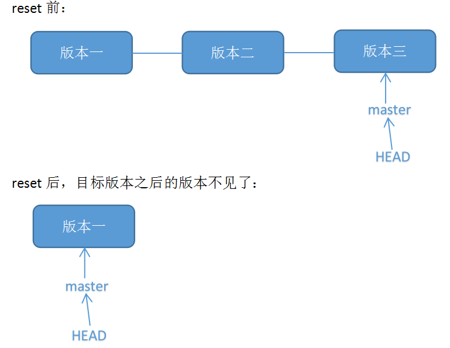
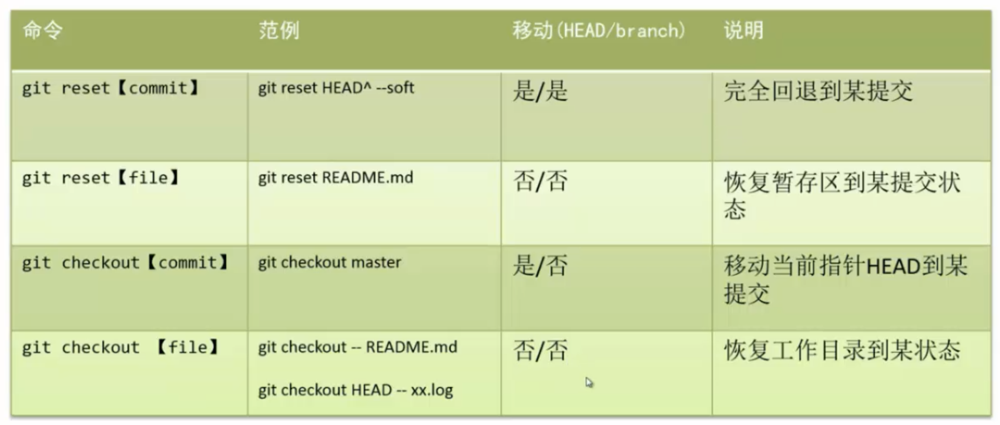

# 版本控制工具-Git


参考资料：

* 基础教程：[Pro Git 中文版](https://www.progit.cn/)   [猴子都能懂的Git入门](https://backlog.com/git-tutorial/cn/)   [Git教程-廖雪峰教程](https://www.liaoxuefeng.com/wiki/896043488029600)
* 学习资源：[Git 操作手册](https://backlog.com/git-tutorial/cn/reference/)   [Resources to learn Git](http://try.github.io/)


## 1. Git 安装


参考教程：[教程 - 1](https://www.jianshu.com/p/7edb6b838a2e)  [教程 - 2](https://www.cnblogs.com/zheng577564429/p/8317524.html)   [教程 - 3](https://www.runoob.com/git/git-install-setup.html)


```text
# 查看是否已安装git
$ git

# 设置username和email
$ git config --global user.name "MrEnvision"
$ git config --global user.email "306407158@qq.com"

# 创建ssh key
$ ssh-keygen -t rsa -C "306407158@qq.com"

# 查看key - 将其复制至github的Settings的New SSH key中
$ cat .ssh/id_rsa.pub

# 验证是否连接成功
ssh -T git@github.com
```

## 2. Git 基础


```text
# 确认工作树和索引的状态
$ git status

# 查看提交记录
$ git log

# ^后退一步，～后退指定步数
git checkout <引用内容，例如HEAD、分支名等>^
git checkout <引用内容，例如HEAD、分支名等>~<num>


# -----------------增加文件-----------------
# 添加指定文件到暂存区
$ git add [file1][file2] …
# 添加指定目录到暂存区，包括子目录
$ git add [dir]
# 添加当前目录的所有文件到暂存区
$ git add .


# -----------------仓库提交-----------------
# 提交暂存区到仓库区
$ git commit -m [message]
# 提交暂存区的指定文件到仓库区
$ git commit[file1] [file2] … -m [message]
# 提交工作区自上次commit之后的变化，直接到仓库区
$ git commit -a
# 提交时显示所有diff信息
$ git commit -v
```


版本控制系统只能跟踪文本文件的改动，比如TXT文件、网页、所有的程序代码等等，而图片、视频等二进制文件，虽然也能由版本控制系统管理，但没法跟踪文件的变化。


## 3. 分支操作\*


* **master 分支**只负责管理发布的状态，在提交时使用标签记录发布版本号。
* **develop 分支**是针对发布的日常开发分支。
* **feature 分支**是针对新功能的开发，在开发的时候从 develop 分支分叉出来的，完成开发后，把分支合并回 develop 分支后发布。
* **release 分支**是为 release 做准备的，通常会在分支名称的最前面加上 release-。一般的开发是在 develop 分支上进行的，到了可以发布的状态时再创建 release 分支，为 release 做最后的 bug 修正。到了可以 release 的状态时，把 release 分支合并到 master 分支，并且在合并提交里添加 release 版本号的标签。
* **hotFix 分支**是在发布的产品需要紧急修正时，从 master 分支创建的分支。通常会在分支名称的最前面加上 hotfix-。

### 3.1 操作分支

创建分支

```text
$ git branch <branchname>
```

切换分支

```text
$ git checkout <branchname>
```

查看分支

```text
$ git branch
```

切换分支

```text
$ git checkout <branchname>
```

创建并切换分支

```text
git checkout -b <branchname>
```


在实际开发应用中，如果要开发一个新功能，我们不建议直接在 master 分支上开发，而是专门创建一个新分支，在新分支上完成开发再 commit/push 合并到 master 分支上，如果后续不再需要特性分支，也可以直接删了特性分支。


### 3.2 合并分支

合并分支有2种方法：使用 merge 或 rebase：

<table>
  <thead>
    <tr>
      <th style="text-align:center">&#x60C5;&#x51B5;</th>
      <th style="text-align:center">&#x56FE;&#x89E3;</th>
    </tr>
  </thead>
  <tbody>
    <tr>
      <td style="text-align:center">&#x5F53;&#x524D;&#x4E24;&#x4E2A;&#x5206;&#x652F;</td>
      <td style="text-align:center">
        
      </td>
    </tr>
    <tr>
      <td style="text-align:center">merge &#x5408;&#x5E76;&#x5206;&#x652F;</td>
      <td style="text-align:center">
        
      </td>
    </tr>
    <tr>
      <td style="text-align:center">rebase &#x5408;&#x5E76;&#x5206;&#x652F;</td>
      <td style="text-align:center">
        <p></p>
        <p>
          
        </p>
      </td>
    </tr>
  </tbody>
</table>

**merge**：保持修改内容的历史记录，但是历史记录会很复杂。

```text
$ git merge <branchname>
# 注意若存在冲突，处理完冲突后使用下面语句
$ git commit -a [message]
```


merge 合并的话 Git 会用两个分支的末端（例如 D 和 Y ）和它们的共同祖先（例如 B）行一次简单的三方合并计算。


**rebase**：历史记录简单，是在原有提交的基础上将差异内容反映进去，可能导致原本的提交内容无法正常运行。

```text
$ git rebase <branchname>
# 注意若存在冲突，处理完冲突后使用下面语句
$ git rebase --continue
```

### 3.3 冲突解决

push 到远程数据库之前需要先 pull 一下，可能存在远程数据库存在冲突的情况，这个时候需要手动解决一下冲突，然后再 push 到远程数据库；或者合并分支的时候也会出现冲突的情况，需要进行冲突解决。

======= 上面的是本地数据库内容，下面的是远程数据库内容，手动修改并删除多余的标示行以解决冲突，然后再次通过 commit 提交，最后再 push 至远程数据库。

```text
连猴子都懂的Git命令
add 把变更录入到索引中
<<<<<<< HEAD
commit 记录索引的状态
=======
pull 取得远端数据库的内容
>>>>>>> 4c0182374230cd6eaa93b30049ef2386264fe12a
```

## 4. 修改提交

### 4.1 撤销更改


参考资料：[Git恢复之前版本的两种方法reset、revert](https://blog.csdn.net/yxlshk/article/details/79944535)


```text
git reset <目标版本号>
git revert <目标版本号>
```

<table>
  <thead>
    <tr>
      <th style="text-align:left">&#x7C7B;&#x578B;</th>
      <th style="text-align:left">&#x8BF4;&#x660E;</th>
      <th style="text-align:left">&#x56FE;&#x89E3;</th>
    </tr>
  </thead>
  <tbody>
    <tr>
      <td style="text-align:left">reset</td>
      <td style="text-align:left">git reset &#x7684;&#x4F5C;&#x7528;&#x662F;&#x4FEE;&#x6539; HEAD &#x7684;&#x4F4D;&#x7F6E;&#xFF0C;&#x5373;&#x5C06;
        HEAD &#x6307;&#x5411;&#x7684;&#x4F4D;&#x7F6E;&#x6539;&#x53D8;&#x4E3A;&#x4E4B;&#x524D;&#x5B58;&#x5728;&#x7684;&#x67D0;&#x4E2A;&#x7248;&#x672C;&#x3002;</td>
      <td
      style="text-align:left">
        <p></p>
        <p>
          
        </p>
        </td>
    </tr>
    <tr>
      <td style="text-align:left">revert</td>
      <td style="text-align:left">git revert &#x662F;&#x7528;&#x4E8E;&#x201C;&#x53CD;&#x505A;&#x201D;&#x67D0;&#x4E00;&#x4E2A;&#x7248;&#x672C;&#xFF0C;&#x4EE5;&#x8FBE;&#x5230;&#x64A4;&#x9500;&#x8BE5;&#x7248;&#x672C;&#x7684;&#x4FEE;&#x6539;&#x7684;&#x76EE;&#x7684;&#x3002;</td>
      <td
      style="text-align:left">
        <p></p>
        <p>
          
        </p>
        </td>
    </tr>
  </tbody>
</table>

reset 存在3种模式：

| 模式名称 | HEAD的位置 | 索引 | 工作树 | 应用 |
| :--- | :--- | :--- | :--- | :--- |
| soft | 修改 | 不修改 | 不修改 | 只取消提交 |
| mixed（默认） | 修改 | 修改 | 不修改 | 复原修改过的索引的状态 |
| hard | 修改 | 修改 | 修改 | 彻底取消最近的提交 |


revert 图解说明：想要撤销版本二，但又不想影响撤销版本三的提交，就可以用 git revert 命令来反做版本二，生成新的版本四，这个版本四里会保留版本三的东西，但撤销了版本二的东西。



不建议使用 reset，不能随便删除已经发布的提交，通过 revert 安全地取消过去发布的提交。


reset 与 checkout 的区别？



### 4.2 提取提交

从其他分支复制指定的提交，然后导入到现在的分支。**主要使用的场合：**

* 把弄错分支的提交移动到正确的地方
* 把其他分支的提交添加到现在的分支


```text
# 将引用内容的导入到当前分支
$ git cherry-pick <引用内容>
```

## 5. 打标签

Git可以使用2种标签：轻标签和注解标签。一般情况下，发布标签是采用注解标签来添加注解或签名的。轻标签是为了在本地暂时使用或一次性使用。

添加轻标签

```text
$ git tag <tagname>
```

添加注解标签

```text
$ git tag -a <tagname>
```

删除标签

```text
$ git tag -d <tagname>
```

## 6. 远程仓库


在提交远程分支前，如果当前远程分支别人已经更改了，则需要先获取相关内容进行合并，建议不管如何，提交前最好都执行下`git pull --rebase`


```text
# -----------本地仓库-->远程仓库----------
# 关联到远程仓库
$ git remote add origin git@github.com:MrEnvision/front-end-learning.git
# 获取远程库与本地同步合并（如果远程库不为空必须做这一步，否则后面的提交会失败）
$ git pull --rebase origin master
# 本地库的所有内容推送到远程库上，如下命令 - 第一次推送要加上 -u
$ git push -u origin master
# 后续本地提交，就只需通过如下命令
$ git push origin master
```

```text
# -----------远程仓库-->本地仓库----------
# 查看远程分支
$ git remote -v
# 从远程获取最新版本到本地(本地新建temp分支，将远程origin仓库的master分支代码下载到本地temp分支)
$ git fetch origin master:temp
# 比较本地仓库与下载的temp分支
$ git diff temp
# 若没什么问题，合并temp分支到本地的master分支
$ git merge temp
# 删除temp分支
$ git branch -d temp
```

```text
# -----------------其他-----------------
# 下载远程仓库的所有变动
$ git fetch[remote]
# 显示所有远程仓库
$ git remote -v
# 显示某个远程仓库的信息
$ git remote show[remote]
# 增加一个新的远程仓库，并命名
$ git remote add[shortname] [url]
# 取回远程仓库的变化，并与本地分支合并
$ git pull[remote] [branch]
# 上传本地指定分支到远程仓库
$ git push[remote] [branch]
# 强行推送当前分支到远程仓库，即使有冲突
$ git push[remote] –force
# 推送所有分支到远程仓库
$ git push[remote] –all
```


如果你对内容有任何疑问，欢迎提交 [❕issues](https://github.com/MrEnvision/Front-end_learning_notes/issues) 或 [ ✉️ email](mailto:EnvisionShen@gmail.com)


