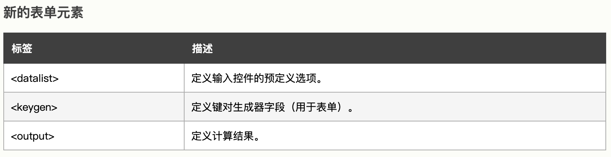
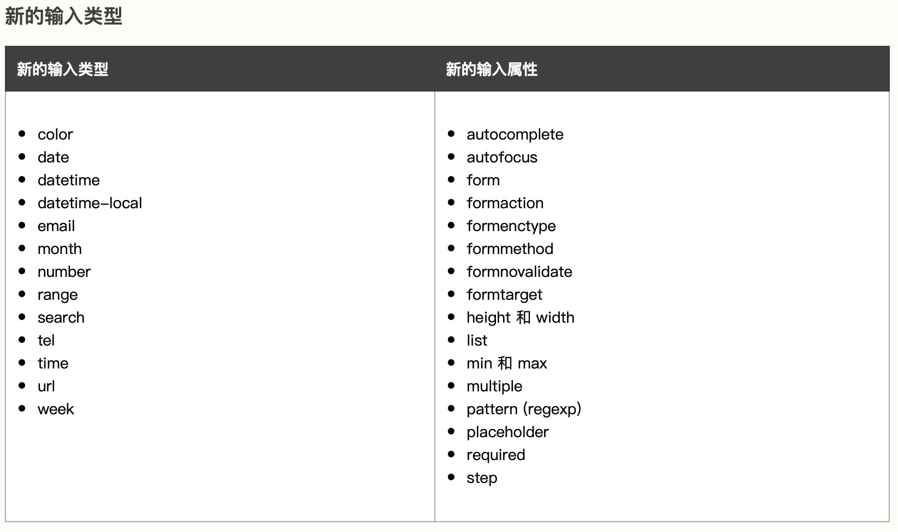
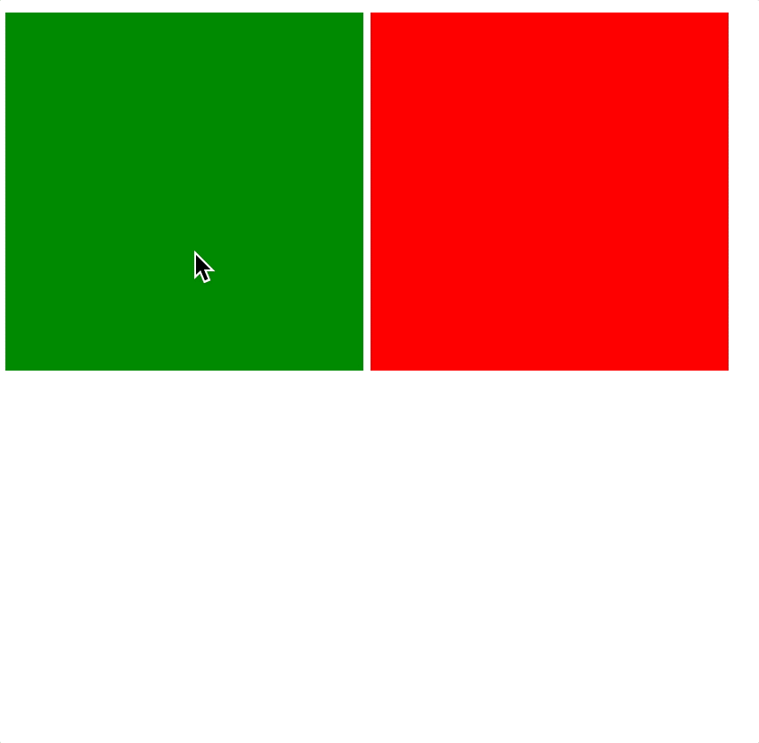

# HTML5

> HTML5 是新一代开发 Web 富客户端应用程序整体解决方案，包括：HTML5，CSS3，Javascript API在内的一套技术组合。


本文仅概述部分内容，具体内容详见[“MDN Web Docs - HTML5”](https://developer.mozilla.org/en-US/docs/Glossary/HTML5)。


## 1. 语义化标签

HTML5 增加了大量有意义的语义标签，更有利于搜索引擎或辅助设备理解 HTML 页面内容。HTML5会让HTML代码的内容更结构化、标签更语义化。

* `<section>` 表示区块
* `<article>` 表示文章，如文章、评论、帖子、博客
* `<header>` 表示页眉
* `<footer>` 表示页脚
* `<nav>` 表示导航
* `<aside>` 表示侧边栏，如文章的侧栏
* `<figure>` 表示媒介内容分组。
* `<mark>` 表示标记 \(用得少\)
* `<progress>` 表示进度 \(用得少\)
* `<time>` 表示日期


## 2. 视/音频

视频 `<video>` 标签

```markup
<!-- video 标签内的段落，当不支持video时则会显示 -->
<video src="地址" controls>
    <p>你的浏览器不支持 HTML5 视频。可点击<a href="地址">此链接</a>观看</p>
</video>

<!-- 当需要适配不同浏览器对不同格式视频的支持情况时 -->
<video controls>
  <source src="rabbit320.mp4" type="video/mp4">
  <source src="rabbit320.webm" type="video/webm">
  <p>你的浏览器不支持 HTML5 视频。可点击<a href="rabbit320.mp4">此链接</a>观看</p>
</video>
```

音频 `audio` 标签

```markup
<audio src="输入文件地址" controls>
    浏览器不支持(浏览器不支持的时候显示)
</audio>

<!-- 多文件供浏览器支持 -->
<audio controls>
    <source src="输入文件地址" type="audio/ogg">
    <source src="输入文件地址" type="audio/mpeg">
    Your browser does not support the audio element.
</audio>
```

## 3. 表单






具体详见 [HTML 表单元素](https://www.w3school.com.cn/html/html_form_elements.asp)、[HTML 输入类型](https://www.w3school.com.cn/html/html_form_input_types.asp)、[HTML 输入属性](https://www.w3school.com.cn/html/html_form_attributes.asp)。


## 4. 自定义属性

H5 可以直接在标签里添加自定义属性，但必须以 `data-` 开头，在 JS 中可以通过`dom.dataset` 来获取所有的自定义属性。

```markup
<!DOCTYPE html>
<html lang="en">
  <head>
    <meta charset="UTF-8" />
    <meta http-equiv="X-UA-Compatible" content="IE=edge" />
    <meta name="viewport" content="width=device-width, initial-scale=1.0" />
    <title>Document</title>
  </head>
  <body>
    <div id="test" data-name="sherwin"></div>
    <script>
      const dom = document.getElementById("test")
      const name = dom.dataset["name"]
      console.log(name) // sherwin
    </script>
  </body>
</html>
```

## 5. 拖拽

在HTML5的规范中，我们可以通过为元素增加 `draggable="true"` 来设置此元素是否可以进行拖拽操作，其中图片、链接默认是开启拖拽的。

```markup
<div class="box1" draggable="true" style="display:inline-block; width: 200px; height: 200px; background-color: green;"></div>
<div class="box2" draggable="false" style="display:inline-block; width: 200px; height: 200px; background-color: red;"></div>
```



拖拽的过程涉及2个元素，拖拽元素与目标元素，即把拖拽元素拖拽到目标元素上，我们可对其分别设置相应的监听事件：

* 拖拽元素
  * `ondragstart`：当拖拽开始时调用
  * `ondragleave`：当鼠标离开拖拽元素时调用
  * `ondragend`：当拖拽结束时调用
  * `ondrag`：整个拖拽过程都会调用
* 目标元素
  * `ondragenter`：当拖拽元素进入时调用
  * `ondragover`：当拖拽元素停留在目标元素上时连续触发（不管移动还是停止状态）
  * `ondrop`：当在目标元素上松开鼠标时调用
  * `ondragleave`：当鼠标离开目标元素时调用

## 6. 地理定位


详见 [W3school 基础教程-HTML5 地理定位](https://www.w3school.com.cn/html/html5_geolocation.asp)。


## 7. H5 应用缓存

通过创建 cache manifest 文件，可轻松创建 web 应用的离线版本。

```markup
<!DOCTYPE HTML>
<html manifest="demo.appcache">
...
</html>
```

```markup
CACHE MANIFEST

# 要缓存的文件
CACHE:
/theme.css
/logo.gif
/main.js

# 指定必须联网才能访问的文件
NETWORK:
login.asp

# 当前页面无法访问是回退的页面
FALLBACK:
404.html
```

* CACHE MANIFEST - 在此标题下列出的文件将在首次下载后进行缓存
* NETWORK - 在此标题下列出的文件需要与服务器的连接，且不会被缓存
* FALLBACK - 在此标题下列出的文件规定当页面无法访问时的回退页面（比如 404 页面）

## 8. 本地存储




如果你对内容有任何疑问，欢迎提交 [❕issues](https://github.com/MrEnvision/Front-end_learning_notes/issues) 或 [ ✉️ email](mailto:EnvisionShen@gmail.com)


