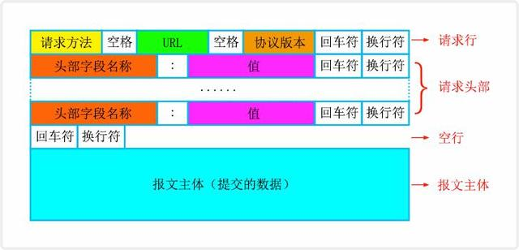
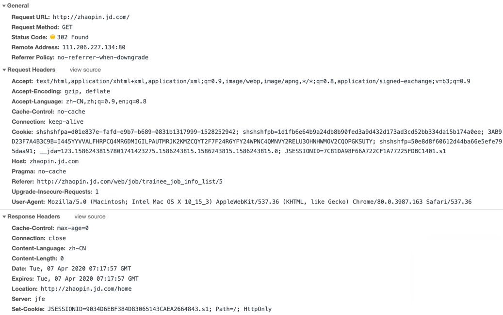

# HTTP/HTTPS


推荐阅读：小林 coding - [30 张图解 HTTP 常见的面试题](https://blog.csdn.net/qq_34827674/article/details/104732605)


## 1. HTTP

HTTP 是 Hyper Text Transfer Protocol（超文本传输协议）的缩写，它是一个应用层协议，由请求和响应构成，是一个标准的客户端服务器模型。

### 1.1 请求/响应报文

#### 1.1.1 请求报文

#### 1.1.2 响应报文

### 1.2 请求方法

* GET\* — 获取资源
* POST\* — 传输资源
* PUT — 更新资源
* DELETE — 删除资源
* HEAD — 获取报文首部
* TRACE — 回显服务器收到的请求，主要用于测试或诊断
* OPTION — 请求一些选项信息，客户端查看服务器性能（CORS 非简单请求就需要预检请求）
* CONNECT — 用于代理服务器


知识点：get/post区别

* Get 请求能缓存，Post 不能
* Post 相对 Get 安全一点点，因为Get 请求都包含在 URL 里，且会被浏览器保存历史纪录。Post 不会，但是在抓包情况下都一样。
* URL有长度限制，会影响 Get 请求，但是这个长度限制是浏览器规定的，不是 RFC 规定的
* Post 支持更多的编码类型且不对数据类型限制


### 1.3 状态码


记忆版本：

* 1xx：指示信息--表示请求已接收，继续处理。
* 2xx：成功--表示请求已被成功接收、理解、接受。
* 3xx：重定向--要完成请求必须进行更进一步的操作。
* 4xx：客户端错误--请求有语法错误或请求无法实现。
* 5xx：服务器端错误--服务器未能实现合法的请求。


2xx：

* 200 OK，表示从客户端发来的请求在服务器端被正确处理
* 204 No content，表示请求成功，但响应报文不含实体的主体部分

3xx：

* 301 moved permanently，永久性重定向，表示资源已被分配了新的 URL
* 302 found，临时性重定向，表示资源临时被分配了新的 URL
* 304 not modified，表示服务器允许访问资源，但因发生请求未满足条件的情况

4xx：

* 401 unauthorized，表示发送的请求需要有通过 HTTP 认证的认证信息
* 403 forbidden，表示对请求资源的访问被服务器拒绝
* 404 not found，表示在服务器上没有找到请求的资源

5xx：

* 500 internal sever error，表示服务器端在执行请求时发生了错误
* 501 Not Implemented，表示服务器不支持当前请求所需要的某个功能
* 503 service unavailable，表明服务器暂时处于超负载或正在停机维护，无法处理请求
* 504 Gateway timeout，表示服务器作为网关或代理，没有及时从上游服务器收到请求

### 1.4 首部字段

#### 1.4.1 通用字段

| 通用字段 | 作用 |
| :---: | :---: |
| Cache-Control | 控制缓存的行为 |
| Connection | 浏览器想要优先使用的连接类型，比如  `keep-alive` |
| Date | 创建报文时间 |
| Pragma | 报文指令 |
| Via | 代理服务器相关信息 |
| Transfer-Encoding | 传输编码方式 |
| Upgrade | 要求客户端升级协议 |
| Warning | 在内容中可能存在错误 |

#### 1.4.2 请求字段

| 请求字段 | 作用 |
| :---: | :---: |
| Accept | 能正确接收的媒体类型 |
| Accept-Charset | 能正确接收的字符集 |
| Accept-Encoding | 能正确接收的编码格式列表 |
| Accept-Language | 能正确接收的语言列表 |
| Expect | 期待服务端的指定行为 |
| From | 请求方邮箱地址 |
| Host | 服务器的域名 |
| If-Match | 两端资源标记比较 |
| If-Modified-Since | 本地资源未修改返回 304（比较时间） |
| If-None-Match | 本地资源未修改返回 304（比较标记） |
| User-Agent | 客户端信息 |
| Max-Forwards | 限制可被代理及网关转发的次数 |
| Proxy-Authorization | 向代理服务器发送验证信息 |
| Range | 请求某个内容的一部分 |
| Referer | 表示浏览器所访问的前一个页面 |
| TE | 传输编码方式 |

#### 1.4.3 响应字段

| 响应字段 | 作用 |
| :---: | :---: |
| Accept-Ranges | 是否支持某些种类的范围 |
| Age | 资源在代理缓存中存在的时间 |
| ETag | 资源标识 |
| Location | 客户端重定向到某个 URL |
| Proxy-Authenticate | 向代理服务器发送验证信息 |
| Server | 服务器名字 |
| WWW-Authenticate | 获取资源需要的验证信息 |

#### 1.4.4 实体字段

| 实体字段 | 作用 |
| :---: | :---: |
| Allow | 资源的正确请求方式 |
| Content-Encoding | 内容的编码格式 |
| Content-Language | 内容使用的语言 |
| Content-Length | request body 长度 |
| Content-Location | 返回数据的备用地址 |
| Content-MD5 | Base64加密格式的内容 MD5检验值 |
| Content-Range | 内容的位置范围 |
| Content-Type | 内容的媒体类型 |
| Expires | 内容的过期时间 |
| Last\_modified | 内容的最后修改时间 |

**举例**

请求头：

* Host：连接的目标主机和端口号
* Accept：客户端能接收的资源类型
* Accept-language：客户端能接收的语言类型
* Accept-Encoding：客户端能接收的压缩数据的类型
* Connection：维护连接关系（keep-alive）
* Referer：告诉服务器请求来自哪里
* If-Modified-Since/If-none-mathc：用于缓存处理
* cache-control：同样用于缓存处理
* cookie
* User-Agent：客户端信息
* Date：请求时间

响应头：

* set-cookie：传回来的cookie信息
* cache-control：用于缓存处理
* Last-Modified：资源最后修改时间（用于缓存处理）
* etag：资源标识（用于缓存处理）
* Connection：维护连接关系
* Content-Language：服务端发送的语言类型
* Content-Type：服务端发送的资源类型
* Content-Encoding： 服务端发送压缩编码类型
* Content-Length：服务端发送的数据长度
* Date：服务端响应时间

## 2. HTTP2

HTTP/2 相比于 HTTP/1，可以说是大幅度提高了网页的性能。

在 HTTP/1 中，为了性能考虑，我们会引入雪碧图、将小图内联、使用多个域名等等的方式。这一切都是因为浏览器限制了同一个域名下的请求数量（Chrome 下一般是限制六个连接），当页面中需要请求很多资源的时候，队头阻塞（Head of line blocking）会导致在达到最大请求数量时，剩余的资源需要等待其他资源请求完成后才能发起请求。

在 HTTP/2 中引入了多路复用的技术，这个技术可以只通过一个 TCP 连接就可以传输所有的请求数据。多路复用很好的解决了浏览器限制同一个域名下的请求数量的问题，同时也接更容易实现全速传输，毕竟新开一个 TCP 连接都需要慢慢提升传输速度。

### 2.1 二进制传输

HTTP/2 中所有加强性能的核心点在于此。在之前的 HTTP 版本中，我们是通过文本的方式传输数据。在 HTTP/2 中引入了新的编码机制，所有传输的数据都会被分割，并采用二进制格式编码。

### 2.2 多路复用

HTTP1.x中，并发多个请求需要多个TCP连接，浏览器为了控制资源会有6-8个TCP连接都限制。HTTP2中同域名下所有通信都在单个连接上完成，消除了因多个 TCP 连接而带来的延时和内存消耗，并且单个连接上可以并行交错的请求和响应，之间互不干扰。

多路复用，就是在一个 TCP 连接中可以存在多条流。换句话说，也就是可以发送多个请求，对端可以通过帧中的标识知道属于哪个请求。通过这个技术，可以避免 HTTP 旧版本中的队头阻塞问题，极大的提高传输性能。

### 2.3 Header 压缩

在 HTTP 1.X 中，我们使用文本的形式传输 header，在 header 携带 cookie 的情况下，可能每次都需要重复传输几百到几千的字节。在 HTTP 2.0 中，使用了 HPACK 压缩格式对传输的 header 进行编码，减少了 header 的大小。并在两端维护了索引表，用于记录出现过的 header ，后面在传输过程中就可以传输已经记录过的 header 的键名，对端收到数据后就可以通过键名找到对应的值。

### 2.4 服务端 Push

在 HTTP 2.0 中，服务端可以在客户端某个请求后，主动推送其他资源。可以想象以下情况，某些资源客户端是一定会请求的，这时就可以采取服务端 push 的技术，提前给客户端推送必要的资源，这样就可以相对减少一点延迟时间。当然在浏览器兼容的情况下你也可以使用 prefetch。

## 3. HTTPS

### 3.1 概念

简单来说 **HTTPS协议 = HTTP协议 + SSL/TLS协议**，在HTTPS数据传输的过程中，需要用SSL/TLS对数据进行加密和解密，需要用HTTP对加密后的数据进行传输，由此可以看出HTTPS是由HTTP和SSL/TLS一起合作完成的。

http默认采用80作为通讯端口，对于传输采用不加密的方式，https默认采用443，对于传输的数据进行加密传输。

### 3.2 过程

1. `Client`发送`Client Hello`报文给`Server`开启`SSL`通信，报文中包含`Random_1`和客户端支持的加密算法
2. 服务器支持`SSL`通信的话，发送`Server Hello`报文回应，报文中包含`Random_2`
3. 服务器之后发送`Certificate`报文，报文中包含数字证书
4. 服务器再发送`Server Hello Done`通知`Client`，最初的`SSL`握手阶段协商部分结束
5. `Client`对数字证书校验，正确后，解密得到服务器的公钥。通过`RSA`算法随机生成`Pre-Master Secret`，并且用服务器的公钥进行加密，包含在`Client Key Exchange`报文中，发送给`Server`
6. 客户端继续发送`Change Cipher Spec`报文，告知`Server`端，客户端切换协商的加密套件，准备使用协商的加密套件加密数据并传输。
7. `Client`发送`Finished`报文，该报文包含了连接至今全部报文的整体校验值（也就是`hash`值）
8. `Server`接收到`Client`的请求，用私钥解密，把`Pre-master secret`取出来。`Server`发送同样的`Change Cipher Spec`报文
9. `Server`同样发送`Finished`报文，提供`Client`校验
10. `Server`和`Client`的`Finished`报文交换完毕，`SLL`连接建立。开始通信。


注意，整个过程涉及三个随机数，步骤1中客户端发送给服务端的，步骤2中服务端发送给客户端的，还有步骤5中客户端加密发送给服务端的。



如果你对内容有任何疑问，欢迎提交 [❕issues](https://github.com/MrEnvision/Front-end_learning_notes/issues) 或 [ ✉️ email](mailto:EnvisionShen@gmail.com)


