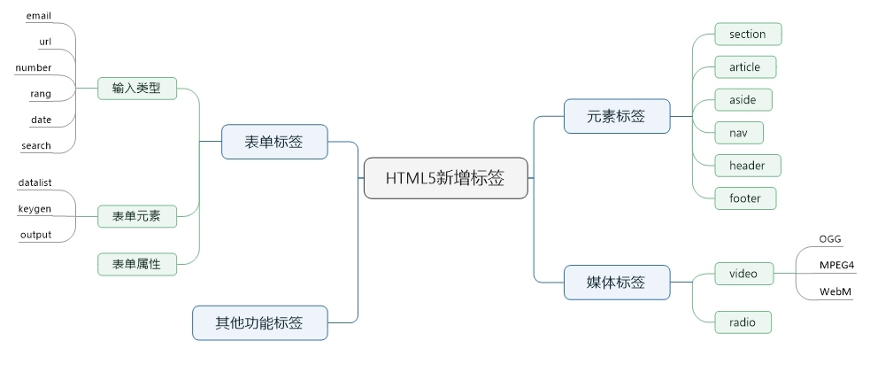

# 面试知识总结

## 一. Javascript知识

### 1. 原型链、继承

1）原型链图


✍️ 关键点

1. \_\_proto\_\_ 和 constructor 属性是对象所独有的；② prototype 属性是函数所独有的，函数也是对象，因此拥有3个属性。
2. \_\_proto\_\_ 指向父对象，constructor 指向构造函数，prototype 构造函数指向其原型。
3. \_\_proto\_\_ 最终都会到达 Object.prototype 至null，constructor 最终都会达到 Function()，构造函数的 \_\_proto\_\_ 都指向Function.prototype.

2）ES5原型链继承\(多种\) + ES6继承

|     类型     | 原理                             | 父类实例属性继承 | 父类原型属性继承 | 多继承 |
| :----------: | :------------------------------- | :--------------- | :--------------- | :----- |
|  原型链继承  | 子类的原型是父类的实例           | +                | +                | -      |
|   构造继承   | 子类调用父类构造函数             | +                | -                | +      |
|   实例继承   | 父类实例作为子类实例返回         | +                | +                | -      |
|   拷贝继承   | 子类原型拷贝父类实例的属性和方法 | +                | +                | +      |
|   组合继承   | 调用父类构造，子类原型是父类实例 | +                | +                | ？     |
| 寄生组合继承 | /                                | +                | +                | ？     |

✍️ ES6的继承super实际执行的是 `父类.prototype.constructor.call(this)`

3）静态方法/私有方法/公有方法

构造函数里直接的属性和方法称为**私有**，构造函数里加了this的和原型上的方法和属性称为**公有**，直接在构造函数上的方法和属性称为**静态**，通过对象调用，不需要new。

```javascript
// ES5
function User() {
    // 私有属性
    const hobby = 'swimming'
    // 私有方法
    const sayHi = function () {
        console.log('Hi')
    }

    // 公有属性
    this.name = 'Sherwin'
    // 公有方法
    this.getName = function () {
        console.log(this.name)
    }
}

// 静态属性
User.height = 180
// 静态方法
User.getHeight = function () {
    console.log(User.height)
}
```

```javascript
// ES6
class User {
    constructor() {
        // 公有属性
        this.name = 'Sherwin'
        this.age = 24
    }

    // 公有方法
    getName() {
        console.log(this.name)
    }

    // 静态方法
    static getAge() {
        console.log(this.age) // 不能使用公有属性和方法
    }
}

// 静态属性
User.hobby = 'swimming'

const user = new User()
console.log(user.name) // 实例使用公有属性
user.getName() // 实例使用公有方法
console.log(User.hobby) // 类使用静态属性
User.getAge() // 类使用静态方法
```

### 2. 数据类型

1）基本数据类型（6种）+引用对象类型（8种）

* 基本数据类型 - null, undefined, number, boolean, string, symbol
* 引用对象类型 - Object, Function, Array, Date, RegExp, String, Boolean, Number

2）类型转换

* 隐式类型转换：一般遵循Object-&gt;String-&gt;Number和Boolean-&gt;Number
* 强制类型转换：target.toString\(\), Number\(target\)/parseInt\(target\)/parseFloat\(target\), Boolean\(target\)

3）类型判断

| 类型                                 | 基本数据类型                 | 基本对象           | 自定义对象 |
| ------------------------------------ | ---------------------------- | ------------------ | ---------- |
| typeof 目标 === 'object'             | 可以（null 为 object）       | object 或 function | object     |
| 目标 instanceof Array === true       | 不可以                       | 可以               | 可以       |
| Object.prototype.toString.call(目标) | 可以                         | 可以               | 不可以     |
| 目标.constructor === Object          | 可以（除 null 和 undefined） | 可以               | 可以       |

✍️ Object.prototype.toString.call(目标).slice(8,-1).toLowerCase() === 'string' 需要转换一下，因为直接得到的是 [object String]

4）instanceof的原理（判断一个对象与构造函数是否在一个原型链上）

```javascript
function instance_of(L, R) {
    var O = R.prototype; 
    L = L.__proto__;
    while (true) {    
        if (L === null)      
             return false;   
        if (O === L) 
             return true;   
        L = L.__proto__;  
    }
}
```

5）赋值、深拷贝与浅拷贝 / 浅拷贝方法 / 深拷贝方法

- 赋值——基本类型传值，引用类型传引用地址
- 浅拷贝——只赋值非对象属性，对象属性是传引用地址，会互相影响
  - Object.assign(target, source)
  - 扩展运算符 ...
- 深拷贝——完全一致的对象，切不影响原始对象
  - target=JSON.parse\(JSON.stringify\(source\)\) —— [弊端](https://blog.csdn.net/u013565133/article/details/102819929)
  - 自定义拷贝（包装对象data、number、string和boolean、RegExp需要使用valueof\(\)转成原始值）

6）自定义对象深拷贝

```javascript
const deepCopy = function (obj) {
    if (typeof obj !== 'object') return obj;
    let newObj = obj instanceof Array ? [] : {};
    for (let key in obj) {
        if (obj.hasOwnProperty(key)) {
            newObj[key] = typeof obj[key] === 'object' ? deepCopy(obj[key]) : obj[key];
        }
    }
    return newObj
}
```

7）==、===、Object.is 区别

== 值相等，=== 和 Object.is 值和类型相等，但 NaN，+0/-0 有区别，Object.is\(NaN,NaN\) 为 true，Object.is\(+0,-0\) 为 false。

8）let/const/var 区别以及ES5中怎么实现块级作用域

块级作用域，变量提升等；立即执行函数；

9）map、set、array的区别

| 类型   | Array                              | Set              | Map                                        |
| :----- | :--------------------------------- | :--------------- | :----------------------------------------- |
| 初始化 | new Array\(value, value\) / \[\]   | new set([value]) | new Map\(\[\[key,value\],\[key,value\]\]\) |
| 长度   | array.length                       | set.size         | map.size                                   |
| 增     | array.push\(\) / array.unshift\(\) | set.add\(\)      | map.set\(key, value\)                      |
| 删     | array.pop\(\) / array.shift\(\)    | set.delete\(\)   | map.delete\(key\)                          |
| 查     | array.find() / array.indexOf()     | set.has\(\)      | map.get\(key\) / map.has\(key\)            |

通用遍历方法：values\(\) / keys\(\) / entries\(\) 

⚠️ entries\(\) 参数是先 key 后 value，forEach 参数是先 value 后 key。

⚠️ entries\(\) 两个参数用数组包裹，`for(let [key,value] of array.entries()){}`。

⚠️ Set 遍历的 key 和 value 为相等！！！区别于 array 的 key 为索引！！！

### 3. this指向


1）this 指向有哪几种？

* 默认绑定：全局环境中，this默认绑定到window。
* 隐式绑定：一般被直接对象所包含的函数调用时，this隐式绑定到该直接对象。
* 隐式丢失：call\(\)、apply\(\)、bind\(\)方法。
* new绑定：一般绑定至new生成的新对象，但是如果构造函数返回一个对象，则绑定至该对象。

✍️ 首先，`new` 的方式优先级最高，接下来是 `bind` 这些函数，然后是 `obj.foo()` 这种调用方式，最后是 `foo` 这种调用方式，同时，箭头函数的 `this` 一旦被绑定，就不会再被任何方式所改变。

2）改变函数内部 this 指针的指向函数？

| 类型  | 调用方式     | 第一个参数           | 其余参数       |
| :---- | :----------- | :------------------- | :------------- |
| bind  | 返回一个函数 | this指向改变后的对象 | 直接传递       |
| apply | 函数直接调用 | this指向改变后的对象 | 用数组包裹参数 |
| call  | 函数直接调用 | this指向改变后的对象 | 直接传递       |

✍️ 如果第一个参数为null或undefined，this的指向就是全局变量，在浏览器里就是window对象。

✍️ 不管我们给函数 bind 几次，fn 中的 this 永远由第一次 bind 决定。

3）自定义bind函数？

```javascript
Function.prototype.newBind = function () {
    const func = this
    const context = Array.from(arguments)[0]
    let args = Array.from(arguments).slice(1)
    const returnFunc = function () {
        args = args.concat(Array.from(arguments))
        return func.apply(this instanceof func ? this : context, args)
    }
    const newFunction = function () {
    }
    newFunction.prototype = func.prototype;
    returnFunc.prototype = new newFunction();
    return returnFunc()
}
```

### 4. 函数

1）箭头函数与普通函数的区别

* 箭头函数没有 this，需要去上下文环境中找（也就是说在定义的时候就确定了）
* 箭头函数没有 arguments，但可以借助 ...resets剩余运算符实现
* 箭头函数不能用作构造函数

2）构造函数new的过程

```javascript
// 使用
const Func=function(){ };  
const func=new Func ();

// 原理
const obj=new Object();  
obj.__proto__= Func.prototype;   
const result =Func.call(obj); 
if (typeof(result) == "object"){  
  func=result;  
}else{  
  func=obj;;  
}
```

3）闭包的定义和作用

* 闭包就是能够读取其他函数内部变量的函数，闭包是将函数内部和函数外部连接起来的桥梁。
* 作用：读取函数内部的变量；保存变量始终在内存中；

4）函数作用域链什么时候决定

一般定义的时候就决定了，区别 this 的指向。

5）剩余参数 ...args 与 arguments 的区别

* 剩余运算符的 args 是数组，arguments 是伪数组
* 剩余参数只包含那些没有对应形参的实参，而 arguments 对象包含了传给函数的所有实参

### 5. 异步解决方案

1）谈谈Promise对象，Generator函数，async/await

详见 ES6 - [Promise 对象](https://es6.ruanyifeng.com/#docs/promise) [Generator函数](https://es6.ruanyifeng.com/#docs/generator) [async/await](https://es6.ruanyifeng.com/#docs/async)

2）实现sleep函数

```javascript
// Promise
const sleep = time =>{
    new Promise((resolve) => {
        setTimeout(resolve, time)
    })
}

sleep(1000).then(() => {
    console.log(1)
})

// Generator
function *sleep(time) {
    yield new Promise(resolve => {
        setTimeout(resolve, time)
    })
}
sleep(1000).next().value.then(() => {
    console.log(1)
})

// async/await
async function sleep(time, func) {
    await new Promise(resolve => setTimeout(resolve, time))
    return func()
}
sleep(1000, () => {
    console.log(1)
})

// ES5
function sleep(callback,time) {
  if(typeof callback === 'function')
    setTimeout(callback,time)
}

function output(){
  console.log(1);
}
sleep(output,1000);
```

### 6. 事件

1）事件代理（事件委托）

不在事件的发生地（直接dom）上设置监听函数，而是在其父元素上设置监听函数，通过事件冒泡，父元素可以监听到子元素上事件的触发，通过判断事件发生元素DOM的类型，来做出不同的响应。其好处是动态绑定（以动态生成li为例）减少开销。

2）DOM2级事件流

事件捕获阶段、处于目标阶段、事件冒泡阶段

3）阻止冒泡事件 / 阻止默认事件

e.stopPropagation\(\) 和 e.preventDefault\(\)

4）事件监听函数的参数

element.addEventListener\(event, function, useCapture\) - useCapture默认false在冒泡阶段触发

### 7. 跨域

* CORS（Access-Control-Allow-Origin）
* JSONP
* postMessage + onmessage
* Nginx
* nodejs中间件
* WebSocket
* document.domain + iframe跨域
* location.hash + iframe跨域（onhashchange）
* window.name + iframe跨域

### 8. Ajax

1）自己实现一个原生的ajax

```javascript
const xhr = new XMLHttpRequest()
xhr.open('get', '/api/getSth', true) // 第三个参数表示异步发送请求
xhr.onreadystatechange = function () {
  if (xhr.readyState === 4) {
    if (xhr.status >= 200 && xhr.status < 300 || xhr.status ==== 304) {
      console.log(xhr.responseText)
    } else {
      console.log('Error:' + xhr.status)
    }
  }
}
xhr.send(null) // 参数为作为请求主体发送的数据
```

2）使用promise封装一个ajax

```javascript
// 原生方式放到 Promise 对象里即可
const ajax = (url, method, async, data) => {
  return new Promise((resolve, reject) => {
    const xhr = new XMLHttpRequest()
    xhr.open(url, method, async)
    xhr.onreadystatechange = () => {
      if (xhr.readyState === 4) {
        if (xhr.status === 200) {
          resolve(JSON.parse(xhr.responseText))
        } else if (xhr.status > 400) {
          reject('发生错误')
        }
      }
    }
    xhr.send(data || null)
  })
}
```

### 9. 垃圾回收

标记清除 + 引用计数（存在什么问题？） —— 详见[参考资料](https://segmentfault.com/a/1190000018605776?utm_source=tag-newest)

### 10. 对象属性

1）获取JS对象属性的方法 ？- 3种区别

* for...in + hasOwnPropery —— 原型链 + 可枚举
* Object.keys\(\) —— 自身 + 可枚举
* Object.getOwnProperyNames\(\) —— 自身 + 不可枚举

2）监听对象属性的改变的方法？- 2种方法

```javascript
// ES5中使用Object.defineProperty() - 针对单个属性，无法监听属性的添加删除、数组索引和长度变更等
Object.defineProperty(user,'name',{
  set：function(key,value){
  }
})

// ES6中使用proxy对象 - 针对整个对象
const user = new Proxy({}, {
  set：function(target,key,value,receiver){
  }
})
```

### 11. 数组和字符串方法

* 两者共同方法：slice,indexOf, includes, concat
* string——**slice**, **substring**, substr, **indexOf**, **replace**, **split**, **includes**, search, repeat, trim, charCodeAt
* array —— 以下插入删除操作会更改原始数组，其他都是生生新数组
  * 插入删除操作：pop, push, unshift, shift, , **splice**
  * 查询：find, findIndex, **includes**, **indexOf**, lastIndexOf（区别indexOf与findIndex）
  * 检查：every, some, filter
  * 遍历：**forEach**, map,  **reduce**
  * 其他：toString, **sort**,  **slice**, **join**, concat, fill

### 12. 节流和防抖

```javascript
// 节流 - 在 n 秒内只会执行一次
function throttle(func, delayTime) {
    let flag;
    return function () {
        let context = this, args = arguments;
        if (!flag) {
            flag = true
            setTimeout(function () {
                func.apply(context, args);
                flag = false
            }, delayTime)
        }
    }
}
```

```javascript
// 防抖 - 按最后一次算
function debounce(func, delayTime) {
    let timeId;
    return function () {
        let context = this, args = arguments;
        timeId && clearTimeout(timeId);
        timeId = setTimeout(function () {
            func.apply(context, args);
        }, delayTime)
    }
}
```

### 13. 模块化

* ES6模块：模块输出 export function myFunc\(\) {} ，模块加载 import { A } from 'path'
* Commonjs：模块输出 modules.exports，模块加载 require\(\)
* AMD / CMD

✍️ 区别 export default function\(\) {} 输出与  export function myFunc\(\) {} 输出时模块加载的不同

### 14. 事件循环机制


JavaScript 是一门单线程语言，异步操作都是放到事件循环队列里面，每次宏任务执行完毕，先去微任务队列查找是否有微任务，如果有就先完成所有的微任务，如果没有微任务或完成所有微任务则从宏任务队列中继续执行宏任务。

* MacroTask\(宏任务\)：script 整体代码, **setTimeout, setInterval**, requestAnimationFrame, I/O, UI rendering
* MicroTask\(微任务\)：**Promise**, **await之后的代码**, process.nextTick, Object.observe, MutationObserver

✍️ async中如果非异步函数，则认为顺序执行，只有await中为异步，后面的代码才进入微任务队列

### 15. 定时器函数

常见的定时器函数有 `setTimeout`、`setInterval`、`requestAnimationFrame`。

1）通过 setTimeout 来实现 setInterval

```javascript
const newSetInterval = function (func, time) {
  const newFunc = function(){
    func();
    setTimeout(newFunc,time)
  }
  setTimeout(newFunc, time)
}

// 添加暂停功能
const newSetInterval = function (func, time) {
  const flag = {
    isStop: false
  }
  const newFunc = function () {
    if (!flag.isStop) {
      func();
      setTimeout(newFunc, time)
    }
  }
  setTimeout(newFunc, time)
  return flag
}
const flag = newSetInterval(() => console.log('hello'), 1000)
setTimeout(() => {flag.isStop = true}, 4000)
```

2）通过 requestAnimationFrame 来实现 setInterval

```javascript
const newSetInterval = function (func, time) {
    let startTime = Date.now()
    let endTime = startTime
    const callback = function () {
        window.requestAnimationFrame(callback)
        endTime = Date.now()
        if (endTime - startTime >= time) {
            startTime = endTime = Date.now()
            func()
        }
    }
    window.requestAnimationFrame(callback)
}

// 添加暂停功能
const newSetInterval = function (func, time) {
  const flag = {
    isStop: false
  }
  let startTime = Date.now()
  let endTime = startTime
  const callback = function () {
    if (!flag.isStop) {
      timer = window.requestAnimationFrame(callback)
      endTime = Date.now()
      if (endTime - startTime >= time) {
        startTime = endTime = Date.now()
        func()
      }
    } else {
      cancelAnimationFrame(timer)
    }
  }
  let timer = window.requestAnimationFrame(callback)
  return flag
}
const flag = newSetInterval(() => console.log('hello'), 1000)
setTimeout(() => {flag.isStop = true}, 4000)
```

### 16. 正则表达式


### 其他

1. 在全局作用域下使用 `let` 和 `const` 声明变量，变量并不会被挂载到 `window` 上。

```javascript
let a = 3
console.log(window.a) // undefined
```


## 二. CSS知识

### 1. Position

* 默认 static
* 绝对定位 absolute - 相对于前一个非 static 定位的父元素，脱离文档流
* 相对定位 relative - 相对于自身原来位置，未脱离文档流
* 固定定位 fixed - 相对于可视窗口而言
* 粘性定位 sticky - 应用于表头锁定、导航栏固定、图片堆叠等

### 2. CSS选择器

（ !important &gt; 内联 &gt;）ID选择器&gt;类选择器=伪类选择器=属性选择器&gt;标签选择器=伪元素选择器

✍️ 哪些属性可以继承？

* 可以继承 - font-size, font-family, color
* 不能继承 - border, padding, margin, width, height

### 3. inline-block、inline和block

1）inline-block、inline和block的区别？

* 块元素 - display：block（常见：div、p、nav、aside、header、footer、section、article、ul-li等）
  * 独占一行，自动填满父元素
  * 设置宽高 / margin / padding 均有效
  * 自动换行
  * 默认排列方式为从上到下
* 行元素 - display：inline （常见：span、a）
  * 不独占一行
  * 设置宽高无效，宽仅与内容有关，但高可以通过 line-height 设置；设置 margin 上下无效，左右有效；设置 padding 上下无效，左右有效，但上下可以有视觉效果，比如 border 会被撑开。
  * 不自动换行
  * 默认排列方式为从左到右
* 行内块元素 - display：inline-block
  * 设置宽高 / margin / padding 均有效
  * 自动换行
  * 默认排列方式为从左到右

2）inline-block换行问题怎么解决？

一个父元素宽度为 1000px，三个 inline-block 子元素宽度为 300px、300px 和 400px，按照正常是能在父元素中一行显示，但实际不能正常一行显示，会出现换行情况。换行的原因在于换行制表符产生的空隙。解决方案：父元素:font-size: 0；或者标签紧挨着不换行。

### 4. 响应式布局方案

* 媒体查询 @media screen and (max-width: 320px){}
* 百分比（需要知道百分比%到底是谁的百分比 —— 大部分相对于祖先元素）
  * padding 和 margin 的百分比，不论是垂直方向或者是水平方向，都相对于直接父亲元素的 width
  * border-radius 的百分比，相对于自身的宽度 width
* rem 单位（只相对于浏览器的根元素 HTML 的 font-size）
* em 是根据父元素的 font-size
* vw / vh（相对于视窗的尺寸）

### 5. flex布局

* 容器属性
  * justify-content：主轴对齐方式
  * align-items：交叉轴对齐方式
  * flex-direction：主轴方向
  * flex-wrap：主轴上项目是否自动换行，默认nowrap，可设置为wrap
* 项目属性
  * flex: flex-grow flex-shrink flex-basis：表示放大比例 缩小比例 占据的主轴空间
  * flex: auto表示1 1 auto；flex: none表示 0 0 auto

### 6. BFC

1）BFC 触发条件

* overflow为hidden、scoll、auto
* display为table-cell、inline-block
* position不为relative和static（脱离文档流）
* float不为none

2）BFC 解决的问题

* 浮动元素使得父元素高度塌陷
* 外边距垂直方向重合问题
* 两栏自适应布局问题（左侧浮动，右边内容一多文字就会扩展到左边，形成环绕左侧的现象，需要为右侧设置 BFC）

### 7. 居中布局


### 8. 等高布局

- 父元素设置：`overflow: hidden;`，需要等高的子元素均设置：`margin-bottom:-999999px;padding-bottom:999999px;`即可！
- 采用 flex 布局，flex 布局的 align-item 默认值为 stretch，项目未设置高度或设为 auto，将占满整个容器的高度。

### 9. 浮动

清除浮动关键在于 clear:both 添加在哪？

* 浮动子元素后添加 div，并设置 clear:both 样式 —— 存在问题是额外增加了一个无意义的标签，有点占用资源；
* 父元素添加 :after 伪类，并设置 clear:both 样式
* 父元素设置 overflow:hidden 样式，BFC —— 存在问题是若 float 元素高度比父元素大那么超出的部分会被隐藏；

✍️ 设置元素浮动后，该元素的 display 值自动变成 block

### 10. 元素隐藏

* visibility = hidden：元素隐藏起来了，但不会改变页面布局，但是不会触发该元素已经绑定的事件，只会引起页面重绘，子元素可以设置visibility:visible显示出来。
* opacity = 0：透明度为0，元素隐藏起来了，但不会改变页面布局，绑定的事件也能正常触发，只会引起页面重绘。
* display: none：元素隐藏起来，并且会改变页面布局，可以理解成在页面中把该元素删除掉一样，它会产生回流和重绘

### 11. transition、transform和animation

* transition（过渡）——当目标元素上的CSS属性发生变化时，按设定的效果进行过渡 `transition: property duration timing-function delay;`
* transform（变换）——应用于元素的2D或3D转换 `transform: rote(30deg);`
* animation（动画）——`animation: 动画名 持续时间 其他子属性;` 具体的动画效果在 @keyframes 实现

```css
animation: 动画名 持续时间 其他子属性;

/*注意，动画的实际表现是由 @keyframes规则实现*/
@keyframes 动画名{
  from{css-styles};
  to{css-styles;};
  /* 也可以写成百分比的形式25%，50%，75%等逐步定义动画的表现 */
}
```

### 其他

1）盒模型——content box和border-box？

content box的宽度为content，border-box的宽度为content+padding+border；

2）CSS背景的填充范围？

* 背景颜色填充的范围是内容、内边距和边框区；边框设置为虚线时可验证； border-box；
* 背景图片填充默认范围是内容、内边距和边框区；但是！！！设置了no-repeat，其填充的位置是padding与border的边界点\(即不包括border\)，这个时候设置position就要考虑这个填充范围。
* background-clip 属性规定背景的绘制区域，可选参数 border-box|padding-box|content-box;

3）双边距重叠问题？

margin值均为正数或负数，则取绝对值最大的值；margin值为一正或一负，则取两者相加的值；

4）一个高度自适应的 div，里面有两个 div，一个高度 100px，如何使另一个填满剩下的高度？

* 方案 1： .sub { height: calc\(100%-100px\); }
* 方案 2： .container { position:relative; } .sub { position: absolute; top: 100px; bottom: 0; }
* 方案 3： .container { display:flex; flex-direction:column; } .sub { flex:1; }


## 三. HTML知识

### 1. 语义结构化


### 2. Meta标签

meta 标签提供关于 HTML 文档的元数据，元数据将服务于浏览器（如何布局或重载页面），搜索引擎 SEO 和其它网络服务等，主要分为两种：

```html
＜meta http-equiv=”参数” content=”参数变量值”＞

1、用于设定网页字符集，便于浏览器解析与渲染页面
<meta http-equiv="content-Type" content="text/html;charset=utf-8">
2、指导浏览器如何缓存某个响应以及缓存多长时间。
<meta http-equiv="cache-control" content="no-cache">
3、用于设定网页的到期时间，过期后网页必须到服务器上重新传输。
<meta http-equiv="expires" content="Sunday 10 October 2020 01:00 GMT" />
4、设定cookie
<meta http-equiv="Set-Cookie" content="User=Lxxyx; path=/; expires=10-Jan-16 10:00:00 GMT">
5、网页将在设定的时间内，自动刷新并调向设定的网址。
<meta http-equiv="refresh" content="30;URL=http://www.fourdays.com/">
```

```html
＜meta name=”参数” content=”具体的参数值”＞

1、告诉搜索引擎网页的信息：keywords-关键字；author-作者；description-描述；copyright-版权信息；
<meta name="keywords" content="硕士生，前端">
2、视图窗口的设置信息
<meta name="viewport" content="width=device-width, initial-scale=1">
```

### 3. img 标签

鼠标放上去会出现 title 信息；当图片不输出信息的时候，会显示 alt 信息

### 4. 页面通信

* localstorge通过 `localStorage.setItem("key", value)` 改变，另一页面监听 storage 事件即可获取信息；
* cookie通过 `document.cookie="key="value;` 改变，另一页面通过 setInterval 轮询获取信息；
* websocket

### 5. manifest

原理：HTML5 的离线存储是基于一个新建的.appcache 文件的缓存机制\(不是存储技术\)，通过这个文件上的解析清单离线存储资源，这些资源就会像 cookie 一样被存储了下来。之后当网络在处于离线状态下时，浏览器会通过被离线存储的数据进行页面展示。

使用：

```html
<html lang="en" manifest="index.manifest">
```

manifest文件：

```
CACHE MANIFEST
#v1.0

CACHE:    ->说明哪些文件可以离线缓存
js/app.js
css/style.css

NETWORK:  ->说明哪些文件必须联网才能获取
assets/logo.png

FALLBACK: ->指定了一个后备页面，当资源无法访问时，浏览器会使用该页面 
/html5/ /404.html
```

### 6. 浏览器渲染过程

* 解析 HTML 构建 DOM\(DOM 树\)，并行请求 css/image/js
* CSS 文件下载完成，开始构建 CSSOM\(CSS 树\)
* CSSOM 构建结束后，和 DOM 一起生成 Render Tree\(渲染树\)
* 布局\(Layout\)：计算出每个节点在屏幕中的位置
* 显示\(Painting\)：通过显卡把页面画到屏幕上

✍️ DOM树和render树的区别？

- DOM 树与 HTML 标签一一对应，包括 head 和隐藏元素；
- render树不包括 head 和隐藏元素，大段文本的每一个行都是独立节点，每一个节点都有对应的 css 属性

### 7. form表单

✍️ enctype数据类型？

* `application/x-www-form-urlencoded` —— key=value&key=value 格式
* `multipart/form-data` —— 提交文件
* `text/plain` ——文本

### 8. Html5新增元素



### 9. 图片格式


✍️ 上述图片都统称为位图（使用像素点来表示图形的图片格式），我们还可以使用矢量图，例如 SVG，其主要基于 XML，常用于 logo 等，放大不影响质量（不存在锯齿），但是不适合表示复杂图形。

✍️ 无损压缩和有损压缩的区别在于无损压缩的压缩和解压缩的过程是完全可逆的，而有损压缩在压缩过程中会对图片造成不可逆的质量损坏。

### 其他

1）src与href的区别？

src（引入 - img / script / iframe）+ href（引用建立联系 - link / a）

2）a标签href的几种用法？

url地址链接 + 绝对/相对URL + `#id`锚点 + 下载文件等


## 四. 浏览器知识

### 1. Web缓存

1）强缓存与协商缓存 - 详见[浏览器缓存](https://segmentfault.com/a/1190000008956069)


* 强缓存字段：Expires + cache-control
* 协商缓存字段：Last-modified / If-Modified-Since + Etag / If-None-Match

2）除了浏览器缓存还有哪些web缓存？

* Web缓存：数据库缓存、服务器端缓存（代理服务器缓存、CDN 缓存）、浏览器缓存；
* 浏览器缓存： HTTP 缓存、indexDB、cookie、localstorage 、sessionstorage等；

|     特性     |                   cookie                   |       localStorage       | sessionStorage |         indexDB          |
| :----------: | :----------------------------------------: | :----------------------: | :------------: | :----------------------: |
| 数据生命周期 |     一般由服务器生成，可以设置过期时间     | 除非被清理，否则一直存在 | 页面关闭就清理 | 除非被清理，否则一直存在 |
| 数据存储大小 |                     4K                     |            5M            |       5M       |           无限           |
| 与服务端通信 | 每次都会携带在 header 中，对于请求性能影响 |          不参与          |     不参与     |          不参与          |

3）浏览器缓存的应用？

* 如果需要少量的信息, 可以考虑使用 cookies, 如 `记住密码` 或 60 秒后 `重发验证码`
* 如果存储敏感信息, 且希望 `退出后自动清空` , 可以考虑 sessionStorage 或 cookies
* 如果需要 `记住上一步` 的表单信息, 且 `刷新` 后继续可见, 建议使用 localtorage
* 如果需要在页面间记住 `查询条件` , 可使用 sessionStorae 或 localtorage
* 如果需要跨页面 `共享数据` , 可以考虑使用 localStorage
* 如果需要缓存 `大量` 的数据, 建议使用 IndexedDB, 如 `落地页配置`
* 如果缓存的数据存在一定的 `关联关系` , 建议使用 IndexedDB

### 2. Http协议

1）浏览器输入URL到页面渲染全过程（详细）

* DNS解析
  * 浏览器缓存-&gt;系统缓存-&gt;路由器缓存-&gt;网络提供商缓存
  * www.baidu.com 就需要递归查找 com 域名下查找 -&gt; baidu 域名下查找 -&gt; www 域名下查找
* TCP三次握手
  * 浏览器 -&gt; 服务器：高速服务器我要发送请求了
  * 服务器 -&gt; 浏览器：我知道你要发送请求了，我做好准备了
  * 浏览器 -&gt; 服务器：我知道你准备好了，我要发送了
* 发送请求：构造 HTTP 请求并发送 \(请求类型\)
* 接收响应：也就是响应报文 \(状态码\)
* 解析并渲染页面（以下步骤并不一定按照顺序）
  * 遇到 Html 标记，调用 html 解析器构建 DOM 树
  * 遇到 link 或 style 标记，调用 CSS 解析器构建 CSSOM 树
  * 遇到 script 标记，调用 JS 解析器（绑定事件，操作修改 DOM 等）
  * 将 DOM 树和 CSSOM 树合并成一个渲染树 render tree
  * 根据渲染树来计算布局并将每个节点绘制到屏幕上去
* TCP四次挥手
  * 浏览器 -&gt; 服务器：我请求（请求报文）完毕了，要关闭连接了
  * 服务器 -&gt; 浏览器：我知道你要关闭连接了，我接受请求（请求报文）完毕了，正在准备关闭
  * 服务器 -&gt; 浏览器：我发送报文（响应报文）完毕了，可以关闭了
  * 浏览器 -&gt; 服务器：我东西（响应报文）接受完了，我准备关闭，你也关闭吧（服务器先关，浏览器需要等2个时间间隔）

2）HTTP协议的请求方式

* 增删改查 - put，delete，post，get
* TRACE - 回显服务器收到的请求，主要用于测试或诊断
* OPTIONS - 返回服务器的相关信息，如支持的请求方式等
* CONNECT

3）常见HTTP状态码

* 1\*\* - 收到请求，正在处理
* 2\*\* - 请求成功（200）
* 3\*\* - 找到资源，但需要另外的操作（304，301，302）
* 4\*\* - 浏览器的错误（404，403）
* 5\*\* - 服务器的错误（504）

4）渲染延伸 - 解析JS文件的顺序？

* `<script> ` 遇到 JS 就停止渲染，执行 JS 代码。
* `<script async> ` 异步下载 JS 文件不阻塞 DOM 解析，当下载完阻塞 DOM 解析转而执行 JS 文件
* `<script defer> ` 异步下载 JS 文件不阻塞 DOM 解析，HTML 标签解析完成后按顺序执行 JS 文件

5）TCP/UDP的区别？

* TCP面向连接，可靠的传输，一对一
* UDP无连接，不可靠的传输，一对多等均可，面向报文，应用于视频、直播、语音等实时性较高场景

6）HTTP请求内容？

HTTP 请求由三部分构成，分别为：

- 请求行
- 首部
- 实体

请求行主要由请求方法 + 请求URL + 协议版本组成，例如  `GET /images/logo.gif HTTP/1.1`。

7）常见请求头？


### 3. HTTP请求方式

1）常见的HTTP请求方式？

* 增删改查 - put，delete，post，get
* TRACE - 回显服务器收到的请求，主要用于测试或诊断
* OPTIONS - 返回服务器的相关信息，如支持的请求方式等
* CONNECT

2）put和post的区别？

* 创建或更新资源时，PUT可以指定资源路径，POST无法指定资源路径

3）get和post的区别？

* get 参数通过 url 传递，post 放在 request body 中
* get 请求在 url 中传递的参数是有长度限制的，而 post 没有（实际是浏览器 url 有限制）
* get 请求只能进行 url 编码，而 post 支持多种编码方式
* get 请求参数会被完整保留在浏览历史记录里，而 post 中的参数不会被保留
* get 比 post 不安全，因为参数直接暴露在 url 中

4）post支持的编码格式

* application/x-www-form-urlencoded - 表单默认编码格式，以key1=val1&key2=val2 的方式进行编码
* multipart/form-data - 一般用来上传文件
* application/json - 消息主体是序列化后的 JSON 字符串
* text/xml

### 4. Https协议

1. 客户端（浏览器）向服务器请求https连接（发送一个随机值以及需要的协议和加密方式）。
2. 服务器产生一个随机值，以及返回证书（公钥）到客户端。
3. 验证证书的合法性
5. 验证通过客户端再生成一个随机值，并用公钥对随机值进行加密。
6. 客户端将加密后的密文发送给服务器。
7. 服务器通过私钥对密文进行解密得到对称加密的秘钥。
8. 此时两端都拥有了三个随机值，按照之前约定的加密方式可进行密文通信。

### 5. Http2.0

Http2.0的特点在于：

* 二进制传输
* 多路复用
* 服务器可主动推送资源
* 头部Header压缩

✍️ 多路复用的应用：在 HTTP/1 中，为了性能考虑，我们会引入雪碧图、将小图内联、使用多个域名等等的方式，这一切都是因为浏览器限制了同一个域名下的请求数量（Chrome 下一般是限制六个连接）。而在 HTTP/2 中引入了多路复用的技术，这个技术可以只通过一个 TCP 连接就可以传输所有的请求数据。多路复用很好的解决了浏览器限制同一个域名下的请求数量的问题。

### 6. cookie、session、token

1）cookie的作用域？

cookie的作用域：`Domain` 和 `Path` 标识定义了 Cookie 的作用域；以下述cookie为例`docment.cookie="name=value;domain=.google.com;path=/docs"`：

* Domain 标识指定了哪些主机可以接受 Cookie。如果不指定，默认为当前主机（**不包含子域名**）。如果指定了 Domain，一般包含子域名。例如：`.google.com`、`hello.google.com`、`www.hello.google.com` 均匹配
* Path 标识指定了 cookie 的有效访问路径。例如：`/docs`、`/docs/Web/`、`/docs/Web/HTTP` 均匹配

✍️ cookies的域发请求时送给谁这个域就是谁的，例如A网站发送请求至B，此时的cookie的域应该是B的，而不是A 的。

2）cookie与session的区别？

* cookie存在客户端，session存在于服务端。
* cookie在客户端中存放，容易伪造，不如session安全
* session会消耗大量服务器资源，cookie在每次HTTP请求中都会带上，影响网络性能

3）session 与 JWT(token) 区别？

> 主要区别就是用户的状态保存的位置不同，session是保存在服务端的，而jwt是保存在客户端的。

session：
1. 用户输入其登录信息
2. 服务器验证信息是否正确，并创建一个session，然后将其存储在数据库中
3. 服务器为用户生成一个sessionId，将具有sesssionId的Cookie将放置在用户浏览器中
4. 在后续请求中，会根据数据库验证sessionID，如果有效，则接受请求
5. 一旦用户注销应用程序，会话将在客户端和服务器端都被销毁

token：
1. 用户输入其登录信息
2. 服务器验证信息是否正确，并返回已签名的token
3. token储在客户端，例如存在local storage或cookie中
4. 之后的HTTP请求都将token添加到请求头里
5. 服务器解码JWT，并且如果令牌有效，则接受请求
6. 一旦用户注销，令牌将在客户端被销毁，不需要与服务器进行交互一个关键是令牌是无状态的，服务器不需要保存令牌或当前session的记录。

### 7. 重绘与回流

1）重绘与回流\(重排\)的概念及发生？

* 重绘：节点的几何属性发生改变或者由于样式发生改变而不会影响布局的，例如字体颜色，背景颜色等。
* 回流：节点的布局或者几何属性需要改变，影响布局的，例如DOM处理、位置尺寸、字体大小、窗口尺寸变化、隐藏内容等。

2）如何减少回流与重绘？

* 使用csstext，className一次性改变属性
* 脱离文档流修改DOM（3种方法）
* 避免使用CSS表达式，避免使用table布局等

3）移动标签却不导致重排的方法？

* 应用transform不会重排

### 8. 浏览器对象模型BOM

BOM\(浏览器对象模型\)的核心是window\(顶层对象\)

* document 文档对象
* history - 历史记录相关的信息
* navigator - 浏览器相关的信息
* location - 当前的url相关的信息
* screen - 客户端显示屏幕的信息
* ......

## 五. 扩展知识

### 1. 性能优化

1）性能优化的方式？

* 降低请求量 - 合并资源，减少HTTP 请求数，精灵图，懒加载，gzip压缩
* 加快请求速度 - CDN 分发，预解析DNS
* 缓存 - HTTP 协议缓存请求，离线数据缓存localStorage
* 渲染 - JS/CSS优化，加载顺序，服务端渲染SSR

2）说下图片的懒加载和预加载？

* 图片预加载：提前加载图片，当用户需要查看时可直接从本地缓存中渲染，减少等待的时间。
  * 应用场景：略缩图，点击方法时可以直接获取大图显示
* 图片懒加载（缓载）：延迟加载图片或符合某些条件时才加载某些图片，减少请求数或延迟请求数。
  * 应用场景：滑动相册，不需要全部加载，滑动的时候加载即可

### 2. 前端安全

**1）CSRF跨站请求伪造**

详见参考资料 - [CSRF](../topics/security.md)

防御：

1. Get 请求不对数据进行修改
2. 不让第三方网站访问到用户 Cookie
3. 验证 Referer 以阻止第三方网站请求接口
4. 请求时附带验证信息，比如验证码或者 Token

**2）XSS跨站脚本攻击**

详见参考资料 - [XSS](../topics/security.md)

防御：

1. 转义字符（普通做法就是对于引号、尖括号、斜杠进行转义，富文本可以使用白名单过滤）

2. CSP，本质上就是建立白名单，开发者明确告诉浏览器哪些外部资源可以加载和执行。

**3）SQL注入**

攻击原理：通过把SQL命令插入到Web表单提交或输入域名或页面请求的查询字符串，后台执行SQL语句时直接把前端传入的字段拿来做SQL查询。

防御措施：永远不要信任用户的输入，需要过滤等操作；不要把机密信息直接存放；

**4）点击劫持**

攻击原理：点击劫持是一种视觉欺骗的攻击手段。攻击者将需要攻击的网站通过 iframe 嵌套的方式嵌入自己的网页中，并将 iframe 设置为透明，在页面中透出一个按钮诱导用户点击。

防御措施：X-FRAME-OPTIONS这一个 HTTP 响应头，该响应头有三个值可选，分别是`DENY`，表示页面不允许通过`iframe`的方式展示；`SAMEORIGIN`，表示页面可以在相同域名下通过`iframe`的方式展示；`ALLOW-FROM`，表示页面可以在指定来源的`iframe`中展示；

**5）中间人攻击**

攻击原理：攻击方同时与服务端和客户端建立起了连接，并让对方认为连接是安全的，但是实际上整个通信过程都被攻击者控制了。攻击者不仅能获得双方的通信信息，还能修改通信信息。例如使用公共wifi等。

防御措施：HTTPS

### 3. SEO搜索引擎优化

* 合理的 title、description、keywords
* 语义化的 HTML 代码，符合 W3C 规范，让搜索引擎容易理解网页
* 重要内容 HTML 代码放在最前：搜索引擎抓取 HTML 顺序是从上到下
* 少用 iframe，搜索引擎不会抓取 iframe 中的内容
* 非装饰性图片必须加 alt，例如图片，视音频等

### 4. CDN

> CDN 的全称是 Content Delivery Network，即内容分发网络。CDN 的基本原理是广泛采用各种缓存服务器，将这些缓存服务器分布到用户访问相对集中的地区或网络中，在用户访问网站时，利用全局负载技术将用户的访问指向距离最近的工作正常的缓存服务器上，由缓存服务器直接响应。


1. 用户在浏览器输入要访问的网站域名，向本地DNS发起域名解析请求。
2. 域名解析的请求被发往网站授权DNS服务器。
3. 网站DNS服务器解析发现域名已经CNAME到了www.example.com.c.cdnhwc1.com。
4. 请求被指向CDN服务。
5. CDN对域名进行智能解析，将响应速度最快的CDN节点IP地址返回给本地DNS。
6. 用户获取响应速度最快的CDN节点IP地址。
7. 浏览器在得到速度最快节点的IP地址以后，向CDN节点发出访问请求。
8. 如果CDN节点有资源就返回资源，如果没有资源则CDN节点回源站拉取用户所需资源。
9. 将回源拉取的资源缓存至节点。
10. 将用户所需资源返回给用户。

### 5. 进程与线程

区别在于：

1. 进程是系统进行资源（CPU、内存等）分配和调度的基本单位；线程是程序执行的基本单位。
2. 进程拥有自己的资源空间，没启动一个进程，系统就会为它分配地址空间；而线程与CPU资源分配无关，多个线程共享同一进程内的资源，使用相同的地址空间。
3. 一个进程可以包含若干个线程。


## 六. VUE框架

### 1. VUE生命周期

1）哪些钩子函数

* 创建期间——beforeCreate,created,beforeMount,mounted
* 运行期间——beforeUpdate, updated
* 销毁期间——beforeDestroy,destroyed

2）简述生命周期

* 创建——初始化Vue对象\(date、method都还没有\)-&gt;beforeCreate-&gt;date、method初始化-&gt;created-&gt;模版编译\(只完成编译还没有显示到页面\)-&gt;beforeMount-&gt;将编译的模版显示到页面上-&gt;mounted-&gt;创建完成
* 运行——数据改变\(也就是model层data改变，页面没变\)-&gt;beforeUpdate-&gt;将页面同步更新渲染-&gt;updated
* 销毁——调用销毁函数-&gt;beforeDestroy-&gt;完成销毁-&gt;destroyed

### 2. 数据双向绑定原理

详见 —— [MVVM原理](../frameworks/vue/mvvm.md)

✍️ 单向数据绑定\(vuex\)和双向数据绑定的区别？

- **单向绑定**：把 Model 绑定到 View，当我们用 JavaScript 代码更新 Model 时，View 就会自动更新。因此，我们不需要进行额外的 DOM 操作，只需要进行 Model 的操作就可以实现视图的联动更新。`v-bind`就是单向绑定。

- **双向绑定**：把 Model 绑定到 View 的同时也将 View 绑定到 Model 上，这样就既可以通过更新 Model 来实现 View 的自动更新，也可以通过更新 View 来实现 Model 数据的更新。所以，当我们用 JavaScript 代码更新 Model 时，View 就会自动更新，反之，如果用户更新了 View，Model 的数据也自动被更新了。`v-model`主要是用在表单元素中，实现了双向绑定。

### 3. vuex状态管理

详见 —— [Vuex](https://github.com/MrEnvision/Front-end_learning_project/tree/master/vuex_tutorial)

### 4. Vue组件通信

详见 —— [Vue组件通信](https://github.com/MrEnvision/Front-end_learning_project)

### 5. Vue路由

1）route（路由信息对象）和 router（路由实例对象）的区别？

* route是路由信息对象，包括path，params，hash，query，fullPath，matched，name等路由信息参数。
* router是路由实例对象，包括路由的跳转方法，钩子函数等。

2）路由跳转的方法

声明式（标签跳转）：

```vue
// 使用路径 
<router-link :to="{path:'/home'}">
// 使用name
<router-link :to ="{name:'home', params: {id:1}}">
```

编程式（ js 跳转）： 

```js
this.$router.push({ name:'home' })
this.$router.push({ path:'/home' })
this.$router.push({ path:'/home', query: { id:'1' } })
this.$router.push({ name:'home', query: { id:'1' } })
this.$router.push({ name:'home', params: { id:'1' } }) // params 只能用 name
// query类似get, 跳转之后页面url后面会拼接参数,类似?id=1; params类似 post, 跳转之后页面 url后面不会拼接参数;
```

✍️ 编程式还可以使用 this.$router.replace() 和 this.$router.go(n)

3）this.$router.push，this.$router.replace 和 this.$router.go(n)的区别

* this.$router.push：跳转到指定url路径，并向 history 栈中添加一个记录
* this.$router.replace：跳转到指定url路径，但并不向 history 栈中添加一个记录
* this.$router.go\(n\)：向前或者向后跳转n个页面

4）什么是路由懒加载？

以前使用路由都需要先导入组件

```javascript
import Vue from 'vue'
import Router from 'vue-router'
import HelloWorld from '@/components/HelloWorld'

Vue.use(Router)

export default new Router({
    routes: [
        {
            path: '/',
            name: 'HelloWorld',
            component: HelloWorld
        }
    ]
})
```

使用路由懒加载后就按需导入即可

```javascript
import Vue from 'vue'
import Router from 'vue-router'
/* 此处省去之前导入的HelloWorld模块 */
Vue.use(Router)

export default new Router({
    routes: [
        {
            path: '/',
            name: 'HelloWorld',
            component: resolve=>(require(["@/components/HelloWorld"],resolve))
        }
    ]
})
```

### 6. Vue指令

1）常见 vue 指令？

* v-bind
* v-model
* v-if
* v-show
* v-for
* v-on

2）v-if 和 v-show 的区别？

* v-if 是动态的向 DOM 树内添加或者删除 DOM 元素；
* v-show 是通过设置 DOM 元素的 display 样式属性控制显隐；

3）v-bind 和 v-model 的区别？

* v-bind绑定数据和属性以及表达式，缩写为`:`；
* v-model使用在表单中，实现双向数据绑定的，在表单元素外使用不起作用；

### 7. 路由原理

本质就是监听 URL 的变化，然后匹配路由规则，显示相应的页面，并且无须刷新页面。目前前端使用的路由就只有两种实现方式：

- Hash 模式
- History 模式

**Hash 模式**

`www.test.com/#/` 就是 Hash URL，当 `#` 后面的哈希值发生变化时，可以通过 `hashchange` 事件来监听到 URL 的变化，从而进行跳转页面，并且注意无论哈希值如何变化，服务端接收到的 URL 请求永远是 `www.test.com`，hash 值不会随请求发送。

**History 模式**

History 模式是 HTML5 新推出的功能，主要使用 `history.pushState` 和 `history.replaceState`改变 URL。通过 History 模式改变 URL 同样不会引起页面的刷新，只会更新浏览器的历史记录。

**两种模式对比**

- Hash 模式只可以更改 `#` 后面的内容，History 模式可以通过 API 设置任意的同源 URL
- History 模式可以通过 API 添加任意类型的数据到历史记录中，Hash 模式只能更改哈希值，也就是字符串
- Hash 模式无需后端配置，并且兼容性好。History 模式在用户手动输入地址或者刷新页面的时候会发起 URL 请求，后端需要配置 `index.html` 页面用于匹配不到静态资源的时候

## 七. 其他


* 编程语言 - Javascript/python
* 前端规范 - html5/CSS3/ES6等
* 前端框架 - vue/jquery/react等
* 后端服务器相关知识
* 基础的设计能力和需求分析的能力
* 浏览器的兼容性处理
* 网络安全CSRF/XSS等
* 测试和性能