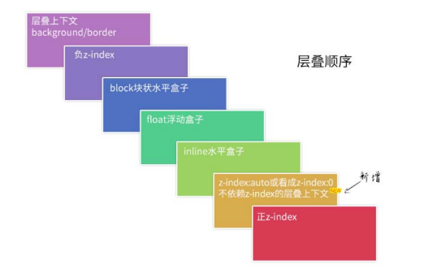
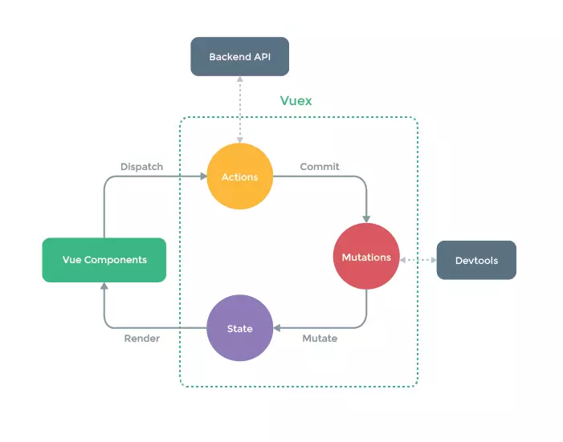

# 面试问题总结

## 一. HTML

### 1. HTML 、XML 和 XHTML 的区别

* HTML 超文本标记语言（Hyper Text Markup Language） —— 旨在显示信息，不区分大小写，标签固定且有限；
* XML 可扩展标记语言（Extensible Markup Language）—— 旨在传输信息，区分大小写，标签可以自己创建；
* XHTML 可扩展超文本标记语言（Extensible Hyper Text Markup Language）—— 比 HTML 更加严格，标签必须被正确地嵌套，标签必须闭合，标签必须小写，文档必须有根元素 ` <html>`；

### 2. 行内元素与块级元素的区别

常见的行内元素有 a b span img strong sub sup button input label select textarea；

常见的块级元素有 div ul ol li dl dt dd h1 h2 h3 h4 h5 h6 p；

1. 格式上，默认情况下，行内元素不会以新行开始，而块级元素会新起一行；
2. 内容上，默认情况下，行内元素只能包含文本和其他行内元素。而块级元素可以包含行内元素和其他块级元素；
3. 布局上，默认情况下，行内元素设置 width 无效，height 无效（可以设置 line-height），设置 margin 和 padding 的上下不会对其他元素产生影响（左右有效，但上下会有视觉效果比如 border 被撑开）。

### 3. 引入 CSS 样式的 link 与 @import 的区别

1. @import 只有导入样式表的作用；link 不仅可以加载 CSS 文件，还可以定义 RSS、rel 连接属性、引入网站图标等。
2. 加载页面时，link 标签引入的 CSS 被同时加载；@import 引入的 CSS 将在页面加载完毕后被加载。
3. 兼容性区别

### 4.  async 和 defer 的作用与区别

1. 渲染过程中遇到 JS 就停止渲染，执行 JS 代码；
2. async 异步下载 JS 文件不阻塞 DOM 解析，当下载完阻塞 DOM 解析转而执行 JS 文件；
3. defer 异步下载 JS 文件不阻塞 DOM 解析，HTML 标签解析完成后按顺序执行 JS 文件；

### 5. 重绘与回流

> 参考资料： [《浏览器的回流与重绘》](https://juejin.im/post/5a9923e9518825558251c96a)

- 重绘：节点的几何属性发生改变或者由于样式发生改变而不会影响布局的，例如字体颜色，背景颜色等。
- 回流：节点的布局或者几何属性需要改变，影响布局的，例如DOM处理、位置尺寸、字体大小、窗口尺寸变化、隐藏内容等。

常见触发回流情况（元素的位置和尺寸大小更改）：

1. 添加或者删除可见的 DOM 元素
2. 元素尺寸改变 -- 边距、填充、边框、宽度和高度
3. 内容变化，比如用户在 input 框中输入文字
4. 浏览器窗口尺寸改变 -- resize事件发生时
5. 计算 offsetWidth 和 offsetHeight 属性
6. 设置 style 属性的值
7. 当你修改网页的默认字体时（元素字体大小变化）
8. 页面首次渲染
9. 激活CSS伪类（例如：:hover）

### 6. 如何减少回流

* 不要使用 table 布局，可能很小的一个小改动会造成整个 table 的重新布局。
* DOM 离线后修改，如使用 documentFragment 对象在内存里操作 DOM；元素设置display: none，操作结束后再把它显示出来。
* 不要一条一条地修改 DOM 的样式。与其这样，还不如预先定义好 css 的 class，然后修改 DOM 的 className。

### 7. HTML语义化的理解

1. 用正确的标签做正确的事情。
2. html 语义化让页面的内容结构化，结构更清晰，便于对浏览器、搜索引擎解析;
3. 即使在没有样式 CSS 情况下也以一种文档格式显示，并且是容易阅读的;
4. 搜索引擎的爬虫也依赖于 HTML 标记来确定上下文和各个关键字的权重，利于 SEO ;
5. 使阅读源代码的人对网站更容易将网站分块，便于阅读维护理解。

### 8. 语义化标签哪些


### 9. 前端SEO

1. 合理的 title、description、keywords （meta标签）
2. 语义化的 HTML 代码，符合 W3C 规范：语义化代码让搜索引擎容易理解网页
3. 重要内容 HTML 代码放在最前：搜索引擎抓取 HTML 顺序是从上到下，有的搜索引擎对抓取长度有限制，保证重要内容肯定被抓取
4. 重要内容不要用 js 输出：爬虫不会执行 js 获取内容
5. 少用 iframe：搜索引擎不会抓取 iframe 中的内容
6. 非装饰性图片必须加 alt
7. 提高网站速度：网站速度是搜索引擎排序的一个重要指标

### 10. HTML5 的离线储存怎么使用

> 参考资料： [《HTML5 离线缓存-manifest 简介》](https://yanhaijing.com/html/2014/12/28/html5-manifest/) [《有趣的 HTML5：离线存储》](https://segmentfault.com/a/1190000000732617)

1. 创建一个和 html 同名的 manifest 文件

 ```
 CACHE MANIFEST
 #version 1.3
 
 CACHE: - 表示需要离线存储的资源列表
 js/app.js
 css/style.css
 
 NETWORK: - 表示只有在线的情况下才能访问的资源列表
 resourse/logo.png
 
 FALLBACK: - 表示如果访问第一个资源失败，那么就使用第二个资源来替换他
 / /offline.html
 ```

2. 在html页面头部加入一个 manifest 的属性

```
 <html lang="en" manifest="index.manifest">
```

### 11. 如何在页面上实现一个圆形的可点击区域

1. 纯 html 实现 - `<map>` 标签用来定义一个客户端图像映射，`<area>` 标签用来定义图像映射中的区域
2. 纯 css 实现 - 使用 border-radius 实现圆形区域
3. 纯  JS 实现 - 通过监听文档的点击事件，获取每次点击时鼠标的位置，判断该位置是否在我们规定的圆形区域内

### 12. Canvas 和 SVG 有什么区别

* Canvas 是一种通过 JavaScript 来绘制 2D 图形的方法。Canvas 是逐像素来进行渲染的，因此当我们对 Canvas 进行缩放时，会出现锯齿或者失真的情况。注意，`<canvas> `元素本身并没有绘制能力，需要借助 JS 来进行绘制。

* SVG 是一种使用 XML 描述 2D 图形的语言。SVG 基于 XML，这意味着 SVG DOM 中的每个元素都是可用的。我们可以为某个元素附加  JavaScript 事件监听函数，并且 SVG 保存的是图形的绘制方法，因此当 SVG 图形缩放时并不会失真。

### 13. link标签与meta标签

link 标签定义文档与外部资源的关系，常用于引入样式表和 icon 图标：

```html
<link rel="stylesheet" type="text/css" href="*.css"/>
<link rel="icon" href="/favicon.ico">
```

meta 标签提供关于 HTML 文档的元数据，元数据将服务于浏览器（如何布局或重载页面），搜索引擎 SEO 和其它网络服务等 - 具体详见 [《Meta 标签用法大全》](http://www.cnblogs.com/qiumohanyu/p/5431859.html)：

```html
<meta charset=’utf-8′>    声明文档使用的字符编码

＜meta http-equiv=”参数” content=”参数变量值”＞
<meta http-equiv="content-Type" content="text/html;charset=utf-8"> <!--设定网页字符集，便于浏览器解析与渲染页面--> 
<meta http-equiv=”X-UA-Compatible” content=”IE=edge,chrome=1″/> <!--优先使用 IE 最新版本和 Chrome-->

＜meta name=”参数” content=”具体的参数值”＞
<meta name="viewport" content="width=device-width, initial-scale=1"> <!--视图窗口的设置信息--> 
<meta name=”description” content=”不超过150个字符”/> <!--页面描述-->
<meta name=”keywords” content=””/> <!--页面关键词者-->
```

### 14. head中有哪些标签

```html
<title> <link> <meta> <script> <style> <base>
```

✍️ `<base>` 标签为页面上的所有链接规定默认地址或默认目标。

### 15. Html 规范中为什么要求引用资源不加协议头http/https

如果用户当前访问的页面是通过 HTTPS 协议来浏览的，那么网页中的资源也只能通过 HTTPS 协议来引用，否则浏览器会出现警告信息，因此不如省略 URL 的协议声明，无论是使用 HTTPS，还是 HTTP 访问页面，浏览器都会以相同的协议请求页面中的资源。

### 16. base64 的缺点？

base64 内容编码后的体积会变大，编码和解码需要额外的工作量可能会变慢影响体验，另外base64（这是字符串）无法利用浏览器缓存机制。

### 17. 事件DOMContentLoaded和load的区别

- DOMContentLoaded：仅当DOM加载完成，不包括其他。
- load：页面上所有的DOM，样式表，脚本，图片都已经加载完成了。

### 18. 单页面与多页面的区别


### 19. 拖拽相关

**被拖拽的元素**：

1. 监听事件ondragstart，设置数据 ev.dataTransfer.setData("Text",ev.target.id); 

**被放置的元素**：

1. 监听事件ondragover，阻止默认事件 ev.preventDefault();
2. 监听事件ondrop，获取数据 ev.dataTransfer.getData("Text");

### 20. viewport

```html
<meta name="viewport" content="width=device-width, initial-scale=1.0">
```

- width/height：控制 viewport 的大小
- initial-scale：初始缩放
- user-scalable：用户是否可以手动缩放

### 21. src 与 href 的区别

1. src主要用于引入（浏览器解析到该元素时，会需要加载该元素），src指向的内容会嵌入到文档中当前标签所在的位置，img/script/iframe
2. herf主要用于引用，用于在当前文档和引用资源之间建立联系，link(连接css)/a

## 二. CSS

### 1. CSS 的盒子模型

盒模型都是由四个部分组成的，分别是margin、border、padding和content。IE盒模型（border-box）、W3C标准盒模型（content-box）区别在于设置width和height时，所对应的范围不同。标准盒模型的width和height属性的范围只包含了content，而IE盒模型的width和height属性的范围包含了border、padding和content。一般来说，我们可以通过修改元素的box-sizing属性来改变元素的盒模型。

### 2. CSS 选择器

1. id选择器（#myid）
2. 类选择器（.myclassname）
3. 标签选择器（div,h1,p）
4. 属性选择器（a[rel="external"]）
5. 伪类选择器（a:hover,li:nth-child）
6. 伪元素选择器（::before、::after）
7. 通配符选择器（*）
8. 后代选择器（h1 p）
9. 相邻后代选择器（子）选择器（ul > li）
10. 兄弟选择器（li ~ a）
11. 相邻兄弟选择器（li + a）

### 3. CSS 权重（优先级）

10000 - !improtant
1000 - 行间样式
100 - ID
10 - 类选择器、属性选择器或伪类
1 - 标签和伪元素
0 - 通配符

### 4. 伪类与伪元素的区别

> 参考资料： [《伪类与伪元素》](http://www.alloyteam.com/2016/05/summary-of-pseudo-classes-and-pseudo-elements/)

* :伪类用于当已有的元素处于某个状态时，为其添加对应的样式，这个状态是根据用户行为而动态变化的。
* ::伪元素用于创建一些不在文档树中的元素，并为其添加样式。

### 5. CSS 样式继承

> 参考资料：[《CSS 有哪些属性可以继承？》](https://www.jianshu.com/p/34044e3c9317)

1. 字体系列属性：font、font-family、font-weight、font-size、font-style、font-variant、font-stretch、font-size-adjust
2. 文本系列属性：text-indent、text-align、text-shadow、line-height、word-spacing、letter-spacing、text-transform、direction、color
3. 表格布局属性：caption-sideborder-collapseempty-cells
4. 列表属性：list-style-type、list-style-image、list-style-position、list-style
5. 光标属性：cursor
6. 元素可见性：visibility

### 6.  a标签的伪类

注意顺序：love and hate： link visited  hover active

### 7. 居中布局


### 8. display 的值有哪些以及作用

1. block - 块类型，默认宽度为父元素宽度，可设置宽高，换行显示。
2. inline - 行内元素类型，默认宽度为内容宽度，不可设置宽高，同行显示。
3. inline-block - 默认宽度为内容宽度，可以设置宽高，同行显示。
4. inherit - 从父元素继承display属性的值。
5. none - 元素不显示，并从文档流中移除。

### 9. position 的值及其定位点

1. 默认static
2. 绝对定位absolute - 相对于前一个非static定位的父元素，脱离文档流
3. 相对定位relative - 相对于自身原来位置，未脱离文档流
4. 固定定位fixed - 相对于可视窗口而言
5. 粘性定位sticky - 应用于表头锁定、导航栏固定、图片堆叠等

### 10. flex布局

> 参考资料： [《Flex 布局教程：语法篇》](http://www.ruanyifeng.com/blog/2015/07/flex-grammar.html) [《Flex 布局教程：实例篇》](http://www.ruanyifeng.com/blog/2015/07/flex-examples.html)

flex 布局是 CSS3 新增的一种布局方式，我们可以通过将一个元素的 display 属性值设置为 flex 从而使它成为一个 flex 容器，它的所有子元素都会成为它的项目。

一个容器默认有两条轴，一个是水平的主轴，一个是与主轴垂直的交叉轴。我们可以使用 flex-direction 来指定主轴的方向。我们可以使用 justify-content 来指定元素在主轴上的排列方式，使用 align-items 来指定元素在交叉轴上的排列方式。还可以使用 flex-wrap 来规定当一行排列不下时的换行方式。

对于容器中的项目，我们可以使用 order 属性来指定项目的排列顺序，还可以使用 flex-grow 来指定当排列空间有剩余的时候，项目的放大比例。还可以使用 flex-shrink 来指定当排列空间不足时，项目的缩小比例。 align-self 允许单个项目与其他项目不同对齐方式

### 11. 用纯 CSS 创建一个三角形的原理是什么

采用的是相邻边框连接处的均分原理。将元素的宽高设为0，只设置 border，把任意三条边隐藏掉（颜色设为 transparent ），剩下的就是一个三角形。

### 12. 等高布局的方法

> 参考资料： [《前端应该掌握的 CSS 实现多列等高布局》](https://juejin.im/post/5b0fb34151882515662238fd) [《CSS：多列等高布局》](https://codepen.io/yangbo5207/post/equh)

1. 负margin-bottom和正padding-bottom实现。(注意，父元素要设置 overflow:hidden;)
2. flex布局，项目align-items属性默认为stretch，如果项目未设置高度或设为auto，将占满整个容器的高度。
3. table与grid布局，略。
4. JS判断最大高度并设置

### 13. li 与 li 之间有看不见的空白间隔是什么原因引起的，如何让去除 inline-block 元素间间距

原因：浏览器会把 inline 元素间的空白字符（空格、换行、Tab等）渲染成一个空格。而为了美观。我们通常是一个 `<li>` 放在一行，
这导致 `<li>` 换行后产生换行字符，它变成一个空格，占用了一个字符的宽度。

方法：（1）将所有 `<li>` 写在同一行；（2）将 `<ul>` 内的字符尺寸直接设为 0，即 font-size: 0，其他内容再设置字体大小；（3）为 `<li>` 设置 float: left。

### 14. 什么是包含块

1. 根元素（一般是 `<html>`）被称为“初始包含块”，其尺寸等同于浏览器可视窗口的大小。
2. 如果元素的position是relative或者static，则“包含块”由其最近的块容器祖先盒的contentbox边界形成。
3. 如果元素position:fixed，则“包含块”是“初始包含块”。
4. 如果元素position:absolute，则“包含块”由最近的position不为static的祖先元素建立。

### 15. css3中 nth-child 和 nth-of-type 的区别

1. ele:nth-of-type(n)是指父元素下第n个ele元素，:nth-of-type 以"type"来区分的。
2. ele:nth-child(n)是指父元素下第n个元素且这个元素为ele，若不是，则选择失败。 

### 16. width:auto 和 width:100% 的区别

1. width: auto 时，父元素宽度 = 子元素 width + padding-left/right + border-left/right + margin-left/right，因此子元素的宽度会自动调节，不会出现溢出父元素的情况。
2. width: 100% 时，子元素宽度即为父元素的宽度，因此 width:100% 会发生内容溢出父节点的情况，会产生不良的影响。

### 17. margin 重叠理解与解决

理解：margin 值均为正数或负数，则取绝对值最大的值；margin值为一正或一负，则取两者相加的值；

解决：

1. 相邻兄弟元素 margin 合并 —— 其中一个设置 BFC
2. 父元素和第一个/最后一个子元素的 margin 合并 —— 
   		1. 对于 margin-top 合并，可以进行如下操作（满足一个条件即可）：
        1. 父元素设置为块状格式化上下文元素；
        2. 父元素设置 border-top 值；
        3. 父元素设置 padding-top 值；
        4. 父元素和第一个子元素之间添加内联元素进行分隔。
   2. 对于 margin-bottom 合并，可以进行如下操作（满足一个条件即可）：
        1. 父元素设置为块状格式化上下文元素；
        2. 父元素设置 border-bottom 值；
        3. 父元素设置 padding-bottom 值；
        4. 父元素和最后一个子元素之间添加内联元素进行分隔；
        5. 父元素设置 height、min-height 或 max-height。
3. 空块级元素的自身 margin-top & bottom 合并 —— 
      1. 设置垂直方向的 border；
      2. 设置垂直方向的 padding；
      3. 里面添加内联元素（直接 Space 键空格是没用的）；
      4. 设置 height 或者 min-height。

### 18. BFC 规范（块级格式化上下文）的理解

> 参考资料： [《深入理解 BFC 和 MarginCollapse》](https://www.w3cplus.com/css/understanding-bfc-and-margin-collapse.html) [《前端面试题-BFC（块格式化上下文）》](https://segmentfault.com/a/1190000013647777)

BFC（block formatting context）指的是块级格式化上下文，一个元素形成了 BFC 之后，那么它内部元素产生的布局不会影响到外部元素，外部元素的布局也不会影响到 BFC 中的内部元素。一个 BFC 就像是一个隔离区域，和其他区域互不影响。

创建 BFC（简单记忆脱离文档流的方法即可，但实际不是哦！）

1. overflow＝hidden|auto或scroll(≠visible)
2. 浮动元素float＝left|right或inherit（≠none）
3. 绝对定位元素position＝absolute或fixed
4. display＝inline-block|flex|inline-flex|table-cell或table-caption
5. 根元素或包含根元素的元素

作用：

1. 浮动元素使得父元素高度塌陷
2. 外边距垂直方向重合问题
3. 两栏自适应布局问题（左侧浮动，右边内容一多文字就会扩展到左边，形成环绕左侧的现象，需要为右侧设置BFC）

衍生问题：overflow: hidden 来实现 BFC 会产生什么问题？例如浮动元素的父元素设置 overflow: hidden，则 float 元素高度比父元素大那么超出的部分会被隐藏。

### 19. 清除浮动的方式以及为什么需要清除浮动

原因：浮动的元素会导致高度会塌陷，而高度的塌陷使我们页面后面的布局不能正常显示。

方法：

1. 浮动子元素后添加div，并设置clear:both样式 - 存在问题是额外增加了一个无意义的标签，有点占用资源；
2. 父元素添加:after伪类，并设置clear:both样式
3. 父元素设置overflow:hidden样式，BFC - 存在问题是若float元素高度比父元素大那么超出的部分会被隐藏；

### 20. 媒体查询的理解

语法：

 ```css
@media mediatype and (media feature) {
 CSS-Code;
}
 ```

mediatype：

 - screen：用于电脑屏幕，平板电脑，智能手机等。
 - print：用于打印机和打印预览
 - all：用于所有设备

media feature（常用宽度来判断，实际还有很多属性特征可用于查询），参考[CSS3 @media 查询](https://www.runoob.com/cssref/css3-pr-mediaquery.html)：

 ```css
/* Extra small devices (phones, 600px and down) */
@media only screen and (max-width: 600px) {
  .example {background: red;}
}

/* Small devices (portrait tablets and large phones, 600px and up) */
@media only screen and (min-width: 600px) {
  .example {background: green;}
}

/* Medium devices (landscape tablets, 768px and up) */
@media only screen and (min-width: 768px) {
  .example {background: blue;}
} 

/* Large devices (laptops/desktops, 992px and up) */
@media only screen and (min-width: 992px) {
  .example {background: orange;}
} 

/* Extra large devices (large laptops and desktops, 1200px and up) */
@media only screen and (min-width: 1200px) {
  .example {background: pink;}
}
 ```

### 21. 浏览器是怎样解析 CSS 选择器的

注意哦，解析是**从右往左**的。样式系统从关键选择器开始匹配，然后左移查找规则选择器的祖先元素。因为如果采用从左至右的方式读取CSS规则，那么大多数规则读到最后（最右）才会发现是不匹配的，这样做会费时耗能，最后有很多都是无用的。

### 22. margin 和 padding 分别适合什么场景使用

> margin是用来隔开元素与元素的间距；padding是用来隔开元素与内容的间隔。

* 何时应当使用 margin：
  * 需要在 border 外侧添加空白时
  * 空白处不需要背景（色）时
  * 上下相连的两个盒子之间的空白，需要相互抵消时。如15px+20px 的 margin，将得到 20px 的空白
* 何时应当时用 padding：
  * 需要在 border 内测添加空白时
  * 空白处需要背景（色）时
  * 上下相连的两个盒子之间的空白，希望等于两者之和时。如15px+20px 的 padding，将得到 35px 的空白

### 23. 为什么不建议使用统配符初始化 css 样式

采用通配符需要把所有的标签都遍历一遍，当网站较大时，样式比较多，这样写就大大的加强了网站运行的负载，会使网站加载的时候需要很长一段时间。

### 24. 元素百分比的相对参考点

1. 如果是宽高的话，是相对于包含块的宽高。
2. 如果是padding或者margin竖直方向的属性则是相对于包含块的宽度。

### 25. font-style 属性中 italic 和 oblique 的区别

italic 和 oblique 这两个关键字都表示“斜体”的意思。它们的区别在于，italic是使用当前字体的斜体字体，而 oblique 只是单纯地让文字倾斜。如果当前字体没有对应的斜体字体，则退而求其次，解析为 oblique，也就是单纯形状倾斜。

### 26. 设备像素、css 像素、设备独立像素、dpr、ppi 之间的区别

> 参考资料：[《什么是物理像素、虚拟像素、逻辑像素、设备像素，什么又是 PPI,DPI,DPR 和 DIP》](https://www.cnblogs.com/libin-1/p/7148377.html) [《前端工程师需要明白的「像素」》](https://www.jianshu.com/p/af6dad66e49a) [《CSS 像素、物理像素、逻辑像素、设备像素比、PPI、Viewport》](https://github.com/jawil/blog/issues/21) [《前端开发中像素的概念》](https://github.com/wujunchuan/wujunchuan.github.io/issues/15)

设备像素指的是物理像素（一般就是分辨率），设备像素不可变。CSS 像素是一个相对单位，dpr = 物理像素 / CSS像素，一般的 pc 屏幕，dpr = 1。ppi指的是每英寸的物理像素的密度，ppi越大，屏幕的分辨率越大。

### 27. 高度自适应的 div里面有两个 div，一个高 100px，如何使另一个填满剩下高度

1. flex 布局。设置主轴为竖轴，并且第二个 div 的 flex-grow 为1，使其自动填充剩余空间。
2. 绝对定位。外层 div 使用 position：relative，高度自适应的 div 使用 position:absolute; top:100px; bottom:0; left:0; right:0;

### 28. 阐述一下 CSSSprites

将一个页面涉及到的所有图片都包含到一张大图中去，然后利用 CSS 的 background-image，background-repeat，background-position 的组合进行背景定位。利用 CSSSprites 能很好地减少网页的 http 请求，从而很好的提高页面的性能；CSSSprites 能减少图片的字节。

✍️ 优点：

1. 减少HTTP请求数，极大地提高页面加载速度；
2. 增加图片信息重复度，提高压缩比，减少图片大小；
3. 更换风格方便，只需在一张或几张图片上修改颜色或样式即可实现；

✍️ 缺点：

1. 图片合并麻烦；
2. 维护麻烦，修改一个图片可能需要重新布局整个图片和修改样式；

### 29. CSS 中出现 height 为 100% 失效的原因

% 是一个相对父元素计算得来的高度，要想使他有效，我们需要设置父元素的 height，如果包含块（父元素）的高度没有显式指定或高度为 auto 都会导致失效。

### 30. animation、transition、transform、translate 的区别

> 参考资料：[《CSS3Transition 和 Animation 区别及比较》](https://blog.csdn.net/cddcj/article/details/53582334) [《CSS 动画：animation、transition、transform、translate》](https://juejin.im/post/5b137e6e51882513ac201dfb)

| 属性               | 含义                                       |
| ------------------ | ------------------------------------------ |
| animation（动画）  | 用于设置动画属性                           |
| transition（过渡） | 用于设置元素的样式过度                     |
| transform（变形）  | 用于元素进行旋转、缩放、移动或倾斜         |
| translate（移动）  | translate只是transform的一个属性值，即移动 |

### 31. margin:auto 的填充规则

1. 如果一侧定值，一侧auto，则auto为剩余空间大小。
2. 如果两侧均是auto，则平分剩余空间。

### 32. line-height/font-size理解


### 33. 图片格式 - 7种

1. 第一种是 BMP 格式，无损压缩，支持索引色和直接色的点阵图。由于它基本上没有压缩，因此文件体积一般比较大。
2. 第二种是 GIF 格式，它是无损压缩的使用索引色的点阵图。由于使用了LZW压缩方法，因此文件的体积很小。并且GIF还支持动画和透明度。但因为它使用的是索引色，所以它适用于一些对颜色要求不高且需要文件体积小的场景。
3. 第三种是 JPEG 格式，它是有损压缩的使用直接色的点阵图。由于使用了直接色，色彩较为丰富，一般适用于来存储照片。但由于使用的是直接色，可能文件的体积相对于GIF格式来说更大。
4. 第四种是 PNG-8 格式，它是无损压缩的使用索引色的点阵图。它是 GIF 的一种很好的替代格式，它也支持透明度的调整，并且文件的体积相对于GIF格式更小。一般来说如果不是需要动画的情况，我们都可以使用 PNG-8 格式代替 GIF 格式。
5. 第五种是 PNG-24 格式，它是无损压缩的使用直接色的点阵图。PNG-24 的优点是它使用了压缩算法，所以它的体积比 BMP 格式的文件要小得多，但是相对于其他的几种格式，还是要大一些。
6. 第六种格式是 svg 格式，它是矢量图，它记录的图片的绘制方式，因此对矢量图进行放大和缩小不会产生锯齿和失真。它一般适合于用来制作一些网站logo或者图标之类的图片。
7. 第七种格式是 webp 格式，它是支持有损和无损两种压缩方式的使用直接色的点阵图。使用 webp 格式的最大的优点是，在相同质量的文件下，它拥有更小的文件体积。因此它非常适合于网络图片的传输，因为图片体积的减少，意味着请求时间的减小，这样会提高用户的体验。这是谷歌开发的一种新的图片格式，目前在兼容性上还不是太好。

### 34. relative定位的注意点

1. left/top/right/bottom 的百分比值是相对于包含块计算的，而不是自身。
2. 当包含块的 height 为 auto 时，设置 top/bottom 的无效，均为 0；包含块的 width 为 auto 无影响，宽度默认为 100%，因此 left/right 有效。
3. 当同时设置 bottom/top 时，top 有效；当同时设置 left/right 时，left 有效；

### 35. 层叠规则

> z-index大的在上；dom文档流在后的在上。



### 36. letter-spacing与word-spacing的区别

1. letter-spacing可以用来控制 "字符 - 英文字母、汉字以及空格" 之间的间距。
2. word-spacing可以用来控制 "空格字符" 之间的间距。

### 37. 单行/多行文本溢出省略号的处理

> 参考资料：[《【CSS/JS】如何实现单行／多行文本溢出的省略》](https://zhuanlan.zhihu.com/p/30707916)  [《CSS 多行文本溢出省略显示》](https://juejin.im/entry/587f453e1b69e60058555a5f)

```css
/*单行文本溢出*/
p {
  overflow: hidden;
  text-overflow: ellipsis;
  white-space: nowrap;
}
```

```css
/*多行文本溢出 - webkit内核浏览器*/
overflow : hidden;
text-overflow: ellipsis;
display: -webkit-box;
-webkit-line-clamp: 2; /*限制在一个块元素显示的文本的行数*/
-webkit-box-orient: vertical;

/*多行文本溢出 - 其他浏览器*/
p {
  overflow: hidden;
  position: relative;
  line-height: 1.5em;
  height: 3em; /*高度为需要显示的行数×行高*/
}
p:after {
  content: "...";
  position: absolute;
  bottom: 0;
  right: 0;
  background-color: #fff;
}
```

### 38. 常见的元素隐藏方式

1. 使用 display:none;隐藏元素，渲染树不会包含该渲染对象，该元素不会在页面中占据位置，也不会响应绑定的监听事件。
2. 使用 visibility:hidden;隐藏元素，元素在页面中仍占据空间，但是不会响应绑定的监听事件。
3. 使用 opacity:0;将元素的透明度设置为0来实现元素的隐藏，元素在页面中仍然占据空间，并且能够响应元素绑定的监听事件。
4. 通过使用绝对定位将元素移除可视区域内来实现元素的隐藏。
5. 通过 z-index 负值，来使其他元素遮盖住该元素来实现隐藏。
6. 通过 clip/clip-path 元素裁剪的方法来实现元素的隐藏，元素仍在页面中占据位置，但是不会响应绑定的监听事件。
7. 通过 transform:scale(0,0)来将元素缩放为0来实现元素的隐藏，元素仍在页面中占据位置，但是不会响应绑定的监听事件。

### 39. CSS布局

> 参考资料：[《几种常见的 CSS 布局》](https://juejin.im/post/5bbcd7ff5188255c80668028#heading-12)

1. 上下固定中间自适应布局
   1. 绝对定位。三部分均设置绝对定位，上面和下面设置 top/bottom: 0; 中间设置 top: 100px; bottom: 100px;
   2. flex布局。中间设置 flex-grow: 1;

2. 两栏（左固定右自适应）布局
   1. 浮动布局。左边定宽并左浮动，右边margin-left为左边宽度并且width为auto；
   2. flex布局。左边定宽且flex-shrink和flex-grow均为0，右边flex为auto；
   3. 绝对定位。左边定宽且绝对定位，右边margin-left为左边宽度；
   4. 绝对定位。左边定宽且绝对定位，右边绝对定位，且left为左边宽度，其他方向为0；

3. 三栏（左右固定中间自适应）布局

   1. 浮动布局。左右浮动，中间设置对应的marhin值，注意中间部分需要放在最后；
   2. flex布局。左右定宽且flex-shrink和flex-grow均为0，中间flex为auto；
   3. 绝对定位。左右定宽且绝对定位，中间设置对应的margin值；
   4. 双飞翼布局。
   5. 圣杯布局。

### 40. 宽高自适应的正方形？（自适应比例矩形同理）

两个思想：1，基于margin/padding百分比是相对父元素width；2，利用视口（viewport units）单位。

```css
/* 1.利用元素的margin/padding百分比是相对父元素width的性质来实现 */
.square {
  width: 20%;
  height: 0;
  padding-top: 20%;
  background: orange;
}

/* 2.利用伪元素的margin-top的值来实现 */
.square {
  width: 30%;
  overflow: hidden;
  background: yellow;
}
.square::after {
  content: "";
  display: block;
  margin-top: 100%;
}

/* 3.利用vw来实现 */
.square {
  width: 10%;
  height: 10vw;
  background: tomato;
}
```

### 41. 百分比总结

> 参考资料：[详解 CSS 中的百分比的应用](https://juejin.im/entry/592e8a3344d90400645e9a12)

```
（1）width/height —— 相对于父元素的width/height，注意，父元素（定位元素）没有明确的高度定义，则百分比都视为auto；
（2）margin/padding —— 相对于父元素的width（无论什么方向）；
（3）transform: translate —— 自身border-box的尺寸；
（4）定位bottom、left、right、top —— left和right是参照包含块的宽度，bottom和top是参照包含块的高度；
（5）border-radius —— 水平半轴相对于盒模型的宽度，垂直半轴相对于盒模型的高度；
（6）background-position —— 图片移动结果是(父元素-背景图片)*百分比；
（7）line-height —— 自身的font-size；
（8）vertical-align —— 自身的line-height；
```

### 42. CSS优化

> 参考资料： [《CSS 优化、提高性能的方法有哪些？》](https://www.zhihu.com/question/19886806) [《CSS 优化，提高性能的方法》](https://www.jianshu.com/p/4e673bf24a3b)

**加载性能**：

1. css 压缩：将写好的 css 进行打包压缩，可以减少很多的体积。
2. css 单一样式：当需要下边距和左边距的时候，很多时候选择 `margin: 10px 0 10px 0;`但`margin-bottom: 10px; margin-left: 10px;`执行的效率更高。
3. 减少使用 @import，而建议使用 link，因为后者在页面加载时一起加载，前者是等待页面加载完成之后再进行加载。

**选择器性能**：

1. 关键选择器（keyselector）。选择器的最后面的部分为关键选择器（即用来匹配目标元素的部分）。CSS选择符是从右到左进行匹配的。当使用后代选择器的时候，浏览器会遍历所有子元素来确定是否是指定的元素等等；
2. 如果规则拥有ID选择器作为其关键选择器，则不要为规则增加标签。
3. 避免使用通配规则，如*{}计算次数惊人！只对需要用到的元素进行选择。
4. 尽量少的去对标签进行选择，而是用class。
5. 尽量少的去使用后代选择器，降低选择器的权重值。后代选择器的开销是最高的，尽量将选择器的深度降到最低，最高不要超过三层，更多的使用类来关联每一个标签元素。
6. 了解哪些属性是可以通过继承而来的，然后避免对这些属性重复指定规则。

**渲染性能**：

1. 慎重使用高性能属性：浮动、定位。
2. 尽量减少页面重排、重绘。
3. 去除空规则，空规则的产生原因一般来说是为了预留样式。
4. 属性值为0时，不加单位。
5. 属性值为浮动小数0.**，可以省略小数点之前的0。
6. 标准化各种浏览器前缀：带浏览器前缀的在前。标准属性在后。
7. 不使用@import前缀，它会影响css的加载速度。
8. 选择器优化嵌套，尽量避免层级过深。
9. css雪碧图，同一页面相近部分的小图标，方便使用，减少页面的请求次数，但是同时图片身会变大，使用时优劣考虑清楚。
10. 正确使用display的属性，由于display的作用，某些样式组合会无效，徒增样式体积的同时也影响解析性能。
11. 不滥用web字体。对于中文网站来说WebFonts可能很陌生，国外却很流行。webfonts通体积庞大，而且一些浏览器在下载webfonts时会阻塞页面渲染损伤性能。

**可维护性、健壮性**：

1. 将具有相同属性的样式抽离出来，整合并通过class在页面中进行使用，提高css的可维护性。
2. 样式与内容分离：将css代码定义到外部css中。

### 43. 前端换肤

> 参考：[前端自定义换肤功能](https://www.jianshu.com/p/10dbfb179fca)

方法一：不同主题对应不同的 css 文件，通过 JS 控制替换对应的 CSS 样式表；

方法二：不同主题对应不同的 class 类名，然后通过 JS 动态去添加 class 类名；

方法三：利用less或者sass等变量代替颜色值，利用webpack输入不同的样式，页面加载之后，根据客户不同的需求，加载不同的样式。

方法四：动态换肤（不是很懂）

方法五：利用 CSS 变量（声明变量名前面要加两根连词线--）设置颜色，在利用JS动态修改变量，使系统颜色变化。

```html
<style>
  :root {
    --theme-color: red /* css 变量赋值位置 */
  }
  .title {
    color: var(--theme-color) /* 用css变量标记颜色 */
  }
</style>
<script>
  function changeColor(color = 'blue') {
    document.documentElement.style.setProperty("--theme-color", color);
  }
</script>
```

| Index | 方法                            | 说明                     |
| ----- | ------------------------------- | ------------------------ |
| 1     | 准备多套CSS主题                 | 传统前端最常用           |
| 2     | 利用 class 命名空间             | 最简单的换肤方案         |
| 3     | 利用 CSS 预处理生成多套主题样式 | 现代前端最常用           |
| 4     | 动态换肤                        | 支持浏览器热换肤，最酷炫 |
| 5     | CSS变量换肤                     | 不考虑IE，最佳换肤方式   |

### 44. 底色为红色，背景图片如何设置透明度？

> 背景图片不能直接设置透明度，我们要通过::after 添加背景图，并且针对 ::after 设置透明度；

```html
<div class='box'></div>

<style>
  .box {
    width: 200px;
    height: 200px;
    background: red;
    position: relative;
  }

  .box::after {
    content: '';
    background-image: url(imgURL);
    opacity: .8;
    top: 0;
    left: 0;
    bottom: 0;
    right: 0;
    position: absolute;
  }
</style>
```

### 45. 背景颜色/图片填充

**背景颜色**填充包含**内容+padding+border**，注意boeder如果为solid则颜色为border的默认黑色，如果为dashed虚线，可以看到border也包括背景颜色。

**背景图片**默认也是填充包含**内容+padding+border**，默认为重复填充满，如果设置不重置no-repeat，则background-position的top和left分别顶到padding的边界，不包含border区域。

### 其他

1. border-color 默认颜色就是 color 值。
2. 默认 background 背景图片是相对于 paddingbox 定位的。
3. font-weight 如果为数值则必须是 100-900 之间的整百数


## 三. JS

### 1. JS 数据类型

1. 基本数据类型：undefined、null、string、boolean、number、symbol（栈存储）
2. 引用数据类型：Object, Function, Array, Date, RegExp, String, Boolean, Number等（堆存储-栈中仅存地址指针）

### 2. null 和 undefined 的区别

> 参考资料： [《JavaScript 深入理解之 undefined 与 null》](http://cavszhouyou.top/JavaScript深入理解之undefined与null.html)

undefined 代表的含义是未定义，null 代表的含义是空对象。一般变量声明了但还没有定义的时候会返回 undefined，null 主要用于赋值给一些可能会返回对象的变量，作为初始化。 null==undefined 为 true；null===undefined 为 false。

### 3. 如何安全获取undefined

采用 “void 0” 的方式获取。

### 4. 数字不同进制的表示方式

1. 八进制 —— 0O、0o、0
2. 二进制 —— 0B、0b
3. 十六进制 —— 0X、0x

### 5. 原型、原型链


### 6. 类型转换

总结：两条路径 Object->String->Number 和 Boolean->Number（== 比较的时候也要按路径转移到相同的内容）

1. 其他类型转 String：

- undefined -> 'undefine', null -> 'null'
- true -> 'true', false -> 'false'
- Number -> 直接转换（极小极大值会指数形式）
- 普通对象 -> '[object object]'（如果对象有自己的 toString() 方法就调用该方法）

2. 其他类型转 Number：

- Undefined -> NaN, null -> 0
- true -> 1, false -> 0
- '' -> 0, 数字类型转数字，非数字类型转 NaN
- 对象（包括数组）会首先被转换为相应的基本类型值，如果返回的是非数字的基本类型值，则再遵循以上规则将其强制转换为数字。

3. 其他类型转 Boolean：

- undefined、null、+0、-0、''、false、NaN 为 false，其他为 true

### 7. 布尔值的隐式强制转换发生在哪些时候

1. if(){}
2. while(){}
3. for(;;)
4. ? : 
5. &&、||、

### 8. 如何使字符串转数字

1. 使用 Number()，缺点是不允许出现不合法字符，否则返回NaN
2. 使用 parseInt()/parseInt()，当遇到不合法字符就停止，返回当前结果，注意与 Number() 区别
3. 使用 - 的时候 —— ‘2’ - 0 === 2

✍️ 当使用 + 的时候不能进行转换的，区别于 - 的时候 —— ‘2’ + 0 === ‘20’

### 9. 生成随机数的方法

```
随机数：
（1）[0,1) —— Math.random()
（2）[n,m) —— Math.random()*(m-n)+n
（3）[n,m]、(n,m)、(n,m] —— 根据 Math.random()*(m-n)+n 的值 while 循环一下
随机整数：
（4）随机0和1 —— Math.round(Math.random())
（5）随机[0,n)整数 —— Math.floor(Math.random()*n)
（6）随机[1,n]整数 —— Math.floor(Math.random()*n)+1 
（7）随机[n,m]整数 —— Math.floor(Math.random()*(max-min+1))+min
```

### 10. 如何实现数组的随机排序

1. 使用数组 sort 方法，让 Math.random() 出来的数与 0.5 比较，如果大于就返回 1 交换位置，如果小于就返回 -1，不交换位置
2. 随机从原数组抽取一个元素，加入到新数组
3. 随机交换数组内的元素（类似洗牌算法） - 从 index 0 开始每次都随机选一个和 index 上的元素交换

### 11. 对象的继承

```javascript
function Parent(name) {
    this.name = name
    this.getName = function () {
        console.log(`name is ${this.name}`)
    }
}

// 1、原型链继承 —— 子类的原型是父类实例
function Child(age) {
  this.age = age
}
Child.prototype = new Parent('Shen')
const child = new Child(24)

// 2、构造函数继承 —— 使用父类的构造函数来增强子类实例
function Child(name, age) {
    Parent.call(this, name)
    this.age = age
}
const child = new Child('Shen', 24)

// 3、实例继承 —— 为父类实例添加新特性，作为子类实例返回
function Child(name, age) {
    const child = new Parent(name)
    child.age = age
    return child
}
const child = new Child('Shen',24)

// 4、拷贝继承 —— 子类拷贝父类实例的属性和方法
function Child(name, age) {
    const parent = new Parent(name)
    for (let pro in parent) {
        Child.prototype[pro] = parent[pro];
    }
    this.age = age
}
const child = new Child('Shen',24)

// 5、组合继承
function Child(name, age) {
    Parent.call(this, name)
    this.age = age
}
Child.prototype = new Parent()
Child.prototype.constructor = Child
const child = new Child('Shen', 24)

// 6、寄生组合继承
function Child(name, age) {
    Parent.call(this, name)
    this.age = age
}
(function () {
    const Super = function () {}
    Super.prototype = Parent.prototype
    Child.prototype = new Super()
})()
const child = new Child('Shen', 24)

// 7、ES6继承
class Parent {
    constructor(name) {
        this.name = name;
    }
    getName() {
        console.log(`name is ${this.name}`)
    }
}
class Child extends Parent {
    constructor(name, age) {
        super(name);
        this.age = age
    }
}
// 注：ES6的继承super实际执行的是父类.prototype.constructor.call(this)
```

### 12. this的指向

- 默认绑定：全局环境中，this默认绑定到window。
- 隐式绑定：一般被直接对象所包含的函数调用时，this隐式绑定到该直接对象。
- 隐式丢失：call()、apply()、bind()方法。
- new绑定：一般绑定至new生成的新对象，但是如果构造函数返回一个对象，则绑定至该对象。

### 13. 改变函数内部 this 指针的指向函数

|       | 调用方式     | 第一个参数           | 其余参数       |
| ----- | ------------ | -------------------- | -------------- |
| bind  | 返回一个函数 | this指向改变后的对象 | 直接传递       |
| apply | 函数直接调用 | this指向改变后的对象 | 用数组包裹参数 |
| call  | 函数直接调用 | this指向改变后的对象 | 直接传递       |

✍️ 如果第一个参数为 null 或 undefined，this的指向就是全局变量，在浏览器里就是window对象。

### 14. 事件的理解

事件是用户操作网页时发生的交互动作，事件被封装成一个 event 对象，包含了该事件发生时的所有相关信息（ event 的属性）以及可以对事件进行的操作（ event 的方法）。

### 15. 三种事件模型

> 参考资料： [《Javascript 事件模型系列（一）事件及事件的三种模型》](https://www.cnblogs.com/lvdabao/p/3265870.html) [《Javascript 事件模型：事件捕获和事件冒泡》](https://blog.csdn.net/wuseyukui/article/details/13771493)

```
（1）DOM0模型：事件发生后不会传播，没有事件流的概念。 <input type=”button” onclick=”func1()” />

（2）IE事件模型：总共两个阶段事件处理阶段和事件冒泡阶段。绑定事件：attachEvent(eventType, handler)；解除事件：detachEvent(eventType, handler)

（3）DOM2模型（重要）：总共三个阶段事件捕获阶段、事件处理阶段和事件冒泡阶段。绑定事件：ele.addEventListener(eventType, handler, useCapture)；解除事件：ele.removeEventListener(eventType, handler, useCapture)；或者通过 on 绑定，例如 ele.onClick = () => {}
```

✍️ addEventListener 与 on 的区别，on 会覆盖前面的事件，而 addEventListener 可以多次绑定同一个事件并且不会覆盖上一个事件。

### 16. 事件委托

事件委托本质上是利用了浏览器事件冒泡的机制。因为事件在冒泡过程中会上传到父节点，并且父节点可以通过事件对象获取到目标节点，因此可以把子节点的监听函数定义在父节点上，由父节点的监听函数统一处理多个子元素的事件，这种方式称为事件代理。使用事件代理我们可以不必要为每一个子元素都绑定一个监听事件，这样减少了内存上的消耗。并且使用事件代理我们还可以实现事件的动态绑定，例如说新增了一个子节点，我们并不需要单独地为它添加一个监听事件，它所发生的事件会交给父元素中的监听函数来处理。

```javascript
// 关键在于父节点的事件监听函数中需要判断当前事件的的目标元素
var ul = document.querySelector('ul');
ul.addEventListener('click', function (event) {
	// 也可以写成这样 if(e.target && e.target.nodeName.toLowerCase() == "li")
  if (event.target.tagName.toLowerCase() === 'li') {
    // some code
  }
});
```

### 17. 如何阻止冒泡事件和默认事件

1. e.stopPropagation()，IE 使用 event.cancelBubble = true
2. e.preventDefault()

### 18. 什么是闭包

解释：闭包是指有权访问另一个函数作用域中变量的函数，创建闭包的最常见的方式就是在一个函数内创建另一个函数，创建的函数可以
访问到当前函数的局部变量。（理解JS的作用域链更好理解）

作用：（1）使我们在函数外部能够访问到函数内部的变量；（2）使已经运行结束的函数上下文中的变量对象继续留在内存中，避免一些计算量巨大的工作重复。

### 19. 作用域链与原型链的区别

（1）作用域链是针对变量而言，比如下面就有三个作用域：全局作用域==>函数a作用域==>函数b作用域，作用域链的特点就是，先在自己的变量范围中查找，如果找不到，就会沿着作用域往上找。

```javascript
var num = 1;
function a(){
  var num = 2;
  function b(){
    var num = 3;
    console.log(num); // 3
  }
  b();
}
a();
```

（2）原型链是针对构造函数而言，通过 \_\_proto\_\_ 不断查找。

### 20. 判断一个对象是否属于一个类？判断数据的类型？自定义类型判断？

1. typeof 目标 === 'object' - 可以判断基本数据类型(除null为object)，引用对象类型均为object(除function)
2. 目标 instanceof 类名或构造函数名 - 不可以判断基本数据类型，可以判断引用对象类型包括自定义对象
3. Object.prototype.toString.call(目标) - 可以判断基本数据类型和引用对象类型，不能识别自定义对象
4. 目标.constructor === Object - 可以判断基本数据类型(除null和undefined)和对象数据类型(内置和自定义)

✍️ Object.prototype.toString.call(目标).slice(8,-1).toLowerCase() === 'string' 需要转换一下，因为直接得到的是 [object String]

### 21. instanceof 的原理

```javascript
// target instanceof object
// 原理：判断构造函数的 prototype 属性是否出现在对象的原型链中的任何位置
function instanceof(target, object){
  let T = target.__proto__
  let O = object.prototype
  while(true){
    if(T === O){
      return true
    }else if(T === null){
      return false
    }
    T = T.__proto__
  }
}
```

### 22. new操作符干了什么

```javascript
const Func=function(){ };  
const func=new Func (); 

// （1）首先创建了一个新的空对象
const obj = new Object();  
// （2）设置原型，将对象的原型设置为函数的 prototype 对象。
obj.__proto__ = Func.prototype;
// （3）让函数的 this 指向这个对象，执行构造函数的代码（为这个新对象添加属性）
const result =Func.call(obj); 
// （4）判断函数的返回值类型，如果是值类型，返回创建的对象。如果是引用类型，就返回这个引用类型的对象。
if (typeof(result) === "object" || typeof(result) === "fucntion"){  
  func = result;  
}else{  
  func = obj;;  
}
return func
```

### 23. JS 哪个函数执行对象查找时永远不会去查找原型

hasOwnProperty 只检查一个对象是否含有特定的自身属性，和 for in 运算符不同，该方法会忽略掉那些从原型链上继承到的属性，所以 for in 往往结合 hasOwnProperty 来操作。

### 24. [].forEach.call() 的理解

```javascript
// 开头的数组[]其实没有任何意义，主要用于访问数组的原型，例如这里的forEach方法。
[1,2,3].forEach.call(['a','b'],(item)=>{
  console.log(item)
})
// a
// b
```

### 25. JS延迟加载的方法

1. 放在最后
2. async/defer —— 区别在于 async 加载完即执行，defer js加载和文档解析同步并且等文档解析完成才按顺序解析JS文件
3. 设置 setTimeout 延迟方法
4. 文档的加载事件进行监听，当文档加载完成后再动态的创建 script 标签来引入 js 脚本

### 26. AJAX的主要步骤

```js
// 1.创建 XMLHttpRequest 对象，也就是创建一个异步调用对象
// 2.创建一个新的 HTTP 请求，并指定该 HTTP 请求的方法、URL 及验证信息
// 3.设置响应 HTTP 请求状态变化的函数
// 4.发送 HTTP 请求

// 创建 xhr 对象
const xhr = new XMLHttpRequest()
// 创建 Http 请求
xhr.open("GET", SERVER_URL, true);
// 设置状态监听函数
xhr.onreadystatechange = function() {
  if (xhr.readyState === 4) {
    if (xhr.status >= 200 && xhr.status < 300 || xhr.status === 304) {
      console.log(xhr.responseText)
    } else {
      console.log('Error:' + xhr.status)
    }
  }
};
// 设置请求失败时的监听函数
xhr.onerror = function() {
  console.error(this.statusText);
};
// 设置请求头信息
xhr.responseType = "json";
xhr.setRequestHeader("Accept", "application/json");
// 发送 Http 请求
xhr.send(null);
```

```js
// promise 封装
function ajax() {
  return new Promise((resolve, reject)=>{
    // 上面的代码复制，在请求成功处使用 resolve，在请求失败处使用 reject
  }) 
}
```

###  27. 模块化规范

```js
// 主要包含4种规范：commonJS、AMD、CMD、ES6，相对 commonJS 和 ES6较为熟悉。

// （1）commonJS. 通过 exports (不建议使用！) 或 module.exports 来导出需要暴露的接口，通过 require 来加载模块。
// 导出
module.exports = {
  func1: function(){}
}
// 引入
const moduleA = require('./moduleA.js')
moduleA.func1()

// （2）ES6. 通过 export default{} 或 expoet 来导出需要暴露的接口，通过 import 来加载模块。注意不同导出方式对应的导入区别。
// 导出-1
export default {}
// 引入-1
import moduleA from './moduleA'
// 导出-2
export function func1(){}
// 引入-2
import {func1} from './moduleA'

```

### 28. require和import的区别

| 加载方式       | 规范         | 命令    | 输出                 |
| -------------- | ------------ | ------- | -------------------- |
| 运行时动态加载 | CommonJS/AMD | require | 输出的是一个值的拷贝 |
| 编译时静态加载 | ESMAScript6+ | import  | 输出的是值的引用     |

### 29. DOM查找的方法

```javascript
// 不要忘了 querySelector 这种方法
document.querySelector(".myclass");
document.querySelectorAll("div.note");

ele.getElementById();
ele.getElementsByName();
ele.getElementsByTagName();
ele.getElementsByClassName();
```

### 30. innerHTML 与 outerHTML 的区别

1. innerHTML：从对象的起始位置到终止位置的全部内容,不包括Html标签。
2. outerHTML: 除了包含innerHTML的全部内容外, 还包含对象标签本身。

```html
<!--
	innerHTML的值是 <span style="color:red">test1</span> test2 
	outerHTML的值是 <div id="test"><span style="color:red">test1</span> test2</div>
-->
<div id="test"> 
   <span style="color:red">test1</span> test2 
</div>
```

### 31. 类数组对象

一个拥有 length 属性和若干索引属性的对象就可以被称为类数组对象，类数组对象和数组类似，但是不能调用数组的方法。常见的类数组对象有 arguments 和 DOM 方法的返回结果，还有一个函数也可以被看作是类数组对象，因为它含有 length属性值，代表可接收的参数个数。

✍️ 类数组对象转为数组的方法

1. Array.from(arrayLike);
2. [...arrayLike]
3. Array.prototype.slice.call(arrayLike）

### 32. 垃圾回收机制

标记清除 + 引用计数（存在循环引用问题） —— 详见[参考资料](https://segmentfault.com/a/1190000018605776?utm_source=tag-newest)

### 33. 如何判断当前脚本是运行在浏览器还是node环境中

```javascript
this === window ? 'browser' : 'node'
```

### 34. 节流与防抖（高频发送请求如何解决）

> 参考资料： [《轻松理解 JS 函数节流和函数防抖》](https://juejin.im/post/5a35ed25f265da431d3cc1b1) [《JavaScript 事件节流和事件防抖》](https://juejin.im/post/5aa60b0e518825556b6c6d1a) [《JS 的防抖与节流》](https://juejin.im/entry/5b1d2d54f265da6e2545bfa4)

```js
// 节流 - 在 n 秒内只会执行一次，比如说适用于 scroll 监听
function throttle(func, delayTime) {
    let flag;
    return function () {
        let context = this, args = arguments;
        if (!flag) {
            setTimeout(function () {
                func.apply(context, args);
                flag = false
            }, delayTime)
        }
    }
}


// 防抖 - 按最后一次算，在事件被触发 n 秒后再执行回调，如果在这 n 秒内事件又被触发，则重新计时。
function debounce(func, delayTime) {
    let timeId;
    return function () {
        let context = this, args = arguments;
        timeId && clearTimeout(timeId);
        timeId = setTimeout(function () {
            func.apply(context, args);
        }, delayTime)
    }
}
```

### 35. ==、===、Object.is 区别

== 值相等（会强制类型转换），=== 和 Object.is 值和类型相等，但 NaN，+0/-0 有区别，Object.is(NaN,NaN) 为 true，Object.is(+0,-0) 为 false。

### 36. JS事件循环机制

任务队列可以分为宏任务队列和微任务队列，当前执行栈中的事件执行完毕后，js 引擎首先会判断微任务队列中是否有任务可以执行，如果有就将微任务队首的事件压入栈中执行。当微任务队列中的任务都执行完成后再去判断宏任务队列中的任务。

1. MacroTask(宏任务)：script(整体代码), setTimeout, setInterval, requestAnimationFrame, I/O
2. MicroTask(微任务)：Promise.then(), await之后的代码, process.nextTick, Object.observe, MutationObserver

✍️ async中如果非异步函数，则认为顺序执行，只有await中为异步，后面的代码才进入微任务队列；

✍️ new Promise 立即执行，then 才分发到微任务；

### 37. 监听对象属性的改变的方法

ES5中使用Object.defineProperty() - 针对单个属性，无法监听属性的添加删除、数组索引和长度变更等。

```javascript
// 第一个参数是需要定义属性的对象，第二个参数是需要定义的属性，第三个是该属性描述符。
Object.defineProperty(user,'name',{
  set：function(key,value){
  }
})
```

ES6中使用proxy对象 - 针对整个对象。

```javascript
const user = new Proxy({}, {
  set：function(target,key,value,receiver){
  }
})
```

### 38. 获取元素位置大小的方法

> 参考资料： [《最全的获取元素宽高及位置的方法》](https://juejin.im/post/5bc9366d5188255c4834e75a) 

```
clientWidth/clientHeight 返回的是元素的内部宽度，它的值只包含 content + padding，如果有滚动条，不包含滚动条。
clientTop 返回的是上边框的宽度。
clientLeft 返回的左边框的宽度。

offsetWidth/offsetHeight 返回的是元素的布局宽度，它的值包含 content + padding + border 包含了滚动条。
offsetTop 返回的是当前元素相对于其 offsetParent 元素的顶部的距离。
offsetLeft 返回的是当前元素相对于其 offsetParent 元素的左部的距离。

scrollWidth/scrollHeight 返回值包含 content + padding + 溢出内容的尺寸。
scrollTop 属性返回的是一个元素的内容垂直滚动的像素数。
scrollLeft 属性返回的是元素滚动条到元素左边的距离。
```

### 39. documen.write 和 ele.innerHTML区别

```
（1）document.write("<h1>Main title</h1>") 会代替整个文档内容，重写整个页面。
（2）document.getElementById("main").innerHTML = "Main title" 只是替代指定元素的内容，只会重写页面中的部分内容。
```

### 40. 异步编程的方式

1. 回调函数：缺点是多个回调函数嵌套的时候会造成回调函数地狱，上下两层的回调函数间的代码耦合度太高，不利于代码维护。
2. Promise 对象：将嵌套的回调函数作为链式调用，但是有时会造成多个 then 的链式调用，可能会造成代码的语义不够明确。
3. Generator 函数：当遇到异步函数执行的时候，将函数执行权转移出去，当异步函数执行完毕的时候我们再将执行权给转移回来。
4. async 函数：async 内部自带执行器，当函数内部执行到一个 await 语句的时候，如果语句返回一个 promise 对象，那么函数将会等待 promise 对象的状态变为 resolve 后再继续向下执行。因此我们可以将异步逻辑，转化为同步的顺序来书写，并且这个函数可以自动执行。

### 41. JS 动画与 CSS 动画区别

1. CSS3 动画：在性能上会稍微好一些，且代码相对简单，但是动画控制不够灵活，兼容性不好
2. JS 动画：控制能力很强，可以单帧的控制、变换，功能强大，对于一些复杂控制的动画，使用 javascript 可能更加合适

### 42. 图片的懒加载和预加载

> 参考资料： [《懒加载和预加载》](https://juejin.im/post/5b0c3b53f265da09253cbed0) [《网页图片加载优化方案》](https://juejin.im/entry/5a73f38cf265da4e99575be3)

1. 预加载：的是将所需的资源提前请求加载到本地，这样后面在需要用到时就直接从缓存取资源。通过预加载能够减少用户的等待时间，提高用户的体验。我了解的预加载的最常用的方式是使用 js 中的 image 对象，通过为 image 对象来设置 scr 属性，来实现图片的预加载。
2. 懒加载：懒加载的主要是当用户需要访问时，再去加载，这样可以提高网站的首屏加载速度，提升用户的体验，并且可以减少服务器的压力。它适用于图片很多，页面很长的电商网站的场景。懒加载的实现原理是，将页面上的图片的 src 属性设置为空字符串，将图片的真实路径保存在一个自定义属性中，当页面滚动的时候，进行判断，如果图片进入页面可视区域内，则从自定义属性中取出真实路径赋值给图片的 src 属性，以此来实现图片的延迟加载。

### 43. Set 和 WeakSet 结构？Map 和 WeakMap 结构？

```
1.Set 类似于数组，但是成员的值都是唯一的，没有重复的值。
2.WeakSet 结构与 Set 类似，也是不重复的值的集合，但是 WeakSet 的成员只能是对象，而不能是其他类型的值。

1.Map 它类似于对象，也是键值对的集合，但是键的范围不限于字符串，各种类型的值（包括对象）都可以当作键。
2.WeakMap 结构与 Map 结构类似，也是用于生成键值对的集合，但是 WeakMap 只接受对象作为键名（ null 除外）。
```

### 44. promise对象？手写Promise？

```js
const promise = new Promise(function(resolve, reject) {
  // ... some code
  if (/* 异步操作成功 */){
    resolve(value);
  } else {
    reject(error);
  }
});

// Promise 是一个构造函数，接收一个函数作为参数，返回一个 Promise 实例。一个 Promise 实例有三种状态，分别是 pending、resolved 和 rejected，分别代表了进行中、已成功和已失败。实例的状态只能由 pending 转变 resolved 或者 rejected 状态，并且状态一经改变，就凝固了，无法再被改变了。状态的改变是通过 resolve() 和 reject() 函数来实现的，我们可以在异步操作结束后调用这两个函数改变 Promise 实例的状态，它的原型上定义了一个 then 方法，使用这个 then 方法可以为两个状态的改变注册回调函数。这个回调函数属于微任务，会在本轮事件循环的末尾执行。

// 手写promise？
const PENDING = "pending";
const RESOLVED = "resolved";
const REJECTED = "rejected";

function MyPromise(fn) {
  // 保存初始化状态
  var self = this;

  // 初始化状态
  this.state = PENDING;

  // 用于保存 resolve 或者 rejected 传入的值
  this.value = null;

  // 用于保存 resolve 的回调函数
  this.resolvedCallbacks = [];

  // 用于保存 reject 的回调函数
  this.rejectedCallbacks = [];

  // 状态转变为 resolved 方法
  function resolve(value) {
    // 判断传入元素是否为 Promise 值，如果是，则状态改变必须等待前一个状态改变后再进行改变
    if (value instanceof MyPromise) {
      return value.then(resolve, reject);
    }

    // 保证代码的执行顺序为本轮事件循环的末尾
    setTimeout(() => {
      // 只有状态为 pending 时才能转变，
      if (self.state === PENDING) {
        // 修改状态
        self.state = RESOLVED;

        // 设置传入的值
        self.value = value;

        // 执行回调函数
        self.resolvedCallbacks.forEach(callback => {
          callback(value);
        });
      }
    }, 0);
  }

  // 状态转变为 rejected 方法
  function reject(value) {
    // 保证代码的执行顺序为本轮事件循环的末尾
    setTimeout(() => {
      // 只有状态为 pending 时才能转变
      if (self.state === PENDING) {
        // 修改状态
        self.state = REJECTED;

        // 设置传入的值
        self.value = value;

        // 执行回调函数
        self.rejectedCallbacks.forEach(callback => {
          callback(value);
        });
      }
    }, 0);
  }

  // 将两个方法传入函数执行
  try {
    fn(resolve, reject);
  } catch (e) {
    // 遇到错误时，捕获错误，执行 reject 函数
    reject(e);
  }
}

MyPromise.prototype.then = function(onResolved, onRejected) {
  // 首先判断两个参数是否为函数类型，因为这两个参数是可选参数
  onResolved =
    typeof onResolved === "function"
      ? onResolved
      : function(value) {
          return value;
        };

  onRejected =
    typeof onRejected === "function"
      ? onRejected
      : function(error) {
          throw error;
        };

  // 如果是等待状态，则将函数加入对应列表中
  if (this.state === PENDING) {
    this.resolvedCallbacks.push(onResolved);
    this.rejectedCallbacks.push(onRejected);
  }

  // 如果状态已经凝固，则直接执行对应状态的函数

  if (this.state === RESOLVED) {
    onResolved(this.value);
  }

  if (this.state === REJECTED) {
    onRejected(this.value);
  }
};
```

### 45. 使用闭包实现每隔一秒打印 1,2,3,4

```javascript
// 闭包
for (let i = 0; i < 4; i++) {
    (function(i) {
        setTimeout(function() {
            console.log(i);
        }, i * 1000);
    })(i)
}

// 注意本身 let 块级作用域也能实现
for (let i = 0; i < 4; i++) {
  setTimeout(function() {
    console.log(i);
  }, i * 1000);
}
```

### 46. Date 对象

```js
const data = new Date()
```

- getDate() 日期 1～31
- getFullYear() 年份
- getMonth() 月份 0～11
- getDay() 星期 0~6

✍️ getDate() 注意是从 1 开始的，并且要区别于 getDay() 返回的星期。

### 47. 手写一个JSONP-跨域？

```js
// 1、创建script节点
const script = document.createElement('script')
// 2、设置src以及如果需要返回数据则设置回调函数
script.src = 'http://localhost:8080/?callback=displayData&&user=envision';
// 3、将回调函数添加至document
document.body.append(script);
// 4、设置回调函数
function displayData(data) {
   alert(data);
}
```

### 48. 静态方法、公有方法、私有方法的区别

构造函数里直接的属性和方法称为**私有**，构造函数里加了this的和原型上的方法和属性称为**公有**，直接在构造函数上的方法和属性称为**静态**，通过对象调用，不需要new。

```javascript
function User(name) {
	var name = name + 'hello'; // 私有属性
	this.name = name; // 公有属性
	function getName() { // 私有方法
		return name;
	}
}
User.prototype.getName = function() { // 公有方法
	return this.name;
}
User.name = 'Wscats'; // 静态属性
User.getName = function() { // 静态方法
	return this.name;
}
var man = new User('sherwin'); //实例化

// 实例化对象 man 才能调用公有属性和公有方法
// 实例化对象 man 不能调用私有方法和静态方法
// 静态方法和静态属性直接通过对象 User 调用
// 私有属性和私有方法外部是不可以访问的
```

### 49. 函数声明与函数表达式声明的区别

```javascript
// var存在变量提升，将变量getName提升，但后面的函数还没有赋值，function也存在提升，但是是整体提升
getName() // man
var getName = function() {
    console.log('woman')
}
getName() // woman
function getName() {
    console.log('man')
}
getName() //woman
```

### 50. 一个列表，假设有 100000 个数据，这个该怎么办

1. 将数据分页，利用分页的原理，每次服务器端只返回一定数目的数据，浏览器每次只对一部分进行加载。
2. 使用懒加载的方法，每次加载一部分数据，其余数据当需要使用时再去加载。
3. 使用数组分块技术，基本思路是为要处理的项目创建一个队列，然后设置定时器每过一段时间取出一部分数据，然后再使用定时器取出下一个要处理的项目进行处理，接着再设置另一个定时器。可通过定时器也可通过 window.requestAnimationFrame()。

✍️ window.requestAnimationFrame(callback) 告诉浏览器希望执行一个动画，并且要求浏览器在下次重绘之前调用指定的回调函数更新动画。

### 51. 使用 setTimeout 模拟 setInterval

```javascript
function mySetInterval(fn, time) {
    function myFunc(){
        fn()
        setTimeout(myFunc,time)
    }
    setTimeout(myFunc,time)
}

// 需要有暂停功能
function mySetInterval(fn, time) {
    let timer = {
        flag: true
    }

    function myFunc() {
        if (timer.flag) {
            fn()
            setTimeout(myFunc, time)
        }
    }

    setTimeout(myFunc, time)
    return timer
}

let timer = mySetInterval(() => {
    console.log('hello')
}, 1000)

setTimeout(()=>{
    timer.flag = false
},4000)
```

###  52. 深浅拷贝的实现

```javascript
// 浅拷贝的实现;

function shallowCopy(object) {
  // 只拷贝对象
  if (!object || typeof object !== "object") return;

  // 根据 object 的类型判断是新建一个数组还是对象
  let newObject = Array.isArray(object) ? [] : {};

  // 遍历 object，并且判断是 object 的属性才拷贝
  for (let key in object) {
    if (object.hasOwnProperty(key)) {
      newObject[key] = object[key];
    }
  }

  return newObject;
}

// 深拷贝的实现;

function deepCopy(object) {
  if (!object || typeof object !== "object") return;

  let newObject = Array.isArray(object) ? [] : {};

  for (let key in object) {
    if (object.hasOwnProperty(key)) {
      newObject[key] =
        typeof object[key] === "object" ? deepCopy(object[key]) : object[key];
    }
  }

  return newObject;
}
```

### 53. call、apply、bind手写

call 函数的实现步骤：
1. 判断调用对象是否为函数，即使我们是定义在函数的原型上的，但是可能出现使用 call 等方式调用的情况。
2. 判断传入上下文对象是否存在，如果不存在，则设置为 window 。
3. 处理传入的参数，截取第一个参数后的所有参数。
4. 将函数作为上下文对象的一个属性。
5. 使用上下文对象来调用这个方法，并保存返回结果。
6. 删除刚才新增的属性。
7. 返回结果。

apply 函数的实现步骤：
1. 判断调用对象是否为函数，即使我们是定义在函数的原型上的，但是可能出现使用 call 等方式调用的情况。
2. 判断传入上下文对象是否存在，如果不存在，则设置为 window 。
3. 将函数作为上下文对象的一个属性。
4. 判断参数值是否传入
4. 使用上下文对象来调用这个方法，并保存返回结果。
5. 删除刚才新增的属性
6. 返回结果

bind 函数的实现步骤：
1. 判断调用对象是否为函数，即使我们是定义在函数的原型上的，但是可能出现使用 call 等方式调用的情况。
2. 保存当前函数的引用，获取其余传入参数值。
3. 创建一个函数返回
4. 函数内部使用 apply 来绑定函数调用，需要判断函数作为构造函数的情况，这个时候需要传入当前函数的 this 给 apply 调用，其余情况都传入指定的上下文对象。

```javascript
// call函数实现
Function.prototype.myCall = function(context) {
  // 判断调用对象
  if (typeof this !== "function") {
    console.error("type error");
  }

  // 获取参数
  let args = [...arguments].slice(1),
    result = null;

  // 判断 context 是否传入，如果未传入则设置为 window
  context = context || window;

  // 将调用函数设为对象的方法
  context.fn = this;

  // 调用函数
  result = context.fn(...args);

  // 将属性删除
  delete context.fn;

  return result;
};

// apply 函数实现
Function.prototype.myApply = function(context) {
  // 判断调用对象是否为函数
  if (typeof this !== "function") {
    throw new TypeError("Error");
  }

  let result = null;

  // 判断 context 是否存在，如果未传入则为 window
  context = context || window;

  // 将函数设为对象的方法
  context.fn = this;

  // 调用方法
  if (arguments[1]) {
    result = context.fn(...arguments[1]);
  } else {
    result = context.fn();
  }

  // 将属性删除
  delete context.fn;

  return result;
};

// bind 函数实现
Function.prototype.myBind = function(context) {
  // 判断调用对象是否为函数
  if (typeof this !== "function") {
    throw new TypeError("Error");
  }

  // 获取参数
  var args = [...arguments].slice(1),
    fn = this;

  return function Fn() {
    // 根据调用方式，传入不同绑定值
    return fn.apply(
      this instanceof Fn ? this : context,
      args.concat(...arguments)
    );
  };
};
```

### 54. 多维数组降维

```javascript
// ES6 新特性 flat
function reduction_1(arr) {
    return arr.flat(Infinity)
}

// 转字符串再转数组
function reduction_2(arr) {
    return arr.toString().split(',').map((item) => Number(item))
}

// 递归
function reduction_3(arr) {
    let result = []
    for (let i = 0; i < arr.length; i++) {
        if (Array.isArray(arr[i])) {
            result = result.concat(reduction_3(arr[i]))
        } else {
            result.push(arr[i])
        }
    }
    return result
}
```

### 55. 正则表达式验证邮箱

```javascript
// 数字字母开头，后续组成为数字字母和下划线
// @后面为数字字母
// .符号后面2-4个字母结尾 
const regExp = /^[0-9A-Za-z](\w|\-)+@[0-9A-Za-z]+\.([a-zA-Z]{2,4})$/gi
console.log(regExp.test('12345@qq.com'))
```

### 56. 打印 red 停 1s，打印 yellow 停 2s，打印 green 停 4s，然后循环 5 次

```javascript
// 个人解决，不一定最优
async function print() {
    const printColor = function (color, time) {
        return new Promise((resolve => {
            console.log('red')
            setTimeout(() => {
                console.log('yellow')
                setTimeout(() => {
                    console.log('green')
                    setTimeout(() => {
                        resolve()
                    }, 4000)
                }, 2000)
            }, 1000)
        }))

    }
    let i = 0
    while (i < 5) {
        await printColor()
        i++
    }
}
```

### 57. Promise 题目

用 promise 实现以下功能：fn1和fn2都是异步函数，f1、fn2同时执行，并且fn1、fn2的结果是 fn3的参数。当fn1或者fn2发生错误时，fn3照常执行，此时的参数为空。

```javascript
const fn1 = () => {
    return new Promise(resolve => {
        setTimeout(() => {
            resolve('success')
        }, 2000)
    }).catch(() => {
        return null
    })
}
const fn2 = () => {
    return new Promise((resolve, reject) => {
        setTimeout(() => {
            reject('error')
        }, 2000)
    }).catch(() => {
        return null
    })
}
// 在fn1和fn2中捕获到错误我们可以定义返回的值为null，处理完毕，在all中的状态是resolve，也即是如果作为参数的 Promise 实例，自己定义了catch方法，那么它一旦被rejected，并不会触发Promise.all()的catch方法。
function myFunc(fn1, fn2) {
    Promise.all([fn1(), fn2()]).then(([res1, res2]) => {
        console.log(res1, res2)
        // 执行 fn3，res1、res2为参数
    })
}

myFunc(fn1, fn2)
```

### 58. 设计模式

> 参考资料： [《JavaScript 设计模式》](https://juejin.im/post/59df4f74f265da430f311909#heading-3) [《JavaScript 中常见设计模式整理》](https://juejin.im/post/5afe6430518825428630bc4d) [小沈的设计模式总结]()

### 59. 函数柯里化

> 参考资料： [《JavaScript 专题之函数柯里化》](https://github.com/mqyqingfeng/Blog/issues/42)  [js如何用一句代码实现函数的柯里化](https://www.jianshu.com/p/c87242cd2f6c)

```javascript
function sub_curry(fn) {
    const args = [].slice.call(arguments, 1);
    return function () {
        return fn.apply(this, args.concat([].slice.call(arguments)));
    };
}


function curry(fn, length) {
    length = length || fn.length;
    return function () {
        if (arguments.length < length) {
            const combined = [fn].concat([].slice.call(arguments));
            return curry(sub_curry.apply(this, combined), length - arguments.length);
        } else {
            return fn.apply(this, arguments);
        }
    };
}
```

```javascript
// 验证
const fn = curry(function(a, b, c) {
    return [a, b, c];
});

fn("a", "b", "c") // ["a", "b", "c"]
fn("a", "b")("c") // ["a", "b", "c"]
fn("a")("b")("c") // ["a", "b", "c"]
fn("a")("b", "c") // ["a", "b", "c"]
```

### 60. 如何判断一个对象为空

```javascript
function isNull(obj) {
    // 方法1
    return Object.keys(obj).length === 0
    // 方法2
    obj.forEach(() => {
        return false
    });
    return true
    // 方法3
    return JSON.stringify(obj) !== '{}';
}
```

### 61. ['1','2','3'].map(parseInt) 的值

结果：1 NaN NaN。解释：map 的回调函数接受三个参数“当前索引元素，索引，原数组”，而 parseInt 一般我们就传一个参数，其实还有第二个参数，表示解析的进制，因此最终就变成了，如下形式，

1. 第一轮遍历 parseInt('1', 0) -> 1
2. 第二轮遍历 parseInt('2', 1) -> NaN
3. 第三轮遍历 parseInt('3', 2) -> NaN

### 62. Generator 函数

```javascript
function* foo(x) {
    let y = 2 * (yield (x + 1))
    let z = yield (y / 3)
    return (x + y + z)
}

let it = foo(5)
console.log(it.next())   // => {value: 6, done: false}
console.log(it.next(12)) // => {value: 8, done: false}
console.log(it.next(13)) // => {value: 42, done: true}
```

✍️ 当执行第一次 next() 时，传参会被忽略，但是后续 next() 中如果有值，则传入的参数等于上一个 `yield` 的返回值，因此 y = 2 *12。

### 63. 浏览器事件循环与 nodejs 的事件循环区别

> 参考资料：[一篇文章教会你Event loop——浏览器和Node](https://segmentfault.com/a/1190000013861128)

1. 浏览器事件循环详见 - [36. JS事件循环机制](#36. JS事件循环机制)
2. nodejs 的 event loop 分为6个阶段，它们会按照顺序反复运行。

✍️ 不同于浏览器的是，在每个阶段完成后，而不是MacroTask任务完成后，microTask队列就会被执行。


### 64. js 实现 sticky 布局

1. 监听滚动事件，计算目标元素距离视口的距离。
2. 距离不满足条件时，按兵不动。
3. 距离满足条件时，创建占位元素，修改目标元素定位方式为 `fixed`。

```javascript
window.addEventListener('scroll', () => {
    const rect = elem.getBoundingClientRect();
    // 计算目标元素和视口的距离
})
```

### 65. URL 的编码解码

encodeURI方法不会对下列字符编码 ASCII字母 数字 ~!@#$&\*()=:/,;?+'

encodeURIComponent方法不会对下列字符编码 ASCII字母 数字 ~!\*()'

1. 如果只是编码字符串，不和URL有半毛钱关系，那么用escape（目前已不建议使用escape）
2. 如果你需要编码整个URL，然后需要使用这个URL，那么用encodeURI。
3. 当你需要编码URL中的参数的时候，那么encodeURIComponent是最好方法。

```javascript
encodeURI('https://www.demo.com/my blog') // https://www.demo.com/my%20blog
encodeURIComponent('https://www.demo.com/my blog?name=sherwin') // https%3A%2F%2Fwww.demo.com%2Fmy%20blog%3Fname%3Dsherwin
```

### 66. 手写Promise.all()

```javascript
function all(array) {
    return new Promise((resolve, reject) => {
        let count = 0
        array.forEach(item => {
            item.then(() => {
                count++
                if (count === array.length) {
                    resolve()
                }
            }).catch(() => {
                reject()
            })
        })
    })
}

const p1 = new Promise(resolve => resolve(1))
const p2 = new Promise((resolve, reject) => resolve(2))
const p3 = new Promise(resolve => resolve(3))
all([p1, p2, p3]).then(() => {
    console.log('success')
}).catch(() => {
    console.log('error')
})
```

### 67. JS为什么是单线程的？

因为多线程会导致DOM操作冲突。

### 68. 跨域时怎么带上cookie？

```javascript
// 前端操作
const xhr = new XMLHttpRequest();
xhr.withCredentials = true;
// 后端 Access-Control-Allow-Credentials 设置为 true，并且后端不能把 Access-Control-Allow-Origin 设置为 *，需要设置具体的内容。
```

### 69. 用 JS 实现 sticky 布局

```html
<!DOCTYPE html>
<html lang="en">
<head>
    <meta charset="UTF-8">
    <title>Title</title>
    <style>
        .box1 {
            height: 500px;
            background-color: blue;
        }

        .box2 {
            width: 100vw;
            height: 200px;
            background-color: yellow;
        }

        .box3 {
            height: 900px;
            margin-top: 600px;
            background-color: red;
        }

        .fixed {
            position: fixed;
            top: 100px;
        }
    </style>
</head>
<body style="height: 3000px">
<div class="box1"></div>
<div class="box2"></div>
<div class="box3"></div>
<script>
    const box2 = document.getElementsByClassName('box2')[0]
    const offsetTop = box2.offsetTop
    window.addEventListener('scroll', () => {
        console.log(document.body.scrollTop)
        if (offsetTop - 100 < document.documentElement.scrollTop) {
            box2.classList.add('fixed')
        } else {
            box2.classList.remove('fixed')
        }
    })
</script>
</body>
</html>
```

### 70. 轮播图实现（类似淘宝的首页）

参考资料：[轮播图](https://juejin.im/post/6844903939159277576) [原生JavaScript实现无缝轮播效果](https://juejin.im/post/6844904087637458958)

详见[轮播图实现](https://github.com/MrEnvision/Front-end_learning_project/tree/master/demo_summary/轮播图)

### 71. Object.defineProperty劫持

```javascript
let a = {
    age: {
        x: 12
    }
}
Object.defineProperty(a, 'age', {
    set: function () {
        console.log('aaa')
    }
})

a.age = 8 // 'aaa'
a.age.x = 8 // TypeError: Cannot set property 'x' of undefined
```

也就是说Object.defineProperty劫持的是当前这一层对象，如果需要劫持里面的对象就要再多写一层，可通过递归的方式实现：

```javascript
let a = {
    age: {
        x: 12
    }
}

const defineObj = function (obj, key, value) {
  	if(typeof value === 'object'){
       observe(value)
    }
    Object.defineProperty(obj, key, {
        set: function (newVal) {
            console.log(newVal, value)
        },
        get: function () {
            return value
        }
    })

}

const observe = function (obj) {
    if (!obj || typeof obj != 'object') {
        return
    }
    for (let i in obj) {
        if (obj.hasOwnProperty(i)) {
            defineObj(obj, i, obj[i]);
        }
    }
}

observe(a)
a.age.x = 32
a.age = 'hello'
```

### 其他

1. NaN 表示 not a number，但是要注意 typeof NaN 为 number，并且 NaN 与自身不相等；
2. new Array (x) 只有一个参数的时候表示数组长度，多个参数就是该数组的值
3. let 和 const 不存在声明提升，存在暂时性死区，如果在变量声明前使用，会报错


## 四. 浏览器/计算机网络

### 1. 对浏览器的理解？

浏览器的主要功能是将用户选择的 web 资源从服务器请求，然后呈现在浏览器窗口中。简单来说浏览器可以分为两部分：shell 和 内核。shell 是指浏览器的外壳，例如菜单，工具栏等提供给用户操作，而内核主要分为渲染引擎和 JS 引擎。

浏览器内核：渲染引擎和 JS 引擎。渲染引擎的职责就是渲染，即在浏览器窗口中显示所请求的内容，默认情况下，渲染引擎可以显示 html、xml 文档及图片，它也可以借助插件显示其他类型数据，例如使用 PDF 阅读器插件，可以显示 PDF 格式。JS 引擎：解析和执行 javascript 来实现网页的动态效果。

### 2. 浏览器的渲染原理？

> 参考资料：[《浏览器渲染原理》](https://juejin.im/book/5bdc715fe51d454e755f75ef/section/5bdc7207f265da613c09425d)  [《深入浅出浏览器渲染原理》](https://blog.fundebug.com/2019/01/03/understand-browser-rendering/)

1. 解析 HTML 构建 DOM(DOM 树)，并行请求 css/image/js
2. CSS 文件下载完成，开始构建 CSSOM(CSS 树)
3. CSSOM 构建结束后，和 DOM 一起生成 Render Tree(渲染树)
4. 布局：计算出每个节点在屏幕中的位置
5. 显示：遍历渲染树并调用渲染对象的 paint 方法将内容显示在屏幕上

✍️ 浏览器的渲染相关问题：

1. 渲染过程中遇到 JS 文件怎么处理？ —— 阻塞文档的解析并加载、解析 JS 文件，async 和 defer 属性的作用。
2. css 是否阻塞 html 解析、渲染？ —— css 加载不会阻塞 DOM 树的解析；css 加载会阻塞 DOM 树的渲染；css 加载会阻塞后面 js 语句的执行（JavaScript 脚本执行时可能请求样式信息）

### 3. 渲染页面时常见哪些不良现象？

1. FOUC（样式闪烁）：在 CSS 加载之前，先呈现了 HTML，就会导致展示出无样式内容，然后样式突然呈现的现象。

- 产生原因：使用 import 方法导入样式表；将样式表放在页面底部 ；有几个样式表，放在html结构的不同位置。
- 解决方法：css 使用 link 标签将样式表放在顶部。

2. 白屏：页面迟迟未渲染出来。

- 产生原因：JS 文件放在头部，脚本的加载会阻塞后面文档内容的解析；有些浏览器渲染机制（比如chrome）要先构建 render tree 再进行渲染，CSS 放在末尾的话，由于 CSS 未加载完成，浏览器迟迟未渲染，从而导致白屏。
- 解决方法：尽量把 JavaScript 放入页面body底部。

### 4. 浏览器端的存储技术有哪些？

cookie、localstorage 、sessionstorage 和 indexDB（大规模数据存储）等。

### 5. cookie、localstorage 、sessionstorage的区别？

> 参考资料：[详解 Cookie，Session，Token](https://juejin.im/post/6844903864810864647)

1. 存储大小

-  cookie：数据大小不能超过4 k 。
-  sessionStorage 和 localStorage：可以达到 5M 或更大。

2. 有期时间

-  localStorage：存储持久数据，浏览器关闭后数据不丢失除非主动删除数据。
-  sessionStorage：数据在页面会话结束时会被清除。页面会话在浏览器打开期间一直保持，并且重新加载或恢复页面仍会保持原来的页面会话。在新标签或窗口打开一个页面时会在顶级浏览上下文中初始化一个新的会话。
-  cookie：设置的 cookie 过期时间之前一直有效，即使窗口或浏览器关闭，通过expires/Max-Age来设置过期时间，两者区别是一个绝对一个相对，max-age优先。

3. 作用域：

- sessionStorage：只在同源的同窗口（或标签页）中共享数据，也就是只在当前会话中共享。
- localStorage：在所有同源窗口中都是共享的。
- cookie：在所有同源窗口中都是共享的。

　✍️ 应用场景：

- cookie：用户登录，保存上次登录的其他信息
- localStoragese：常用于长期登录（+判断用户是否已登录）
- sessionStorage：敏感账号一次性登录
- 

### 6. 如何在浏览器多个标签页内通信？

原理：本质上都是通过中介者模式来实现，因为标签页之间没法直接通信，因此让标签页和中介者进行通信，然后让这个中介者来进行消息的转发。

1. 使用 websocket 协议： websocket 协议可以实现服务器推送，服务器就可以用来当做这个中介者，标签页通过向服务器发送数据，然后由服务器向其他标签页推送转发。
2. 用 ShareWorker 的方式：shareWorker 会在页面存在的生命周期内创建一个唯一的线程，并且开启多个页面也只会使用同一个线程，共享线程就可以充当中介者的角色，标签页间通过共享一个线程，然后通过这个共享的线程来实现数据的交换。
3. 使用 localStorage 的方式：localStorage 对象充当中介者的角色，在一个标签页对 localStorage 的变化事件进行监听，然后当另一个标签页修改数据localStorage.setItem("key", value)，就可以通过这个监听storage事件来获取到数据。（只能实现同一浏览器相同域名、相同协议、相同端口下的多个标签页之间的通信）window.addEventListener('storage', onStorageChange);
4. 使用 postMessage 方法

### 7. 浏览器缓存机制

> 参考资料： [《浅谈浏览器缓存》](https://segmentfault.com/a/1190000012573337) [《浏览器缓存技术介绍》](https://juejin.im/post/5b9346dcf265da0aac6fbe57#heading-3) [《请求头中的 Cache-Control》](https://www.web-tinker.com/article/21221.html) [《Cache-Control 字段值详解》](https://juejin.im/post/5c2d6c9ae51d450cf4195a08)


### 8. 浏览器同源政策

解释：指的是域的协议、域名、端口都必须一致。

限制：

1. 当前域下的 js 脚本不能够访问其他域下的 cookie、localStorage 和 indexDB。
2. 当前域下的 js 脚本不能够操作访问操作其他域下的 DOM。
3. 当前域下 ajax 无法发送跨域请求。

### 9. 浏览器跨域方法

> 参考资料： [《前端常见跨域解决方案（全）》](https://segmentfault.com/a/1190000011145364) [《浏览器同源政策及其规避方法》](http://www.ruanyifeng.com/blog/2016/04/same-origin-policy.html) [《跨域，你需要知道的全在这里》](https://juejin.im/entry/59feae9df265da43094488f6) 

- CORS（Access-Control-Allow-Origin）
- JSONP
- postMessage + onmessage
- Nginx
- nodejs中间件
- WebSocket
- document.domain + iframe跨域
- location.hash + iframe跨域（onhashchange）
- window.name + iframe跨域

✍️ JSONP 只能用于 get 请求；CORS 可能存在一些兼容性问题；

### 10. cookie的属性


- Name: 名字
- Value: 值
- Domain: 可以访问cookie的域名
- path: 可以访问此cookie的页面路径
- HttpOnly: 若设为true则无法通过js读取cookie的内容，防止了XSS攻击（不要忘记哦！）
- Expires/Max-age: 超时时间
- Size: 大小

### 11. 前端安全有哪些注意点

1. CSRF 跨站请求伪造
2. XSS 跨站脚本攻击
3. SQL注入
4. 点击劫持
5. 中间人攻击

### 12. 什么是 XSS 攻击？如何防范 XSS 攻击？

> 参考资料： [《前端安全系列（一）：如何防止 XSS 攻击？》](https://juejin.im/post/5bad9140e51d450e935c6d64)

Cross-Site Scripting（跨站脚本攻击）简称 XSS，是一种代码注入攻击。攻击者通过在目标网站上注入恶意脚本，恶意代码未经过滤，与网站正常的代码混在一起,浏览器无法分辨哪些脚本是可信的，导致恶意脚本被执行。利用这些恶意脚本，攻击者可获取用户的敏感信息如 Cookie、SessionID 等，进而危害数据安全。

防御方法：

1. 输入过滤
2. 转义 HTML - 建议使用成熟的转义库，而不是自己写
3. HTTP-only Cookie - 禁止 JavaScript 读取某些敏感 Cookie
4. 验证码 - 防止脚本冒充用户提交危险操作

### 13. 什么是 CSRF 攻击？如何防范 CSRF 攻击？

> 参考资料： [《前端安全系列之二：如何防止 CSRF 攻击？》](https://juejin.im/post/5bc009996fb9a05d0a055192)

CSRF（Cross-site request forgery）跨站请求伪造：攻击者诱导受害者进入第三方网站，在第三方网站中，向被攻击网站发送跨站请求。利用受害者在被攻击网站已经获取的注册凭证，绕过后台的用户验证，达到冒充用户对被攻击的网站执行某项操作的目的。

典型流程：

1. 受害者登录 a.com，并保留了登录凭证（Cookie）。
2. 攻击者引诱受害者访问了 b.com。
3. b.com 向 a.com 发送了一个请求：a.com/act=xx
4. a.com 接收到请求后，对请求进行验证，并确认是受害者的凭证，误以为是受害者自己发送的请求。
5. a.com 以受害者的名义执行了 act=xx。
6. 攻击完成，攻击者在受害者不知情的情况下，冒充受害者，让 a.com 执行了自己定义的操作。

防御方法：

1. 使用 Origin Header 确定来源域名 - 请求的 Header 中会携带 Origin 字段，字段内包含请求的域名（不包含path及query）
2. 使用 Referer Header 确定来源域名 - 在 HTTP 头中有一个字段叫 Referer，记录了该 HTTP 请求的来源地址
3. CSRF Token
4. Samesite Cookie 属性

### 14. 什么是点击劫持？如何防范点击劫持？

> 参考资料： [《web 安全之--点击劫持攻击与防御技术简介》](https://www.jianshu.com/p/251704d8ff18)

点击劫持是一种视觉欺骗的攻击手段，攻击者将需要攻击的网站通过 iframe 嵌套的方式嵌入自己的网页中，并将 iframe 设置为透明，在页面中透出一个按钮诱导用户点击。X-FRAME-OPTIONS 响应头设为 DENY 表示该页面不允许被以 iframe 形式嵌套，也就是任何网页都不能使用 iframe 载入该网页。

### 15. URI、URL 和 URN 的区别

解释：

1. URI（Uniform Resource Identifier）统一资源标识符
2. URL（Uniform Resource Location）统一资源定位符
3. URN（Universal Resource Name）统一资源名称

URI 用唯一的标识来确定一个资源，它是一种抽象的定义，不管使用什么方法来定义，只要能唯一的标识一个资源，就可以称为 URI。URL 指的是统一资源定位符，URN 指的是统一资源名称，URL 可以理解为使用地址来标识资源，URN 可以理解为使用名称来标识资源。

### 16. 开发中常用的 Content-Type

1. application/x-www-form-urlencoded：浏览器的原生 form 表单，如果不设置 enctype 属性，那么最终就会以 application/x-www-form-urlencoded 方式提交数据。该种方式提交的数据放在 body 里面，数据按照 key1=val1&key2=val2 的方式进行编码，key 和 val 都进行了 URL 转码。
2. multipart/form-data：该种方式也是一个常见的 POST 提交方式，通常表单上传文件时使用该种方式。
3. application/json：告诉服务器消息主体是序列化后的 JSON 字符串。
4. text/xml：该种方式主要用来提交 XML 格式的数据。

### 17. 什么是 Cookie 隔离（请求资源的时候不要让它带 cookie 怎么做）

网站向服务器请求的时候，会自动带上cookie这样增加表头信息量，使请求变慢。如果静态文件都放在主域名下，那静态文件请求的时候都带有的cookie的数据提交给server的，非常浪费流量，所以不如隔离开，静态资源放CDN。因为cookie有域的限制，因此不能跨域提交请求，故使用非主要域名的时候，请求头中就不会带有cookie数据，这样可以降低请求头的大小，降低请求时间，从而达到降低整体请求延时的目的。

### 18. HTTP1.0/HTTP2.0

1. 新的二进制格式（Binary Format），HTTP1.x的解析是基于文本。基于文本协议的格式解析存在天然缺陷，文本的表现形式有多样性，要做到健壮性考虑的场景必然很多，二进制则不同，只认0和1的组合。基于这种考虑HTTP2.0的协议解析决定采用二进制格式，实现方便且健壮。
2. 多路复用（MultiPlexing），即连接共享，即每一个request都是是用作连接共享机制的。一个request对应一个id，这样一个连接上可以有多个request，每个连接的request可以随机的混杂在一起，接收方可以根据request的 id将request再归属到各自不同的服务端请求里面。HTTP/1.* 一次请求-响应，建立一个连接，用完关闭；每一个请求都要建立一个连接；HTTP/2多个请求可同时在一个连接上并行执行。
3. header压缩，如上文中所言，对前面提到过HTTP1.x的header带有大量信息，而且每次都要重复发送，HTTP2.0使用encoder来减少需要传输的header大小，通讯双方各自cache一份header fields表，既避免了重复header的传输，又减小了需要传输的大小。
4. 服务端推送（server push），同 SPDY 一样，HTTP2.0也具有server push功能。

### 19. session 与 JWT(token) 区别


session：
1. 用户输入其登录信息
2. 服务器验证信息是否正确，并创建一个session，然后将其存储在数据库中
3. 服务器为用户生成一个sessionId，将具有sesssionId的Cookie将放置在用户浏览器中
4. 在后续请求中，会根据数据库验证sessionID，如果有效，则接受请求
5. 一旦用户注销应用程序，会话将在客户端和服务器端都被销毁


token：
1. 用户输入其登录信息
2. 服务器验证信息是否正确，并返回已签名的token
3. token储在客户端，例如存在local storage或cookie中
4. 之后的HTTP请求都将token添加到请求头里
5. 服务器解码JWT，并且如果令牌有效，则接受请求
6. 一旦用户注销，令牌将在客户端被销毁，不需要与服务器进行交互一个关键是令牌是无状态的，服务器不需要保存令牌或当前session的记录。

✍️ 主要区别就是用户的状态保存的位置不同，session 是保存在服务端的且通过 cookie 发送至服务器，而 jwt 是保存在客户端的且通过请求头发送至服务器。

### 20. TCP三次握手 / 四次挥手


✍️ 为什么TCP客户端最后还要发送一次确认呢？

一句话，主要防止已经失效的连接请求报文突然又传送到了服务器，从而产生错误。

可以想象如下场景。客户端发送了一个连接请求 A，但是因为网络原因造成了超时，这时 TCP 会启动超时重传的机制再次发送一个连接请求 B。此时请求顺利到达服务端，服务端应答完就建立了请求，然后接收数据后释放了连接。假设这时候连接请求 A 在两端关闭后终于抵达了服务端，那么此时服务端会认为客户端又需要建立 TCP 连接，从而应答了该请求并进入 ESTABLISHED 状态。但是客户端其实是 CLOSED 的状态，那么就会导致服务端一直等待，造成资源的浪费。

✍️ 为什么客户端最后还要等待2MSL？

保证客户端发送的最后一个ACK报文能够到达服务器，因为这个ACK报文可能丢失，站在服务器的角度看来，我已经发送了FIN+ACK报文请求断开了，客户端还没有给我回应，应该是我发送的请求断开报文它没有收到，于是服务器又会重新发送一次，而客户端就能在这个2MSL时间段内收到这个重传的报文，接着给出回应报文，并且会重启2MSL计时器。

### 21. 插入几万个 DOM，如何实现页面不卡顿？

✍️ 解决问题的重点应该是如何分批次部分渲染 DOM。

1. 通过 requestAnimationFrame 的方式去循环的插入 DOM（定时器的作用）。
2. 虚拟滚动 —— 只渲染可视区域内的内容，非可见区域的那就完全不渲染了，当用户在滚动的时候就实时去替换渲染的内容。

### 22. 首屏优化（关键渲染路径）

**如何加速：**

1. 从文件大小考虑
2. 从 `script` 标签使用上来考虑
3. 从 CSS、HTML 的代码书写上来考虑
4. 从需要下载的内容是否需要在首屏使用上来考虑

### 23. 图片加载优化

1. 能使用 CSS 达到目的的尽量使用 CSS，例如一些装饰性图片
2. 将多个图标文件整合到一张图片中（雪碧图）
3. 小图使用 base64 格式
4. 移动端完全没有必要去加载原图浪费带宽。一般图片都用 CDN 加载，计算出适配屏幕的宽度，然后去请求相应裁剪好的图片
5. 选择正确的图片格式
   - 能够使用 webp 的尽量使用 webp，其图片体积更小只是兼容性不好
   - 照片使用 JPEG
   - 小图使用 PNG（或者使用 SVG 代替）

### 24. TCP 和 UDP 的区别 

- TCP 面向连接；UDP 无连接
- TCP 一对一；UDP 一对一、一对多、多对多
- TCP 首部 40 字节；UDP 首部 8 字节
- TCP 可靠；UDP 不保证可靠，适用于实时性比较高的场景，例如直播等

### 25. URL的组成

http://www.fordays.com:8080/api/demo/?data=hello&name=shen#5

- 协议（http）
- 域名（www.fordays.com）
- 端口（8080）
- 路径（/api/demo/）
- 参数（?data=hello&name=shen）
- 锚点（#5）

### 26. 什么是正向代理和反向代理

1. 正向代理的过程，它隐藏了真实的请求客户端，服务端不知道真实的客户端是谁。
2. 反向代理隐藏了真实的服务端，当我们请求一个网站的时候，背后可能有成千上万台服务器为我们服务，但具体是哪一台，我们不知道，也不需要知道，我们只需要知道反向代理服务器是谁就好了，反向代理服务器会帮我们把请求转发到真实的服务器那里去。

### 27. 负载均衡的方法

1. 反向代理。用户请求都发送到反向代理服务上，然后由反向代理服务器来转发请求到真实服务器上，以实现集群的负载平衡。
2. DNS。 一个域名可能会对应多个服务器地址。当用户向网站域名请求的时候，DNS 服务器返回这个域名所对应的服务器 IP 地址的集合，但在每个回答中，会循环这些 IP 地址的顺序，用户一般会选择排在前面的地址发送请求。

### 28. service worker

service worker 是一个服务器与浏览器之间的中间人角色，如果网站中注册了 service worker 那么它可以拦截当前网站所有的请求，进行判断（需要编写相应的判断程序），如果需要向服务器发起请求的就转给服务器，如果可以直接使用缓存的就直接返回缓存不再转给服务器。从而大大提高浏览体验。

### 29. 为什么操作 DOM 开销很大？

因为 DOM 是属于渲染引擎中的东西，而 JS 又是 JS 引擎中的东西。当我们通过 JS 操作 DOM 的时候，其实这个操作涉及到了两个线程之间的通信，那么势必会带来一些性能上的损耗。操作 DOM 次数一多，也就等同于一直在进行线程之间的通信，并且操作 DOM 可能还会带来重绘回流的情况，所以也就导致了性能上的问题。

### 30. localStorage容量超过5M怎么办？

localStorage最大容量5M的意思是每一个域名下的localStorage容量是5M，假如现在a.com域名下localstorage存不下了，我们可以使用iframe创建b.com域框架（子页面）用于存储a.com剩下的数据。然后使用postMessage读写数据。

### 31. form 表单提交允许跨域吗？为什么？

单纯 form 表单提交允许跨域，区别于ajax不允许跨域在于原页面用 form 提交到另一个域名之后，原页面的脚本无法获取新页面中的内容，所以浏览器认为这是安全的，而 ajax是可以读取响应内容的，因此浏览器不能允许你这样做。

### 32. Web Socket、Web Worker和Service Worker

1. **service worker**：一个服务器与浏览器之间的中间人角色，如果网站中注册了service worker那么它可以拦截当前网站所有的请求，进行判断（需要编写相应的判断程序），如果需要向服务器发起请求的就转给服务器，如果可以直接使用缓存的就直接返回缓存不再转给服务器。从而大大提高浏览体验。
2. **Web Worker**：JavaScript是单线程的，但是碰到一些计算密集型或者高延迟的任务时，会影响整个页面的运行。Web Worker 的作用，就是为 JavaScript 创造多线程环境，允许主线程创建 Worker 线程，将一些任务分配给后者运行。在主线程运行的同时，Worker 线程在后台运行，两者互不干扰。等到 Worker 线程完成计算任务，再把结果返回给主线程。
3. **web socket**：HTML5 开始提供的一种在单个 TCP 连接上进行全双工通讯的协议。WebSocket 使得客户端和服务器之间的数据交换变得更加简单，允许服务端主动向客户端推送数据。

## 五. Vue框架

### 1. vue 双向数据绑定原理？


### 2. vue生命周期以及钩子函数

Vue 一共有8个生命阶段，分别是创建前、创建后、加载前、加载后、更新前、更新后、销毁前和销毁后，每个阶段对应了一个生命周期的钩子函数。

1. beforeCreate 钩子函数，在实例初始化之后，在数据监听和事件配置之前触发。因此在这个事件中我们是获取不到 data 数据的。
2. created 钩子函数，在实例创建完成后触发，此时可以访问 data、methods 等属性。但这个时候组件还没有被挂载到页面中去，所以这个时候访问不到 $el 属性。一般我们可以在这个函数中进行一些页面初始化的工作，比如通过 ajax 请求数据来对页面进行初始化。
3. beforeMount 钩子函数，在组件被挂载到页面之前触发。在 beforeMount 之前，会找到对应 template，并编译成 render 函数。
4. mounted 钩子函数，在组件挂载到页面之后触发。此时可以通过 DOM API 获取到页面中的 DOM 元素。
5. beforeUpdate 钩子函数，在响应式数据更新时触发，发生在虚拟 DOM 重新渲染和打补丁之前，这个时候我们可以对可能会被移除的元素做一些操作，比如移除事件监听器。
6. updated 钩子函数，虚拟 DOM 重新渲染和打补丁之后调用。
7. beforeDestroy 钩子函数，在实例销毁之前调用。一般在这一步我们可以销毁定时器、解绑全局事件等。
8. destroyed 钩子函数，在实例销毁之后调用，调用后，Vue 实例中的所有东西都会解除绑定，所有的事件监听器会被移除，所有的子实例也会被销毁。
9. 当我们使用 keep-alive 的时候，还有两个钩子函数，分别是 activated 和 deactivated 。用 keep-alive 包裹的组件在切换时不会进行销毁，而是缓存到内存中并执行 deactivated 钩子函数，命中缓存渲染后会执行 actived 钩子函数。

### 3. Vue 组件间的参数传递方式

> 参考资料：[《VUE 组件之间数据传递》](https://juejin.im/entry/5ba215ac5188255c6d0d8345)

第一个是父子组件间通信

1. 子组件通过 props 属性来接受父组件的数据，然后父组件在子组件上注册监听事件，子组件通过 emit 触发事
   件来向父组件发送数据。
2. 通过 ref 属性给子组件设置一个名字。父组件通过 $refs 组件名来获得子组件，子组件通过 $parent 获得父组
   件，这样也可以实现通信。
3. 使用 provider/inject，在父组件中通过 provider 提供变量，在子组件中通过 inject 来将变量注入到组件
   中。不论子组件有多深，只要调用了 inject 那么就可以注入 provider 中的数据。

第二个是兄弟组件间通信

1. 使用 eventBus 的方法，它的本质是通过创建一个空的 Vue 实例来作为消息传递的对象，通信的组件引入这个实
   例，通信的组件通过在这个实例上监听和触发事件，来实现消息的传递。
2. 通过 $parent.$refs 来获取到兄弟组件，也可以进行通信。

第三个是任意组件之间

1. 使用 eventBus ，其实就是创建一个事件中心，相当于中转站，可以用它来传递事件和接收事件。
2. 使用 vuex。

### 4. computed 和 watch 的差异

1. computed 只有当依赖发生改变，第一次访问 computed 属性，才会计算新的值，适用于一个数据被多个数据影响
2. watch 是有当该值发生改变时才会回调，适用于一个数据影响多个数据

### 5. $route 和 $router 的区别

1. $route 是“路由信息对象”，包括 path，params，hash，query，fullPath，matched，name 等路由信息参数。
2. $router 是“路由实例”对象包括了路由的跳转方法，钩子函数等。

### 6. this.$nexttick()

this.$nextTick()将回调延迟到下次 DOM 更新循环之后执行。this.$nextTick()在页面交互，尤其是从后台获取数据后重新生成dom对象之后的操作有很大的优势。

### 7. Slot 插槽

组件 base-layout

```vue
<div class="container">
  <slot name="header"></slot>
</div>
```

使用上述组件 - 在一个 `<template>` 元素上使用 `v-slot` 指令

```vue
<base-layout>
  <template v-slot:header>
 		<h1>Here might be a page title</h1>
  </template>
</base-layout>
```

### 8. mixin 和 mixins 区别

mixin 是全局混入，它将影响每一个之后创建的 Vue 实例。

```js
Vue.mixin({
  methods: {
    sayHi(){
      console.log('hello')
    }
  }
})
```

mixins 是最常使用的扩展组件的方式，如果多个组件中有相同的业务逻辑，就可以将这些逻辑剥离出来，通过 `mixins` 混入代码。

```js
const myMixin = {
  created: function () {
    this.hello()
  },
  methods: {
    hello: function () {
      console.log('hello from mixin!')
    }
  }
}

export defult {
  mixins: [myMixin],
}
```

### 9. Vue2.0 与 Vue3.0 的区别？

1. 数据监听：object.defineProperty 与 Proxy
2. 目录结构更新
3. 配置项统一写在vue.config.js上
4. Composition API 写在统一  setup() 函数中，声明对象和基础数据使用的是不同方式

### 10. 单向数据流


基础的单向数据流即访问 view 使其发出 action，action 对相应的 state 进行更改，state 更新会触发 view 的更新。



在 vuex 中，组件 dispatch actions，action commit mutations，mutations mutate state，state 更新触发组件更新。

### 11. 讲讲Vuex

```javascript
// 存储
const store = new Vuex.store({
  state: {
    count: 0
  },
  getter: {
    nowCount(state){
      return `当前数量${state.count}`
    }
  },
  actions: {
    increment (context) {
      context.commit('addCount', 5)
    }
  },
  mutations: {
    addCount(state, n){
      state.count += n
    }
  }
})

// 使用 - 单独
this.$store.state.count
this.$store.dispach('increment')
this.$store.commit('addCount', 5)
this.$store.getters.nowCount

// 使用 - map
computed: {
  ...mapState({
    count: state => state.count // this.count 就是 this.$store.state
  }),
  ...mapState([
    'nowCount'
  ])
}

methods: {
  ...mapActions([
    'addFun' // 可以将 this.addFun 映射为 this.$store.dispatch('addFun')
  ]),
  ...mapMutations([
    'addFun' // 可以将 this.addFun 映射为this.$store.commit('addFun')
  ])
}

// 上述如果需要重命名则不能用数组的形式，用对像即可，举例：
...mapActions({
  addOne: 'addFun' // 可以使用 this.addOne() 映射到 this.$store.dispatch('addFun')
})
```

## 六. 其他

### 1. 前端优化？

第一个方面是页面的内容方面

1. 通过文件合并、css 雪碧图、使用 base64 等方式来减少 HTTP 请求数，避免过多的请求造成等待的情况。
2. 通过 DNS 缓存等机制来减少 DNS 的查询次数。
3. 通过设置缓存策略，对常用不变的资源进行缓存。
4. 使用延迟加载的方式，来减少页面首屏加载时需要请求的资源。延迟加载的资源当用户需要访问时，再去请求加载。
5. 通过用户行为，对某些资源使用预加载的方式，来提高用户需要访问资源时的响应速度。

第二个方面是服务器方面

1. 使用 CDN 服务，来提高用户对于资源请求时的响应速度。
2. 服务器端启用 Gzip、Deflate 等方式对于传输的资源进行压缩，减小文件的体积。
3. 尽可能减小 cookie 大小，并将静态资源分配到其他域名下来避免对静态资源请求时携带不必要的 cookie（cookie隔离）

第三个方面是 CSS 和 JavaScript 方面

1. 把样式表放在页面的 head 标签中，减少页面的首次渲染的时间。
2. 避免使用 @import 标签。
3. 尽量把 js 脚本放在页面底部或者使用 defer 或 async 属性，避免脚本的加载和执行阻塞页面的渲染。
4. 通过对 JavaScript 和 CSS 的文件进行压缩，来减小文件的体积。

### 2. 谈谈webpack

Webpack 具有四个核心的概念，分别是 Entry（入口）、Output（输出）、loader 和 Plugins（插件）。

1. Entry 是 webpack 的入口起点，它指示 webpack 应该从哪个模块开始着手，来作为其构建内部依赖图的开始。
2. Output 告诉 webpack 在哪里输出它所创建的打包文件，也可指定打包文件的名称，默认位置为 ./dist。
3. loader 可以理解为 webpack 的编译器，其使 webpack 可以处理一些非 JS 文件，常用的有 css-loader、style-loader 等。
4. 插件可以用于执行范围更广的任务，包括打包、优化、压缩、搭建服务器等等。

### 3. 常用 plugin / loader

- loader
  - 样式：style-loader、css-loader、less-loader、sass-loader等
  - 文件：raw-loader、file-loader 、url-loader等
  - 编译：babel-loader、coffee-loader 、ts-loader等
  - 校验测试：mocha-loader、jshint-loader 、eslint-loader等
  - 其他：vue-loader、vue-style-loader

- plugin：
  - html-webpack-plugin 可以根据模板自动生成html代码，并自动引用css和js文件
  - HotModuleReplacementPlugin 热更新
  - optimize-css-assets-webpack-plugin：压缩 css
  - clean-webpack-plugin：每次打包清理 ./dist
  - copy-webpack-plugin：自己建的文件或是整个目录复制到打包目录下（如文档等）

### 4. 前端单元测试

> TDD（测试驱动开发）&BDD（行为驱动开发），参考资料： [《浅谈前端单元测试》](https://juejin.im/post/5b2da89cf265da597f1c7cab)

## 七. 情景题

### 1. 用 vue 模拟一个a标签

### 2. 原生写一个弹框（含黑色半透明背景），并且点击弹框外区域则消失

### 3. 登录注册的流程

### 4. 自己封装v-model