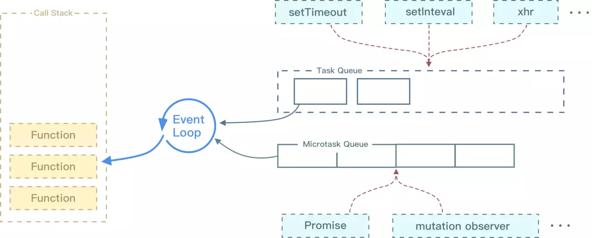

# 进阶知识

## 1. 闭包 losure

### 1.1 定义

闭包为定义在一个函数内部的函数，其本质是将函数内部和函数外部连接起来的一座桥梁，通过闭包使外部能够访问函数内的局部变量，延伸了变量的作用范围。

```javascript
// f2能够访问f1内的局部变量，因此返回f2就能在外部访问f1内的局部变量 - f2就是闭包
function f1() {
    var n = 999;
    function f2() {
        console.log(n);
    }
    return f2;
}
var result = f1();
result(); // 999

// 注意闭包返回f2与f2()的区别 - 带上括号返回的是函数调用，不带括号仅函数名返回的是函数
function f1() {
    var n = 999;
    function f2() {
        console.log(n);
    }
    return f2();
}
var result = f1(); // 999
```

### 1.2 作用

1. 读取函数内部的变量
2. 变量的值始终保持在内存中 - 保存变量现场
3. 封装 - 信息隐藏

```javascript
// Example1 
function f1() {
    var n = 999;
    nAdd = function () {
        n += 1
    }
    function f2() {
        alert(n);
    }
    return f2;
}

var result = f1();
result(); // 999
// nAdd前面没有使用var关键字，因此nAdd是一个全局变量，而不是局部变量，但是需要先调用一次f1()才会生成全局变量nAdd。
nAdd();
// f1是f2的父函数，而f2被赋给了一个全局变量,这导致f2始终在内存中，而f2的存在依赖于f1，因此f1也始终在内存中，不会在调用结束后，被垃圾回收机制（garbage collection）回收，因此f1的局部变量n也一直保存在内存中。
result(); // 1000
```

```javascript
// Example2
// 未使用闭包，在实际中点击节点并不会显示对应的标号，而每个节点点击显示的都是nodes的长度值，因为i均来自for循环中i
var addHandlers = function(nodes){
  for(var i=0;i<nodes.length;i++){
    nodes[i].onclick() = function(){
      alert(i);
    }
  }
} 

// 使用闭包，每个节点生成点击事件都生成一个闭包，每个闭包都存储了当前的i值，因此在这个情况下能满足要求，在实际中点击节点会显示对应的标号。
var addHandlers = function(nodes){
  var helper = function(i){
    return function(){
      alert(i);
    }
  }
  for(var i=0;i<nodes.length;i++){
    nodes[i].onclick() = helper(i);
  }
}
```

```javascript
// Example3 - 封装
// 外部不能访问内部的observerList，而通过返回的闭包则能够访问observerList进行操作
var observer = (function(){
  var observerList = [];
  return {
    add: function(obj){
      observerList.push(obj);
    },
    empty: function(){
      observerList = [];
    },
    get: function(){
      return observerList;
    }
  }
})();
```

## 2. 事件循环机制

JavaScript 是一门单线程语言，异步操作都是放到事件循环队列里面，每次宏任务执行完毕，先去微任务队列查找是否有微任务，如果有就先完成所有的微任务，如果没有微任务或完成所有微任务则从宏任务队列中继续执行宏任务。



### 2.1 宏任务

分类：script 整体代码, **setTimeout, setInterval**, requestAnimationFrame, I/O, UI rendering

* 宏任务所处的队列就是宏任务队列
* 第一个宏任务队列中只有一个任务，也就是script的代码
* 宏任务队列可以有多个
* 当宏任务队列中的任务全部执行完毕后可以查看是否有微任务队列，如果有就先执行微任务队列中的所有任务

### 2.2 微任务

分类：**Promise.then\(\)**, **await之后的代码**, process.nextTick, Object.observe, MutationObserver

* 微任务所处的队列就是微任务队列
* 只有一个微任务队列
* 在上一个宏任务队列执行完毕后，如果微任务队列中有任务就会去执行微任务队列中的所有任务

```javascript
// 例题

console.log('----- start -----')
setTimeout(() => {
  console.log('setTimeout')
},0)
new Promise((resolve) => {
  for(let i = 0; i < 5; i++) {
    console.log(i)
  }
  resolve()
}).then(() => {
  console.log('promise实例成功回调执行')
})
console.log('----- end -----')

// ----- start -----
// 0
// 1
// 2
// 3
// 4
// ----- end -----
// promise实例成功回调执行
// setTimeout
```

## 3. 垃圾回收机制


参考资料：[谈谈 JS 垃圾回收机制](https://segmentfault.com/a/1190000018605776)


## 4. 节流与防抖


参考资料：[十分钟学会防抖和节流](https://www.cnblogs.com/zhuanzhuanfe/p/10633019.html)


## 5. 模版字符串

模版字符串的引入可以使字符串中直接嵌入变量，而不用使用'+'连接。注意模版字符串不是引号`""`，而是反引号````````。

```javascript
// ES5
let a = 'hello <b>' + basket.count + '</b>';

// ES6 - 多行字符串所有的空格和缩进都会被保留在输出之中
let a = `hello <b> ${basket.count} </b>`;
let a = `
<ul>
  <li>first</li>
  <li>second</li>
</ul>
`;
```

模板字符串紧跟在一个函数名后面，该函数将被调用来处理这个模板字符串。

```javascript
let message = SaferHTML`<p>${sender} has sent you a message.</p>`;

function SaferHTML(templateData) {
  let s = templateData[0];
  for (let i = 1; i < arguments.length; i++) {
    let arg = String(arguments[i]);

    // Escape special characters in the substitution.
    s += arg.replace(/&/g, "&amp;")
            .replace(/</g, "&lt;")
            .replace(/>/g, "&gt;");

    // Don't escape special characters in the template.
    s += templateData[i];
  }
  return s;
}
```


如果你对内容有任何疑问，欢迎提交 [❕issues](https://github.com/MrEnvision/Front-end_learning_notes/issues) 或 [ ✉️ email](mailto:EnvisionShen@gmail.com)


