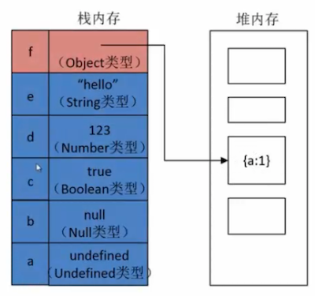
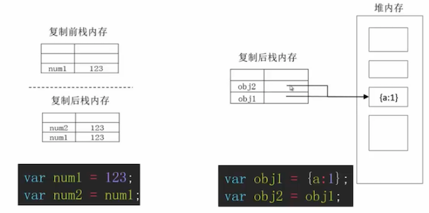
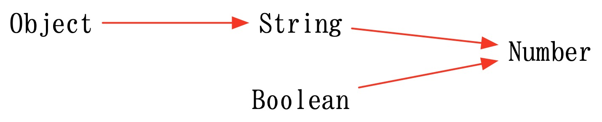
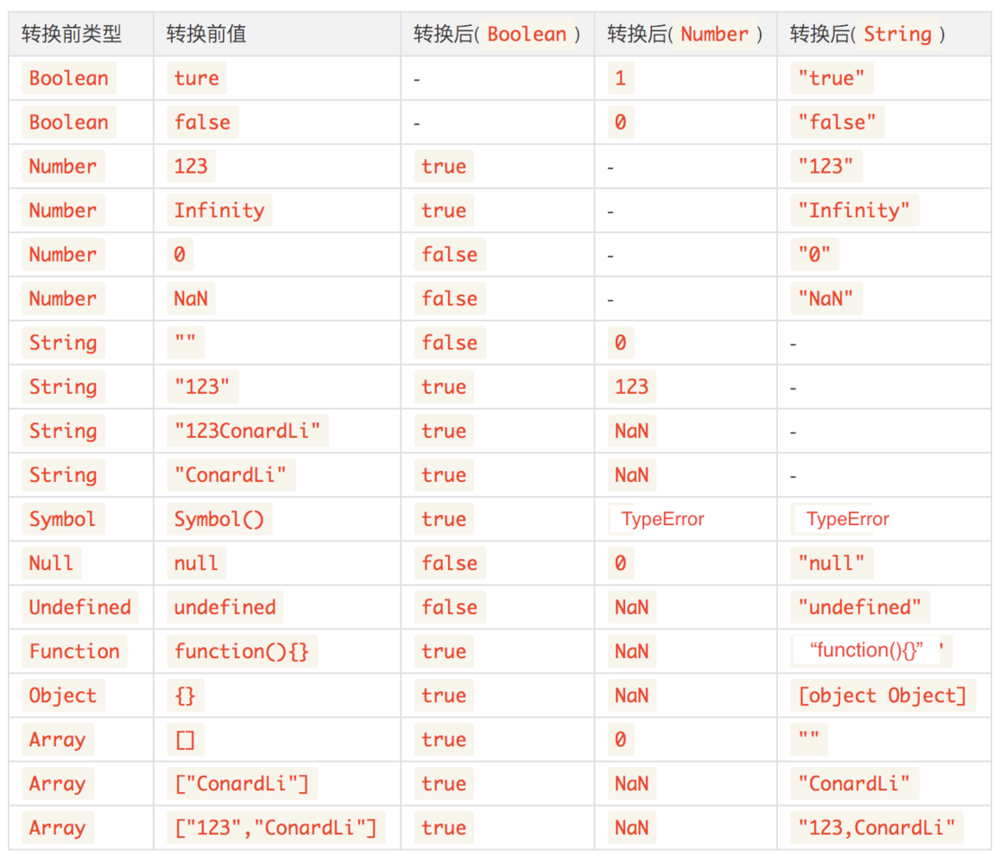

# 数据类型

## 1. 数据类型

**原始类型与引用类型**

* 原始类型：Undefined，Null，Boolean，String，Number，Symbol，BigInt（ES10引入）
* 引用类型：Object，Boolean，String，Number......

原始类型值直接存储在栈内存，而引用类型值存储在堆内存，其栈内存值存储的是值存储地址，如下图所示：



原始类型复制即重新复制一份原始数据，而引用类型复制为拷贝地址，两个地址指向同一个堆内存，更改其中一个也会影响另一个，如下图所示：



## 2. 类型识别

### 2.1 typeof

```javascript
// typeof可以识别标准类型（除null）；
typeof 'hello'; // string
typeof 12; // number
typeof true; // boolean
typeof undefined; // undefined
typeof null; // object
typeof {a:12}; // object
​
// typeof不能识别具体的对象类型（除function）
typeof function(){}; // function
typeof []; // object
typeof new Date(); // object
typeof /\d/; // object
function Person(){}
typeof Person(); // object
​
// ES6 新加的symbol也能识别
typeof Symbol('hello'); // symbol
```

### 2.2 instanceof

```javascript
// instanceof不能判别原始类型
1 instanceof Number; // false
"hello" instanceof String; // false
​
// instanceof能够判别内置对象类型
[] instanceof Array; // true
/\d/ instanceof RegExp; // true
​
// instanceof能够判别自定义类型及父子类型
function Point(){}
function Circle(){}
Circle.prototype = new Point();
Circle.prototype.constructor = Circle;
var c = new Circle();
c instanceof Point(); // true
c instanceof Circle(); // true
​
// instanceof 不能识别symbol
Symbol('hello') instanceof Symbol; // false
```

### 2.3 constructor

```javascript
// constructor是对象原型上的属性，指向构造器本身
​
//constructor可以识别标准类型（除null/undefined）
"hello".constructor === String; // true
(1).constructor === Number; // true
true.constructor === Boolean; // true
({}).constructor === Object; // true
​
// constructor可以识别内置对象
[].constructor === Array; // true
​
// constructor可以识别自定义类型
function Person(){}
new Person().constructor === Person; // true 
// 也可以识别symbol
Symbol('hello').constructor === Symbol;  // true 
```

### 2.4 Object.prototype.toString\(\)

```javascript
function type(obj){
  return Object.prototype.toString.call(obj).slice(8,-1).toLowerCase();
}
// Object.prototype.toString可以识别标准类型
type(1); // number
type("abc"); // string
type(true); // boolean
type(undefined); // undefined
type(null); // null
type({}); // object
​
// Object.prototype.toString可以识别内置对象类型
type([]); // array
type(new Date); // date
type(/\d/); // regexp
type(function(){}); // function
​
// Object.prototype.toString不能识别自定义类型
function Person(){}
type(new Person); // object
​
// 也可以识别symbol
type(Symbol()); // symbol
```

### 2.5 总结

* typeof 目标 === 'object' —— 可以判断基本数据类型（除 null 为 object），引用对象类型均为 object（除function）
* 目标 instanceof Array === true —— 不可以判断基本数据类型，可以判断引用对象类型包括自定义对象
* 目标.constructor === Object —— 可以判断基本数据类型（除 null 和 undefined）和对象数据类型（内置和自定义）
* Object.prototype.toString.call\(目标\).slice\(8,-1\).toLowerCase\(\) === 'string' —— 可以判断基本数据类型和引用对象类型，不能识别自定义对象

## 3. 类型转化

### 3.1 强制转换

* `Number()`
* `String()`
* `Boolean()`
* `pareseInt() / parseFloat()`

### 3.2 隐式转换





#### 3.2.1 Boolean\(\)

除了 +0、-0、undefined、null、''、false、NaN 之外其余均为 true。


所有对象（包括空对象）的转换结果都是`true`，甚至连`false`对应的布尔对象`new Boolean(false)`也是`true`，注意区别布尔值与布尔对象。


#### 3.2.2 Number\(\)

```javascript
// 数值：转换后还是原来的值
Number(324) // 324
// 字符串：如果可以被解析为数值，则转换为相应的数值
Number('324') // 324
// 字符串：如果不可以被解析为数值，返回 NaN
Number('324abc') // NaN
// 空字符串转为0
Number('') // 0
// 布尔值：true 转成 1，false 转成 0
Number(true) // 1
Number(false) // 0
// undefined：转成 NaN
Number(undefined) // NaN
// null：转成0
Number(null) // 0

Number({a: 1}) // NaN
Number([1, 2, 3]) // NaN
Number([5]) // 5
```


null 转为 0，undefined 转为 NaN！！！



Number 方法的参数是对象时，将返回 NaN，除非是包含单个数值的数组，注意是单个数值。



区别 parseInt\(\) 和 Number\(\)：

parseInt 逐个解析字符，而 Number 函数整体转换字符串的类型，基本上，只要有一个字符无法转成数值，整个字符串就会被转为NaN。


#### 3.2.3 parseInt\(\)

```javascript
// 只保留字符串最开头的数字，后面的中文自动消失
console.log(parseInt("2017在公众号上写了6篇文章")); //打印结果：2017
console.log(parseInt("2017.01.02在公众号上写了6篇文章")); //打印结果仍是：2017

// 如果对非 String使用 parseInt() 或 parseFloat()，它会先将其转换为 String 然后再操作
console.log(parseInt(168.23));//打印结果：168 
console.log(parseInt(true)); //打印结果：NaN 
console.log(parseInt(null)); //打印结果：NaN 
console.log(parseInt(undefined)); //打印结果：NaN

// 自动带有截断小数的功能：取整，不四舍五入
console.log(parseInt(5.8)); // 5

// 第二个参数表示在转换时的进制。
console.log(parseInt('110', 16)); // 272
```

#### 3.2.4 String\(\)

```javascript
// 数值：转为相应的字符串。
String(123) // "123"
// 字符串：转换后还是原来的值。
String('abc') // "abc"
// 布尔值：true转为字符串"true"，false转为字符串"false"。
String(true) // "true"
// undefined：转为字符串"undefined"。
String(undefined) // "undefined"
// null：转为字符串"null"。
String(null) // "null"

String({a: 1}) // "[object Object]"
String(function demo(x,y){}) // "function demo(x,y){}"
String([1, 2, 3]) // "1,2,3"
```


String 方法的参数如果是对象，返回一个类型字符串；如果是数组，返回数组的字符串形式。


#### 3.2.5 Number\(\) 和 String\(\) 原理

Number\(\) 参数为对象时背后的规则：

1. 调用对象自身的`valueOf`方法。如果返回原始类型的值，直接对该值使用`Number`函数，不再进行后续步骤。
2. 如果`valueOf`方法返回的还是对象，则改为调用对象自身的`toString`方法。如果`toString`方法返回原始类型的值，则对该值使用`Number`函数，不再进行后续步骤。
3. 如果`toString`方法返回的是对象，就报错。

String\(\) 参数为对象时背后的规则：

1. 先调用对象自身的`toString`方法。如果返回原始类型的值，则对该值使用`String`函数，不再进行以下步骤。
2. 如果`toString`方法返回的是对象，再调用原对象的`valueOf`方法。如果`valueOf`方法返回原始类型的值，则对该值使用`String`函数，不再进行以下步骤。
3. 如果`valueOf`方法返回的是对象，就报错。

Object.prototype.valueOf\(\) 方法的作用是返回一个对象的“值”，默认情况下返回对象本身。

```javascript
new Number(123).valueOf()  // 123
new String('abc').valueOf() // "abc"
new Boolean(true).valueOf() // true

var obj = new Object();
obj.valueOf() === obj // true
```

Object.prototype.toString\(\) 方法的作用是返回一个对象的字符串形式，默认情况下返回类型字符串“\[object Object\]”。

```javascript
[1, 2, 3].toString() // "1,2,3"

'123'.toString() // "123"

(function () {
  return 123;
}).toString()
// "function () {
//   return 123;
// }"

(new Date()).toString()
// "Tue May 10 2016 09:11:31 GMT+0800 (CST)"
```


如果你对内容有任何疑问，欢迎提交 [❕issues](https://github.com/MrEnvision/Front-end_learning_notes/issues) 或 [ ✉️ email](mailto:EnvisionShen@gmail.com)


