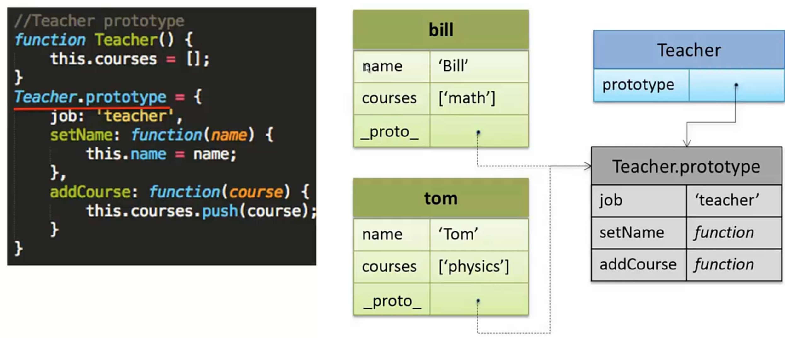

# 原型链/继承

## 1. 原型链


参考资料：[帮你彻底搞懂 JS 中的 prototype、\_\_proto\_\_ 与 constructor](https://blog.csdn.net/cc18868876837/article/details/81211729)


### 1.1 基础介绍

每次利用构造函数生成对象，则部分重复的内容则会占用不必要的内存，因此利用原型prototype，则可以减少这些内存开销，每一个生成的对象都有一个隐式的`_proto_`指向原型，如下图所示。




如上图所示的原型代码，则会形成一个原型链，如下图所示。


属性访问：属性访问会沿着原型链进行查找，首先在自身属性上查找，若没有则沿着原型链一层一层往下找。

```javascript
tom.name; // "Tom"
tom.job; // "teacher"
tom.toString(); // 内置Object对象含有该属性
```

属性删除：属性删除永远删除的是对象的自身属性，除非指定删除prototype的属性。

```javascript
del tom.job; // 只删除tom的job属性，对原型无影响
tom.job; //再访问job则会获得原型的job属性值 
```

属性修改：属性修改永远修改的是对象的自身属性，除非指定修改prototype的属性。

```javascript
tom.job = "policeman"; // 此时只会在tom对象上生成job属性，并且Teacher的prototype上的job值不改变
Teacher.prototype.job = "assistant"; // 此时则会修改Teacher的prototype上的job值
```

如下图所示，bill 对象继承了 Teacher 原型，bill 对象调用 addCourse 方法时，改变了 teacher 的 course。实际为 `bill.__proto__.add("haha");` 是 bill 的原型调用了 add，this 指的是原型 Teacher。


### 1.2 核心知识\*


* 我们需要牢记两点：①\_\_proto\_\_ 和 constructor 属性是对象所独有的；② prototype 属性是函数所独有的，但因为函数也是一种对象，所以函数也拥有 \_\_proto\_\_ 和 constructor属性。
* \_\_proto\_\_ 属性的作用就是当访问一个对象的属性时，如果该对象内部不存在这个属性，那么就会去它的 \_\_proto\_\_ 属性所指向的那个对象（父对象）里找，一直找，直到 \_\_proto\_\_ 属性的终点 null，再往上找就相当于在 null 上取值，会报错。通过 \_\_proto\_\_ 属性将对象连接起来的这条链路即我们所谓的原型链.
* prototype 属性的作用就是让该函数所实例化的对象们都可以找到公用的属性和方法，即 `f1.__proto__ === Foo.prototype`。
* constructor 属性的含义就是指向该对象的构造函数，所有函数（此时看成对象了）最终的构造函数都指向 Function。

简单来说

* `__proto__`和`constructor`属性是对象所独有的；`prototype`属性是函数所独有的，函数也是对象，因此拥有3个属性。
* `__proto__`对象实例指向父对象，`constructor`原型指向构造函数，`prototype`构造函数指向其原型。
* `__proto__`最终会到达`Object.prototype`至null，`constructor`最终会达`Function()`。

## 2. 继承

### 2.1 ES5 继承


参考链接：[JS继承的实现方式](https://www.cnblogs.com/humin/p/4556820.html)


```javascript
function Animal(name) {
    // 实例属性
    this.name = name;
    // 实例方法
    this.sleep = function () {
        console.log(this.name + '正在睡觉！');
    }
}
​
Animal.prototype.eat = function (food) {
    console.log(this.name + '正在吃：' + food);
};
```

#### 2.1.1 原型链继承

子类的原型是父类的实例。

```javascript
function Cat() {}
​
Cat.prototype = new Animal();
Cat.prototype.name = 'cat';
```

缺点：

1. 创建子类实例时无法向父类构造函数传参，`const cat = new Cat('name')`；
2. 来自原型对象的所有属性被所有实例共享，如果是引用类型则更改会影响其他子类实例；
3. 无法实现多继承。

#### 2.1.2 构造继承

使用父类的构造函数来增强子类实例，等于是复制父类的实例属性给子类。

```javascript
function Cat(name) {
    Animal.call(this, name);
}
```

解决了原型继承的缺点1和缺点2（因为每一次都创建了新的父类实例）。缺点：

1. 不能继承父类原型的属性与方法；
2. 每个子类都有父类实力函数的副本，影响性能。

#### 2.1.3 实例继承

为父类实例添加新特性，作为子类实例返回。

```javascript
function Cat3(name) {
    const cat = new Animal(name);
    cat.age = 18 // 实例添加属性
    return cat
}
```

缺点：

1. 子类的实例其实是父类的实例；
2. 不能多继承。

#### 2.1.4 拷贝继承

为父类实例添加新特性，作为子类实例返回。

```javascript
function Cat(name) {
    const animal = new Animal(name);
    for (let pro in animal) {
        Cat.prototype[pro] = animal[pro];
    }
}
```

缺点：

1. 效率低，需要拷贝父类的属性；
2. 无法获取父类不可枚举的属性。

#### 2.1.5 组合继承

通过调用父类构造，继承父类的属性并保留传参的优点，然后通过将父类实例作为子类原型，实现函数复用。

```javascript
function Cat(name) {
    Animal.call(this, name);
}
​
Cat.prototype = new Animal();
Cat.prototype.constructor = Cat5;
```

缺点：

1. 调用了两次父类构造函数，生成了两份实例（子类实例将子类原型上的那份屏蔽了）。

#### 2.1.6 寄生组合继承

通过寄生方式，砍掉父类的实例属性。

```javascript
function Cat(name) {
    Animal.call(this, name);
}
​
(function () {
    // 创建一个没有实例方法的类
    const Super = function () {};
    // 将实例作为子类的原型
    Super.prototype = Animal.prototype;
    Cat.prototype = new Super();
})();
```

| 类型 | 原理 | 父类实例属性继承 | 父类原型属性继承 | 多继承 |
| :--- | :--- | :--- | :--- | :--- |
| 原型链继承 | 子类的原型是父类的实例 | + | + | - |
| 构造继承 | 调用父类构造函数 | + | - | + |
| 实例继承 | 子类实例是父类实例 | + | + | - |
| 拷贝继承 | 子类拷贝父类实例的属性和方法 | + | + | + |
| 组合继承 | 调用父类构造，子类原型是父类实例 | + | + | ？ |
| 寄生组合继承 | / | + | + | ？ |

### 2.2 ES6 继承

子类必须在`constructor`方法中调用`super`方法，否则新建实例时会报错。这是因为子类自己的`this`对象，必须先通过父类的构造函数完成塑造，得到与父类同样的实例属性和方法，然后再对其进行加工，加上子类自己的实例属性和方法。如果不调用`super`方法，子类就得不到`this`对象。

```javascript
class Point { /* ... */ }
​
class ColorPoint extends Point {
  constructor(x, y, color) {
    super(x, y); // 调用父类的constructor(x, y)
    this.color = color;
  }
​
  toString() {
    return this.color + ' ' + super.toString(); // 调用父类的toString()
  }
}
```


如果你对内容有任何疑问，欢迎提交 [❕issues](https://github.com/MrEnvision/Front-end_learning_notes/issues) 或 [ ✉️ email](mailto:EnvisionShen@gmail.com)


