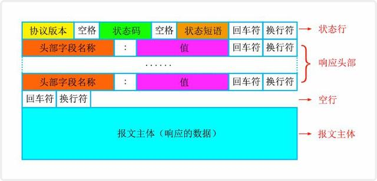

# HTTP协议

HTTP是Hyper Text Transfer Protocol（超文本传输协议）的缩写，它是一个应用层协议，由请求和响应构成，是一个标准的客户端服务器模型。HTTP是一个无状态的协议。

 参考资料：[图解HTTP](https://mp.weixin.qq.com/s/4epUWMCLpwCBxxQgEbL8gA) 

## 1. 请求/响应报文

### 1.1 请求报文

### 1.2 响应报文

## 2. 请求方法

 - GET —— 获取资源
 - POST —— 传输资源
 - PUT —— 更新资源
 - DELETE —— 删除资源
 - HEAD —— 获取报文首部
 - TRACE —— 回显服务器收到的请求，主要用于测试或诊断
 - OPTION —— 请求一些选项的信息，客户端查看服务器的性能（CORS 非简单请求就需要 预检请求）
 - CONNECT —— 用于代理服务器

### 2.1 get/post区别

- Get 请求能缓存，Post 不能
- Post 相对 Get 安全一点点，因为Get 请求都包含在 URL 里，且会被浏览器保存历史纪录。Post 不会，但是在抓包情况下都一样。
- URL有长度限制，会影响 Get 请求，但是这个长度限制是浏览器规定的，不是 RFC 规定的
- Post 支持更多的编码类型且不对数据类型限制

## 3. 状态码

1. 1xx：指示信息--表示请求已接收，继续处理。
2. 2xx：成功--表示请求已被成功接收、理解、接受。
3. 3xx：重定向--要完成请求必须进行更进一步的操作。
4. 4xx：客户端错误--请求有语法错误或请求无法实现。
5. 5xx：服务器端错误--服务器未能实现合法的请求。

2xx：

- 200 OK，表示从客户端发来的请求在服务器端被正确处理
- 204 No content，表示请求成功，但响应报文不含实体的主体部分

3xx：

- 301 moved permanently，永久性重定向，表示资源已被分配了新的 URL
- 302 found，临时性重定向，表示资源临时被分配了新的 URL
- 304 not modified，表示服务器允许访问资源，但因发生请求未满足条件的情况

4xx：

- 401 unauthorized，表示发送的请求需要有通过 HTTP 认证的认证信息
- 403 forbidden，表示对请求资源的访问被服务器拒绝
- 404 not found，表示在服务器上没有找到请求的资源

5xx：

- 500 internal sever error，表示服务器端在执行请求时发生了错误
- 501 Not Implemented，表示服务器不支持当前请求所需要的某个功能
- 503 service unavailable，表明服务器暂时处于超负载或正在停机维护，无法处理请求
- 504 Gateway timeout，表示服务器作为网关或代理，但是没有及时从上游服务器收到请求

## 4. 请求头/响应头

### 4.1 通用字段

|     通用字段      |                       作用                       |
| :---------------: | :----------------------------------------------: |
|   Cache-Control   |                  控制缓存的行为                  |
|    Connection     | 浏览器想要优先使用的连接类型，比如  `keep-alive` |
|       Date        |                   创建报文时间                   |
|      Pragma       |                     报文指令                     |
|        Via        |                代理服务器相关信息                |
| Transfer-Encoding |                   传输编码方式                   |
|      Upgrade      |                要求客户端升级协议                |
|      Warning      |               在内容中可能存在错误               |

### 4.2 请求字段

|      请求字段       |                作用                |
| :-----------------: | :--------------------------------: |
|       Accept        |        能正确接收的媒体类型        |
|   Accept-Charset    |         能正确接收的字符集         |
|   Accept-Encoding   |      能正确接收的编码格式列表      |
|   Accept-Language   |        能正确接收的语言列表        |
|       Expect        |        期待服务端的指定行为        |
|        From         |           请求方邮箱地址           |
|        Host         |            服务器的域名            |
|      If-Match       |          两端资源标记比较          |
|  If-Modified-Since  | 本地资源未修改返回 304（比较时间） |
|    If-None-Match    | 本地资源未修改返回 304（比较标记） |
|     User-Agent      |             客户端信息             |
|    Max-Forwards     |    限制可被代理及网关转发的次数    |
| Proxy-Authorization |      向代理服务器发送验证信息      |
|        Range        |        请求某个内容的一部分        |
|       Referer       |    表示浏览器所访问的前一个页面    |
|         TE          |            传输编码方式            |

### 4.3 响应字段

|      响应字段      |            作用            |
| :----------------: | :------------------------: |
|   Accept-Ranges    |   是否支持某些种类的范围   |
|        Age         | 资源在代理缓存中存在的时间 |
|        ETag        |          资源标识          |
|      Location      |   客户端重定向到某个 URL   |
| Proxy-Authenticate |  向代理服务器发送验证信息  |
|       Server       |         服务器名字         |
|  WWW-Authenticate  |   获取资源需要的验证信息   |

### 4.4 实体字段

|     实体字段     |              作用              |
| :--------------: | :----------------------------: |
|      Allow       |       资源的正确请求方式       |
| Content-Encoding |         内容的编码格式         |
| Content-Language |         内容使用的语言         |
|  Content-Length  |       request body 长度        |
| Content-Location |       返回数据的备用地址       |
|   Content-MD5    | Base64加密格式的内容 MD5检验值 |
|  Content-Range   |         内容的位置范围         |
|   Content-Type   |         内容的媒体类型         |
|     Expires      |         内容的过期时间         |
|  Last_modified   |       内容的最后修改时间       |

### 4.5 举例

请求头：

- Host：连接的目标主机和端口号
- Accept：客户端能接收的资源类型
- Accept-language：客户端能接收的语言类型
- Accept-Encoding：客户端能接收的压缩数据的类型
- Connection：维护连接关系（keep-alive）
- Referer：告诉服务器请求来自哪里
- If-Modified-Since/If-none-mathc：用于缓存处理
- cache-control：同样用于缓存处理
- cookie
- User-Agent：客户端信息
- Date：请求时间

响应头：

- set-cookie：传回来的cookie信息
- cache-control：用于缓存处理
- Last-Modified：资源最后修改时间（用于缓存处理）
- etag：资源标识（用于缓存处理）
- Connection：维护连接关系
- Content-Language：服务端发送的语言类型
- Content-Type：服务端发送的资源类型
- Content-Encoding： 服务端发送压缩编码类型
- Content-Length：服务端发送的数据长度
- Date：服务端响应时间

