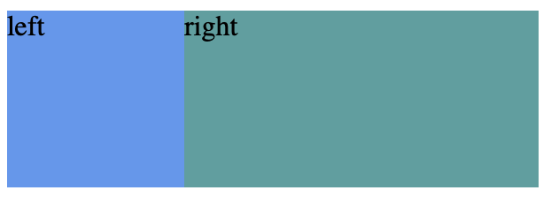

# BFC块格式化上下文

简介：本文为BFC笔记，完整笔记详见[Github](https://github.com/MrEnvision/Front-end_learning_notes)

作者：[Envision](https://github.com/MrEnvision) 联系邮箱：[EnvisionShen@gmail.com](mailto:EnvisionShen@gmail.com)

参考链接：[BFC介绍1](https://www.cnblogs.com/dojo-lzz/p/3999013.html) [BFC介绍2](https://www.jianshu.com/p/0d713b32cd0d)

## 形成BFC

1. 根元素
2. float属性不为none
3. position为absolute或fixed
4. display为inline-block, table-cell, table-caption, flex, inline-flex
5. 具有overflow 且值不是 visible 的块元素

注意：可以简单理解为脱离文档流（为了记忆方便，实际应该并不是哦！）

## BFC特性\(作用\)

1. 使 BFC 内部浮动元素不会到处乱跑，不会产生高度塌陷问题。
2. 和浮动元素产生边界。
3. 避免margin重叠问题

举例说明：

* 情况1:一般元素设置了浮动或绝对定位，则该元素就会脱离普通文档流，让外层父元素继续包裹住内层元素，则可以讲外层父元素设置为BFC。

```markup
<style>
    .par{
        border: 2px solid #000000;
        overflow: hidden;
    }
    .chi{
        border: 1px solid #FFF231;
        height: 100px;
        width: 100px;
        float: left;
    }

</style>
<body>
<div class="par">
   <div class="chi">float</div>
</div>
</body>
```

如果父元素不加`overflow: hidden;`，则会显示如下：


父元素添加`overflow: hidden;`，则会显示如下：


* 情况2:一般元素设置了浮动，如果普通元素要与浮动元素产生左右边距，需要将 maring 设置为浮动元素的宽度加上你想要产生边距的宽度，则将普通元素设置为BFC则能和浮动元素产生边界。

```markup
<style>
    .left{
        background: cornflowerblue;
        height: 100px;
        width: 100px;
        float: left;
    }
    .right{
        background: cadetblue;
        height: 100px;
        width: 200px;
        overflow: hidden;
    }
</style>
<body>
<div class="left">left</div>
<div class="right">right</div>
</body>
```

如果右元素不加`overflow: hidden;`，则会显示如下：


右元素添加`overflow: hidden;`，则会显示如下：



如果发现本项目有错误，欢迎提交 issues 指正。

