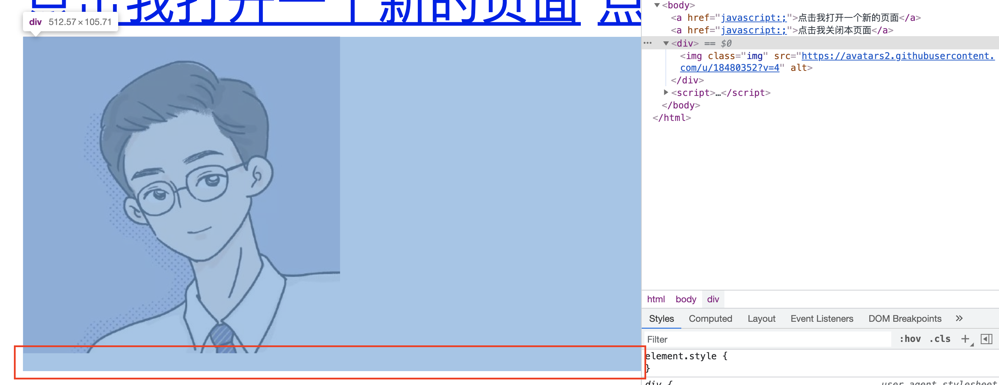

# CSS 踩坑指南

## 1. inline-block 产生间隙的问题

```markup
<style>
.main {
    display: inline-block;
    width: 100px;
    height: 100px;
    background-color: lightpink;
}
</style>
<div class="box">
    <div class="main"></div>
    <div class="main"></div>
</div>
```


**原因**：inline-block 元素间有空格或是换行，因此产生了间隙。

**解决方案**：

```css
.box {
    font-size: 0;
    letter-spacing: -3px; /* 负值即可 */
}
```

这种情况也在img 图片情况下常见，图片的父元素会有一个3px的间隙。



**解决方案**：

1. 同上述处理一致，父元素设置 font-size 等
2. 图片`` 设置 `display: block`
3. 父元素高度设置为图片实际高度（写死高度，不建议）


如果你对内容有任何疑问，欢迎提交 [❕issues](https://github.com/MrEnvision/Front-end_learning_notes/issues) 或 [ ✉️ email](mailto:EnvisionShen@gmail.com)


