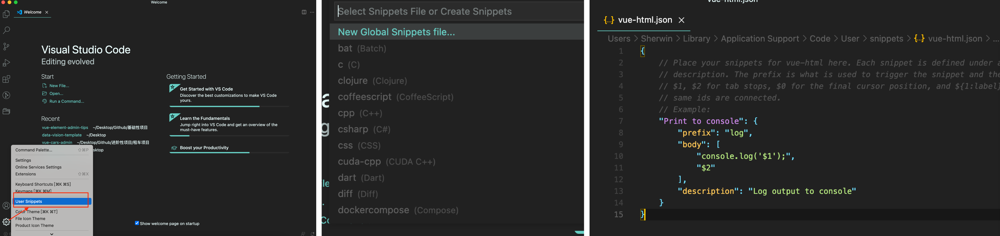
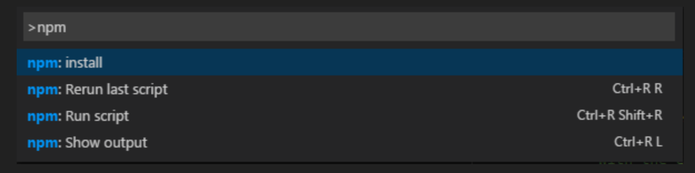
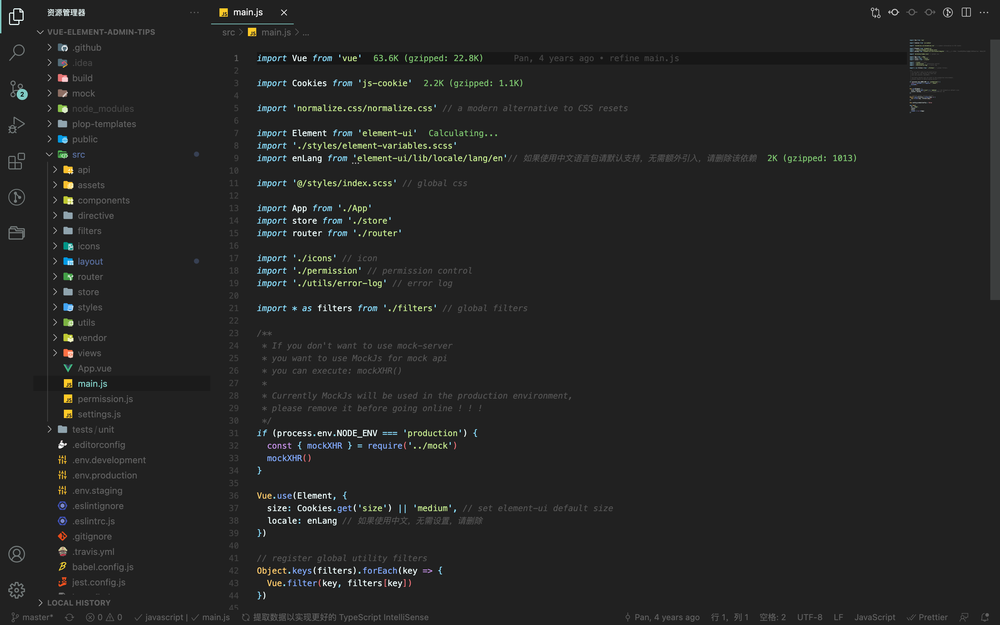

# 代码编辑器-VSCode

> 所谓工欲善其事必先利其器，一个优秀的编辑器能大大提高开发的效率。在以往开发过程中均使用 Webstorm 进行开发（因为我相信收费软件必有其过人之处才敢收费吧😅），现因需与团队同步改用 VSode 进行开发，因此为了使用方便和接近webstorm使用习惯需要对其进行改造，安装插件选择谨代表个人观点。

## 配置

### 代码自动保存

默认情况下 vscode 不会自动保存代码，需要手动 ctrl + s，为了实现代码自动保存，我们在设置下搜索 auto save，其具有四个选项，自行选择设定即可。

1. off: 关闭自动保存
2. afterDelay: XX毫秒后自动保存
3. onFocusChange: 当焦点移出编辑框
4. onWindowChange: 当焦点移出 vscode 窗口

也可以直接在菜单栏选择「文件-自动保存」，勾选后，当写完代码后，文件会立即实时保存。

### 代码片段配置



```javascript
{
	// Place your snippets for vue-html here. Each snippet is defined under a snippet name 
	// and has a prefix, body and description. The prefix is what is used to trigger the 
	// snippet and the body will be expanded and inserted. Possible variables are:
	// $1, $2 for tab stops, $0 for the final cursor position, and ${1:label}, ${2:another} for 
	// placeholders. Placeholders with the same ids are connected.
	// Example:
	"Print to console": {
		"prefix": "log",
		"body": [
			"console.log('$1');",
			"$2"
		],
		"description": "Log output to console"
	},
	"Print to demo": {
		"prefix": "vdiv",
		"body": [
			"<div class='$1'>",
			"</div>",
			"$2"
		],
		"description": "Log output to console"
	}
}
```


参考资料：[「VSCode 利用 Snippets 设置超实用的代码块」](https://juejin.cn/post/6844903869424599053)


## 插件

### Vetur

vscode 下的 Vue 多功能集成工具，Vue 开发必备！

### Code Spell Checker

实时的识别单词拼写是否有误，并给出提示，对于英语菜鸟来说非常友好。注意，需要在插件Enable Filetypes 设置项（表示进行检查的文件类型）中添加 vue，不然不会检查 vue 文件。

### Code Runner

代码一键运行，支持超过40种语言。

### open in browser

通过编辑器打开浏览器显示代码效果（右键选择）。

### Auto Rename Tag / Auto Close Tag

Auto Rename Tag 插件可以自动重命名成对的`HTML/XML`标记；Auto Close Tag 插件可以自动添加`HTML/XML`关闭标签。

### GitLens — Git supercharged

可以查看git所有提交记录，并且代码上面自动有提示。

### Javascript code snippets / Html snippets / Vue 3 snippets

各种实用的代码片段，提高开发效率！！！

### File peek

在 VS Code 中，将鼠标移至文件路径上并 command +点击，可以在新的标签页打开对应的文件，而安装了 File Peek 后，可以打开一个文件预览窗口，预览文件内容，并支持文件编辑。

### CSS peek

追踪至样式表中 CSS class 和 id 定义。

### Vue peek

追踪 vue 文件，允许快速跳转到或查看作为组件（从模板）或模块导入（从脚本）引用的文件。

### HTML CSS Support / IntelliSense for CSS class names in HTML

CSS 智能提示。

### Path Intellisense

路径智能提示。

### NPM Intellisense

npm 包导入智能提示。

### Search node\_modules

搜索快速导航和打开文件 node\_modules 的某个包位置。

### ESLint

代码格式检查工具，首先需要在本地全局安装`npm install -g eslint`。

### NPM

npm 插件支持运行 package.json 文件中定义的 npm 脚本，并支持根据 package.json 中定义的依赖项验证已安装的模块。



### SVG

SVG 插件集编码、最小化、预览等一体。

### Material icon theme / Material theme

对于颜值党来说，颜值就是一切！为了让 vscode 看起来更加美丽动人，icon图标插件可选择material icon theme 或者 vscode-icons，编辑器主题可选择 material theme 或者 atom material theme 等等。



### Project Manager

保存项目目录，方便切换不同项目。

### turbo console log

选中内容并按 ctrl + option + L 自动针对选中内容扩展 console.log\(\)，使得调试更便捷。

### Import Cost

Import Cost 可以在代码中友好的提示我们，当前引入的包会增加多少体积，这有助于帮我们优化代码的体积。注意，如果需要知道 vue 组件等引入的体积需要进行配置才可以。


如果你对内容有任何疑问，欢迎提交 [❕issues](https://github.com/MrEnvision/Front-end_learning_notes/issues) 或 [ ✉️ email](mailto:EnvisionShen@gmail.com)


