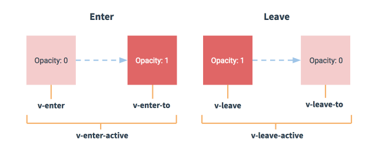

# Vue 动画

## 1. 默认过渡类名



动画进入：

* v-enter：动画进入之前的初始状态
* v-enter-to：动画进入之后的结束状态
* v-enter-active：动画进入的时间段

动画离开：

* v-leave：动画离开之前的初始状态
* v-leave-to：动画离开之后的结束状态
* v-leave-active：动画离开的时间段

```markup
<div id="app">
  <input type="button" value="toggle" @click="flag=!flag">
  <!-- 需求： 点击按钮，让 h3 显示，再点击，让 h3 隐藏 -->
  <transition>
    <h3 v-if="flag">这是一个H3</h3>
  </transition>
</div>

<style>
.v-enter, .v-leave-to {
  opacity: 0;
  transform: translateX(80px);
}

.v-enter-active, .v-leave-active {
  transition: all 1s ease;   /*期间，设置过渡的属性：all表示所有的属性、时间为1秒、过渡的状态*/
}
</style>
```

多个元素实现动画，可以采用`transition-group`

```markup
<transition-group>
    <li v-for="(item, i) in list" :key="item.id">
        {{item.id}} --- {{item.name}}
    </li>
</transition-group>
```

## 2. 自定义过渡类名

默认的`.v-enter`、`.v-leave-to`这些过渡类名都是以`v-`开头的，我们可以通过自定义别名来设置自定义的前缀。

```markup
<!-- 设置自定义别名 name="my" -->
<transition name="my">
  <h6 v-if="flag">这是一个H6</h6>
</transition>

<!--后续就可以使用 my-enter、.my-leave-to 这些类名-->
<style>
.my-enter, .my-leave-to {
  opacity: 0;
  transform: translateY(70px);
}
</style>
```

## 3. 钩子函数实现动画


建议还是看[官方文档](https://cn.vuejs.org/v2/guide/transitions.html)！！！


只有出场动画、没有离场动画，这种就是属于半场动画。比如把一件商品加入收藏，会出现一个动画；当再次点击收藏按钮的时候却看不到动画效果，这就说明，只有前一半才有动画。半场动画，可以使用钩子函数来实现，做法是：基于钩子函数直接在methods中写入场动画的函数，不写离场动画的函数即可。

```markup
<!-- 这八个钩子函数（四个入场、四个离场）可以理解成是动画的生命周期 -->
<transition
  v-on:before-enter="beforeEnter"
  v-on:enter="enter"
  v-on:after-enter="afterEnter"
  v-on:enter-cancelled="enterCancelled"

  v-on:before-leave="beforeLeave"
  v-on:leave="leave"
  v-on:after-leave="afterLeave"
  v-on:leave-cancelled="leaveCancelled"
>
  <!-- DOM元素 -->
</transition>
```

```markup
<transition @before-enter="beforeEnter" @enter="enter" @after-enter="afterEnter">
  <div class="ball" v-show="flag"></div>
</transition>

<script>
var vm = new Vue({
  el: '#app',
  data: {
    flag: false
  },
  methods: {
    // 设置开始动画之前的起始状态
    beforeEnter(el) {
      // 第一个参数：el，表示要执行动画的那个DOM元素
      el.style.transform = "translate(0, 0)" 
    },
    enter(el, done) {
      // el.offsetWidth 这句话，没有实际的作用，但是，如果不写，出不来动画效果，可以认为 el.offsetWidth 会强制动画刷新
      el.offsetWidth
      el.style.transform = "translate(150px, 300px)"
      el.style.transition = 'all 1s ease'
      // done 是 afterEnter 函数的引用
      done()
    },
    afterEnter(el) {
      this.flag = !this.flag
    }
  }
})
</script>
```


当只用 JavaScript 过渡的时候，在`enter`和`leave`中必须使用`done`进行回调。否则，它们将被同步调用，过渡会立即完成。



如果你对内容有任何疑问，欢迎提交 [❕issues](https://github.com/MrEnvision/Front-end_learning_notes/issues) 或 [ ✉️ email](mailto:EnvisionShen@gmail.com)


