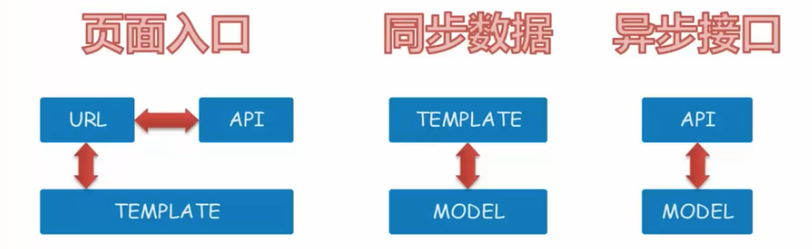

# 接口设计

简介：本文为接口设计笔记，完整笔记详见[Github](https://github.com/MrEnvision/Front-end_learning_notes)

作者：[Envision](https://github.com/MrEnvision)         联系邮箱：[EnvisionShen@gmail.com](mailto:EnvisionShen@gmail.com)

前端访问主要为以下流程：

根据上述流程，接口主要分为以下三部分：

### 页面入口

- 基本信息
- 输入参数
- 模版列表
- 接口参数

举例如下：

**<u>通过页面入口设计规范可以构建项目结构：</u>**

### 同步数据

- 基本信息
- 预填数据
- 注入接口

举例如下：

<u>**通过同步数据设计规范可以模拟同步数据：**</u>

### 异步接口

- 基本信息
- 输入数据
- 输出结果

举例如下：

<u>**通过异步接口设计规范可以模拟异步数据：**</u>

参考资料：@网易微专业前端课程 - 接口设计

------

如果发现本项目有错误，欢迎提交 issues 指正。