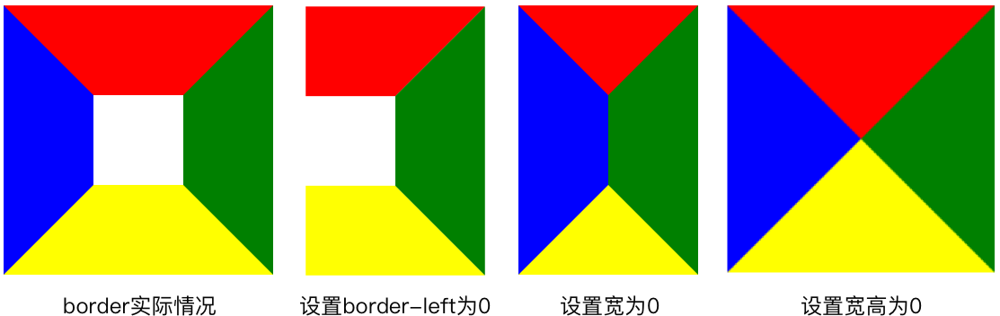

# CSS画图

简介：本文为CSS画图笔记，完整笔记详见[Github](https://github.com/MrEnvision/Front-end_learning_notes)

作者：[Envision](https://github.com/MrEnvision)         联系邮箱：[EnvisionShen@gmail.com](mailto:EnvisionShen@gmail.com)

参考链接：[1、如何用CSS画三角形](https://www.cnblogs.com/wangjiachen666/p/9462837.html)  [2、倾斜skew()方法](http://www.lvyestudy.com/css3/css3_9.5.aspx) [3、纯CSS画的基本图形](https://www.cnblogs.com/zuobaiquan01/p/8582298.html) [4、利用css样式画各种图形--初步、进阶、高级（一）](https://www.cnblogs.com/pigtail/archive/2013/02/17/2914119.html) 

## border属性

> 通过对border设置大小，对内容设置宽高，可以得到梯形、三角形等。

## skew属性

## 总结

- 三角形/梯形 - [border属性](#border属性)
- 平行四边形 - [transform:skew()属性](#skew属性)
- 圆形相关 -  border-radius属性 + border属性

------

如果发现本项目有错误，欢迎提交 issues 指正。