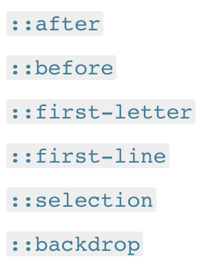
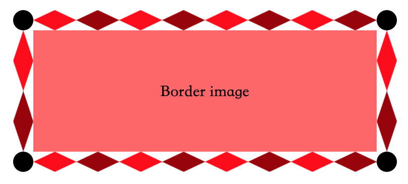
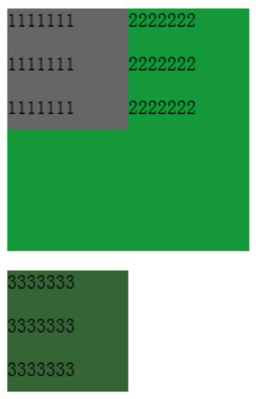
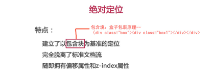
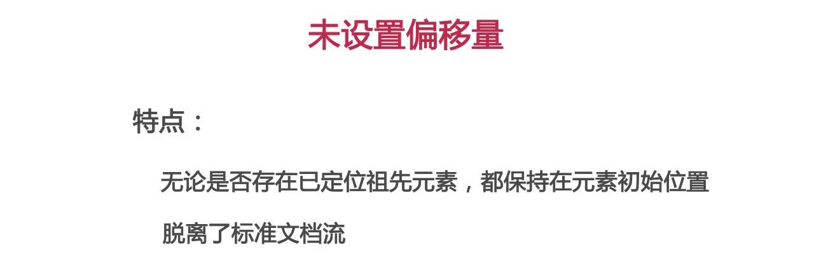
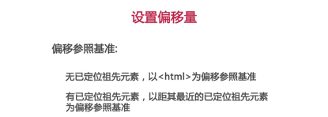
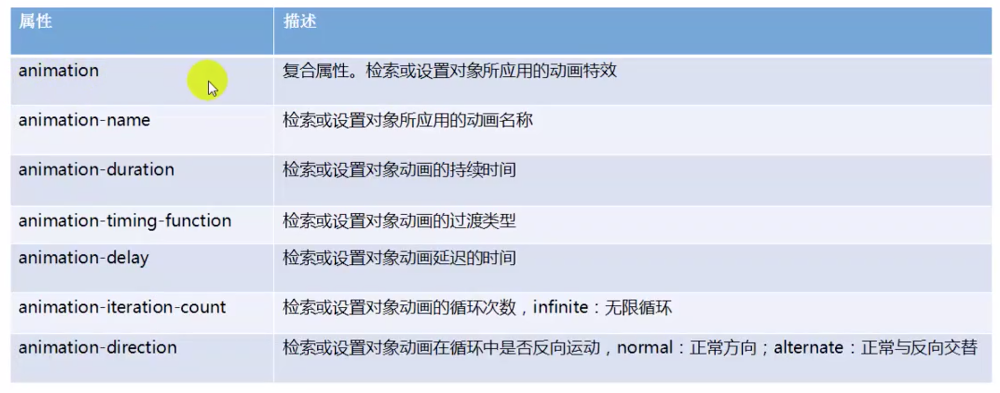

# CSS基础知识

简介：本文为CSS基础知识笔记，完整笔记详见[Github](https://github.com/MrEnvision/Front-end_learning_notes)

作者：[Envision](https://github.com/MrEnvision)         联系邮箱：[EnvisionShen@gmail.com](mailto:EnvisionShen@gmail.com)


## 目录：

[基础语法](#1基础语法) - [CSS工作原理](#11CSS工作原理) + [CSS应用到HTML的方法](#12CSS应用到HTML的方法) +  [CSS语句种类](#13CSS语句种类) + [CSS选择器种类](#14CSS选择器种类)

[CSS选择器](#2CSS选择器) - [类型、class、id选择器](#21选择器\-类型classid) + [属性、属性值选择器](#22选择器-属性和属性值) + [伪类、伪元素选择器](#23选择器\-伪类伪元素) + [组合器、多重选择器](#24选择器\-组合器多重选择器)

[CSS的数值与单位](#3CSS的数值与单位)     [层叠和继承](#4层叠和继承)     [盒模型](#5盒模型)     [文本字体样式](#6文本字体样式)     [列表样式](#7列表样式)     [链接样式](#8链接样式)     [背景](#9背景)     [边界](#10边界)

[布局](#11布局) - [浮动](#111浮动) + [定位](#112定位) + [弹性盒子](#113弹性盒子) + [网格](#114网格) + [多列布局(其他)](#115多列布局其他)

[CSS动画](#12CSS动画) - [2D、3D转换](#1212D3D转换) + [过渡 - transition](#122过渡\-transition) + [动画 - animation](#123动画\-animation)

[浏览器内核](#13浏览器内核)     [设备媒体](#14设备媒体)


## 1、基础语法

### 1.1、CSS工作原理


### 1.2、CSS应用到HTML的方法

```html
<!--外部样式表-->
<link rel="stylesheet" href="style.css">
<!--内部样式表-->
<style> 样式 </style>
<!--内联样式-->
<h1 style="样式"></h1>
<!--导入方式-->
<style> 
	@import url("bluish.css") projection, tv;
	@import 'custom.css';
	@import url("chrome://communicator/skin/");
</style>
```

### 1.3、CSS语句种类

```css
/* 1、基本CSS规则块 */
h1 {
  colour: blue;
  background-color: yellow;
  border: 1px solid black;
}

/* 2、@-规则(At-rules) - 主要用于传递元数据、条件信息或其它描述性信息。 */
@charset 和 @import （元数据）
@media 或 @document （条件信息，又被称为嵌套语句，见下方。)
@font-face （描述性信息）

/* 3、嵌套语句 - 只有在特定条件匹配时才会应用到文档上 */
@media 只有在运行浏览器的设备匹配其表达条件时才会应用该@-规则的内容；
@supports 只有浏览器确实支持被测功能时才会应用该@-规则的内容；
@document 只有当前页面匹配一些条件时才会应用该@-规则的内容。
------ 举例：只有在页面宽度超过801像素时才会应用 ------
@media (min-width: 801px) {
  body {
    margin: 0 auto;
    width: 800px;
  }
} 
```

### 1.4、CSS选择器种类

- 简单选择器（Simple selectors）：通过元素类型、class或id匹配一个或多个元素。
- 属性选择器（Attribute selectors）：通过 属性 / 属性值 匹配一个或多个元素。

- 伪类（Pseudo-classes）：匹配处于确定状态的一个或多个元素，比如被鼠标指针悬停的元素，或当前被选中或未选中的复选框，或元素是DOM树中一父节点的第一个子节点。
- 伪元素（Pseudo-elements）:匹配处于相关的确定位置的一个或多个元素，例如每个段落的第一个字，或者某个元素之前生成的内容。 
- 组合器（Combinators）：这里不仅仅是选择器本身，还有以有效的方式组合两个或更多的选择器用于非常特定的选择的方法。例如，你可以只选择divs的直系子节点的段落，或者直接跟在headings后面的段落。
- 多重选择器（Multiple selectors）：这些也不是单独的选择器；这个思路是将以逗号分隔开的多个选择器放在一个CSS规则下面， 以将一组声明应用于由这些选择器选择的所有元素。

## 2、CSS选择器

### 2.1、选择器-类型、class、id

```css
p {
  color: red;
}
.first {
  font-weight: bold;
}
#polite {
  font-family: cursive;
}
* {
  padding: 5px;
}
```

### 2.2、选择器-属性和属性值

- 存在和值（Presence and value）属性选择器-匹配精确的属性值

[attr]：该选择器选择包含 attr 属性的所有元素，不论 attr 的值为何。

[attr=val]：该选择器仅选择 attr 属性被赋值为 val 的所有元素。

[attr~=val]：该选择器仅选择具有 attr 属性的元素，而且要求 val 值是 attr 值包含的被空格分隔的取值列表里中的一个。

注意：=即表示val严格等于，～=即表示val值包含即可

- 子串值（Substring value）属性选择器-类似 regular expression 的灵活匹配方式

[attr|=val] : 选择attr属性的值是 val 或值以 val- 开头的元素。

[attr^=val] : 选择attr属性的值以 val 开头（包括 val）的元素。

[attr$=val] : 选择attr属性的值以 val 结尾（包括 val）的元素。

[attr*=val] : 选择attr属性的值中包含子字符串 val 的元素。

```css
/* 给date-pref属性包含same的li标签添加背景颜色 */
li[data-perf*="same"] {
   background-color: rgba(0,0,255,0.5);
}
```

### 2.3、选择器-伪类、伪元素

注：该选择器不是选择元素，而是元素的某些部分，或仅在某些特定上下文中存在的元素。

一个 CSS  伪类（pseudo-class） 是一个以冒号(:)作为前缀，被添加到一个选择器末尾的关键字，当你希望样式在特定状态下才被呈现到指定的元素时，你可以往元素的选择器后面加上对应的伪类（pseudo-class）。


举例如下：

```css
<a href="https://developer.mozilla.org/" target="_blank">Mozilla Developer Network</a>

/* 这些样式将在任何情况下应用于我们的链接 */
a {
  color: blue;
  font-weight: bold;
}

/* 我们想让被访问过的链接和未被访问的链接看起来一样 */
a:visited {
  color: blue;
}

/* 当光标悬停于链接，键盘激活或锁定链接时，我们让链接呈现高亮 */
a:hover,
a:active,
a:focus {
  color: darkred;
  text-decoration: none;
}
```

伪元素（Pseudo-element）前缀是两个冒号 (::) ， 同样是添加到选择器后面去选择某个元素的某个部分。



创建一个伪元素，作为已选中元素的最后一个子元素;

创建一个伪元素，作为已选中元素的第一个子元素;

指定段落的第一个单词;

指定段落的第一行;

应用于文档中被用户高亮的部分（比如使用鼠标或其他选择设备选中的部分）;

在任何处于全屏模式的元素下的即刻渲染的盒子（并且在所有其他在堆中的层级更低的元素之上）;

举例如下：

```html
<ul>
  <li><a href="https://developer.mozilla.org/en-US/docs/Glossary/CSS">CSS</a> defined in the MDN glossary.</li>
  <li><a href="https://developer.mozilla.org/en-US/docs/Glossary/HTML">HTML</a> defined in the MDN glossary.</li>
</ul>

/* 所有含有"href"属性并且值以"http"开始的元素，将会在其内容后增加一个箭头（去表明它是外部链接）*/
[href^=http]::after {
  content: '⤴';
}
```

### 2.4、选择器-组合器、多重选择器


举例如下：

```css
/* 所有table里的tfoot里的th */
table tfoot th {}
/* 在table当中，所有的th之后的td */
table th + td {}
/* 所有table里的tbody里的所有td（第一个除外），每个td都是由它上边的td选择 */
table tbody td + td {}
```

## 3、CSS的数值与单位

### 3.1、数值

> 长度值，用于指定例如元素宽度、边框（border）宽度或字体大小；无单位整数，用于指定例如相对线宽或运行动画的次数。

长度值：

- 绝对单位：

  - px：像素（pixels ）
  - mm, cm, in: 毫米（Millimeters），厘米（centimeters），英寸（inches）
  - pt, pc: 点（Points (1/72 of an inch)）， 十二点活字（ picas (12 points.)）

- 相对单位：

  - em:1em与当前元素的字体大小相同（注意em会继承父元素的字体大小）
  - ex, ch: 分别是小写x的高度和数字0的宽度。
  - rem: 等于默认基础字体大小的尺寸，且继承的字体大小将不起作用，区别于em
  - vw, vh: 分别是视口宽度的1/100和视口高度的1/100

无单位整数：

- 0就是0，无关单位，如margin: 0;则去除了内外边框
- 设置行高，line-height，如line-height: 1.5;则行高为font-size的1.5倍
- 运行动画的次数等，如animation-iteration-count: 5;

### 3.2、百分比

用于指定尺寸或长度——例如取决于父容器的长度或高度，或默认的字体大小。

百分比都是相对于父元素来说的。

### 3.3、颜色

用于指定背景颜色，字体颜色等。

方法：

- 关键词，如“red”
- 十六进制，如“#000000”
- RGB，如“rgb(255,0,0)”
- RGBA，如“rgba(255,0,0,0.5)” - 多了透明度通道
- 不透明度，如“opacity: 0.5”

### 3.4、坐标位置

例如，以屏幕的左上角为坐标原点定位元素的位置。

### 3.5、函数

例如，用于指定背景图片或背景图片渐变。

## 4、层叠和继承

### 4.1、层叠

解决问题：当有多个选择器匹配到同一个元素上时，哪个选择器的 CSS 规则最终会应用到元素上？

基于三个原则：

- 重要性（Importance）

  - !important - 使得规则总是优先于其他规则 - 不建议使用

- 专用性（Specificity）

  - 规则在一个元素的 []() 属性里 > ID选择器 > 类选择器、属性选择器、或者伪类 > 元素选择器或伪元素

- 源代码次序（Source order）

  - 后面的规则将战胜先前的规则

相互冲突的声明将按以下顺序适用，后一种将覆盖先前的声明：

1. 在用户代理样式表的声明 (例如：浏览器在没有其他声明的默认样式).
2. 用户样式表中的普通声明（由用户设置的自定义样式）。
3. 作者样式表中的普通声明（这是我们设置的样式，Web开发人员）。
4. 作者样式表中的重要声明
5. 用户样式表中的重要声明

### 4.2、继承

解决问题：应用于某个元素的一些属性值将由该元素的哪些子元素继承，而哪些则不会？

控制继承：

- inherit：该值将应用到选定元素的属性值设置为与其父元素一样
- initial：该值将应用到选定元素的属性值设置为与浏览器默认样式表中该元素设置的值一样。如果浏览器默认样式表中没有设置值，则相当于inherit
- unset：该值将属性重置为其自然值，即如果属性是自然继承的，那么它就表现得像 inherit，否则就是表现得像 initial。
- revert：如果当前的节点没有应用任何样式，则将该属性恢复到它所拥有的值。换句话说，属性值被设置成自定义样式所定义的属性（如果被设置）， 否则属性值被设置成用户代理的默认样式。

> css可继承属性-只有颜色、文字、字体间距、行高、对齐方式和列表的样式可以继承
>
> - 所有元素可继承：visibility和cursor。 
>
> - 内联元素可继承：letter-spacing、word-spacing、white-space、line-height、color、font、font-family、font-size、font-style、font-variant、font-weight、text-decoration、text-transform、direction。 
>
> - 终端块状元素可继承：text-indent和text-align。 
>
> - 列表元素可继承：list-style、list-style-type、list-style-position、list-style-image。

## 5、盒模型


- box-sizing:content-box; 表示标准的W3C盒子模型，盒子设置的长宽即为内容的长宽
- box-sizing:border-box; 表示IE盒子模型，盒子设置的长宽等于内容长宽+padding长宽+border长宽
- box-sizing:inherit; 表示从父元素继承

### 5.1、高级操作

- 阴影：box-shadow属性 - box-shadow: 5px 5px 5px rgba(0,0,0,0.7);

  - 数值说明

    - 第一个长度值是水平偏移量（horizontal offset ）——即向右的距离，阴影被从原始的框中偏移(如果值为负的话则为左)。
    - 第二个长度值是垂直偏移量（vertical offset）——即阴影从原始盒子中向下偏移的距离(或向上，如果值为负)。
    - 第三个长度的值是模糊半径（blur radius）——在阴影中应用的模糊度。
    - 颜色值是阴影的基本颜色（base color）。

  - inset关键字放在一个阴影声明的开始，使它变成一个内部阴影，而不是一个外部阴影。box-shadow: inset 2px 2px 1px black

  - ⚠️可以添加多个阴影

- 溢流：overflow属性

  - auto: 当内容过多，溢流的内容被隐藏，然后出现滚动条来让我们滚动查看所有的内容。

  - hidden: 当内容过多，溢流的内容被隐藏。
  - visible: 当内容过多，溢流的内容被显示在盒子的外边（这个是默认的行为）

- 背景裁剪：background-clip属性

  - background-clip: border-box; - 背景延伸至边框外沿（但是在边框下层）
  - background-clip: padding-box; - 背景延伸至内边距（padding）外沿。不会绘制到边框处。
  - background-clip: content-box; - 背景被裁剪至内容区（content box）外沿。

### 5.2、宽高约束

- 通过max-height，max-width，min-height，min-width属性控制

```css
/* 效果：当父容器在最小和最大宽度限制内时，它将填满整个视口宽度；当父容器超过1280px宽度时，布局将保持在1280px宽，并开始在可用空间内居中。 当宽度低于480px时，视口将小于容器，您必须滚动才能看得到完全的内容。*/
width: 70%;
max-width: 1280px;
min-width: 480px;
margin: 0 auto;
/* 效果：前两条样式规则可以使它的展示行为像一个块元素并且在父容器内居中。真正神奇的是第三条——这个限制了图像的宽度使它的最大宽度与父容器的宽度相等。因此，当父容器宽度缩小到小于图像的宽度时，图像会一起缩小。 */
display: block;
margin: 0 auto;
max-width: 100%;
```

### 5.3、CSS块框

- inline行内框 - 随着文档的文字流动（例如：它将会和周围的文字和其他行内元素出现在同一行，而且它的内容会像一段中的文字一样随着文字部分的流动而打乱），对行内盒设置宽高无效，设置padding, margin 和 border都会更新周围文字的位置，但是对于周围的的块框（ block box）不会有影响。
- block块框 - 堆放在其他框上的框（例如：其内容会独占一行），而且可以设置它的宽高，之前所有对于框模型的应用适用于块框 （ block box）。
- inline-block行内块状框 - 它不会重新另起一行但会像行内框（ inline box）一样随着周围文字而流动，而且他能够设置宽高，并且像块框一样保持了其块特性的完整性，它不会在段落行中断开（在下面的示例中，行内块状框会放在第二行文本上，因为第一行没有足够的空间，并且不会突破两行）


### 5.4、注意点

- 盒子的高度不适用百分比长度；盒子的高度总是会和内容框的高度相同，除非另外给它设置了一个绝对高度（例如，像素或者 em）。这比把页面上每个盒子的高度默认设置为视口高度的 100% 更方便。
- 边界（border）也会忽略百分比宽度设置。
- 外边距（margin）有一个特殊的行为，称为外边距塌陷： 当两个盒子挨在一起时，二者之间的距离为两个挨着的外边距中最大的那个值，而不是二者的和。
- box-sizing属性值为content-box则宽高设置之后再设置padding、border不影响，在宽度和高度之外绘制元素的内边距和边框；若属性值为border-box，则宽高设置之后影响padding、border，通过从已设定的宽度和高度分别减去边框和内边距才能得到内容的宽度和高度。

## 6、文本字体样式

### 6.1、字体样式

> 作用于字体的属性，会直接应用到文本中，比如使用哪种字体，字体的大小是怎样的，字体是粗体还是斜体，等等。

- 颜色：color
- 字体种类：font-family （注意可以使用字体栈，即写入多个字体，浏览器选择最近的一个可用字体）
- 字体样式：font-style
  - normal: 将文本设置为普通字体 (将存在的斜体关闭)
  - italic: 如果当前字体的斜体版本可用，那么文本设置为斜体版本；如果不可用，那么会利用 oblique 状态来模拟 italics。
  - oblique: 将文本设置为斜体字体的模拟版本，也就是将普通文本倾斜的样式应用到文本中。
- 字体粗细：font-weight
  - normal, bold: 普通或者加粗的字体粗细
  - lighter, bolder: 将当前元素的粗体设置为比其父元素粗体更细或更粗一步。
- 文本转换：font-transform
  - none: 防止任何转型。
  - uppercase: 将所有文本转为大写。
  - lowercase: 将所有文本转为小写。
  - capitalize: 转换所有单词让其首字母大写。
  - full-width: 将所有字形转换成固定宽度的正方形，类似于等宽字体，允许对齐。拉丁字符以及亚洲语言字形（如中文，日文，韩文）
- 文本装饰：font-decoration
  - none: 取消已经存在的任何文本装饰。
  - underline: 文本下划线
  - overline: 文本上划线- 上下划线可以同时存在
  - line-through: 穿过文本的线 strikethrough over the text.
- 文字阴影：text-shadow
  - 包含四个属性值：阴影与原始文本的水平偏移，阴影与原始文本的垂直偏移，模糊半径，阴影的基础颜色，举例`text-shadow: 4px 4px 5px red;`
  - 多种阴影，举例`text-shadow: -1px -1px 1px #aaa,0px 4px 1px rgba(0,0,0,0.5),4px 4px 5px rgba(0,0,0,0.7),0px 0px 7px rgba(0,0,0,0.4);`

### 6.2、文本布局风格

> 作用于文本的间距以及其他布局功能的属性，比如，允许操纵行与字之间的空间，以及在内容框中，文本如何对齐。

- 文本对齐：text-align - 文本与内容盒子的对齐方式

  - left: 左对齐文本。

  - right: 右对齐文本。
  - center: 居中文字。
  - justify: 使文本展开，改变单词之间的差距，使所有文本行的宽度相同。类似word的每行长度一致，一行内容不满时不起作用。

- 行高：line-height

  - 若为无单位的数值，则为该数无单位的值乘以font-size获得line-height

- 字母和单词间距：letter-spacing 和 word-spacing 

  - 字母与字母的间距
  - 单词和单词的间距

注意-line-height/font-size理解：


- 行高line-height是指文本行基线间的垂直距离。行高=行间距+字体大小=上半行距+字体大小+下半行距。
- 行距是上一行的底线和下一行的顶线之间的距离。
- 字体大小font-size是同一行的顶线和底线之间的距离。

总结：在给定元素高度时，高度等于行高，文字会垂直居中。当行高值减小时，字体会向上运动。当行高值增大时，字体会向下运动。

### 6.3、web字体（自定义）

CSS开始处有一个@font-face块，它指定要下载的字体文件

```css
@font-face {
  font-family: "myFont";
  src: url("myFont.ttf");
}
```

参考：https://developer.mozilla.org/zh-CN/docs/Learn/CSS/为文本添加样式/Web_字体

### 6.4、其他


- Font简写顺序： font-style, font-variant, font-weight, font-stretch, font-size, line-height, and font-family.（font-size 和 line-height 属性之间必须放一个正斜杠，其他加空格）

## 7、列表样式

### 7.1、列表特定样式

```css
ul {  
  list-style-type: square;  
  list-style-position: inside;  
  list-style-image: url(example.png); 
}
```

- list-style-type - 设置用于列表的项目符号的类型，例如无序列表的方形或圆形项目符号，或有序列表的数字，字母或罗马数字（设置为none，以便默认情况下不会显示项目符号。）
- list-style-position - 置在每个项目开始之前，项目符号是出现在列表项内，还是出现在其外。 如上所示，默认值为 outside，这使项目符号位于列表项之外。
- list-style-image - 属性允许对于项目符号使用自定义图片。

```css
/* 采用background来代替列表的原始项目符号 */
ul li {
  padding-left: 2rem;
  background-image: url(star.svg);
  background-position: 0 0;
  background-size: 1.6rem 1.6rem;
  background-repeat: no-repeat;
}
```

### 7.2、管理列表计数

> 有序列表上进行不同的计数方式。例如： 从1以外的数字开始，或向后倒数，或者按步或多于1计数。

```html
<!-- start表示序号从4开始, reversed表示启动列表倒计数 -->
<ol start="4" reversed>
</ol>

<!-- value属性允许设置列表项指定数值 - 如下例则列表序号为value值2，4 -->
<ol>
  <li value="2">Toast pitta, leave to cool, then slice down the edge.</li>
  <li value="4">Fry the halloumi in a shallow, non-stick pan, until browned on both sides.</li>
</ol>
```

## 8、链接样式

链接状态（采用伪类）

- Link (没有访问过的): 这是链接的默认状态，当它没有处在其他状态的时候，它可以使用:link 伪类来应用样式。
- Visited: 这个链接已经被访问过了(存在于浏览器的历史纪录), 它可以使用 :visited 伪类来应用样式。
- Hover: 当用户的鼠标光标刚好停留在这个链接，它可以使用 :hover 伪类来应用样式。
- Focus: 一个链接当它被选中的时候 (比如通过键盘的 Tab 移动到这个链接的时候，或者使用编程的方法来选中这个链接 HTMLElement.focus()) 它可以使用 [:focus]() 伪类来应用样式。
- Active: 一个链接当它被激活的时候 (比如被点击的时候)，它可以使用 :active 伪类来应用样式。

默认样式：

- 链接具有下划线。
- 未访问过的 (Unvisited) 的链接是蓝色的。
- 访问过的 (Visited) 的链接是紫色的.
- 悬停 (Hover) 在一个链接的时候鼠标的光标会变成一个小手的图标。
- 选中 (Focus) 链接的时候，链接周围会有一个轮廓，你应该可以按 tab 来选中这个页面的链接。
- 激活 (Active) 链接的时候会变成红色 (当你点击链接时，请尝试按住鼠标按钮。)

规则集：

```css
a {
    /* 取消了默认的文本下划线和链接被选中 (focus) 时的轮廓 (outline) */
    outline: none;
    text-decoration: none;
}
a:link {}
a:visited {}
a:focus {}
a:hover {}
a:active {}
```

在链接中包含图标:

```html
<!-- html -->
<p>For more information on the weather, visit our weather page</a>,look at <a href="https://en.wikipedia.org/wiki/Weather">weather on Wikipedia</a>.</p>

<!-- css -->
<style>
a[href*="http"] {
  background: url('https://mdn.mozillademos.org/files/pic1.png') no-repeat 100% 0;
  background-size: 16px 16px;
  padding-right: 19px;
}
</style>
<!-- 注意：[href*="http"]为属性选择器，只会选择href中含有http的a标签，并不一定要加。 -->
```

## 9、背景

- background-color: 为背景设置一个纯色。

- background-image: 指定在元素的背景中出现的背景图像。

  - 静态文件：

  - 生成渐变：

    - 线性渐变 - 背景中渐变的方向，开始的颜色和结尾的颜色 - background-image: linear-gradient(to bottom, orange, yellow);

      - 关键字来指定方向 （to bottom，to right， to bottom right等）， 或角度值 (0deg相当于 to top，90deg 相当于 to right，直到 360deg，它再次相当于 to top ）

    - 径向渐变 - 略

- background-position:指定背景应该出现在元素背景中的位置，水平(x)和垂直(y)坐标

  - background-position: 99% center，水平位于99%处，垂直居中

- background-repeat: 指定背景是否应该被重复(平铺)。

  - no-repeat: 图像将不会重复:它只会显示一次。

  - repeat-x: 图像将在整个背景中水平地重复。
  - repeat-y: 图像会在背景下垂直地重复。
  - repeat: 图像将在整个背景中水平和竖直地重复。

- background-attachment: 当内容滚动时，指定元素背景的行为，例如，它是滚动的内容，还是固定的?
- background: 在一行中指定以上五个属性的缩写。
- background-size: 允许动态调整背景图像的大小。

支持多背景：

```css
div {
    background: url(image.png) no-repeat 99% center,
                url(background-tile.png),
                linear-gradient(to bottom, yellow, #dddd00 50%, orange);
    background-color: yellow;
}
```

## 10、边界

基本写法

- border-top,border-bottom,border-left,border-right
- border-style,border-color,border-width
- 组合写法：border-top-color 

边界半径

- border-radius

边界图像

- border-image

```html
<div>
  <p>Border image</p>
</div>
```

```css
div {
  width: 300px;
  padding: 20px;
  margin: 10px auto;
  line-height: 3;
  background-color: #f66;
  text-align: center;
  /* border-related properties */
  border: 20px solid black;
  background-clip: padding-box;
  /* 简写：border-image: url(border-image.png) 40 round;*/
  /* 指定要使用的源图像作为边界图像 */
  border-image-source: url(https://mdn.mozillademos.org/files/13060/border-image.png);
  /* 设置所需大小的切片，取值类似于padding，一个值，两个值，三个值，四个值的区别 */
  border-image-slice: 40;
  /* 指定图像如何填充边界：1、stretch：默认;侧面的图像被拉伸来填满边界。2、repeat：边图像被重复，直到边界被填满，会出现碎片。3、round： 边的图像被重复，直到边界被填满，它们都被稍微拉伸，不会出现碎片。4、space：边图像被重复，直到边界被填满，每个拷贝之间添加了少量的间隔，不会出现碎片。 */
  border-image-repeat: round;
}
```

结果：



## 11、布局

> 默认布局：
> 块级元素的宽度为父元素的100%，高度为内容高度；行内元素的宽度为内容宽度，高度为内容高度(行内元素的宽高无法设置)。
> 块级元素每次都会另起一行；行内元素宽度足够不会另起一行，宽度不够出现溢出才会另起一行。
> 相邻元素的margin重叠只保留最大的那一个margin - 外边距叠加。

**float:**1.仍在标准文档流中。2.若未设置width，宽度大小随内容大小变化。3.影响紧随其后的一个元素（可能影响其父元素,用width：100%+overflow:hiddle;或chear:both；清除浮动）。
**relative:**1.仍在标准文档流中。2相对自身最初位置偏移。3.有偏移属性和Z轴，会遮盖其他元素。4.宽度不随内容大小改变。
**absolute:**1.脱离标准文档流。2.以最近的、设置了定位的父包含块定位；若无，以<html>元素定位。3.有偏移属性和Z轴。4.若未设置width，宽度大小随内容大小变化。

### 11.1、浮动

⚠️浮动的元素不占位了

案例1 - 多列浮动 - 基于百分比：

```html
<!DOCTYPE html>
<html lang="en">
<head>
    <meta charset="UTF-8">
    <title>Title</title>
    <style>
        body {
            width: 90%;
            max-width: 900px;
            margin: 0 auto;
        }

        div:nth-of-type(1) {
            width: 36%;
            float: left;
        }

        div:nth-of-type(2) {
            width: 30%;
            float: left;
            margin-left: 4%;
        }

        div:nth-of-type(3) {
            width: 26%;
            float: right;
        }
    </style>
</head>
<body>
<div>
    <h2>First column</h2>
    <p>这是内容1</p>
</div>
<div>
    <h2>Second column</h2>
    <p>这是内容2</p>
</div>
<div>
    <h2>Third column</h2>
    <p>这是内容3</p>
</div>
</body>
</html>
```

案例2 - 首字母下沉:

```html
<!DOCTYPE html>
<html lang="en">
<head>
    <meta charset="UTF-8">
    <title>Title</title>
    <style>
        body {
            width: 90%;
            max-width: 900px;
            margin: 0 auto;
        }

        div:first-line{
            text-transform: uppercase;
        }
        div:first-letter{
            float: left;
            font-size: 3em;
            color: #c13832;
        }
    </style>
</head>
<body>
<div>
    Lorem ipsum dolor sit amet, consectetur adipiscing elit. Nulla luctus aliquam dolor, eu lacinia lorem placerat vulputate. Duis felis orci, pulvinar id metus ut, rutrum luctus orci. Cras porttitor imperdiet nunc, at ultricies tellus laoreet sit amet. Sed auctor cursus massa at porta. Integer ligula ipsum, tristique sit amet orci vel, viverra egestas ligula.
</div>
</body>
</html>
```

清除浮动  - 可以设置全局类

```html
<div class="clearfix"></div>
<style>
  .clearfix {
  clear: both;
}
</style>
```

clear 可以取三个值：

- left：停止任何活动的左浮动
- right：停止任何活动的右浮动
- both：停止任何活动的左右浮动

清除浮动的几种方法：

- 父级div定义 overflow:hidden
- clear:both;清除浮动
- 对父级设置适合CSS高度

### 11.2、定位

#### **11.2.1、静态定位**

静态定位是每个元素获取的默认值——它只是意味着“将元素放入它在文档布局流中的正常位置 `position: static;`

#### **11.2.2、相对定位**

top, bottom, left, 和 right 来精确指定要将定位元素移动到的位置。（表示相对于以前的位置移动，偏移前的位置保留不动） `position: relative;`

#### **11.2.3、绝对定位**

绝对定位的元素不再存在于正常文档布局流中。top, bottom, left, 和 right 指定元素应距离每个包含元素的边的距离，而不是指定元素应该移入的方向。 z-index: 1;决定重叠元素显示的顺序，数值大的显示在最上层。`position: absolute;`

⚠️哪个元素是绝对定位元素的“包含元素“？这取决于绝对定位元素的父元素的position属性。

如果所有的父元素都没有显式地定义position属性，那么所有的父元素默认情况下position属性都是static。结果，绝对定位元素会被包含在**初始块容器**中。这个初始块容器有着和浏览器视口一样的尺寸，并且<html>元素也被包含在这个容器里面。简单来说，绝对定位元素会被放在<html>元素的外面，并且根据浏览器视口来定位。

#### **11.2.4、固定定位**

绝对定位固定元素是相对于 []() 元素或其最近的定位祖先，而固定定位固定元素则是相对于浏览器视口本身。`position: fixed;`

> 注意区别绝对定位和相对定位：绝对定位，不占用原来元素的空间，元素从文档流中拖出来了。


**⚠️浮动和绝对定位的区别**

- float：浮动的框可以向左或向右移动，直到它的外边缘碰到包含框或另一个浮动框的边框为止。由于浮动框不在文档的普通流中，所以文档的普通流中的块框表现得就像浮动框不存在一样。
- absolute：设置为绝对定位的元素框从文档流完全删除，并相对于其包含块定位，包含块可能是文档中的另一个元素或者是初始包含块。元素原先在正常文档流中所占的空间会关闭，就好像该元素原来不存在一样。元素定位后生成一个块级框，而不论原来它在正常流中生成何种类型的框。

```html
<body>
<div id="div1">
    <p>1111111</p>
    <p>1111111</p>
    <p>1111111</p>
</div>
<div id="div2">
    <p>2222222</p>
    <p>2222222</p>
    <p>2222222</p>
</div>
<div id="div3">
    <p>3333333</p>
    <p>3333333</p>
    <p>3333333</p>
</div>
</body>
```

float例子:

```css
#div1 {
background:#666;
/*position: absolute;
top: 0px;
left: 0px;*/
float:left;
width:100px;
height:100px;
}
#div2 {
background:#093;
width:200px;
height:200px;
}
#div3 {
background:#363;
width:100px;
height:100px;
}
```

结果：



absolute例子：

```css
#div1 {
background:#666;
position: absolute;
top: 0px;
left: 0px;
/*float:left;*/
width:100px;
height:100px;
}
#div2 {
background:#093;
width:200px;
height:200px;
}
#div3 {
background:#363;
width:100px;
height:100px;
}
```

结果：


> 对于浮动float它并没有把div2里面的内容222222遮住而绝对定位absolute把div2的内容覆盖

⚠️定位的一些其他问题：








元素有無偏移量的區別：

A. 不設置偏移量時特點：無論是否存在「已定位祖先元素」，都保持在元素初始位置；脫離標準文檔流；

B. 設置偏移量時特點：

1.無已定位祖先元素：以〈html〉標籤為偏移參照基準

2.有已經定位的祖先元素：以距它最近的元素為基準（如果有多個包裹層時）

（注釋：當一個元素設置絕對定位，沒有設置寬度是，元素的寬度根據內容進行調節，內容越多越寬）

當元素設置為絕對定位後，元素也會多出兩類屬性：偏移量屬性 和 Z-index屬性

不同的是：

1.該元素已經脫離了標準文檔流（不佔位）

2.建立的定位基準不是該元素的原來位置，而是分兩種情況

### 11.3、弹性盒子

> 给 flexible 元素的父元素设置属性 - display:flex，然后再设置各个flexible 元素


父元素设置：

```css
main {
    /* 表明为弹性盒子*/
    display:flex;
    /* 主轴方向，默认为row */
    flex-direction: column;
    /* 任何溢出的元素将被移到下一行 */
    flex-wrap: wrap
    /* flex-direction和flex-wrap合并缩写为flex-flow */
    flex-flow: row wrap；
}
```

flex item设置：

```css
/* 表示每个 flex 项沿主轴的可用空间大小比例，同时也可以指定 flex 的最小值*/
article {
  flex: 2;
}
article {
  flex: 1 200px;
}
/* align-items 控制 flex 项在交叉轴上的位置。stretch是默认值，沿着交叉轴的方向拉伸以填充父容器；center 值会使flex项保持其原有的高度，但是会在交叉轴居中 */
/* justify-content 控制 flex 项在主轴上的位置。默认值是 flex-start，这会使所有 flex 项都位于主轴的开始处；flex-end 来让 flex 项到结尾处；center 可以让 flex 项在主轴居中；space-around使所有 flex 项沿着主轴均匀地分布。*/
div {
  display: flex;
  align-items: center;
  justify-content: space-around;
}
/* order 值大的 flex 项比 order 值小的在显示顺序中更靠后 */
button {
  order: -1;
}
```

### 11.4、网格


#### 11.4.1、基本网格（宽度为具体数值）

Html设置：

```html
<div class="wrapper">
  <div class="row">
    <div class="col">1</div>
    <div class="col">2</div>
    <div class="col">3</div>
    <div class="col">4</div>
    <div class="col">5</div>
    <div class="col">6</div>
    <div class="col">7</div>
    <div class="col">8</div>
    <div class="col">9</div>
    <div class="col">10</div>
    <div class="col">11</div>
    <div class="col">12</div>
  </div>
  <div class="row">
    <div class="col span1">13</div>
    <div class="col span6">14</div>
    <div class="col span3">15</div>
    <div class="col span2">16</div>    
  </div>
</div>
```

CSS设置：

```css
* {
  box-sizing: border-box;
}
    
body {
  width: 980px;
  margin: 0 auto;
}

.wrapper {
  padding-right: 20px;
}
/* 在网格的每一行的行容器从另一行中清除一行，因此不需要应用构成完整的列元素去填充每一行 */
.row {
  clear: both;
}

.col {
  float: left;
  margin-left: 20px;
  width: 60px;
  background: rgb(255, 150, 150);
}

.col.span2 { width: 140px; }
.col.span3 { width: 220px; }
.col.span6 { width: 460px; }
```

结果：


#### 11.4.2、流体网格（宽度为百分比）

具体公式：target / context = result

举例：上下文是一个960像素的包装器，目标的宽度是60像素，我们可以使用以下计算百分比，60 / 960 = 6.25%

将具体数值替换为百分比即可。

### 11.5、多列布局(其他)

```html
<div class="container">
  <h1>标题1</h1>
  <p>内容1</p>
  <p>内容2</p>
</div>

<style>
.container {
    /* 创建指定数量的列 */
    column-count: 3;
}

.container {
    /* 浏览器将按照指定的宽度尽可能多的创建列；任何剩余的空间之后会被现有的列平分。*/
      column-width: 200px;
}

/* 使用 column-gap:50px 改变列间间隙。*/
/* 使用 column-rule:2px soild red; 在列间加入一条分割线 */
</style>
```


## 12、CSS动画

### 12.1、2D、3D转换

> 通过2D、3D转换，能够对元素进行移动、缩放、转动、拉长或拉伸

2D转换 - transform属性 `transform: rotate(30deg);`

- translate() - 移动
- rotate() - 选择
- scale() - 缩放
- skew() - 倾斜
- matrix - 复合功能

3D转换

- rotateX() - X轴旋转
- rotateY() - Y轴旋转

### 12.2、过渡-transition

即预先定义过渡的参数，如果应用过渡的CSS属性改变则应用该过渡设置


```css
# 应用于宽度属性的过渡效果，时长为 2 秒：
div {
    transition: width 2s;
    -webkit-transition: width 2s; /* Safari */
}
# 规定当鼠标指针悬浮(:hover)于 <div>元素上时：
div:hover {
    width:300px;
}
```

### 12.3、动画-animation



```css
.div{
    animation-name:cartoon_name;
    animation-duration:2s;
    animation-timing-function:ease-in-out;
    animation-iteration-count:2;
    animation-direction:normal;
}
@keyframes cartoon_name {
    # 使用百分比
    0%   {top:0px;}
    25%  {top:200px;}
    50%  {top:100px;}
    75%  {top:200px;}
    100% {top:0px;}
    # 使用from/to
    from {top:0px;}
    to {top:200px;}
}
```

## 13、浏览器内核


为了让CSS3样式兼容，需要将某些样式加上浏览器前缀：

- -ms- 兼容IE浏览器
- -moz- 兼容firefox
- -o- 兼容opera
- -webkit- 兼容chrome 和 safari

例如：

```css
div{ 
    -ms-transform: rotate(30deg); 
    -webkit-transform: rotate(30deg); 
    -o-transform: rotate(30deg); 
    -moz-transform: rotate(30deg); 
    transform: rotate(30deg);
}
```

## 14、设备媒体

概念：指定样式表规则用于指定的媒体类型和查询条件

语法：@media screen and (width/min-width/max-width) { }

举例：

```css
@media screen and (max-width:640px) {
    .class{}
    ......
}
@media screen and (min-width:640px) and (max-width:800px){
    .class{}
    ......
}
```


------

如果发现本项目有错误，欢迎提交 issues 指正。

