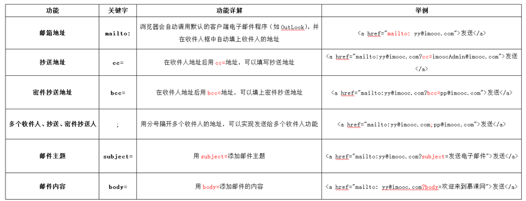
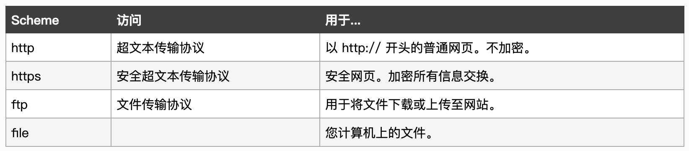
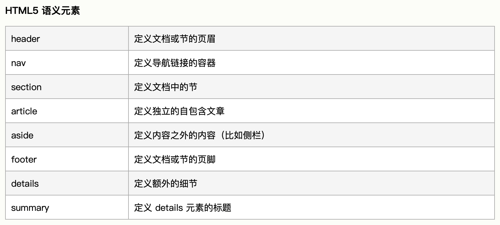

# Html学习笔记

简介：本文为Html学习笔记，完整笔记详见[Github](https://github.com/MrEnvision/Front-end_learning_notes)

作者：[Envision](https://github.com/MrEnvision)         联系邮箱：[EnvisionShen@gmail.com](mailto:EnvisionShen@gmail.com)


## 目录：

[基础语法](#基础语法)     [块级元素或内联元素](#块级元素或内联元素)    [文本格式化](#文本格式化)     ["计算机输出"标签](#\"计算机输出\"标签)     [引用、引用和术语定义](#引用\、引用和术语定义)    [超链接](#超链接)    [图像](#图像)    [表格](#表格)    [列表](#列表)    [页面布局](#页面布局)     [框架](#框架)    [头部元素](#头部元素)    [字符实体](#字符实体)    [URL地址](#URL地址)    [站点增加自定义图标](#站点增加自定义图标)     [href与src的区别](#href与src的区别)    [时间的表示](#时间的表示)    [HTML中的图片](#HTML中的图片)   [视频和音频内容](#视频和音频内容)     [在网页中添加矢量图形](#在网页中添加矢量图形)    [图片自适应](#图片自适应)    [表单 - 基础](#表单\-基础)    [表单 - 发送](#表单\-发送)      [表单 - 校验](#表单\-校验)    [音频/视频](#音频视频)    [网站布局-Html5语义](#网站布局\-Html5语义)


### 基础语法

```html
# 注释 <!-- -->
# 标题 <h1></h1>  to  <h6></h6>
# 连续标题 <hgroup><h1></h1><h2></h2></hgroup>
# 水平线 <hr>
# 段落 <p></P> 注：浏览器自动地在段落的前后添加空行。
# 换行 <br />
# 样式 <style type="text/css" ></style>
```


### 块级元素或内联元素

```html
块级元素 - 以新行来开始（和结束）
# 块级元素宽度在不设置的情况下，是它本身父容器的100%（和父元素的宽度一致），除非设定一个宽度。
# 块级元素的高度、宽度、行高以及顶和底边距都可设置。
<div>, <h1>, <p>, <ul>, <table>

内联元素 - 不以新行来开始（和结束）
# 内联元素的宽度就是它包含的文字或图片的宽度，不可改变。
# 内联元素的高度、宽度及顶部和底部边距不可设置。
<span>, <b>, <td>, <a>, 
```


### 文本格式化

```html
# 定义粗体文本 <b></b>
# 定义大号字 <big><big>
# 定义着重文字 <em></em>
# 定义斜体字 <i></i>
# 定义小号字 <small></small>
# 定义加重语气 <strong></strong>
# 定义下标字 <sub></sub>
# 定义上标字 <sup></sup>
# 定义插入字 <ins></ins>
# 定义删除字 <del></del>
```


### "计算机输出"标签

```html
# 定义计算机代码（表示计算机源代码） <code></code>
# 定义变量（表示变量名称，或用户提供值） <var></var>
# 定义预格式文本（编辑器的格式就是显示的格式） <pre></pre>
注：code元素不保留多余的空格和折行，可使用pre
```


### 引用、引用和术语定义

```html
# 定义短引用（显示带“”） <q></q>
# 定义首字母缩写（显示会缩进） <blockquote></blockquote>
# 定义缩写(例如WHO) <abbr></abbr>
# 定义地址联系方式(显示为斜体) <address></address>
# 定义著作标题 <cite></cite>
```


### 超链接

```html
# 通过使用 href 属性
<a href="url">Link text</a>

# 定位锚(id代替name同样)
<div id="tips"></div>
<a href="#tips">有用的提示</a>
注：其他页面也可定位至该锚 <a href="http://www.fourdays.top#tips">定位至fourdays页面的锚tips</a>
(若浏览器找不到已定义的命名锚，那么就会定位到文档的顶端)

# 使用title属性，鼠标暂停一会时间会显示
<a href="www.fourdays.top" title="this is shen's personal website">hello</a>

# 邮件连接 格式 - mailto:地址
<a href="mailto:nowhere@mozilla.org">Send email to nowhere</a>
# 邮件连接 - 任何标准的邮件头字段都可以被添加到邮件URL中
<a href="mailto:邮件地址?cc=抄送地址1&bcc=暗抄送地址&subject=主题&body=主体">Send mail with cc, bcc, subject and body</a>

# <base> 标签为页面上的所有相对链接规定默认地址或默认目标。⚠️base标签位于head内部，而不是body
<base href="http://www.hello.com" target="_blank"> 所有链接都为这个

注1:尽可能使用相对链接。因为使用绝对链接时浏览器首先通过DNS查找服务器的真实位置，然后再转到该服务器并查找所请求的文件，额外的工作导致效率降低。
```

邮件：




### 图像

```html
# 基础

注：src为图片地址，alt为图片未显示时的替换文本

# 图片定位链接-可在图片不同位置跳转至不同链接

<map name="mymap">
    <area shape="rect" coords="0,0,50,50" href="url1" /> 
    <area shape="circle" coords="75,75,25" href="url2" /> 
</map>
```


### 表格

1、基本结构

```html
<table>
    # 标题
    <caption></caption>
    # 表头
    <thread>
    <tr>
        <th></th>
        <th></th>
     </tr>
    </thread>
    # 内容
    <tbody>
    <tr>
        <td></td>
        <td></td>
    </tr>
    </tbody>
    # 表尾
    <tfoot>
    </tfoot>
</table>
```

2、为表格中的列提供共同的样式

```html
# 采用<col>和<colgroup>元素，每一个<col>都会制定每列的样式
<table>
  <colgroup>
    <col stylr="background-color: red">
    <col style="background-color: yellow">
  </colgroup>
  <tr>
    <th>Data 1</th>
    <th>Data 2</th>
  </tr>
  <tr>
    <td>Calcutta</td>
    <td>Orange</td>
  </tr>
</table>

# 想把样式信息应用到每一列，可以只使用一个 <col> 元素，并包含 span 属性
<colgroup>
  <col style="background-color: yellow" span="2">
</colgroup>
```

3、允许单元格跨越多行和列

```html
<!-- 
	colspan属性：占据n个单元格宽度
	rowspan属性：占据n个单元格高度
-->
<table>
    <tr>
        <th colspan="2">Animals</th>
    </tr>
    <tr>
        <th colspan="2">Hippopotamus</th>
    </tr>
    <tr>
        <th rowspan="2">Horse</th>
        <td>Mare</td>
    </tr>
    <tr>
        <td>Stallion</td>
    </tr>
    <tr>
        <th colspan="2">Crocodile</th>
    </tr>
    <tr>
        <th rowspan="2">Chicken</th>
        <td>Hen</td>
    </tr>
    <tr>
        <td>Rooster</td>
    </tr>
</table>
```

结果如下：


### 列表

```html
# 无序列表
<ul>
    <li></li>
    <li></li>
</ul>
# 有序列表
<ol>
    <li></li>
    <li></li>
</ol>
# 定义列表 - dt表列表项，dd表列表项定义，浏览器的默认样式会在描述部分（description description）和描述术语（description terms）之间产生缩进。
<dl>
    <dt>Coffee</dt>
    <dd>Black hot drink</dd>
</dl>
```

定义列表可用于如下例子：


### 页面布局

```html
方式一：使用 <div> 元素的 HTML 布局

方式二：使用 HTML5 的网站布局
# 定义文档或节的页眉
<header></header>
# 定义导航链接的容器
<nav></nav>
# 定义文档中的节
<section></section>
# 定义独立的自包含文章
<article></article>
# 定义内容之外的内容（比如侧栏）
<aside></aside>
# 定义文档或节的页脚
<footer></footer>
# 定义额外的细节
<details></details>
# 定义 details 元素的标题
<summary></summary>
```


### 框架

```html
# 在网页内显示网页
<iframe src="URL"></iframe>
# iframe作为链接的目标，点击链接iframe显示链接的内容 - 通过name属性
<iframe src="http://wwww.baidu.com" name="iframe_a"></iframe>
<a href="http://www.w3school.com.cn" target="iframe_a">W3School.com.cn</a>
# 内部元素表示不支持的时候显示的内容
<iframe src="地址1" width="100%" height="500" frameborder="0" allowfullscreen sandbox>
  <p> <a href="地址1">Fallback link for browsers that don't support iframes</a></p>
</iframe>
```

属性说明：
1、frameborder="0" - 移除边框
2、height/width - 规定高和宽
3、allowfullscreen - 可以通过全屏API设置为全屏模式
4、sandbox - 见文档


### 头部元素

```html
<head></head>可添加元素：<title>、<base>、<link>、<meta>、<script> 以及 <style>

1、<title> 标签定义文档的标题
<title>Title of the document</title>

2、<base> 标签为页面上的所有链接规定默认地址或默认目标(target)
<base href="http://www.w3school.com.cn/images/" />
<base target="_blank" />

3、<link> 标签定义文档与外部资源之间的关系
<link rel="stylesheet" type="text/css" href="mystyle.css" />

4、<style> 标签用于为 HTML 文档定义样式信息
<style type="text/css">
    body {background-color:yellow}
</style>

5、<meta> 标签提供关于 HTML 文档的元数据。
<meta name="author" content="Chris Mills">
<meta name="description" content="Free Web tutorials on HTML, CSS, XML" />
meta 元素被用于规定页面的描述、关键词、文档的作者、最后修改时间以及其他元数据；
元数据可用于浏览器（如何显示内容或重新加载页面），搜索引擎（关键词），或其他 web 服务。

6、<script> 标签用于定义客户端脚本，比如 JavaScript。
<script>
    alert("hello")
</script>
```


### 字符实体


### URL地址

 scheme://host.domain:port/path/filename

- scheme - 定义因特网服务的类型。最常见的类型是 http
- host - 定义域主机（http 的默认主机是 www）
- domain - 定义因特网域名，比如 w3school.com.cn
- :port - 定义主机上的端口号（http 的默认端口号是 80）
- path - 定义服务器上的路径（如果省略，则文档必须位于网站的根目录中）。
- filename - 定义文档/资源的名称

主流schemes




### 站点增加自定义图标

```html
# 举例
<!-- third-generation iPad with high-resolution Retina display: -->
<link rel="apple-touch-icon-precomposed" sizes="144x144" href="https://developer.cdn.mozilla.net/static/img/favicon144.a6e4162070f4.png">
<!-- iPhone with high-resolution Retina display: -->
<link rel="apple-touch-icon-precomposed" sizes="114x114" href="https://developer.cdn.mozilla.net/static/img/favicon114.0e9fabd44f85.png">
<!-- first- and second-generation iPad: -->
<link rel="apple-touch-icon-precomposed" sizes="72x72" href="https://developer.cdn.mozilla.net/static/img/favicon72.8ff9d87c82a0.png">
<!-- non-Retina iPhone, iPod Touch, and Android 2.1+ devices: -->
<link rel="apple-touch-icon-precomposed" href="https://developer.cdn.mozilla.net/static/img/favicon57.a2490b9a2d76.png">
<!-- basic favicon -->
<link rel="shortcut icon" href="https://developer.cdn.mozilla.net/static/img/favicon32.e02854fdcf73.png">
```


### href与src的区别

href 用于在当前文档和引用资源之间确立联系；

```html
<link href="style.css" rel="stylesheet" />
```

src 用于替换当前内容；

```html
<script src="script.js"></script>
```


### 时间的表示

```html
<!-- 标准简单日期 -->
<time datetime="2016-01-20">20 January 2016</time>
<!-- 只包含年份和月份-->
<time datetime="2016-01">January 2016</time>
<!-- 只包含月份和日期 -->
<time datetime="01-20">20 January</time>
<!-- 只包含时间，小时和分钟数 -->
<time datetime="19:30">19:30</time>
<!-- 还可包含秒和毫秒 -->
<time datetime="19:30:01.856">19:30:01.856</time>
<!-- 日期和时间 -->
<time datetime="2016-01-20T19:30">7.30pm, 20 January 2016</time>
<!-- 含有市区偏移值的日期时间 -->
<time datetime="2016-01-20T19:30+01:00">7.30pm, 20 January 2016 is 8.30pm in France</time>
<!-- 调用特定的周 -->
<time datetime="2016-W04">The fourth week of 2016</time>
```


### HTML中的图片

1、备选文本-alt属性——表示对图片的文字描述，用于在图片无法显示或不能被看到的情况。
2、关于图片的尺寸，如果需要改变图片的尺寸，应该使用CSS而不是HTML。
3、区别于CSS背景图片background-image：如果图像对您的内容里有意义，则应使用HTML图像。 如果图像纯粹是装饰，则应使用CSS背景图片。
4、为图片添加说明文字，舍弃使用``与`<p></p>`组合，采用`<figure>` 和 `<figcaption>`，建立图片与标题之间的语义。

```html
# 注意：figure可以是几张图片、一段代码、音视频、方程、表格或别的。
<figure>
  
  <figcaption>一只霸王龙的化石</figcaption>
</figure>

```


### 视频和音频内容

1、视频`<video>`标签

```html
# controls 用户能够控制视频和音频的回放功能。
# <video>标签内的段落，当不支持video时则会显示。
<video src="地址" controls>
    <p>你的浏览器不支持 HTML5 视频。可点击<a href="地址">此链接</a>观看</p>
</video>

# 当需要适配不同浏览器对不同格式视频的支持情况时
<video controls>
  <source src="rabbit320.mp4" type="video/mp4">
  <source src="rabbit320.webm" type="video/webm">
  <p>你的浏览器不支持 HTML5 视频。可点击<a href="rabbit320.mp4">此链接</a>观看</p>
</video>

# 针对循环播放loop，立即播放autoplay，关闭声音播放muted，广告poster（显示在视频播放之前），缓冲preload等均具有对应的属性
```


### 在网页中添加矢量图形

SVG添加到页面的方法：

1、``标签

```html

```

缺点：

- 无法使用JavaScript操作图像
- 如果要使用CSS控制SVG内容，则必须在SVG代码中包含内联CSS样式。 （从SVG文件调用的外部样式表不起作用）
- 不能用CSS伪类来重设图像样式（如:focus）

2、`<svg>`标签 —— 文本编辑器中打开SVG文件，复制SVG代码，并将其粘贴到HTML文档中

```html
<svg width="300" height="200">
    <rect width="100%" height="100%" fill="green" />
</svg>
```

3、`<iframe>`标签嵌入 - 不建议

```html
<iframe src="triangle.svg" width="500" height="500" sandbox>
    
</iframe>
```


### 图片自适应

存在问题：

1、艺术方向问题(当网站在狭窄的屏幕上观看时，显示一幅图片的包含了重要细节的裁剪版本)

2、分辨率切换问题(不同分辨率的设备，选择适合分辨率的图片进行显示)

解决方案：

1、艺术方向问题

采用`<picture></picture>`标签——`<picture>`素包含了一些`<source>`元素，它使浏览器在不同资源间做出选择，紧跟着的是最重要的``元素。

- `<picture></picture>`标签中必须提供一个``元素以及它的src和alt属性，否则不会有图片显示。
- source的media属性包含媒体条件进行判断，srcset属性包含显示图片的路径。

```html
<picture>
  <source media="(max-width: 799px)" srcset="elva-480w-close-portrait.jpg">
  <source media="(min-width: 800px)" srcset="elva-800w.jpg">
  
</picture>
```

2、分辨率切换问题

利用srcset 和 sizes属性——来提供更多额外的资源图像和提示，帮助浏览器选择正确的一个资源

- srcset：文件名+空格+图像固有宽度（以像素为单位）
- sizes：一个媒体条件+空格+当媒体条件为真时，图像将填充的“槽的宽度”（选择“图像固有宽度”最接近的“槽的宽度”的图片）

```html

```

通过srcset和x语法结合的方式，而不用sizes（**<u>更加常用</u>**）

```html

```


### 表单-基础

1、基础形式

```html
# action属性定义了在提交表单时,应该把所收集的数据送给谁(/那个模块)(URL)去处理
# method属性定义了发送数据的HTTP方法(它可以是“get”或“post”).
# 其中get方法用户可以在url中看到
# label标签的for可以与input标签的id相互绑定，这样就允许用户单击标签以激活相应的小部件
# button标签的type属性有三类：submit、reset、button，其中button提交表单的方式还可以<input type="submit">
<form action="/my-handling-form-page" method="post">
    <div>
        <label for="name">Name:</label>
        <input type="text" id="name" name="user_name"/>
    </div>
    <div>
        <label for="mail">E-mail:</label>
        <input type="email" id="mail" name="user_email"/>
    </div>
    <div>
        <label for="msg">Message:</label>
        <textarea id="msg" name="user_message"></textarea>
    </div>
    <div class="button">
        <button type="submit">Send your message</button>
    </div>
</form>
```

2、`<fieldset> `和` <legend>` 元素

```html
# <fieldset>元素是一种方便的用于创建具有相同目的的小部件组的方式，出于样式和语义目的。 <legend>元素来给<fieldset> 标上标签，其文本内容正式地描述<fieldset>的用途
<form>
  <fieldset>
    <legend>Fruit juice size</legend>
    <p>
      <input type="radio" name="size" id="size_1" value="small">
      <label for="size_1">Small</label>
    </p>
    <p>
      <input type="radio" name="size" id="size_2" value="medium">
      <label for="size_2">Medium</label>
    </p>
    <p>
      <input type="radio" name="size" id="size_3" value="large">
      <label for="size_3">Large</label>
    </p>
  </fieldset>
</form>
```

3、基础组件

```html
# 单行文本域
<input type="text" id="comment" name="comment" value="I'm a text field">
 
# Email - multiple属性表示允许输入多个电子邮件地址(以逗号分隔)
<input type="email" id="email" name="email" multiple>

# 密码
<input type="password" id="pwd" name="pwd">

# 搜索域
<input type="search" id="search" name="search">

# 电话号码域
<input type="tel" id="tel" name="tel">

# URL域
<input type="url" id="url" name="url">

# 多行文本域
<textarea rows="行数" cols="列数"></textarea>

# 自动补全输入框
<label for="myFruit">What's your favorite fruit?</label>
<input type="text" name="myFruit" id="myFruit" list="mySuggestion">
<datalist id="mySuggestion">
  <option>Apple</option>
  <option>Banana</option>
  <option>Blackberry</option>
  <option>Blueberry</option>
  <option>Lemon</option>
  <option>Lychee</option>
  <option>Peach</option>
  <option>Pear</option>
</datalist>

# 单选按钮
<input type="radio" checked id="soup" name="meal">
注：几个单选按钮可以连接在一起。如果它们的name属性共享相同的值，那么它们将被认为属于同一组的按钮。同一组中只有一个按钮可以同时被选；这意味着当其中一个被选中时，所有其他的都将自动未选中。如果没有选中任何一个，那么整个单选按钮池就被认为处于未知状态，并且没有以表单的形式发送任何值。
<fieldset>
  <legend>What is your favorite meal?</legend>
  <ul>
    <li>
      <label for="soup">Soup</label>
      <input type="radio" checked id="soup" name="meal" value="soup">
    </li>
    <li>
      <label for="curry">Curry</label>
      <input type="radio" id="curry" name="meal" value="curry">
    </li>
    <li>
      <label for="pizza">Pizza</label>
      <input type="radio" id="pizza" name="meal" value="pizza">
    </li>
  </ul>
</fieldset>

# 按钮
<button></button> type属性分三种：submit、reset、button
<input type="reset" value="重置（按钮上显示文字）">
<input type="submit" value="提交（按钮上显示文字）">

# 数字
<input type="number" name="age" id="age" min="1" max="10" step="2">
注：通过设置min和max属性来约束该值；通过设置step属性来指定增加和减少按钮更改小部件的值的数量。

# 滑块
<input type="range" name="beans" id="beans" min="0" max="500" step="10">

# 日期时间选择器
<input type="datetime-local" name="datetime" id="datetime">
注意：type分为date、datetime-local、month、time、week
<input type="date" name="myDate" min="2013-06-01" max="2013-08-31" id="myDate">
注意：所有日期和时间控制都可以使用min和max属性来约束。
```

```html
# 单选框
<input type="radio" id="sp_type" name="p_type" value="single" checked="checked">
<input type="radio" id="dp_type" name="p_type" value="some"   style="width: 10px;">
<input type="radio" id="fp_type" name="p_type" value="family"   style="width: 10px;">
# 复选框
<input type="checkbox" checked id="carrots" name="carrots" value="carrots">
<input type="checkbox" checked id="carrots" name="carrots" value="family">
<input type="checkbox" checked id="carrots" name="carrots" value="single">

注：同一组的单选按钮，name 取值一定要一致，checked="checked"/>文本则该文本在显示时默认选择
```

```html
# 选择框-下拉框
<select id="simple" name="simple">
  <option value="提交值">Banana</option>
  <option value="提交值">Cherry</option>
  <option value="提交值" selected="selected">Lemon</option>
</select>
注：也可将选项进行分组，利用<optgroup>
<select id="groups" name="groups">
  <optgroup label="fruits">
    <option>Banana</option>
    <option selected>Cherry</option>
    <option>Lemon</option>
  </optgroup>
  <optgroup label="vegetables">
    <option>Carrot</option>
    <option>Eggplant</option>
    <option>Potato</option>
  </optgroup>
</select>

# 多选选择框 - 使用multiple
<select multiple id="multi" name="multi">
  <option>Banana</option>
  <option>Cherry</option>
  <option>Lemon</option>
</select>
```


注：如果一个`<option>`元素设置了value属性，那么当提交表单时该属性的值就会被发送。如果忽略了value属性，则使用`<option>`元素的内容作为选择框的值。


### 表单-发送

1、基本发送

```html
# 关键属性action和method。
# action表示发送数据要去的位置ur；method表示发送类型，分为get和post，get的表单内容显示在url中
<form action="http://foo.com" method="post"></form>

```

2、文件发送

```html
# 使用enctype属性，一般默认为application/x-www-form-urlencoded，改为multipart/form-data
<form method="post" enctype="multipart/form-data"></form>
```

3、服务器处理准则

永远不要相信你的用户，包括你自己；即使是一个值得信赖的用户也可能被劫持。所有到达服务器的数据都必须经过检查和消毒。

- 有潜在危险的字符转义。应该如何谨慎使用的特定字符取决于所使用的数据的上下文和所使用的服务器平台，但是所有的服务器端语言都有相应的功能。
- 限制输入的数据量，只允许有必要的数据。
- 沙箱上传文件(将它们存储在不同的服务器上，只允许通过不同的子域访问文件，或者通过完全不同的域名访问文件更好)。


### 表单-校验

在真实的项目开发过程中，开发者一般都倾向于使用客户端校验与服务器端校验的组合校验方式以更好的保证数据的正确性与安全性。

1、Html5的新功能：通过表单元素的校验属性实现表单校验。

```html
# required 属性 - 输入是必需的，若没有输入，该表单将不会提交（并将显示错误消息）。
<input id="choose" name="i_like" required>

# pattern 属性 - 结合正则表达式
 <input id="choose" name="i_like" required pattern="banana|cherry">
 
 # minlength 和 maxlength 属性 - 用于强制条目的长度
 <input id="choose" name="i_like" required minlength="6" maxlength="6">
```

2、javascript校验表单

略


### 音频/视频

1、音频 - audio

```html
# control属性添加播放、暂停、音量控件
<audio src="输入文件地址" controls>浏览器不支持(浏览器不支持的时候显示)</audio>
# 多文件供浏览器支持
<audio controls>
    <source src="输入文件地址">
    <source src="输入文件地址">
</audio>
```

2、视频 - video

```html
# control属性添加播放、暂停、音量控件，比音频audio多了width和height属性
<video src="输入文件地址" controls width="400px" height="400px">浏览器不支持(浏览器不支持的时候显示)</video>
# 多文件供浏览器支持
<video controls>
    <source src="输入文件地址">
    <source src="输入文件地址">
</video>
```


### 网站布局-Html5语义




------

如果发现本项目有错误，欢迎提交 issues 指正。

