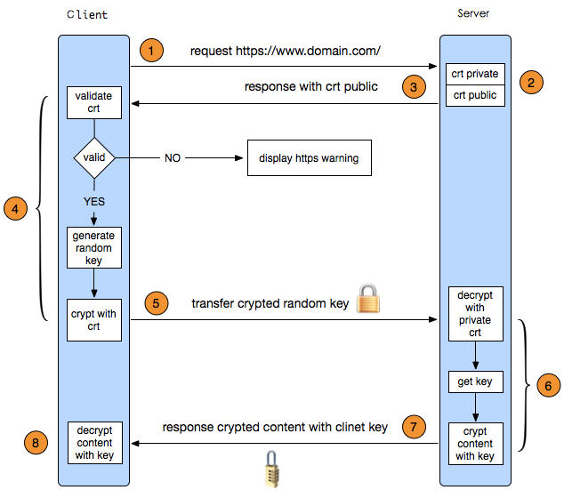

# Https

简介：本文为Https笔记，完整笔记详见[Github](https://github.com/MrEnvision/Front-end_learning_notes)

作者：[Envision](https://github.com/MrEnvision)         联系邮箱：[EnvisionShen@gmail.com](mailto:EnvisionShen@gmail.com)

> http默认采用80作为通讯端口，对于传输采用不加密的方式，https默认采用443，对于传输的数据进行加密传输。

## 1、概念

**HTTPS协议 = HTTP协议 + SSL/TLS协议**，在HTTPS数据传输的过程中，需要用SSL/TLS对数据进行加密和解密，需要用HTTP对加密后的数据进行传输，由此可以看出HTTPS是由HTTP和SSL/TLS一起合作完成的。

**SSL**的全称是Secure Sockets Layer，即安全套接层协议，是为网络通信提供安全及数据完整性的一种安全协议。

**TLS**的全称是Transport Layer Security，即安全传输层协议，最新版本的TLS（Transport Layer Security，传输层安全协议）是IETF（Internet Engineering Task Force，Internet工程任务组）制定的一种新的协议，它建立在SSL 3.0协议规范之上，是SSL 3.0的后续版本。在TLS与SSL3.0之间存在着显著的差别，主要是它们所支持的加密算法不同，所以TLS与SSL3.0不能互操作。虽然TLS与SSL3.0在加密算法上不同，但是在我们理解HTTPS的过程中，我们可以把SSL和TLS看做是同一个协议。

## 2、过程

HTTPS在传输的过程中会涉及到三个密钥：

 - 服务器端的公钥和私钥，用来进行非对称加密
 - 客户端生成的随机密钥，用来进行对称加密

一个HTTPS请求实际上包含了两次HTTP传输，可以细分为8步。

1. 客户端向服务器发起HTTPS请求，连接到服务器的443端口
2. 服务器端有一个密钥对，即公钥和私钥，是用来进行非对称加密使用的，服务器端保存着私钥，不能将其泄露，公钥可以发送给任何人。
3. 服务器将自己的公钥发送给客户端。
4. 客户端收到服务器端的公钥之后，会对公钥进行检查，验证其合法性，如果发现发现公钥有问题，那么HTTPS传输就无法继续。严格的说，这里应该是验证服务器发送的数字证书的合法性。如果公钥合格，那么客户端会生成一个随机值，这个随机值就是用于进行对称加密的密钥，我们将该密钥称之为client key，即客户端密钥，这样在概念上和服务器端的密钥容易进行区分。然后用服务器的公钥对客户端密钥进行非对称加密，这样客户端密钥就变成密文了，至此，HTTPS中的第一次HTTP请求结束。
5. 客户端会发起HTTPS中的第二个HTTP请求，将加密之后的客户端密钥发送给服务器。
6. 服务器接收到客户端发来的密文之后，会用自己的私钥对其进行非对称解密，解密之后的明文就是客户端密钥，然后用客户端密钥对数据进行对称加密，这样数据就变成了密文。
7. 然后服务器将加密后的密文发送给客户端。
8. 客户端收到服务器发送来的密文，用客户端密钥对其进行对称解密，得到服务器发送的数据。这样HTTPS中的第二个HTTP请求结束，整个HTTPS传输完成。

------

如果发现本项目有错误，欢迎提交 issues 指正。

