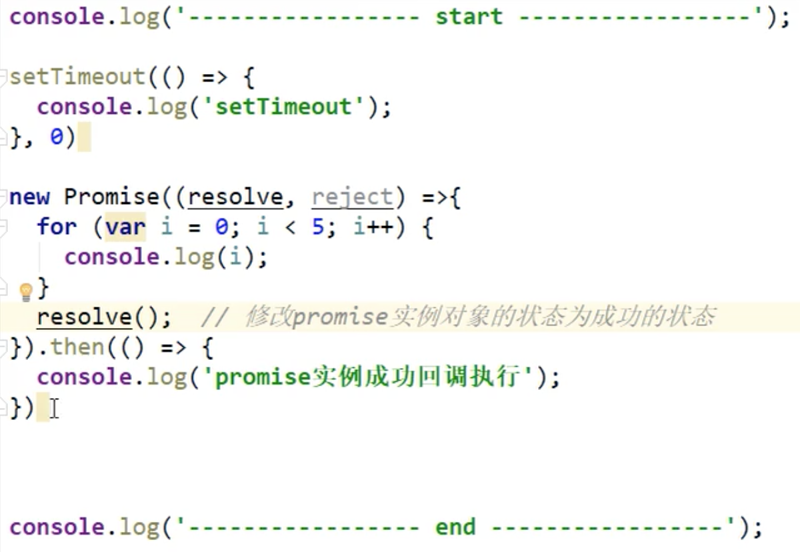
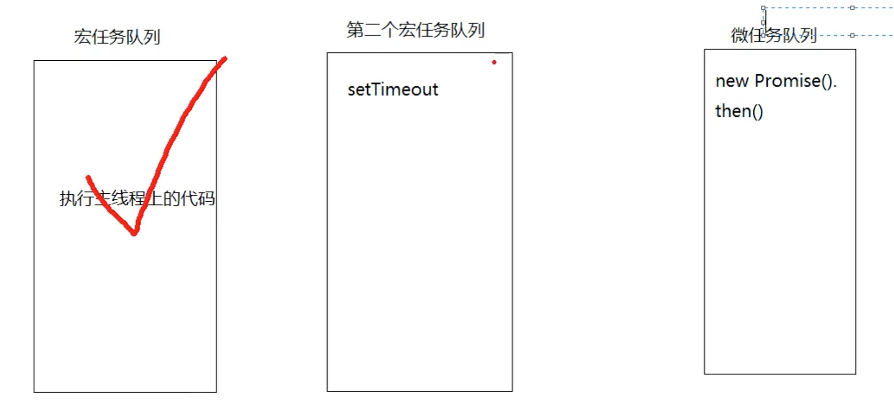

# 微任务和宏任务

简介：本文为微任务和宏任务笔记，完整笔记详见[Github](https://github.com/MrEnvision/Front-end_learning_notes)

作者：[Envision](https://github.com/MrEnvision)         联系邮箱：[EnvisionShen@gmail.com](mailto:EnvisionShen@gmail.com)

## 简介

注意点：1：执行主线程的js代码也是一个宏任务；2：宏任务执行完会去执行所有的微任务（如果有的话）

分类：

- **宏任务**：script的代码、setTimeout、setInterval、requestAnimationFrame、postMessage等
- **微任务**：Promise.then、await后面的代码、process.nextTick

## 举例

题目：

分析：

结果： 

> ————start—————
> 0
> 1
> 2
> 3
> 4
> —————end—————
> promise执行成功
> setTimeout

------

如果发现本项目有错误，欢迎提交 issues 指正。