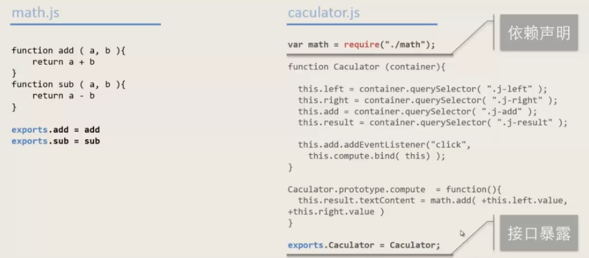

# 模块化

简介：本文为模块化笔记，完整笔记详见[Github](https://github.com/MrEnvision/Front-end_learning_notes)

作者：[Envision](https://github.com/MrEnvision)         联系邮箱：[EnvisionShen@gmail.com](mailto:EnvisionShen@gmail.com)


## 1、基础概念

> 许多语言都具有模块支持，如python通过import导入模块，CSS通过@import导入模块，但是JS语言没有模块支持，即不同JS文件之间不能直接通过如import这样的语言进行导入使用。

模块的职责：

- 封装实现
- 暴露接口
- 声明依赖

模块系统的职责：

- 依赖管理 - 加载/分析/注入/初始化
- 决定模块写法


## 2、传统方法

> 目前解决方法最主要的有 CommonJS 和 AMD 两种，前者用于服务器，后者用于浏览器。而ES6 在语言标准的层面上，实现了模块功能，从而目前主要采用ES6module方式

### 2.1 Commonjs



不直接支持浏览器环境，因此前端需要利用其他软件，如browserfly，webpack等进行打包。

### 2.2 AMD（异步加载模块）


通过Simplified CommonJs Warpping可类似于CommonJs


## 3、ES6 module


主要有2个命令构成：`export`和`import`。`export`命令用于规定模块的对外接口，`import`命令用于输入其他模块提供的功能。

### 3.1 export

> 一个模块就是一个独立的文件。该文件内部的所有变量，外部无法获取。如果你希望外部能够读取模块内部的变量、函数或类（class），就必须使用`export`关键字输出该变量。

```javascript
const name = 'Michael';
function a(){}

export {name, a};

// 也可以使用重命名类似python的import a as newName
export {
  name as newName,
  a as newA
};
```

### 3.2 import

> 使用`export`命令定义了模块的对外接口以后，其他 JS 文件就可以通过`import`命令加载这个模块。

```javascript
import { firstName, lastName, year } from './profile.js';

function setName(element) {
  element.textContent = firstName + ' ' + lastName;
}

// 同样可以使用重命名
import { firstName as newName , lastName as newName2 , year } from './profile.js';

// 使用*来指定一个对象作为整体加载
import * as newModule from './circle';
function setName(element) {
  element.textContent = newModule.firstName + ' ' + newModule.lastName;
}
```

> 使用`import`命令的时候，用户需要知道所要加载的变量名或函数名，以{}的形式加载。可以采用到`export default`命令，为模块指定默认输出。

```javascript
// export-default.js
export default function () {
  console.log('foo');
}

// import-default.js
import customName from './export-default';
customName(); // 'foo'

// 注意一个模块只能有一个默认输出，因此export default命令只能使用一次
```

### 3.3 export 与 import 的复合写法 

```javascript
export { foo, bar } from 'my_module';

// 可以简单理解为
import { foo, bar } from 'my_module';
export { foo, bar };

// export *，表示再输出circle模块的所有属性和方法，实现了模块的继承
export * from 'circle';
```


## 4、Module加载

### 4.1 浏览器加载

```html
<!-- 传统外部脚本通过application/javascript加载，默认是省略的 -->
<script type="application/javascript" src="path/to/myModule.js">

<!-- 模块脚本通过module加载，默认是省略的 -->
<script type="module" src="./foo.js"></script>

```

### 4.2 Nodejs加载

区别于Commonjs：

- CommonJS 模块输出的是一个值的拷贝，ES6 模块输出的是值的引用。
- CommonJS 模块是运行时加载，ES6 模块是编译时输出接口。

具体参看教程[Node-js-加载](https://es6.ruanyifeng.com/#docs/module-loader#Node-js-加载)。

### 4.3 循环加载

> “循环加载”（circular dependency）指的是，`a`脚本的执行依赖`b`脚本，而`b`脚本的执行又依赖`a`脚本。

其解决方法具体参考教程[循环加载](https://es6.ruanyifeng.com/#docs/module-loader#循环加载)。


## 5、总结

1、CommonJS —— exports和require

```javascript
// 模块文件
// 导出模块：exports.XXX = XXX;
exports.add = function(a,b){return a+b};

// 引用文件
// 引入模块：XXX = require('/filePath');
let module = require('module.js');
console.log(module.add(1,2));
```

2、AMD/RequireJS + CMD/SeaJS

> define和require方法，参考链接：[RequireJS和AMD规范](https://www.cnblogs.com/ghw0501/p/4796922.html) [谈谈Js前端模块化规范](https://segmentfault.com/a/1190000015991869)

3、ES6 Module —— export和import

```javascript
// 模块文件
let name = 'envision';
function v1() { ... }
function v2() { ... }

export {
	name,
  v1,
  v2 as func1,
};
               
// 引用文件
import {name as newName, v1, func1} from './mudule.js';
console.log(newName);
v1();
func1();
// 或者整体加载
import * as mod from './mudule.js';
console.log(mod.name);
mod.v1();
mod.func1();
```

注：浏览器使用`<script type="module" src="foo.js"></script>`需要设定type，参考链接: [ES6 module](http://caibaojian.com/es6/module.html)


------

如果发现本项目有错误，欢迎提交 issues 指正。