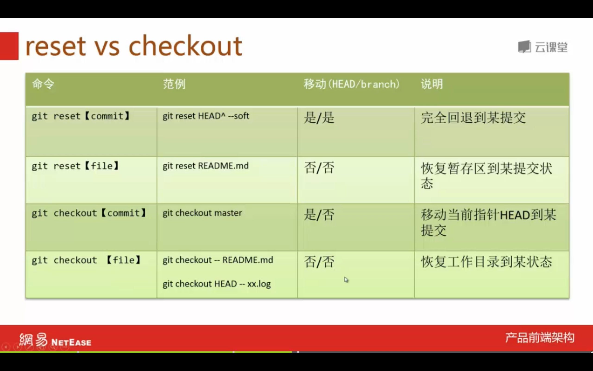

# Git学习笔记

简介：本文为Git学习笔记，完整笔记详见[Github](https://github.com/MrEnvision/Front-end_learning_notes)

作者：[Envision](https://github.com/MrEnvision)         联系邮箱：[EnvisionShen@gmail.com](mailto:EnvisionShen@gmail.com)

参考资料：[猴子都能懂的Git入门](https://backlog.com/git-tutorial/cn/)   [Git简明指南](http://rogerdudler.github.io/git-guide/index.zh.html)   [Pro Git Book](https://www.kancloud.cn/kancloud/progit/70158)   [try github](http://try.github.com)   [Git命令-博客](https://blog.csdn.net/qq_33384065/article/details/81909754)   [Git教程-菜鸟教程](https://www.runoob.com/git/git-tutorial.html)   [Git教程-廖雪峰教程](https://www.liaoxuefeng.com/wiki/896043488029600) 


## 1、Git安装

>安装-参考教程: [1](https://www.jianshu.com/p/7edb6b838a2e) [2](https://www.cnblogs.com/zheng577564429/p/8317524.html) [3](https://www.runoob.com/git/git-install-setup.html)

```shell
# 查看是否已安装git
$ git
# 设置username和email
$ git config --global user.name "MrEnvision"
$ git config --global user.email "306407158@qq.com"
# 创建ssh key
$ ssh-keygen -t rsa -C "306407158@qq.com"
# 查看key - 将其复制至github的Settings的New SSH key中
$ cat .ssh/id_rsa.pub
# 验证是否连接成功
ssh -T git@github.com 
```

## 2、常用命令


```shell
# 确认工作树和索引的状态
$ git status

# -----------------增加文件-----------------
# 添加指定文件到暂存区
$ git add [file1][file2] …
# 添加指定目录到暂存区，包括子目录
$ git add [dir]
# 添加当前目录的所有文件到暂存区
$ git add .

# -----------------仓库提交-----------------
# 提交暂存区到仓库区
$ git commit -m [message]
# 提交暂存区的指定文件到仓库区
$ git commit[file1] [file2] … -m [message]
# 提交工作区自上次commit之后的变化，直接到仓库区
$ git commit -a
# 提交时显示所有diff信息
$ git commit -v

# 查看提交记录
$ git log
```

⚠️注意：1) 文件修改只是在暂存区，要使用commit命令提交到仓库才有效！2) 版本控制系统，只能跟踪文本文件的改动，比如TXT文件，网页，所有的程序代码等等，而图片、视频等二进制文件，虽然也能由版本控制系统管理，但没法跟踪文件的变化。

## 3、分支操作（重要）

> 在公司进行开发，往往需要多人在多个分支进行开发，因此学习分支操作非常重要！

### 3.1 合并分支

> 合并分支有2种方法：使用merge或rebase。


使用merge合并的结果：


使用rebase合并的结果：


- **merge** _ 保持修改内容的历史记录，但是历史记录会很复杂。

```shell
$ git merge <branchname>
# 注意若存在冲突，处理完冲突后使用下面语句
$ git commit -m [message]
```

- **rebase** _ 历史记录简单，是在原有提交的基础上将差异内容反映进去，可能导致原本的提交内容无法正常运行。

```shell
$ git rebase <branchname>
# 注意若存在冲突，处理完冲突后使用下面语句
$ git rebase --continue
```

### 3.2 其他操作

```shell
# 创建分支
$ git branch <branchname>
# 查看分支
$ git branch
# 切换分支
$ git checkout <branchname>
# 删除分支
$ git branch -d <branchname>
```

## 4、冲突解决

> 注意，push到远程数据库之前需要先pull一下，可能存在远程数据库存在冲突的情况，这个时候需要手动解决一下冲突，然后再push到远程数据库。

```
连猴子都懂的Git命令
add 把变更录入到索引中
<<<<<<< HEAD
commit 记录索引的状态
=======
pull 取得远端数据库的内容
>>>>>>> 4c0182374230cd6eaa93b30049ef2386264fe12a
```

说明：=======上面的是本地数据库内容，下面的是远程数据库内容，手动修改并删除多余的标示行以解决冲突，然后再次通过commit提交，最后再push至远程数据库。

## 5、远程仓库

```shell
# -----------本地仓库-->远程仓库----------
# 关联到远程仓库
$ git remote add origin git@github.com:MrEnvision/front-end-learning.git
# 获取远程库与本地同步合并（如果远程库不为空必须做这一步，否则后面的提交会失败）
$ git pull --rebase origin master
# 本地库的所有内容推送到远程库上，如下命令 - 第一次推送要加上 -u
$ git push -u origin master
# 后续本地提交，就只需通过如下命令
$ git push origin master

# 如果多人协作，此时远程仓库已更改，则需要先fetch+merge远程仓库再进行提交到远程仓库

# -----------远程仓库-->本地仓库----------
# 查看远程分支
$ git remote -v
# 从远程获取最新版本到本地(本地新建temp分支，将远程origin仓库的master分支代码下载到本地temp分支)
$ git fetch origin master:temp
# 比较本地仓库与下载的temp分支
$ git diff temp
# 若没什么问题，合并temp分支到本地的master分支
$ git merge temp
# 删除temp分支
$ git branch -d temp

# -----------------其他-----------------
# 下载远程仓库的所有变动
$ git fetch[remote]
# 显示所有远程仓库
$ git remote -v
# 显示某个远程仓库的信息
$ git remote show[remote]
# 增加一个新的远程仓库，并命名
$ git remote add[shortname] [url]
# 取回远程仓库的变化，并与本地分支合并
$ git pull[remote] [branch]
# 上传本地指定分支到远程仓库
$ git push[remote] [branch]
# 强行推送当前分支到远程仓库，即使有冲突
$ git push[remote] –force
# 推送所有分支到远程仓库
$ git push[remote] –all
```

## 6、撤销操作

checkout与reset区别：




------

如果发现本项目有错误，欢迎提交 issues 指正。