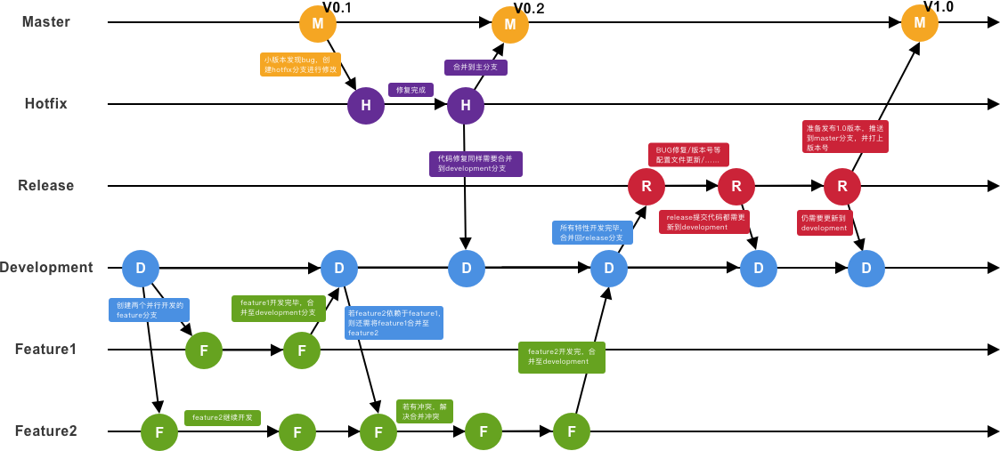

# Git学习笔记

简介：本位为Git使用，完整笔记详见[Github](https://github.com/MrEnvision/Front-end_learning_notes)

作者：[Envision](https://github.com/MrEnvision)         联系邮箱：[EnvisionShen@gmail.com](mailto:EnvisionShen@gmail.com)


## Git使用

***额外知识点***：[产品级分支模型](#10产品级分支模型)

### 1、Git安装

```shell
# 查看是否已安装git
$ git
# 设置username和email
$ git config --global user.name "MrEnvision"
$ git config --global user.email "306407158@qq.com"
# 创建ssh key
$ ssh-keygen -t rsa -C "306407158@qq.com"
# 查看key - 将其复制至github的Settings的New SSH key中
$ cat .ssh/id_rsa.pub
# 验证是否连接成功
ssh -T git@github.com 
```

⚠️备注：<u>passphrase - 960623</u>


教程参考：

1. https://www.jianshu.com/p/7edb6b838a2e
2. https://www.cnblogs.com/zheng577564429/p/8317524.html
3. https://www.runoob.com/git/git-install-setup.html


### 2、创建仓库Repository

```shell
# -----------------新建仓库-----------------
# 创建或进入项目文件夹
$ cd learngit
# 使项目变成git管理的仓库
$ git init
# -----------------克隆仓库-----------------
```


### 3、增加/删除/改名文件

```shell
# -----------------增加文件-----------------
# 添加指定文件到暂存区
$ git add [file1][file2] …
# 添加指定目录到暂存区，包括子目录
$ git add [dir]
# 添加当前目录的所有文件到暂存区
$ git add .

# -----------------删除文件-----------------
# 文件管理器中直接删除文件或rm命令删除
$ rm [file1]
# 若确实需要删除文件
$ git rm [file1][file2] …

# -----------------改名文件-----------------
$ git mv[file-originalname] [file-renamed]

# -----------------其他操作-----------------
git add -A  添加所有变化
git add -u  添加被修改(modified)和被删除(deleted)文件，不包括新文件(new)
git add .   添加新文件(new)和被修改(modified)文件，不包括被删除(deleted)文件
```

⚠️注意：1) 文件修改只是在暂存区，要使用commit命令提交到仓库才有效！2) 版本控制系统，只能跟踪文本文件的改动，比如TXT文件，网页，所有的程序代码等等，而图片、视频等二进制文件，虽然也能由版本控制系统管理，但没法跟踪文件的变化。


### 4、仓库提交

```shell
# 提交暂存区到仓库区
$ git commit -m [message]
# 提交暂存区的指定文件到仓库区
$ git commit[file1] [file2] … -m [message]
# 提交工作区自上次commit之后的变化，直接到仓库区
$ git commit -a
# 提交时显示所有diff信息
$ git commit -v
```


### 5、远程仓库

```shell
# -----------本地仓库-->远程仓库----------
# 关联到远程仓库
$ git remote add origin git@github.com:MrEnvision/front-end-learning.git
# 获取远程库与本地同步合并（如果远程库不为空必须做这一步，否则后面的提交会失败）
$ git pull --rebase origin master
# 本地库的所有内容推送到远程库上，如下命令 - 第一次推送要加上 -u
$ git push -u origin master
# 后续本地提交，就只需通过如下命令
$ git push origin master

# 如果多人协作，此时远程仓库已更改，则需要先fetch+merge远程仓库再进行提交到远程仓库

# -----------远程仓库-->本地仓库----------
# 查看远程分支
$ git remote -v
# 从远程获取最新版本到本地(本地新建temp分支，将远程origin仓库的master分支代码下载到本地temp分支)
$ git fetch origin master:temp
# 比较本地仓库与下载的temp分支
$ git diff temp
# 若没什么问题，合并temp分支到本地的master分支
$ git merge temp
# 删除temp分支
$ git branch -d temp

# -----------------其他-----------------
# 下载远程仓库的所有变动
$ git fetch[remote]
# 显示所有远程仓库
$ git remote -v
# 显示某个远程仓库的信息
$ git remote show[remote]
# 增加一个新的远程仓库，并命名
$ git remote add[shortname] [url]
# 取回远程仓库的变化，并与本地分支合并
$ git pull[remote] [branch]
# 上传本地指定分支到远程仓库
$ git push[remote] [branch]
# 强行推送当前分支到远程仓库，即使有冲突
$ git push[remote] –force
# 推送所有分支到远程仓库
$ git push[remote] –all
```


### 6、撤销操作

checkout与reset区别：


### 7、分支操作

略


### 8、标签操作

略


### 9、信息查看

```shell
# 显示有变更的文件
$ git status
```


### 10、产品级分支模型

- 常驻分支
  - production(master) - 默认分支
  - development - 从master创建
- 活动分支
  - feature - 从development创建(程序员开发常用)
  - hotfix - 从master创建
  - release - 从development创建

过程举例：



- 开发环境 -> 提交到下一个release的特性分支
- 测试环境 -> release/development分支
- 预发布环境 -> release分支
- 生产环境 -> master分支


### 参考网站

[Git简明指南](http://rogerdudler.github.io/git-guide/index.zh.html)
[Pro Git Book](https://www.kancloud.cn/kancloud/progit/70158)
[try github](http://try.github.com)
[Git命令-博客](https://blog.csdn.net/qq_33384065/article/details/81909754)
[Git教程-菜鸟教程](https://www.runoob.com/git/git-tutorial.html)
[Git安装](https://www.jianshu.com/p/7edb6b838a2e)
[Git教程-廖雪峰教程](https://www.liaoxuefeng.com/wiki/896043488029600)
[如何生成SSH KEY及查看SSH KEY](https://www.cnblogs.com/zheng577564429/p/8317524.html)


------

如果发现本项目有错误，欢迎提交 issues 指正。